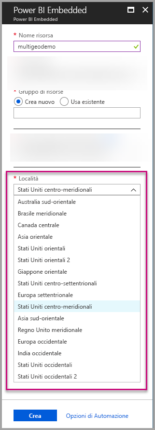
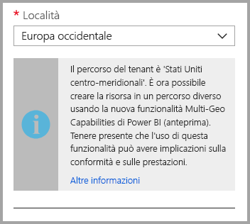
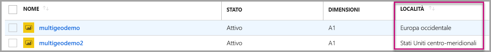
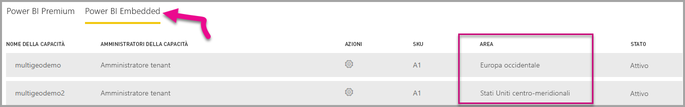

# Supporto di più aree geografiche per Power BI Embedded

**Supporto di più aree geografiche per Power BI Embedded** significa che gli ISV e le organizzazioni che creano applicazioni che usano Power BI Embedded per incorporare funzionalità analitiche nelle proprie app possono ora distribuire i dati in aree diverse in tutto il mondo.

I clienti che usano **Power BI Embedded** possono ora configurare una **capacità A** usando le opzioni per **più aree geografiche**, in base alle stesse funzionalità e limitazioni [supportate da Power BI Premium per l'uso di più aree geografiche](../../service-admin-premium-Multi-Geo.md).

## Creazione di una nuova risorsa capacità di Power BI Embedded con più aree geografiche

Nella schermata **Crea risorsa** è necessario scegliere la località della capacità. Fino ad ora, era possibile selezionare solo la località del tenant di Power BI, quindi era disponibile una singola località. Con il supporto di più aree geografiche è possibile scegliere tra aree diverse per distribuire la capacità.

Si noti che quando si apre il menu di riepilogo a discesa della località, il tenant iniziale è la selezione predefinita.
  

Quando si sceglie una località diversa, un messaggio richiede di assicurarsi di essere certi della selezione.

## Visualizzare la località della capacità

È possibile visualizzare facilmente la località della capacità passando alla pagina di gestione principale di Power BI Embedded nel portale di Azure.

È anche disponibile nel portale di amministrazione in Powerbi.com. Nel portale di amministrazione scegliere 'Impostazioni di capacità' e quindi passare alla scheda 'Power BI Embedded '.

[Altre informazioni sulla creazione di capacità con Power BI Embedded.](azure-pbie-create-capacity.md)

## Gestire la località della capacità esistente

Dopo aver creato una nuova capacità, non è possibile modificare la località di una risorsa di Power BI Embedded.

Per spostare il contenuto di Power BI in un'area diversa, seguire questa procedura:

1. [Creare una nuova capacità](azure-pbie-create-capacity.md) in un'area diversa.

2. Assegnare tutte le aree di lavoro dalla capacità esistente alla nuova capacità.

3. Eliminare o sospendere la capacità precedente.

È importante notare che se si decide di eliminare una capacità senza riassegnare il relativo contenuto, tutto il contenuto in tale capacità viene spostato in una capacità condivisa, ovvero nell'area iniziale.

## Supporto delle API per più aree geografiche

Per supportare la gestione delle capacità con più aree geografiche tramite API, sono state apportate alcune modifiche alle API esistenti:

1. **[Get Capacities](https://docs.microsoft.com/rest/api/power-bi/capacities/getcapacities)** -L'API restituisce un elenco di capacità con accesso all'utente. La risposta include ora una proprietà aggiuntiva denominata 'region', che specifica la località della capacità.

2. **[Assign To Capacity](https://docs.microsoft.com/rest/api/power-bi/capacities)** -L'API consente l'assegnazione di un'area di lavoro a una capacità. Questa operazione non consente di assegnare le aree di lavoro a una capacità all'esterno dell'area iniziale o di spostare aree di lavoro tra le capacità in aree diverse. Per eseguire questa operazione, l'utente o l'[entità servizio](embed-service-principal.md) necessita ancora delle autorizzazioni di amministratore per l'area di lavoro e delle autorizzazioni di amministratore o per l'assegnazione per la capacità di destinazione.

3. **[API di Azure Resource Manager](https://docs.microsoft.com/rest/api/power-bi-embedded/capacities)** - Tutte le operazioni dell'API di Azure Resource Manager, tra cui *Create* e *Delete*, supportano più aree geografiche.

## Limitazioni e considerazioni

* Verificare che qualsiasi spostamento avviato tra aree rispetti tutti i requisiti di conformità aziendali e di enti pubblici prima di avviare il trasferimento dei dati.

* Una query memorizzata nella cache archiviata in un'area remota resta in tale area quando è inattiva. Tuttavia, gli altri dati in transito potrebbero spostarsi tra diverse aree geografiche.

* Quando si spostano dati da un'area a un'altra in un ambiente con più aree geografiche, i dati di origine possono rimanere nell'area da cui vengono spostati fino a 30 giorni. Durante tale periodo, gli utenti non potranno accedervi. I dati verranno rimossi da quest'area ed eliminati definitivamente durante il periodo di 30 giorni.

* Il supporto di più aree geografiche non comporta prestazioni migliori in generale. Il caricamento di report e dashboard comporta comunque richieste all'area iniziale per i metadati.

## Passaggi successivi

Per altre informazioni sulle capacità di Power BI Embedded e le opzioni per più aree geografiche per tutte le capacità, fare riferimento ai collegamenti seguenti.

* [Che cos'è Power BI Embedded?](azure-pbie-what-is-power-bi-embedded.md)

* [Creare capacità di Power BI Embedded](azure-pbie-create-capacity.md)

* [Supporto di più aree geografiche per Power BI Premium](../../service-admin-premium-multi-geo.md)

Altre domande? [Provare a rivolgersi alla community di Power BI](https://community.powerbi.com/)