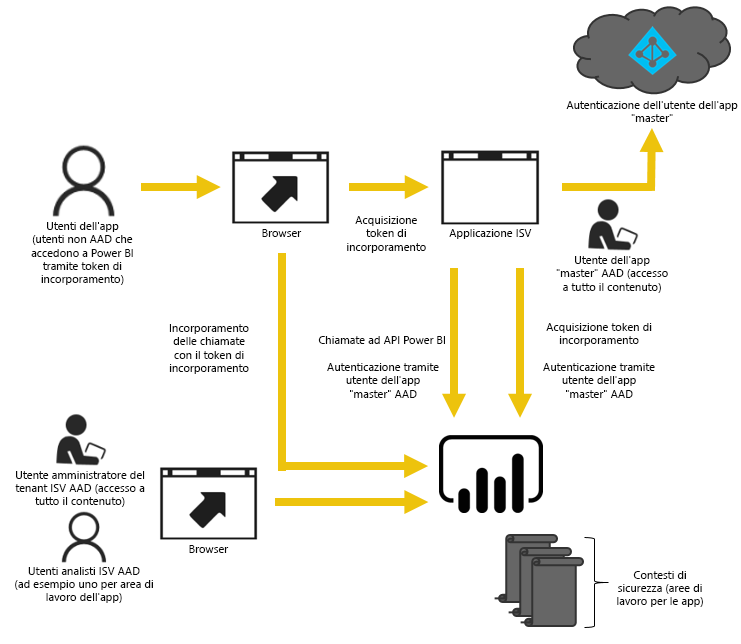
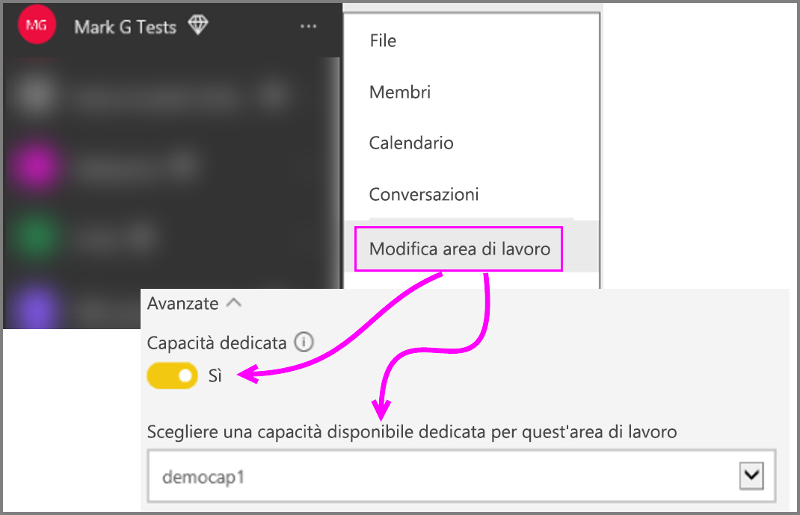

# Come eseguire la migrazione del contenuto della raccolta di aree di lavoro di Power BI in Power BI Embedded

Informazioni su come eseguire la migrazione dalla raccolta di aree di lavoro di Power BI a Power BI Embedded e sfruttare i miglioramenti per l'incorporamento nelle app.

Microsoft ha recentemente [annunciato Power BI Embedded](https://powerbi.microsoft.com/blog/power-bi-embedded-capacity-based-skus-coming-to-azure/), un nuovo modello di gestione delle licenze basato sulla capacità che aumenta la flessibilità di accesso, condivisione e distribuzione del contenuto per gli utenti. L'offerta aggiunge anche ulteriore scalabilità e rendimento.

Con Power BI Embedded si avrà una sola superficie dell'API, un set coerente di funzionalità e l'accesso alle ultime funzionalità di Power BI, ad esempio dashboard, gateway e aree di lavoro, quando si incorpora il contenuto. In futuro sarà possibile iniziare con Power BI Desktop e passare alla distribuzione con Power BI Embedded.

La raccolta di aree di lavoro di Power BI corrente continuerà a essere disponibile per un periodo di tempo limitato. I clienti nell'ambito di un contratto Enterprise potranno accedere fino alla scadenza dei rispettivi contratti esistenti; i clienti che hanno acquisito la raccolta di aree di lavoro di Power BI attraverso canali diretti o CSP manterranno l'accesso per un anno dalla versione di Power BI Embedded disponibile a livello generale.  Questo articolo contiene alcune informazioni per la migrazione dalla raccolta di aree di lavoro di Power BI alla nuova esperienza di Power BI Embedded e su quali modifiche aspettarsi nell'applicazione.

> [!IMPORTANT]
> Mentre la migrazione richiederà una dipendenza in Power BI Embedded, non esiste una dipendenza in Power BI per gli utenti dell'applicazione quando si usa un **token di incorporamento**. Gli utenti non dovranno eseguire l'iscrizione a Power BI per visualizzare il contenuto incorporato nell'applicazione. È possibile usare questo approccio di incorporamento per gli utenti di Embedded esterni a Power BI.

Prima di iniziare a eseguire la migrazione al nuovo Power BI Embedded, è possibile seguire una rapida procedura dettagliata che consente di impostare il nuovo ambiente di Power BI Embedded tramite lo [strumento di installazione dell'incorporamento](https://aka.ms/embedsetup).

Scegliere la soluzione adatta alle proprie esigenze:
* **Incorporare per i clienti**: quando si è interessati a una soluzione in cui i [dati sono di proprietà dell'app](https://aka.ms/embedsetup/AppOwnsData). L'[incorporamento per i clienti](embedding.md#embedding-for-your-customers) offre la possibilità di incorporare dashboard e report per gli utenti che non hanno un account per Power BI. 

* **Incorporare per l'organizzazione**: quando si è interessati a una soluzione in cui i [dati sono di proprietà dell'utente](https://aka.ms/embedsetup/UserOwnsData). L'[incorporamento per l'organizzazione](embedding.md#embedding-for-your-organization) consente di estendere il servizio Power BI.

## Preparare la migrazione

Per prepararsi alla migrazione dalla raccolta di aree di lavoro di Power BI a Power BI Embedded occorre eseguire alcune operazioni. È necessario un tenant disponibile, oltre a un utente che abbia una licenza di Power BI Pro.

1. Accertarsi di avere accesso a un tenant di Azure Active Directory (Azure AD).

    È necessario determinare l'impostazione del tenant da usare.

   * Usare il tenant di Power BI aziendale esistente?
   * Usare un tenant diverso per l'applicazione?
   * Usare un tenant diverso per ogni cliente?

     Se si decide di creare un nuovo tenant per l'applicazione o di crearne uno per ogni cliente, vedere [Creare un tenant di Azure Active Directory](create-an-azure-active-directory-tenant.md) o [Come ottenere un tenant di Azure Active Directory](https://docs.microsoft.com/azure/active-directory/develop/active-directory-howto-tenant).
2. Creare un utente all'interno di questo nuovo tenant che verrà usato come account "master" dell'applicazione. È necessario che l'account in questione si iscriva a Power BI e che gli sia stata assegnata una licenza di Power BI Pro.

## Account in Azure AD

I seguenti account dovranno esistere all'interno del tenant.

> [!NOTE]
> Le licenze di Power BI Pro sono necessarie a questi account per usare le aree di lavoro.

1. Un utente amministratore tenant.

    È consigliabile che l'utente sia membro di tutte le aree di lavoro create a scopo di incorporamento.

2. Account per gli analisti che creeranno il contenuto.

    Questi utenti devono essere assegnati alle aree di lavoro in base alle esigenze.

3. Un account utente *master* dell'applicazione o un account Embedded.

    Il back-end delle applicazioni memorizza le credenziali per l'account e le userà per acquisire un token di Azure AD da usare con le API REST di Power BI. Questo account verrà usato per generare il token di incorporamento per l'applicazione. Questo account deve anche essere un amministratore delle aree di lavoro create per l'incorporamento.

> [!NOTE]
> Si tratta solo di un normale account utente nell'organizzazione che verrà usato a scopo di incorporamento.

## Registrazione e autorizzazioni dell'app

È necessario registrare un'applicazione in Azure AD e concedere alcune autorizzazioni.

### Registrare un'applicazione

Sarà necessario registrare l'applicazione in Azure AD per effettuare chiamate all'API REST. Questa procedura include il passaggio al portale di Azure per l'applicazione di configurazione aggiuntiva, oltre alla pagina di registrazione dell'app Power BI. Per altre informazioni, vedere [Registrare un'app di Azure AD per incorporare il contenuto di Power BI](register-app.md).

È necessario registrare l'applicazione usando l'account **master** dell'applicazione.

## Creare aree di lavoro (obbligatorio)

È possibile sfruttare le aree di lavoro per offrire un isolamento più efficiente se l'applicazione viene usata da più clienti. I dashboard e i report sarebbero isolati tra i clienti. È quindi possibile usare un account di Power BI per ogni area di lavoro per isolare ulteriormente le esperienze delle applicazioni tra i clienti.

> [!IMPORTANT]
> Non è possibile usare un'area di lavoro personale per sfruttare l'incorporamento per gli utenti esterni a Power BI.

Per creare un'area di lavoro all'interno di Power BI, un utente deve avere una licenza Pro. Per impostazione predefinita, l'utente di Power BI che crea l'area di lavoro sarà un amministratore della stessa.

> [!NOTE]
> L'account *master* dell'applicazione deve essere un amministratore dell'area di lavoro.

## Migrazione del contenuto

La migrazione del contenuto dalle raccolte di aree di lavoro in Power BI Embedded può essere eseguita in parallelo alla soluzione attuale e non richiede alcun tempo di inattività.

Per agevolare la copia del contenuto dalla raccolta di aree di lavoro di Power BI a Power BI Embedded è disponibile uno **strumento di migrazione**. In particolare se la quantità del contenuto è elevata. Per altre informazioni, vedere [Power BI Embedded migration tool](migrate-tool.md) (Strumento di migrazione di Power BI Embedded).

La migrazione del contenuto si basa principalmente su due API.

1. Download PBIX: questa API può scaricare i file PBIX che sono stati caricati in Power BI a partire da novembre 2016.
2. Import PBIX: questa API consente di caricare qualsiasi file PBIX in Power BI.

Per alcuni frammenti di codice correlati, vedere [Frammenti di codice per eseguire la migrazione del contenuto dalla raccolta di aree di lavoro di Power BI](migrate-code-snippets.md).

### Tipi di report

Esistono diversi tipi di report, ognuno dei quali richiede un flusso di migrazione leggermente diverso.

#### Report e set di dati memorizzati nella cache

I set di dati memorizzati nella cache fanno riferimento ai file PBIX che contengono dati importati e non dispongono di una connessione in tempo reale o DirectQuery.

**Flusso**

1. Chiamare l'API Download PBIX dall'area di lavoro PaaS.
2. Salvare i file PBIX.
3. Chiamare Import PBIX nell'area di lavoro SaaS.

#### Report e set di dati DirectQuery

**Flusso**

1. Chiamare GET `https://api.powerbi.com/v1.0/collections/{collection_id}/workspaces/{wid}/datasets/{dataset_id}/Default.GetBoundGatewayDataSources` e salvare la stringa di connessione ricevuta.
2. Chiamare l'API Download PBIX dall'area di lavoro PaaS.
3. Salvare i file PBIX.
4. Chiamare Import PBIX nell'area di lavoro SaaS.
5. Aggiornare la stringa di connessione chiamando POST `https://api.powerbi.com/v1.0/myorg/datasets/{dataset_id}/Default.SetAllConnections`
6. Ottenere gli ID GW e dell'origine dati chiamando - GET `https://api.powerbi.com/v1.0/myorg/datasets/{dataset_id}/Default.GetBoundGatewayDataSources`
7. Aggiornare le credenziali dell'utente chiamando PATCH `https://api.powerbi.com/v1.0/myorg/gateways/{gateway_id}/datasources/{datasource_id}`

#### Report e set di dati precedenti

Si tratta di set di dati o report creati prima di ottobre 2016. Download PBIX non supporta i file PBIX che sono stati caricati prima di ottobre 2016

**Flusso**

1. Ottenere il file PBIX dall'ambiente di sviluppo (controllo della sorgente interna).
2. Chiamare Import PBIX nell'area di lavoro SaaS.

#### Report e set di dati push

Download PBIX non supporta i set di dati dell'*API Push*. I dati del set di dati dell'API push non possono essere trasferiti da PaaS a SaaS.

**Flusso**

1. Chiamare l'API "Create dataset" con i set di dati JSON per creare i set di dati nell'area di lavoro SaaS.
2. Ricompilare il report per i set di dati creati*.

È possibile usare alcune soluzioni alternative per eseguire la migrazione del report dell'API Push da PaaS a SaaS eseguendo le operazioni seguenti.

1. Caricare i file PBIX fittizi nell'area di lavoro PaaS.
2. Clonare il report dell'API Push e associarlo al file PBIX fittizio del passaggio 1.
3. Scaricare il report dell'API Push con il file PBIX fittizio.
4. Caricare il file PBIX fittizio nell'area di lavoro di SaaS.
5. Creare set di dati push nell'area di lavoro SaaS.
6. Riassociare il report al set di dati dell'API Push.

## Creare e caricare i nuovi report

Oltre al contenuto di cui è stata eseguita la migrazione dalla raccolta di aree di lavoro di Power BI, è possibile creare report e set di dati tramite Power BI Desktop e quindi pubblicare i report in un'area di lavoro. Per pubblicare report in un'area di lavoro, l'utente finale che esegue la pubblicazione deve avere una licenza di Power BI Pro.

## Ricompilare l'applicazione

1. È necessario modificare l'applicazione per usare le API REST di Power BI e il percorso del report in powerbi.com.
2. Ricompilare l'autenticazione AuthN/AuthZ usando l'account *master* per l'applicazione. È possibile sfruttare l'uso di un [token di incorporamento](https://docs.microsoft.com/rest/api/power-bi/embedtoken) per consentire all'utente di agire per conto di altri utenti.
3. Incorporare i report da powerbi.com nell'applicazione.

## Eseguire il mapping degli utenti a un utente di Power BI

All'interno dell'applicazione, verrà eseguito il mapping degli utenti gestiti all'interno dell'applicazione alle credenziali dell'account *master* di Power BI ai fini dell'applicazione. Le credenziali per questo account *master* di Power BI verranno memorizzate all'interno dell'applicazione e usate per creare token di incorporamento.

## Cosa fare quando si è pronti per la produzione

Quando si è pronti a passare alla produzione, è necessario eseguire le operazioni seguenti.

* Se si usa un tenant diverso per lo sviluppo, è necessario assicurarsi che l'area di lavoro, insieme ai dashboard e ai report, sia disponibile nell'ambiente di produzione. È inoltre necessario assicurarsi di aver creato l'applicazione in Azure AD per il tenant di produzione e di aver assegnato le autorizzazioni di dell'app adeguate, come indicato nel Passaggio 1.
* Acquistare una capacità adatta alle proprie esigenze. Per valutare al meglio la quantità e il tipo di capacità necessari, vedere [Power BI Embedded analytics capacity planning whitepaper](https://aka.ms/pbiewhitepaper) (White paper sulla pianificazione della capacità di analisi di Power BI Embedded). È possibile [acquistare capacità](https://portal.azure.com/#create/Microsoft.PowerBIDedicated) in Azure.
* Modificare l'area di lavoro e assegnarle una capacità Premium in Avanzate.

    

* Distribuire l'applicazione aggiornata nell'ambiente di produzione e iniziare a incorporare i report da Power BI Embedded.

## Dopo la migrazione

È necessario eseguire alcune operazioni di pulitura all'interno di Azure.

* Rimuovere tutte le aree di lavoro dalla soluzione distribuita all'interno del servizio Embedded di Azure della raccolta di aree di lavoro di Power BI.
* Eliminare eventuali raccolte di aree di lavoro esistenti all'interno di Azure.

## Passaggi successivi

[Incorporamento con Power BI](embedding.md)  
[Strumento di migrazione di Power BI Embedded](migrate-tool.md)  
[Frammenti di codice per eseguire la migrazione del contenuto dalla raccolta di aree di lavoro di Power BI](migrate-code-snippets.md)  
[Come incorporare i dashboard, i report e i riquadri di Power BI](embed-sample-for-your-organization.md)  
[Power BI Premium - what is it?](../../service-premium-what-is.md) (Power BI Premium: definizione)  
[Archivio GIT API JavaScript](https://github.com/Microsoft/PowerBI-JavaScript)  
[Archivio GIT C# di Power BI](https://github.com/Microsoft/PowerBI-CSharp)  
[Esempio di incorporamento JavaScript](https://microsoft.github.io/PowerBI-JavaScript/demo/)  
[Workspace Collection analytics capacity planning whitepaper](https://aka.ms/pbiewhitepaper) (White paper sulla pianificazione della capacità di analisi della raccolta di aree di lavoro)  
[White paper su Power BI Premium](https://aka.ms/pbipremiumwhitepaper)  

Altre domande? [Provare a rivolgersi alla community di Power BI](https://community.powerbi.com/)
