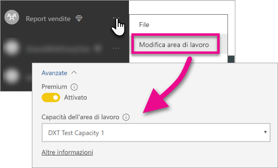

# Incorporare i dashboard, i report e i riquadri di Power BI

Informazioni sulla procedura da seguire per incorporare il contenuto di Power BI all'interno dell'applicazione.

Microsoft ha [annunciato Power BI Premium](https://powerbi.microsoft.com/blog/microsoft-accelerates-modern-bi-adoption-with-power-bi-premium/), un nuovo modello di gestione delle licenze basato sulla capacità che aumenta la flessibilità di accesso, condivisione e distribuzione del contenuto per gli utenti. L'offerta aggiunge anche ulteriore scalabilità e rendimento al servizio Power BI. È stato annunciato anche Power BI Embedded, che consente la creazione di capacità in Microsoft Azure. Power BI Embedded è incentrato sull'applicazione e sui clienti dell'utente. 

Questo articolo esamina la procedura per incorporare il contenuto di Power BI per l'organizzazione e i clienti. I passaggi sono simili per entrambi gli scenari. Verranno eseguiti dei callout quando un passaggio è specifico per la procedura di incorporamento per il cliente.

A tale scopo, sono previsti alcuni passaggi che è necessario eseguire con l'applicazione. Verranno esaminati i passaggi necessari a consentire di creare e usare un contenuto incorporato all'interno dell'applicazione.

> [!NOTE]
> Le API di Power BI fanno ancora riferimento alle aree di lavoro per le app come gruppi. I riferimenti ai gruppi indicano che si stanno usando le aree di lavoro per le app.

## Passaggio 1: Configurare l'ambiente di sviluppo di analisi incorporato

Prima di iniziare la procedura di incorporamento di dashboard e report in un'applicazione, è necessario assicurarsi che l'ambiente sia configurato per consentire per l'incorporamento. Come parte dell'installazione, sarà necessario eseguire le operazioni seguenti.

* [Verificare di avere un tenant di Azure Active Directory](embedding-content.md#azureadtenant)
* [Creare l'account di Power BI Pro](embedding-content.md#proaccount)
* [Registrare l'applicazione di Azure Active Directory e le autorizzazioni](embedding-content.md#appreg)

> [!NOTE]
> La capacità di Power BI non è necessaria per lo sviluppo dell'applicazione. Gli sviluppatori dell'applicazione dovranno avere la licenza di Power BI Pro.

### Tenant di Azure Active Directory

Per incorporare gli elementi da Power BI è necessario un tenant di Azure Active Directory (Azure AD). Questo tenant deve avere almeno un utente di Power BI Pro. È inoltre necessario definire un'app di Azure AD nel tenant. È possibile usare un tenant di Azure AD esistente o crearne uno nuovo specifico per eseguire l'incorporamento.

Sarà necessario determinare quale configurazione del tenant usare in caso di incorporamento per i clienti.

* Usare il tenant di Power BI aziendale esistente?
* Usare un tenant diverso per l'applicazione?
* Usare un tenant diverso per ogni cliente?

Se non si vuole usare un tenant esistente, è possibile decidere di creare un nuovo tenant per l'applicazione o di crearne uno per ogni cliente. Vedere [Creare un tenant di Azure Active Directory](create-an-azure-active-directory-tenant.md) o [Come ottenere un tenant di Azure Active Directory](https://docs.microsoft.com/azure/active-directory/develop/active-directory-howto-tenant).

### Creare un account utente di Power BI Pro

Per incorporare il contenuto è necessario disporre di un solo account di Power BI Pro. Tuttavia, è consigliabile disporre di diversi utenti che hanno un accesso specifico agli elementi. Ecco gli utenti che è possibile prendere in considerazione all'interno del tenant.

I seguenti account dovranno esistere all'interno del tenant e avere una licenza per Power BI Pro. Per usare le aree di lavoro dell'app in Power BI, è necessaria una licenza per Power BI Pro.

#### Un utente amministratore del tenant/dell'organizzazione

È consigliabile che l'utente amministratore globale del tenant o dell'organizzazione non sia usato come account dell'applicazione in caso di incorporamento per i clienti, allo scopo di ridurre l'accesso dell'account dell'applicazione all'interno del tenant. È consigliabile che l'utente amministratore sia amministratore di tutte le aree di lavoro per le app create allo scopo dell'incorporamento.

#### Account per gli analisti che creeranno il contenuto

Possono esserci più utenti che creano contenuto per Power BI. È necessario un account di Power BI Pro per ogni analista che crea e distribuisce il contenuto in Power BI.

#### Account utente *master* dell'applicazione per l'incorporamento per i clienti

L'account master è l'account che verrà usato dall'applicazione durante l'incorporamento del contenuto per i clienti. Questo scenario è in genere relativo ad applicazioni ISV. L'account master è l'unico account obbligatorio che è necessario all'interno dell'organizzazione. Può anche essere usato come account di amministratore e analista, ma non è consigliato. Il back-end delle applicazioni memorizza le credenziali per l'account e le userà per acquisire un token di autenticazione di Azure AD da usare con le API di Power BI. Questo account verrà usato per generare il token di incorporamento per l'applicazione da usare per i clienti.

L'account master è semplicemente un utente normale con una licenza di Power BI Pro che viene usato con l'applicazione. Deve essere un account amministratore delle aree di lavoro per le app create per l'incorporamento.

###  Registrazione e autorizzazioni dell'app

Sarà necessario registrare l'applicazione in Azure AD per effettuare chiamate all'API REST. Per altre informazioni, vedere [Registrare un'app di Azure AD per incorporare il contenuto di Power BI](register-app.md).

### Creare aree di lavoro per le app

Se si intende incorporare i dashboard e i report per i clienti, questi devono essere inseriti all'interno di un'area di lavoro per le app. L'account *master* indicato in precedenza deve essere un amministratore dell'area di lavoro per le app.

[!INCLUDE [powerbi-service-create-app-workspace](../includes/powerbi-service-create-app-workspace.md)]

### Creare e caricare i report

È possibile creare report e set di dati usando Power BI Desktop e quindi pubblicando tali report in un'area di lavoro per le app. Per pubblicare in un'area di lavoro per le app l'utente finale che pubblica i report deve avere una licenza di Power BI Pro.

## Passaggio 2: Incorporare il contenuto

All'interno dell'applicazione è necessario eseguire l'autenticazione con Power BI. Se si intende incorporare il contenuto per i clienti, le credenziali per l'account *master* verranno archiviate all'interno dell'applicazione. Per altre informazioni, vedere [Autenticare gli utenti e ottenere un token di accesso di Azure AD per l'app Power BI](get-azuread-access-token.md).

Dopo l'autenticazione, nell'applicazione usare le API REST di Power BI e le API JavaScript per incorporare dashboard e report nell'applicazione. 

Per l'**incorporamento per l'organizzazione**, vedere le procedure dettagliate seguenti:

* [Integrare un dashboard in un'app](integrate-dashboard.md)
* [Integrare un riquadro in un'app](integrate-tile.md)
* [Integrare un report in un'app](integrate-report.md)

Per l'**incorporamento con i clienti**, scenario tipico per ISV, vedere quanto segue:

* [Integrare un dashboard, un riquadro o un report nell'applicazione](embed-sample-for-customers.md)

Quando si esegue l'incorporamento per i clienti, è necessario un token di incorporamento. Per altre informazioni, vedere [GenerateToken](https://msdn.microsoft.com/library/mt784614.aspx).

## Passaggio 3: Alzare di livello della soluzione alla produzione

Lo spostamento in produzione richiede alcuni passaggi aggiuntivi.

### Incorporamento per l'organizzazione

Se si intende incorporare per l'organizzazione, è sufficiente informare gli utenti su come ottenere l'applicazione. 

Gli utenti del piano Gratuito possono utilizzare contenuti incorporati da un'area di lavoro dell'app (gruppo) se tale area di lavoro dispone della capacità sufficiente. Elencare l'utente del piano Gratuito come membro dell'area di lavoro dell'app (gruppo). In caso contrario, viene visualizzato un errore di tipo 401 - Non autorizzato. La tabella seguente elenca gli SKU di Power BI Premium disponibili in Office 365.

| Nodo della capacità | Totale core *(Back-end + front-end)* | Core di back-end | Core di front-end | Limiti di connessione dinamica/DirectQuery | Rendering massimo della pagina all'ora di punta |
| --- | --- | --- | --- | --- | --- |
| EM3 |4 v-core |2 core, 10 GB di RAM |2 core | |601-1.200 |
| P1 |8 v-core |4 core, 25 GB di RAM |4 core |30 al secondo |1.201-2.400 |
| P2 |16 v-core |8 core, 50 GB di RAM |8 core |60 al secondo |2.401-4.800 |
| P3 |32 v-core |16 core, 100 GB di RAM |16 ore |120 al secondo |4.801-9600 |

> [!NOTE]
> È necessario essere amministratore globale o di fatturazione, all'interno del tenant, per acquistare Power BI Premium. Per informazioni su come acquistare Power BI Premium, vedere [How to purchase Power BI Premium](../service-admin-premium-purchase.md) (Come acquistare Power BI Premium).

### Incorporamento per i clienti

Per eseguire l'incorporamento per i clienti, procedere nel modo seguente.

* Se si usa un tenant diverso per lo sviluppo, è necessario assicurarsi che l'area di lavoro per le app, insieme ai dashboard e ai report, sia disponibile nell'ambiente di produzione. Assicurarsi di creare l'applicazione in Azure AD per il tenant di produzione e di assegnare le autorizzazioni di dell'app adeguate, come indicato nel Passaggio 1.
* Acquistare una capacità adatta alle proprie esigenze. È possibile usare la tabella seguente per individuare gli SKU per la capacità di Power BI Embedded necessari. Per altre informazioni, vedere [Embedded analytics capacity planning whitepaper](https://aka.ms/pbiewhitepaper) (White paper sulla pianificazione della capacità di analisi incorporata) Quando si è pronti, è possibile completare l'acquisto nel [portale di Microsoft Azure](https://portal.azure.com). Per informazioni dettagliate su come creare capacità per Power BI Embedded, vedere [Create Power BI Embedded capacity in the Azure portal](https://docs.microsoft.com/azure/power-bi-embedded/create-capacity) (Creare capacità per Power BI Embedded nel portale di Azure).

> [!IMPORTANT]
> Dato che i token di incorporamento sono destinati solo alle attività di sviluppo e test, un account master Power BI può generare un numero di token di incorporamento limitato. È necessario [acquistare una capacità](https://docs.microsoft.com/power-bi/developer/embedded-faq#technical) per gli scenari di incorporamento della produzione. Dopo l'acquisto della capacità è possibile generare un numero illimitato di token di incorporamento.

| Nodo della capacità | Totale core *(Back-end + front-end)* | Core di back-end | Core di front-end | Limiti di connessione dinamica/DirectQuery | Rendering massimo della pagina all'ora di punta |
| --- | --- | --- | --- | --- | --- |
| A1 |1 v-core |0,5 core, 3 GB di RAM |0,5 core | 5 al secondo |1-300 |
| A2 |2 v-core |1 core, 5 GB di RAM |1 core | 10 al secondo |301-600 |
| A3 |4 v-core |2 core, 10 GB di RAM |2 core | 15 al secondo |601-1.200 |
| A4 |8 v-core |4 core, 25 GB di RAM |4 core |30 al secondo |1.201-2.400 |
| A5 |16 v-core |8 core, 50 GB di RAM |8 core |60 al secondo |2.401-4.800 |
| A6 |32 v-core |16 core, 100 GB di RAM |16 ore |120 al secondo |4.801-9600 |

* Modificare l'area di lavoro per le app e assegnarla a una capacità in Opzioni avanzate.

    

* Distribuire l'applicazione aggiornata nell'ambiente di produzione e iniziare a incorporare i dashboard e i report di Power BI.

## Impostazioni di amministrazione

Gli amministratori globali o gli amministratori del servizio Power BI possono attivare o disattivare la possibilità di usare le API REST per un tenant. Gli amministratori di Power BI possono configurare questa impostazione per l'intera organizzazione o per singoli gruppi di sicurezza. L'opzione è abilitata per l'intera organizzazione per impostazione predefinita. Questa operazione viene eseguita tramite il [portale di amministrazione di Power BI](../service-admin-portal.md).

## Passaggi successivi

[Incorporamento con Power BI](embedding.md)  
[Come eseguire la migrazione del contenuto della raccolta di aree di lavoro di Power BI Embedded in Power BI](migrate-from-powerbi-embedded.md)  
[Power BI Premium - what is it?](../service-premium.md) (Power BI Premium: descrizione)  
[How to purchase Power BI Premium](../service-admin-premium-purchase.md) (Come acquistare Power BI Premium)  
[Archivio GIT API JavaScript](https://github.com/Microsoft/PowerBI-JavaScript)  
[Archivio GIT C# di Power BI](https://github.com/Microsoft/PowerBI-CSharp)  
[Esempio di incorporamento JavaScript](https://microsoft.github.io/PowerBI-JavaScript/demo/)  
[Embedded analytics capacity planning whitepaper](https://aka.ms/pbiewhitepaper) (White paper sulla pianificazione della capacità di analisi incorporata)  
[White paper su Power BI Premium](https://aka.ms/pbipremiumwhitepaper)  

Altre domande? [Provare a rivolgersi alla community di Power BI](http://community.powerbi.com/)

