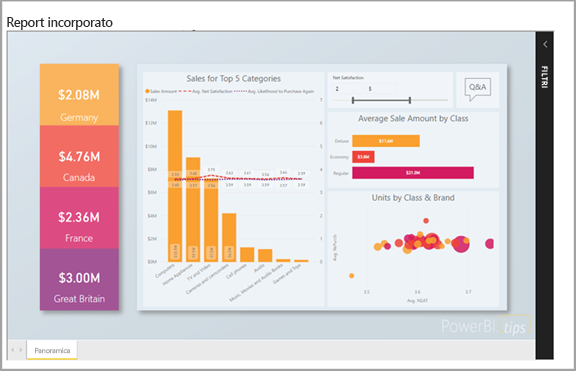
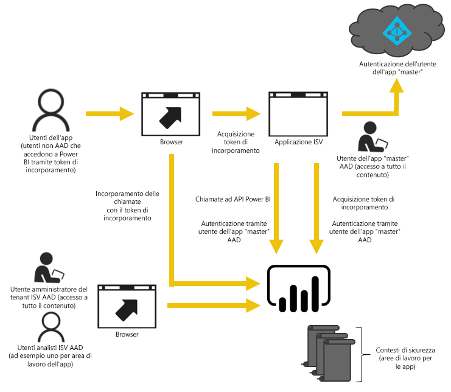

# Analisi incorporata con Power BI

Il servizio Power BI (SaaS) e il servizio Power BI Embedded in Azure (PaaS) offrono API per l'incorporamento di dashboard e report. Quando si incorpora contenuto, questo consente di accedere alle ultime funzionalità di Power BI, ad esempio dashboard, gateway e aree di lavoro di app.

È possibile usare lo [strumento di installazione dell'incorporamento](https://aka.ms/embedsetup) per iniziare rapidamente e scaricare un'applicazione di esempio.

Scegliere la soluzione adatta alle proprie esigenze:

* L'[incorporamento per l'organizzazione](embedding.md#embedding-for-your-organization) consente di estendere il servizio Power BI. A tale scopo, implementare il [incorporamento per l'organizzazione](https://aka.ms/embedsetup/UserOwnsData) soluzione.
* [Incorporamento per i clienti](embedding.md#embedding-for-your-customers) consente di incorporare dashboard e report per gli utenti che non dispongono di un account Power BI. A tale scopo, implementare il [incorporamento per i clienti](https://aka.ms/embedsetup/AppOwnsData) soluzione.

## Usare le API

Esistono due scenari principali per l'incorporamento di contenuto di Power BI:
- Incorporamento per gli utenti dell'organizzazione (che dispongono di licenze di Power BI). 
 
- Incorporamento per utenti e clienti che non necessitano di licenze di Power BI. 

Il [API REST di Power BI](https://docs.microsoft.com/rest/api/power-bi/) consentono entrambi gli scenari.

Per i clienti e gli utenti senza licenza di Power BI, sarà possibile incorporare dashboard e report nell'applicazione personalizzata usando la stessa API per l'organizzazione o per i clienti. I clienti visualizzeranno i dati gestiti dall'applicazione. Inoltre, gli utenti di Power BI dell'organizzazione hanno opzioni aggiuntive da visualizzare *i propri dati* direttamente in Power BI o nel contesto dell'applicazione incorporata. È possibile usufruire delle API REST e JavaScript per soddisfare le proprie esigenze di incorporamento.

Per comprendere come funziona l'incorporamento, vedere la [esempio di incorporamento di JavaScript](https://microsoft.github.io/PowerBI-JavaScript/demo/).

## Incorporamento per l'organizzazione

L'**incorporamento per l'organizzazione** consente di estendere il servizio Power BI. Incorporamento di questa richiede l'accesso agli utenti dell'applicazione nel servizio Power BI per visualizzare il contenuto. Quando un utente dell'organizzazione esegue l'accesso, potrà accedere solo ai dashboard e ai report di cui è proprietario o che sono stati condivisi con l'utente nel servizio Power BI.

Esempi di incorporamento organizzazione includono le applicazioni interne, ad esempio [SharePoint Online](https://powerbi.microsoft.com/blog/integrate-power-bi-reports-in-sharepoint-online/), [integrazione Microsoft Teams (è necessario disporre dei diritti di amministratore)](https://powerbi.microsoft.com/blog/power-bi-teams-up-with-microsoft-teams/), e [Microsoft Dynamics](https://docs.microsoft.com/dynamics365/customer-engagement/basics/add-edit-power-bi-visualizations-dashboard).

Per incorporare per l'organizzazione, vedere [esercitazione: Incorporare contenuto di Power BI in un'applicazione per l'organizzazione](embed-sample-for-your-organization.md).

Le funzionalità self-service, quali la modifica, il salvataggio e altro ancora, sono disponibili tramite le [API JavaScript](https://github.com/Microsoft/PowerBI-JavaScript) durante l'incorporamento per gli utenti di Power BI.

È possibile passare il [dello strumento di configurazione di incorporamento](https://aka.ms/embedsetup/UserOwnsData) per iniziare a usare e scaricare un'applicazione di esempio che illustra l'integrazione di un report per l'organizzazione.

## Incorporamento per i clienti

**Incorporamento per i clienti** ti permette di incorporare dashboard e report per gli utenti che non dispongono di un account Power BI. L'incorporamento è noto anche come *Power BI Embedded*.

[Power BI Embedded](azure-pbie-what-is-power-bi-embedded.md) è un **Microsoft Azure** servizio che consente ai fornitori di software indipendenti (ISV) e agli sviluppatori rapidamente incorporare oggetti visivi, report e dashboard in un'applicazione. Incorporamento di questa operazione viene eseguita tramite un modello a consumo orario, basata sulla capacità.

Power BI Embedded offre vantaggi ai fornitori di software indipendenti, agli sviluppatori e ai clienti. Ad esempio un fornitore di software indipendente può iniziare a creare gratuitamente oggetti visivi con Power BI Desktop. Riducendo al minimo gli sforzi di sviluppo visivo di analisi, gli ISV accelera il time-to-market e distinguono dalla concorrenza con esperienze dati differenziate. Gli ISV possono anche scegliere di un addebito per il valore aggiuntivo creati con analitica incorporata.

Con Power BI Embedded non è necessario che i clienti abbiano informazioni su Power BI. È possibile utilizzare due metodi diversi per creare un'applicazione incorporata:
- Account di Power BI Pro 
- Entità servizio 

L'account di Power BI Pro agisce come account principale dell'applicazione (è possibile un account proxy). Questo account consente di generare i token che forniscono l'accesso a dashboard di Power BI e report dell'applicazione di incorporamento.

L'[entità servizio](embed-service-principal.md) può incorporare il contenuto di Power BI in un'applicazione con un token **solo app**. Permette anche di generare i token che forniscono l'accesso a dashboard di Power BI e report dell'applicazione di incorporamento.

Gli sviluppatori che usano Power BI Embedded possono concentrare incentrate sulla compilazione della propria applicazione funzionalità di base anziché spesa ora sviluppare oggetti visivi e analitica. Rapidamente possono soddisfare le richieste di report e dashboard cliente e incorporare con facilità con SDK e API completamente documentate. Abilitando l'esplorazione dei dati semplificata nelle app, gli ISV consentono ai clienti di prendere decisioni rapide, basate sui dati nel contesto appropriato e da qualsiasi dispositivo.

> [!IMPORTANT]
> Mentre l'incorporamento richiede che il servizio Power BI, i clienti non sono necessario disporre di un account di Power BI per visualizzare il contenuto incorporato dell'applicazione. 

Quando si è pronti per passare alla produzione, l'area di lavoro per le app deve essere assegnata a una capacità dedicata. Power BI Embedded in Microsoft Azure offre [capacità dedicate](azure-pbie-create-capacity.md) da usare con le applicazioni.

Per l'incorporamento di informazioni dettagliate, vedere [come incorporare contenuto di Power BI](embed-sample-for-customers.md).

## Passaggi successivi

È ora possibile provare a incorporare contenuto di Power BI in un'applicazione o provare a incorporare contenuto di Power BI per i clienti.

> [!div class="nextstepaction"]
> [Incorporare contenuto per l'organizzazione](embed-sample-for-your-organization.md)

> [!div class="nextstepaction"]
> [Che cos'è Power BI Embedded?](azure-pbie-what-is-power-bi-embedded.md)

> [!div class="nextstepaction"]
>[Incorporamento per i clienti](embed-sample-for-customers.md)

Altre domande? [Provare a rivolgersi alla community di Power BI](http://community.powerbi.com/)
