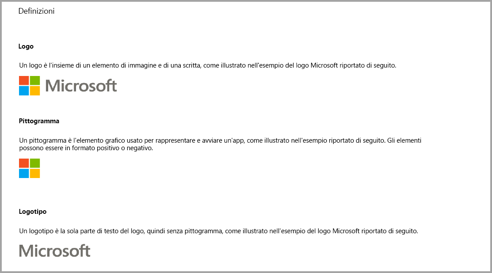
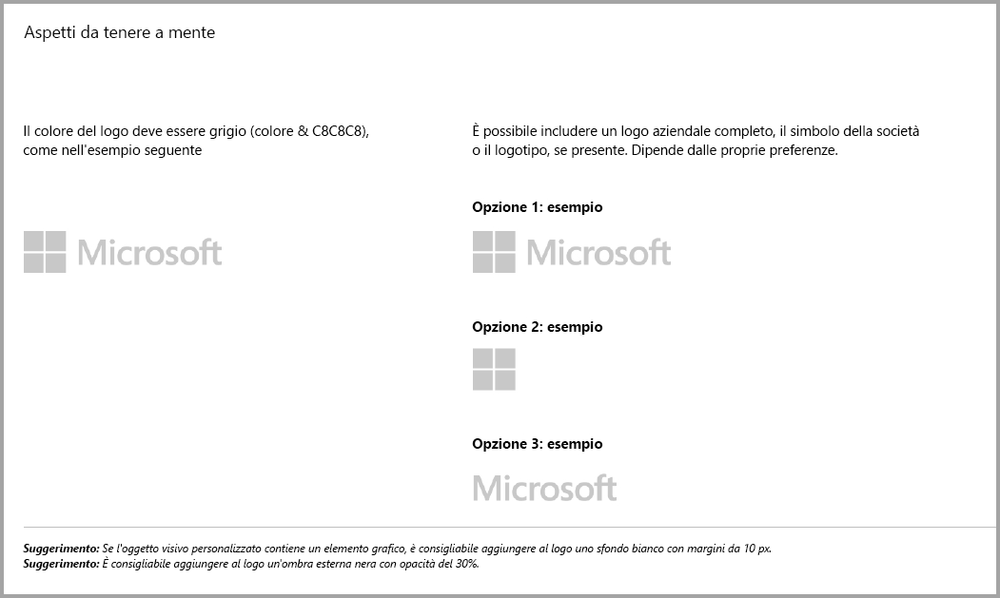
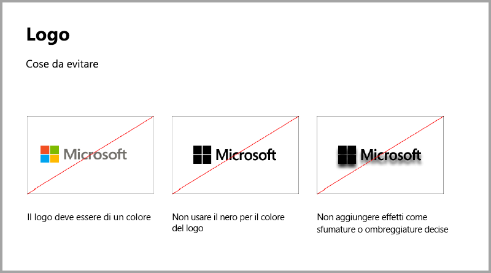
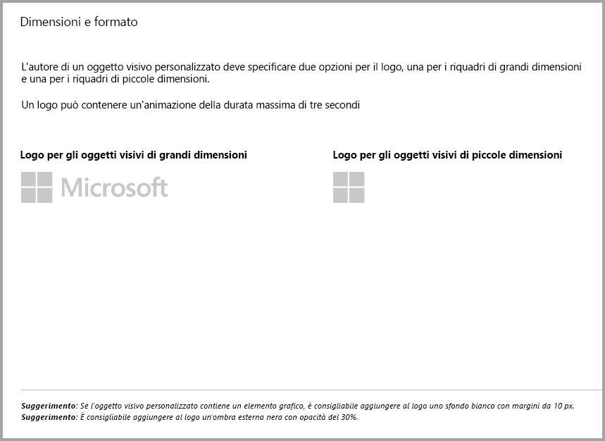
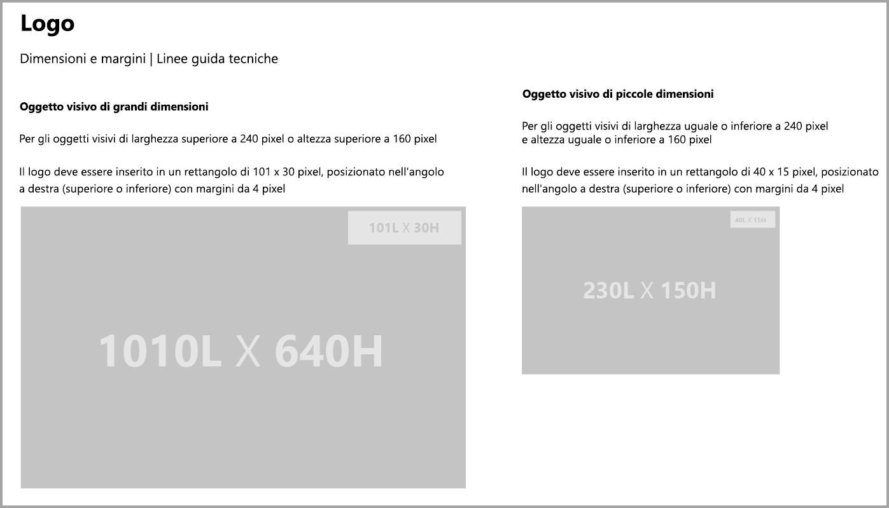
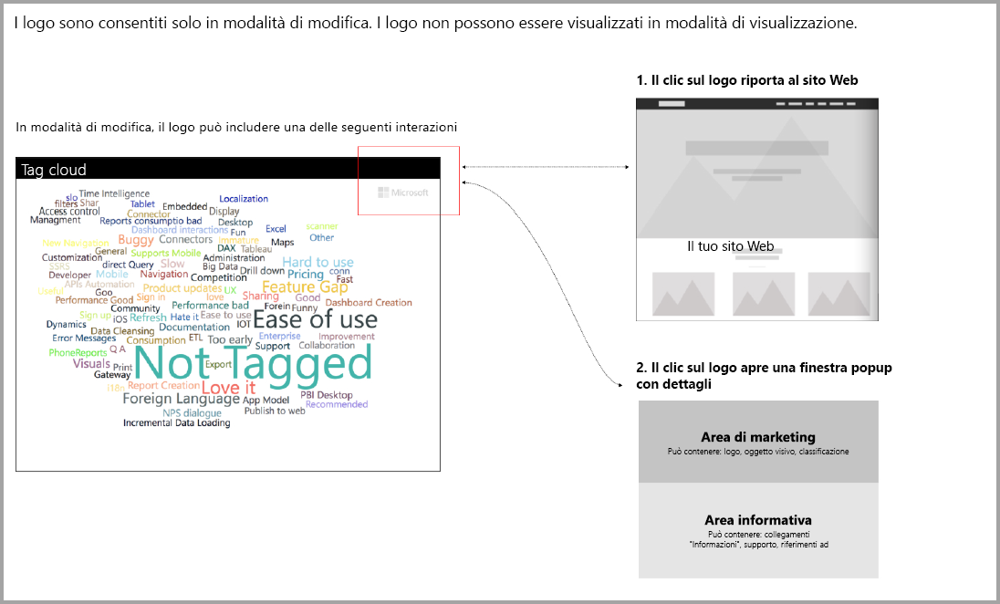

# Linee guida per gli oggetti visivi di Power BI

## Linee guida per gli oggetti visivi di Power BI con acquisti aggiuntivi

Fino a poco tempo fa, il Marketplace (AppSource) accettava solo oggetti visivi di Power BI gratuiti. Questa regola è stata modificata a dicembre 2018 ed è possibile inviare in AppSource anche oggetti visivi con il tag di prezzo "Potrebbe essere necessario un acquisto aggiuntivo". 

Gli oggetti visivi con il tag "Potrebbe essere necessario un acquisto aggiuntivo" sono analoghi ai componenti aggiuntivi con acquisto in-app disponibili in Office Store. Gli sviluppatori possono anche inviare questi oggetti visivi per richiedere la certificazione dopo aver ricevuto l'approvazione del team di AppSource e averne verificato la conformità con i requisiti. Per altre informazioni sui requisiti, vedere [Oggetti visivi personalizzati certificati](../power-bi-custom-visuals-certified.md).

> [!NOTE]
> Perché l'oggetto visivo sia certificato, non deve avere accesso a servizi o risorse esterni.

>[!IMPORTANT]  
> Se si aggiorna l'oggetto visivo da gratuito a "Potrebbe essere necessario un acquisto aggiuntivo", gli utenti devono ricevere lo stesso livello di funzionalità gratuite concesso loro prima dell'aggiornamento. È possibile aggiungere funzionalità a pagamento avanzate facoltative oltre alle funzionalità gratuite esistenti. È consigliabile inviare gli oggetti visivi con acquisto in-app con funzionalità avanzate come nuovi oggetti visivi anziché aggiornare gli oggetti gratuiti esistenti.

## Che cosa è cambiato nel processo di invio?

Gli sviluppatori caricano gli oggetti visivi con acquisto in-app in AppSource usando il Dashboard venditori, come erano soliti fare per gli oggetti visivi gratuiti. Per indicare che l'oggetto visivo inviato contiene funzionalità con acquisto in-app, gli sviluppatori devono indicare nelle note del dashboard venditori: "Oggetto visivo con acquisto in-app". Gli sviluppatori devono anche specificare anche un codice di licenza o un token in modo che il team di convalida possa convalidare le funzionalità con acquisto in-app. Dopo aver convalidato e approvato l'oggetto visivo, nell'elenco AppSource degli oggetti visivi con acquisto in-app viene visualizzato "Potrebbe essere necessario un acquisto aggiuntivo" tra le opzioni di prezzo.

## Che cos'è un oggetto visivo di Power BI con funzionalità con acquisto in-app?

Un oggetto visivo con acquisto in-app è un oggetto visivo **gratuito** che offre **funzionalità gratuite**. Include anche alcune funzionalità avanzate per l'uso delle quali potrebbe essere previsto un costo aggiuntivo. Nella descrizione dell'oggetto visivo gli sviluppatori devono segnalare agli utenti la presenza di funzionalità che richiedono un acquisto aggiuntivo per poter essere usate. Attualmente, Microsoft non fornisce API native per supportare l'acquisto di app e componenti aggiuntivi.

Per questo tipo di acquisti, gli sviluppatori possono usare un sistema di pagamento di terze parti. Per altre informazioni, vedere l'[informativa per lo store](https://docs.microsoft.com/office/dev/store/validation-policies#2-apps-or-add-ins-can-display-certain-ads).

> [!NOTE]
> Le filigrane non sono consentite per le funzionalità gratuite o gli oggetti visivi gratuiti. È possibile applicare le filigrane nelle funzionalità a pagamento usate senza una licenza valida. È consigliabile visualizzare una finestra popup che contiene tutte le informazioni correlate alla licenza per sapere se le funzionalità avanzate a pagamento vengono usate senza una licenza valida.  

## Linee guida per il logo

In questa sezione vengono descritte le specifiche per l'aggiunta dei logo negli oggetti visivi.

> [!IMPORTANT]
> I logo sono consentiti solo in **modalità di modifica**. I logo **non possono** essere visualizzati in modalità di visualizzazione.

## Procedure consigliate

### Pagina di destinazione dell'oggetto visivo

Usare la pagina di destinazione per spiegare come usare l'oggetto visivo e dove acquistare la licenza. Non includere video che si attivano automaticamente. Aggiungere solo materiale che ottimizza l'esperienza dell'utente, ad esempio informazioni o collegamenti su dettagli di acquisto delle licenze o sull'uso delle funzionalità con acquisto in-app.

### Codice di licenza e token

Per comodità dell'utente, aggiungere i campi correlati a codice di licenza o token nella parte superiore del riquadro formato.

## DOMANDE FREQUENTI

Per altre informazioni sugli oggetti visivi, vedere le [domande frequenti sugli oggetti visivi con acquisti aggiuntivi](https://docs.microsoft.com/power-bi/power-bi-custom-visuals-faq#visuals-with-additional-purchases).

## Passaggi successivi

Informazioni su come pubblicare l'oggetto visivo personalizzato in [AppSource](office-store.md) in modo che altri utenti possano individuarlo e usarlo.
