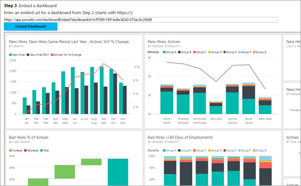
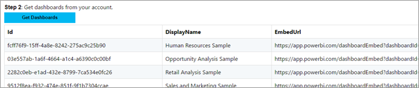

# <a name="integrate-a-dashboard-into-an-app-for-your-organization"></a>Integrare un dashboard in un'app per l'organizzazione
Informazioni su come integrare o incorporare un dashboard in un'app Web con chiamate all'API REST insieme all'API JavaScript di Power BI durante l'incorporamento per l'organizzazione.



Per eseguire questa procedura dettagliata, è necessario un account **Power BI**. Se non si ha un account, è possibile [iscriversi per ottenere un account Power BI gratuito](../service-self-service-signup-for-power-bi.md) oppure creare il proprio [tenant di Azure Active Directory](create-an-azure-active-directory-tenant.md) a scopo di test.

> [!NOTE]
> Se invece si vuole incorporare un dashboard per i clienti usando un embedtoken, vedere [Integrare un dashboard, un riquadro o un report nell'applicazione per i clienti](embed-sample-for-customers.md).
> 
> 

Per integrare un dashboard in un'app Web, usare l'API REST di **Power BI** o Power BI C# SDK e un **token di accesso** di un'autorizzazione di Azure Active Directory (AD) per ottenere un dashboard. Caricare quindi il dashboard usando lo stesso token di accesso. L'API **Power BI** fornisce l'accesso a livello di codice a determinate risorse di **Power BI**. Per altre informazioni, vedere [Power BI REST API](https://docs.microsoft.com/rest/api/power-bi/) (API REST di Power BI) e [Power BI JavaScript API](https://github.com/Microsoft/PowerBI-JavaScript) (API JavaScript di Power BI).

## <a name="download-the-sample"></a>Scaricare l'esempio
Questo articolo illustra il codice usato in [integrate-dashboard-web-app](https://github.com/Microsoft/PowerBI-Developer-Samples/tree/master/User%20Owns%20Data/integrate-dashboard-web-app) su GitHub. Per proseguire con questa procedura dettagliata, è possibile scaricare l'esempio.

## <a name="step-1---register-an-app-in-azure-ad"></a>Passaggio 1: Registrare un'app in Azure AD
Sarà necessario registrare l'applicazione in Azure AD per effettuare chiamate all'API REST. Per altre informazioni, vedere [Registrare un'app di Azure AD per incorporare il contenuto di Power BI](register-app.md).

Se è stato scaricato l'[esempio di integrazione di un dashboard](https://github.com/Microsoft/PowerBI-Developer-Samples/tree/master/User%20Owns%20Data/integrate-dashboard-web-app), usare l'**ID Client** e il **segreto client** ottenuti dopo la registrazione in modo che l'esempio possa autenticarsi con Azure AD. Per configurare l'esempio, modificare l'**ID client** e il **Segreto client** nel file *cloud.config*.


## <a name="step-2---get-an-access-token-from-azure-ad"></a>Passaggio 2: Ottenere un token di accesso da Azure AD
Nell'applicazione è prima di tutto necessario ottenere un **token di accesso** da Azure AD prima di effettuare chiamate all'API REST di Power BI. Per altre informazioni, vedere [Autenticare gli utenti e ottenere un token di accesso di Azure AD per l'app Power BI](get-azuread-access-token.md).

## <a name="step-3---get-a-dashboard"></a>Passaggio 3: Ottenere un dashboard
Per ottenere un dashboard di **Power BI**, usare l'operazione [Get Dashboards](https://docs.microsoft.com/rest/api/power-bi/dashboards/getdashboards) che recupera un elenco di report di dashboard di **Power BI**. Dall'elenco dei dashboard è possibile ottenere un ID dashboard.



### <a name="get-dashboards-using-an-access-token"></a>Ottenere dashboard con un token di accesso
Con il **token di accesso** recuperato al [Passaggio 2](#step-2-get-an-access-token-from-azure-ad) è possibile chiamare l'operazione [Get Dashboards](https://docs.microsoft.com/rest/api/power-bi/dashboards/getdashboards). L'operazione [Get Dashboards](https://docs.microsoft.com/rest/api/power-bi/dashboards/getdashboards) restituisce un elenco di dashboard. Dall'elenco dei dashboard è possibile ottenere un singolo dashboard. Di seguito è riportato un metodo C# completo per ottenere un dashboard. 

Per effettuare la chiamata all'API REST, è necessario includere un'intestazione *Authorization* con formato *Bearer {token di accesso}*.

#### <a name="get-dashboards-with-the-rest-api"></a>Ottenere dashboard con l'API REST
**Default.aspx.cs**

```
protected void getDashboardsButton_Click(object sender, EventArgs e)
{
    string responseContent = string.Empty;

    //Configure dashboards request
    System.Net.WebRequest request = System.Net.WebRequest.Create(String.Format("{0}dashboards", baseUri)) as System.Net.HttpWebRequest;
    request.Method = "GET";
    request.ContentLength = 0;
    request.Headers.Add("Authorization", String.Format("Bearer {0}", authResult.AccessToken));

    //Get dashboards response from request.GetResponse()
    using (var response = request.GetResponse() as System.Net.HttpWebResponse)
    {
        //Get reader from response stream
        using (var reader = new System.IO.StreamReader(response.GetResponseStream()))
        {
            responseContent = reader.ReadToEnd();

            //Deserialize JSON string
            PBIDashboards PBIDashboards = JsonConvert.DeserializeObject<PBIDashboards>(responseContent);

            if (PBIDashboards != null)
            {
                var gridViewDashboards = PBIDashboards.value.Select(dashboard => new {
                    Id = dashboard.id,
                    DisplayName = dashboard.displayName,
                    EmbedUrl = dashboard.embedUrl
                });

                this.GridView1.DataSource = gridViewDashboards;
                this.GridView1.DataBind();
            }
        }
    }
}

//Power BI Dashboards used to deserialize the Get Dashboards response.
public class PBIDashboards
{
    public PBIDashboard[] value { get; set; }
}
public class PBIDashboard
{
    public string id { get; set; }
    public string displayName { get; set; }
    public string embedUrl { get; set; }
    public bool isReadOnly { get; set; }
}
```

#### <a name="get-dashboards-using-the-net-sdk"></a>Ottenere dashboard con .NET SDK
È possibile usare .NET SDK per recuperare un elenco di dashboard invece di chiamare direttamente l'API REST.

```
using Microsoft.IdentityModel.Clients.ActiveDirectory;
using Microsoft.PowerBI.Api.V2;
using Microsoft.PowerBI.Api.V2.Models;

var tokenCredentials = new TokenCredentials(<ACCESS TOKEN>, "Bearer");

// Create a Power BI Client object. It will be used to call Power BI APIs.
using (var client = new PowerBIClient(new Uri(ApiUrl), tokenCredentials))
{
    // Get a list of dashboards your "My Workspace"
    ODataResponseListDashboard dashboards = client.Dashboards.GetDashboards();

    // Get a list of dashboards from a group (app workspace)
    ODataResponseListDashboard dashboards = client.Dashboards.GetDashboardsInGroup(groupId);

    Dashboard dashboard = dashboards.Value.FirstOrDefault();

    var embedUrl = dashboard.EmbedUrl
}
```

## <a name="step-4---load-a-dashboard-using-javascript"></a>Passaggio 4: Caricare un dashboard con JavaScript
È possibile usare JavaScript per caricare un dashboard in un elemento div nella pagina Web.

**Default.aspx**

```
<!-- Embed Dashboard-->
<div> 
    <asp:Panel ID="PanelEmbed" runat="server" Visible="true">
        <div>
            <div><b class="step">Step 3</b>: Embed a dashboard</div>

            <div>Enter an embed url for a dashboard from Step 2 (starts with https://):</div>
            <input type="text" id="tb_EmbedURL" style="width: 1024px;" />
            <br />
            <input type="button" id="bEmbedDashboardAction" value="Embed Dashboard" />
        </div>

        <div id="dashboardContainer"></div>
    </asp:Panel>
</div>
```

**Site.master**

```
window.onload = function () {
    // client side click to embed a selected dashboard.
    var el = document.getElementById("bEmbedDashboardAction");
    if (el.addEventListener) {
        el.addEventListener("click", updateEmbedDashboard, false);
    } else {
        el.attachEvent('onclick', updateEmbedDashboard);
    }

    // handle server side post backs, optimize for reload scenarios
    // show embedded dashboard if all fields were filled in.
    var accessTokenElement = document.getElementById('MainContent_accessTokenTextbox');
    if (accessTokenElement !== null) {
        var accessToken = accessTokenElement.value;
        if (accessToken !== "")
            updateEmbedDashboard();
    }
};

// update embed dashboard
function updateEmbedDashboard() {

    // check if the embed url was selected
    var embedUrl = document.getElementById('tb_EmbedURL').value;
    if (embedUrl === "")
        return;

    // get the access token.
    accessToken = document.getElementById('MainContent_accessTokenTextbox').value;

    // Embed configuration used to describe the what and how to embed.
    // This object is used when calling powerbi.embed.
    // You can find more information at https://github.com/Microsoft/PowerBI-JavaScript/wiki/Embed-Configuration-Details.
    var config = {
        type: 'dashboard',
        accessToken: accessToken,
        embedUrl: embedUrl
    };

    // Grab the reference to the div HTML element that will host the dashboard.
    var dashboardContainer = document.getElementById('dashboardContainer');

    // Embed the dashboard and display it within the div container.
    var dashboard = powerbi.embed(dashboardContainer, config);

    // dashboard.on will add an event handler which prints to Log window.
    dashboard.on("tileClicked", function (event) {
        var logView = document.getElementById('logView');
        logView.innerHTML = logView.innerHTML + "Tile Clicked<br/>";
        logView.innerHTML = logView.innerHTML + JSON.stringify(event.detail, null, "  ") + "<br/>";
        logView.innerHTML = logView.innerHTML + "---------<br/>";
    });

    // dashboard.on will add an event handler which prints to Log window.
    dashboard.on("error", function (event) {
        var logView = document.getElementById('logView');
        logView.innerHTML = logView.innerHTML + "Error<br/>";
        logView.innerHTML = logView.innerHTML + JSON.stringify(event.detail, null, "  ") + "<br/>";
        logView.innerHTML = logView.innerHTML + "---------<br/>";
    });
}
```

Se è stato scaricato ed eseguito l'[esempio di integrazione di un dashboard](https://github.com/Microsoft/PowerBI-Developer-Samples/tree/master/User%20Owns%20Data/integrate-dashboard-web-app), avrà un aspetto simile al seguente.


## <a name="tile-clicked-events"></a>Eventi selezionati nel riquadro
Nell'esempio precedente, si sarà notato che è possibile gestire gli eventi quando si fa clic sul riquadro nel dashboard. Per altre informazioni sugli eventi, vedere [Gestione degli eventi all'interno dell'API JavaScript](https://github.com/Microsoft/PowerBI-JavaScript/wiki/Handling-Events).

```
// dashboard.on will add an event handler which prints to Log window.
dashboard.on("tileClicked", function (event) {
    var logView = document.getElementById('logView');
    logView.innerHTML = logView.innerHTML + "Tile Clicked<br/>";
    logView.innerHTML = logView.innerHTML + JSON.stringify(event.detail, null, "  ") + "<br/>";
    logView.innerHTML = logView.innerHTML + "---------<br/>";
});

// dashboard.on will add an event handler which prints to Log window.
dashboard.on("error", function (event) {
    var logView = document.getElementById('logView');
    logView.innerHTML = logView.innerHTML + "Error<br/>";
    logView.innerHTML = logView.innerHTML + JSON.stringify(event.detail, null, "  ") + "<br/>";
    logView.innerHTML = logView.innerHTML + "---------<br/>";
});
```

Se è stato scaricato ed eseguito l'[esempio di integrazione di un dashboard](https://github.com/Microsoft/PowerBI-Developer-Samples/tree/master/PowerBI.com%20Integrate/integrate-dashboard-web-app),facendo clic in un riquadro verrà generato del testo sotto al dashboard. Il testo dovrebbe essere simile a quello indicato di seguito. Ciò consente di registrare che è stato fatto clic su un riquadro e quindi l'utente potrà passare alla posizione appropriata.

```
Tile Clicked
{ "event": "TileClick", "reportEmbedUrl": "", "navigationUrl": "https://app.powerbi.com/dashboards/fcff76f9-15ff-4a8e-8242-275ac9c25b90/qna?q=count%20of%20new%20hires%20from%20July%202014%20to%20December%202014", "tileId": "0e99b45c-9b53-4920-b239-cee7d37d2369" }
---------
Tile Clicked
{ "event": "TileClick", "reportEmbedUrl": "https://app.powerbi.com/reportEmbed?reportId=ab199308-80b1-4626-9823-43a84623bd9c", "navigationUrl": "https://app.powerbi.com/reports/ab199308-80b1-4626-9823-43a84623bd9c/ReportSection1", "tileId": "ffc30447-674a-4511-944f-79e182d719de", "pageName": "ReportSection1" }
---------
```

## <a name="working-with-groups-app-workspaces"></a>Utilizzo dei gruppi (aree di lavoro dell'app)
Per incorporare un dashboard da un gruppo (area di lavoro dell'app), è consigliabile ottenere l'elenco di tutti i dashboard disponibili in un gruppo tramite la chiamata seguente all'API REST. Per altre informazioni su questa chiamata all'API REST, vedere [Get Dashboards](https://docs.microsoft.com/rest/api/power-bi/dashboards/getdashboards) (Ottenere dashboard). Per consentire alla richiesta di restituire risultati, sarà necessaria l'autorizzazione per il gruppo.

```
https://api.powerbi.com/v1.0/myorg/groups/{groupId}/dashboards
```

L'API precedente restituisce l'elenco dei dashboard disponibili. Ogni dashboard presenta una proprietà EmbedUrl che è già concepita per supportare l'incorporamento del gruppo.

```
https://app.powerbi.com/dashboardEmbed?dashboardId={dashboardId}&groupId={groupId}
```

## <a name="limitations"></a>Limitazioni
* Gli utenti finali che accedono ai dashboard incorporati devono avere un account Power BI e devono avere l'accesso al dashboard. Gli utenti devono essere proprietari del dashboard o il dashboard deve essere stato condiviso con l'utente.
* Attualmente, Domande e risposte non è supportato nei dashboard incorporati.
* Come limitazione temporanea, quando si condivide un dashboard con gruppi di sicurezza, l'utente deve accedere ai dashboard in PowerBI.com prima di poterlo visualizzare incorporato.

## <a name="next-steps"></a>Passaggi successivi
Un'applicazione di esempio è disponibile su GitHub per gli utenti. Gli esempi precedenti sono basati su di essa. Per altre informazioni, vedere [integrate-dashboard-web-app](https://github.com/Microsoft/PowerBI-Developer-Samples/tree/master/User%20Owns%20Data/integrate-dashboard-web-app).

Per altre informazioni sull'API JavaScript, vedere [Power BI JavaScript API](https://github.com/Microsoft/PowerBI-JavaScript) (API JavaScript di Power BI).

Altre domande? [Provare a rivolgersi alla community di Power BI](http://community.powerbi.com/)

