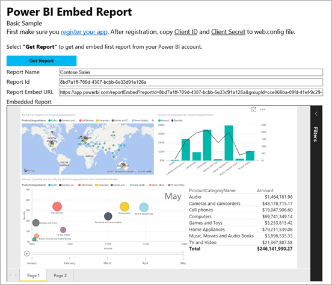
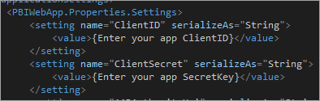

# <a name="integrate-a-report-into-an-app-for-your-organization"></a>Integrare un report in un'app per l'organizzazione
Informazioni su come integrare o incorporare un report in un'app Web con chiamate all'API REST insieme all'API JavaScript di Power BI durante l'incorporamento per l'organizzazione.



Per eseguire questa procedura dettagliata, è necessario un account **Power BI**. Se non si ha un account, è possibile [iscriversi per ottenere un account Power BI gratuito](../service-self-service-signup-for-power-bi.md) oppure creare il proprio [tenant di Azure Active Directory](create-an-azure-active-directory-tenant.md) a scopo di test.

> [!NOTE]
> Se invece si vuole incorporare un report per i clienti usando un embedtoken, vedere [Integrare un dashboard, un riquadro o un report nell'applicazione per i clienti](embed-sample-for-customers.md).
> 
> 

Per integrare un report in un'app Web, usare l'API REST di **Power BI** o Power BI C# SDK e un **token di accesso** di un'autorizzazione di Azure Active Directory (AD) per ottenere un report. Caricare quindi il report usando lo stesso token di accesso. L'API **Power BI** fornisce l'accesso a livello di codice a determinate risorse di **Power BI**. Per altre informazioni, vedere [Panoramica dell'API REST di Power BI](https://msdn.microsoft.com/library/dn877544.aspx) e [Power BI JavaScript API](https://github.com/Microsoft/PowerBI-JavaScript) (API JavaScript di Power BI).

## <a name="download-the-sample"></a>Scaricare l'esempio
Questo articolo illustra il codice usato in [integrate-report-web-app](https://github.com/Microsoft/PowerBI-Developer-Samples/tree/master/User%20Owns%20Data/integrate-report-web-app) su GitHub. Per proseguire con questa procedura dettagliata, è possibile scaricare l'esempio.

## <a name="step-1---register-an-app-in-azure-ad"></a>Passaggio 1: Registrare un'app in Azure AD
Sarà necessario registrare l'applicazione in Azure AD per effettuare chiamate all'API REST. Per altre informazioni, vedere [Registrare un'app di Azure AD per incorporare il contenuto di Power BI](register-app.md).

Se è stato scaricato [integrate-report-web-app](https://github.com/Microsoft/PowerBI-Developer-Samples/tree/master/User%20Owns%20Data/integrate-report-web-app), usare l'**ID Client** e il **segreto client** ottenuti dopo la registrazione in modo che l'esempio possa autenticarsi con Azure AD. Per configurare l'esempio, modificare l'**ID client** e il **Segreto client** nel file *cloud.config*.



## <a name="step-2---get-an-access-token-from-azure-ad"></a>Passaggio 2: Ottenere un token di accesso da Azure AD
Nell'applicazione è prima di tutto necessario ottenere un **token di accesso** da Azure AD prima di effettuare chiamate all'API REST di Power BI. Per altre informazioni, vedere [Autenticare gli utenti e ottenere un token di accesso di Azure AD per l'app Power BI](get-azuread-access-token.md).

## <a name="step-3---get-a-report"></a>Passaggio 3: Ottenere un report
Per ottenere un report di **Power BI**, usare l'operazione [Get Reports](https://msdn.microsoft.com/library/mt634543.aspx) che recupera un elenco di report di **Power BI**. Dall'elenco dei report è possibile ottenere un ID report.

### <a name="get-reports-using-an-access-token"></a>Ottenere i report usando un token di accesso
Con il **token di accesso** recuperato al [Passaggio 2](#step-2-get-an-access-token-from-azure-ad) è possibile chiamare l'operazione [Get Reports](https://msdn.microsoft.com/library/mt634543.aspx). L'operazione [Get Reports](https://msdn.microsoft.com/library/mt634543.aspx) restituisce un elenco di report. È possibile ottenere un singolo report dall'elenco di report. Di seguito è riportato un metodo C# completo per ottenere un report. 

Per effettuare la chiamata all'API REST, è necessario includere un'intestazione *Authorization* con formato *Bearer {token di accesso}*.

#### <a name="get-reports-with-the-rest-api"></a>Ottenere report con l'API REST
**Default.aspx.cs**

```
using Newtonsoft.Json;

//Get a Report. In this sample, you get the first Report.
protected void GetReport(int index)
{
    //Configure Reports request
    System.Net.WebRequest request = System.Net.WebRequest.Create(
        String.Format("{0}/Reports",
        baseUri)) as System.Net.HttpWebRequest;

    request.Method = "GET";
    request.ContentLength = 0;
    request.Headers.Add("Authorization", String.Format("Bearer {0}", accessToken.Value));

    //Get Reports response from request.GetResponse()
    using (var response = request.GetResponse() as System.Net.HttpWebResponse)
    {
        //Get reader from response stream
        using (var reader = new System.IO.StreamReader(response.GetResponseStream()))
        {
            //Deserialize JSON string
            PBIReports Reports = JsonConvert.DeserializeObject<PBIReports>(reader.ReadToEnd());

            //Sample assumes at least one Report.
            //You could write an app that lists all Reports
            if (Reports.value.Length > 0)
            {
                var report = Reports.value[index];

                txtEmbedUrl.Text = report.embedUrl;
                txtReportId.Text = report.id;
                txtReportName.Text = report.name;
            }
        }
    }
}

//Power BI Reports used to deserialize the Get Reports response.
public class PBIReports
{
    public PBIReport[] value { get; set; }
}
public class PBIReport
{
    public string id { get; set; }
    public string name { get; set; }
    public string webUrl { get; set; }
    public string embedUrl { get; set; }
}
```

#### <a name="get-reports-using-the-net-sdk"></a>Recuperare report con .NET SDK
È possibile usare .NET SDK per recuperare un elenco di report invece di chiamare direttamente l'API REST.

```
using Microsoft.IdentityModel.Clients.ActiveDirectory;
using Microsoft.PowerBI.Api.V2;
using Microsoft.PowerBI.Api.V2.Models;

var tokenCredentials = new TokenCredentials(<ACCESS TOKEN>, "Bearer");

// Create a Power BI Client object. It will be used to call Power BI APIs.
using (var client = new PowerBIClient(new Uri(ApiUrl), tokenCredentials))
{
    // Get the first report all reports in that workspace
    ODataResponseListReport reports = client.Reports.GetReports();

    Report report = reports.Value.FirstOrDefault();

    var embedUrl = report.EmbedUrl;
}
```

## <a name="step-4---load-a-report-using-javascript"></a>Passaggio 4: Caricare un report con JavaScript
È possibile usare JavaScript per caricare un report in un elemento div nella pagina Web.

**Default.aspx**

```
<!-- Embed Report-->
<div> 
    <asp:Panel ID="PanelEmbed" runat="server" Visible="true">
        <div>
            <div><b class="step">Step 3</b>: Embed a report</div>

            <div>Enter an embed url for a report from Step 2 (starts with https://):</div>
            <input type="text" id="tb_EmbedURL" style="width: 1024px;" />
            <br />
            <input type="button" id="bEmbedReportAction" value="Embed Report" />
        </div>

        <div id="reportContainer"></div>
    </asp:Panel>
</div>
```

**Site.master**

```
window.onload = function () {
    // client side click to embed a selected report.
    var el = document.getElementById("bEmbedReportAction");
    if (el.addEventListener) {
        el.addEventListener("click", updateEmbedReporte, false);
    } else {
        el.attachEvent('onclick', updateEmbedReport);
    }

    // handle server side post backs, optimize for reload scenarios
    // show embedded report if all fields were filled in.
    var accessTokenElement = document.getElementById('MainContent_accessTokenTextbox');
    if (accessTokenElement !== null) {
        var accessToken = accessTokenElement.value;
        if (accessToken !== "")
            updateEmbedReport();
    }
};

// update embed report
function updateEmbedReport() {

    // check if the embed url was selected
    var embedUrl = document.getElementById('tb_EmbedURL').value;
    if (embedUrl === "")
        return;

    // get the access token.
    accessToken = document.getElementById('MainContent_accessTokenTextbox').value;

    // Embed configuration used to describe the what and how to embed.
    // This object is used when calling powerbi.embed.
    // You can find more information at https://github.com/Microsoft/PowerBI-JavaScript/wiki/Embed-Configuration-Details.
    var config = {
        type: 'report',
        accessToken: accessToken,
        embedUrl: embedUrl
    };

    // Grab the reference to the div HTML element that will host the report.
    var reportContainer = document.getElementById('reportContainer');

    // Embed the report and display it within the div container.
    var report = powerbi.embed(reportContainer, config);

    // report.on will add an event handler which prints to Log window.
    report.on("error", function (event) {
        var logView = document.getElementById('logView');
        logView.innerHTML = logView.innerHTML + "Error<br/>";
        logView.innerHTML = logView.innerHTML + JSON.stringify(event.detail, null, "  ") + "<br/>";
        logView.innerHTML = logView.innerHTML + "---------<br/>";
    });
}
```

Se è stato scaricato ed eseguito [integrate-report-web-app](https://github.com/Microsoft/PowerBI-Developer-Samples/tree/master/User%20Owns%20Data/integrate-report-web-app), l'esempio avrà un aspetto simile al seguente.


## <a name="working-with-groups-app-workspaces"></a>Utilizzo dei gruppi (aree di lavoro dell'app)
Per incorporare un report da un gruppo (area di lavoro dell'app), è consigliabile ottenere l'elenco di tutti i report disponibili nel dashboard del gruppo tramite la chiamata seguente all'API REST. Per altre informazioni su questa chiamata all'API REST, vedere [Get Reports](https://msdn.microsoft.com/library/mt634543.aspx). Per consentire alla richiesta di restituire risultati, sarà necessaria l'autorizzazione per il gruppo.

```
https://api.powerbi.com/v1.0/myorg/groups/{group_id}/reports
```

L'API precedente restituisce l'elenco dei report disponibili. Ogni report presenta una proprietà EmbedUrl che è già concepita per supportare l'incorporamento del gruppo.

```
https://app.powerbi.com/reportEmbed?reportId={report_id}&groupId={group_id}
```

## <a name="next-steps"></a>Passaggi successivi
Un'applicazione di esempio è disponibile su GitHub per gli utenti. Per altre informazioni, vedere [integrate-report-web-app](https://github.com/Microsoft/PowerBI-Developer-Samples/tree/master/User%20Owns%20Data/integrate-report-web-app).

Per altre informazioni sull'API JavaScript, vedere [Power BI JavaScript API](https://github.com/Microsoft/PowerBI-JavaScript) (API JavaScript di Power BI).

Altre domande? [Provare a rivolgersi alla community di Power BI](http://community.powerbi.com/)

