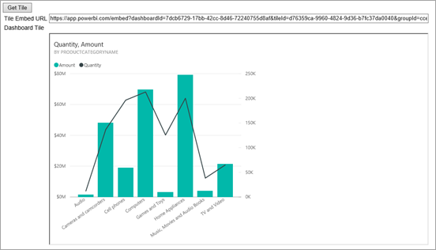

# <a name="integrate-a-tile-into-an-app-user-owns-data"></a>Integrare un riquadro in un'app (i dati sono di proprietà dell'utente)
Informazioni su come integrare o incorporare un riquadro in un'app Web con chiamate all'API REST insieme all'API JavaScript di Power BI durante l'incorporamento per l'organizzazione.



Per eseguire questa procedura dettagliata, è necessario un account **Power BI**. Se non si ha un account, è possibile [iscriversi per ottenere un account Power BI gratuito](../service-self-service-signup-for-power-bi.md) oppure creare il proprio [tenant di Azure Active Directory](create-an-azure-active-directory-tenant.md) a scopo di test.

> [!NOTE]
> Se invece si vuole incorporare un riquadro per i clienti usando un embedtoken, vedere [Integrare un dashboard, un riquadro o un report nell'applicazione per i clienti](embed-sample-for-customers.md).
> 
> 

Per integrare un riquadro in un'app Web, usare l'API REST di **Power BI** o Power BI C# SDK e un **token di accesso** di un'autorizzazione di Azure Active Directory (AD) per ottenere un riquadro. Caricare quindi il riquadro usando lo stesso token di accesso. L'API **Power BI** fornisce l'accesso a livello di codice a determinate risorse di **Power BI**. Per altre informazioni, vedere [Power BI REST API](https://docs.microsoft.com/rest/api/power-bi/) (API REST di Power BI) e [Power BI JavaScript API](https://github.com/Microsoft/PowerBI-JavaScript) (API JavaScript di Power BI).

## <a name="download-the-sample"></a>Scaricare l'esempio
Questo articolo illustra il codice usato in [integrate-tile-web-app](https://github.com/Microsoft/PowerBI-Developer-Samples/tree/master/User%20Owns%20Data/integrate-tile-web-app) su GitHub. Per proseguire con questa procedura dettagliata, è possibile scaricare l'esempio.

## <a name="step-1---register-an-app-in-azure-ad"></a>Passaggio 1: Registrare un'app in Azure AD
Sarà necessario registrare l'applicazione in Azure AD per effettuare chiamate all'API REST. Per altre informazioni, vedere [Registrare un'app di Azure AD per incorporare il contenuto di Power BI](register-app.md).

Se è stato scaricato [integrate-tile-web-app](https://github.com/Microsoft/PowerBI-Developer-Samples/tree/master/User%20Owns%20Data/integrate-tile-web-app), usare l'**ID Client** e il **segreto client** ottenuti dopo la registrazione in modo che l'esempio possa autenticarsi con Azure AD. Per configurare l'esempio, modificare l'**ID client** e il **Segreto client** nel file *cloud.config*.


## <a name="step-2---get-an-access-token-from-azure-ad"></a>Passaggio 2: Ottenere un token di accesso da Azure AD
Nell'applicazione è prima di tutto necessario ottenere un **token di accesso** da Azure AD prima di effettuare chiamate all'API REST di Power BI. Per altre informazioni, vedere [Autenticare gli utenti e ottenere un token di accesso di Azure AD per l'app Power BI](get-azuread-access-token.md).

## <a name="step-3---get-a-tile"></a>Passaggio 3: Ottenere un riquadro
Per ottenere un riquadro di **Power BI**, usare l'operazione [Get Tiles](https://docs.microsoft.com/rest/api/power-bi/dashboards/gettiles), che ottiene un elenco di riquadri di **Power BI** da un dashboard specifico. Dall'elenco di riquadri è possibile ottenere un ID riquadro e un URL incorporato.

Prima di ottenere il riquadro, sarà necessario recuperare un ID dashboard. Per informazioni su come recuperare un dashboard, vedere [Integrare un dashboard in un'app (i dati sono di proprietà dell'utente)](integrate-dashboard.md).

### <a name="get-tiles-using-an-access-token"></a>Ottenere i riquadri usando un token di accesso
Con il **token di accesso** recuperato al [Passaggio 2](#step-2-get-an-access-token-from-azure-ad) è possibile chiamare l'operazione [Get Tiles](https://docs.microsoft.com/rest/api/power-bi/dashboards/gettiles). L'operazione [Get Tiles](https://docs.microsoft.com/rest/api/power-bi/dashboards/gettiles) restituisce un elenco di riquadri. È possibile ottenere un singolo riquadro dall'elenco di riquadri. Di seguito è riportato un metodo C# completo per ottenere un riquadro. 

Per effettuare la chiamata all'API REST, è necessario includere un'intestazione *Authorization* con formato *Bearer {token di accesso}*.

#### <a name="get-tiles-with-the-rest-api"></a>Recuperare riquadri con l'API REST
**Default.aspx.cs**

```
using Newtonsoft.Json;

//Get a tile from a dashboard. In this sample, you get the first tile.
protected void GetTile(string dashboardId, int index)
{
    //Configure tiles request
    System.Net.WebRequest request = System.Net.WebRequest.Create(
        String.Format("{0}Dashboards/{1}/Tiles",
        baseUri,
        dashboardId)) as System.Net.HttpWebRequest;

    request.Method = "GET";
    request.ContentLength = 0;
    request.Headers.Add("Authorization", String.Format("Bearer {0}", accessToken.Value));

    //Get tiles response from request.GetResponse()
    using (var response = request.GetResponse() as System.Net.HttpWebResponse)
    {
        //Get reader from response stream
        using (var reader = new System.IO.StreamReader(response.GetResponseStream()))
        {
            //Deserialize JSON string
            PBITiles tiles = JsonConvert.DeserializeObject<PBITiles>(reader.ReadToEnd());

            //Sample assumes at least one Dashboard with one Tile.
            //You could write an app that lists all tiles in a dashboard
            if (tiles.value.Length > 0)
                tileEmbedUrl.Text = tiles.value[index].embedUrl;
        }
    }
}

//Power BI Tiles used to deserialize the Get Tiles response.
public class PBITiles
{
    public PBITile[] value { get; set; }
}
public class PBITile
{
    public string id { get; set; }
    public string title { get; set; }
    public string embedUrl { get; set; }
}
```

#### <a name="get-tiles-using-the-net-sdk"></a>Recuperare riquadri con .NET SDK
È possibile usare .NET SDK per recuperare un elenco di dashboard invece di chiamare direttamente l'API REST.

```
using Microsoft.IdentityModel.Clients.ActiveDirectory;
using Microsoft.PowerBI.Api.V2;
using Microsoft.PowerBI.Api.V2.Models;

var tokenCredentials = new TokenCredentials(<ACCESS TOKEN>, "Bearer");

// Create a Power BI Client object. It will be used to call Power BI APIs.
using (var client = new PowerBIClient(new Uri(ApiUrl), tokenCredentials))
{
    // Get a list of dashboards your "My Workspace"
    ODataResponseListDashboard tiles = client.Dashboards.GetDashboards();

    // Get a list of dashboards from a group (app workspace)
    ODataResponseListDashboard dashboards = client.Dashboards.GetDashboardsInGroup(groupId);

    Dashboard dashboard = dashboards.Value.FirstOrDefault();

    // Get the first tile from the above dashbaord
    ODataResponseListTile tiles = client.Dashboards.GetTiles(dashboard.Id);

    Tile tile = tiles.Value.FirstOrDefault();
}
```

## <a name="step-4---load-a-tile-using-javascript"></a>Passaggio 4: Caricare un riquadro con JavaScript
È possibile usare JavaScript per caricare un riquadro in un elemento div nella pagina Web.

**Default.aspx**

```
<!-- Embed Tile-->
<div> 
    <asp:Panel ID="PanelEmbed" runat="server" Visible="true">
        <div>
            <div><b class="step">Step 3</b>: Embed a tile</div>

            <div>Enter an embed url for a tile from Step 2 (starts with https://):</div>
            <input type="text" id="tb_EmbedURL" style="width: 1024px;" />
            <br />
            <input type="button" id="bEmbedTileAction" value="Embed Tile" />
        </div>

        <div id="tileContainer"></div>
    </asp:Panel>
</div>
```

**Site.master**

```
window.onload = function () {
    // client side click to embed a selected tile.
    var el = document.getElementById("bEmbedTileAction");
    if (el.addEventListener) {
        el.addEventListener("click", updateEmbedTile, false);
    } else {
        el.attachEvent('onclick', updateEmbedTile);
    }

    // handle server side post backs, optimize for reload scenarios
    // show embedded tile if all fields were filled in.
    var accessTokenElement = document.getElementById('MainContent_accessTokenTextbox');
    if (accessTokenElement !== null) {
        var accessToken = accessTokenElement.value;
        if (accessToken !== "")
            updateEmbedTile();
    }
};

// update embed tile
function updateEmbedTile() {

    // check if the embed url was selected
    var embedUrl = document.getElementById('tb_EmbedURL').value;
    if (embedUrl === "")
        return;

    // get the access token.
    accessToken = document.getElementById('MainContent_accessTokenTextbox').value;

    // Embed configuration used to describe the what and how to embed.
    // This object is used when calling powerbi.embed.
    // You can find more information at https://github.com/Microsoft/PowerBI-JavaScript/wiki/Embed-Configuration-Details.
    var config = {
        type: 'tile',
        accessToken: accessToken,
        embedUrl: embedUrl
    };

    // Grab the reference to the div HTML element that will host the tile.
    var tileContainer = document.getElementById('tileContainer');

    // Embed the tile and display it within the div container.
    var tile = powerbi.embed(tileContainer, config);

    // tile.on will add an event handler which prints to Log window.
    tile.on("error", function (event) {
        var logView = document.getElementById('logView');
        logView.innerHTML = logView.innerHTML + "Error<br/>";
        logView.innerHTML = logView.innerHTML + JSON.stringify(event.detail, null, "  ") + "<br/>";
        logView.innerHTML = logView.innerHTML + "---------<br/>";
    });
}
```

Se è stato scaricato ed eseguito [integrate-tile-web-app](https://github.com/Microsoft/PowerBI-Developer-Samples/tree/master/User%20Owns%20Data/integrate-tile-web-app), l'esempio avrà un aspetto simile al seguente.


## <a name="working-with-groups-app-workspaces"></a>Utilizzo dei gruppi (aree di lavoro dell'app)
Per incorporare un riquadro da un gruppo (area di lavoro dell'app), è consigliabile ottenere l'elenco di tutti i riquadri disponibili nel dashboard del gruppo tramite la chiamata seguente all'API REST. Per altre informazioni su questa chiamata all'API REST, vedere [Get Tiles](https://docs.microsoft.com/rest/api/power-bi/dashboards/gettiles). Per consentire alla richiesta di restituire risultati, sarà necessaria l'autorizzazione per il gruppo.

```
https://api.powerbi.com/v1.0/myorg/groups/{groupId}/dashboards/{dashboard_id}/tiles
```

L'API precedente restituisce l'elenco dei riquadri disponibili. Ogni riquadro presenta una proprietà EmbedUrl che è già concepita per supportare l'incorporamento del gruppo.

```
https://app.powerbi.com/embed?dashboardId={dashboard_id}&tileId={tile_id}&groupId={group_id}
```

## <a name="next-steps"></a>Passaggi successivi
[Incorporamento di riquadri](https://github.com/Microsoft/PowerBI-JavaScript/wiki/Tile-Embed) sul wiki PowerBI-JavaScript

[API JavaScript di Power BI](https://github.com/Microsoft/PowerBI-JavaScript).

Esempio [integrate-tile-web-app](https://github.com/Microsoft/PowerBI-Developer-Samples/tree/master/User%20Owns%20Data/integrate-tile-web-app) su GitHub.

Altre domande? [Provare a rivolgersi alla community di Power BI](http://community.powerbi.com/)

