# <a name="power-bi-embedded-migration-tool"></a>Strumento di migrazione di Power BI Embedded
Questo strumento di migrazione può essere usato per copiare i report dal servizio Power BI Embedded Azure (PaaS) al servizio Power BI (SaaS).

La migrazione del contenuto dalle raccolte di aree di lavoro nel servizio Power BI può essere eseguita in parallelo alla soluzione attuale e non richiede alcun tempo di inattività.

## <a name="limitations"></a>Limitazioni
* Non è possibile scaricare i set di dati di push, quindi sarà necessario crearli di nuovo con le API REST di Power BI per il servizio Power BI.
* Non sarà possibile scaricare i file PBIX importati prima del 26 novembre 2016.

## <a name="download"></a>Scarica
È possibile scaricare l'esempio di strumento di migrazione da [GitHub](https://github.com/Microsoft/powerbi-migration-sample). È possibile scaricare un file zip del repository oppure è possibile clonarlo localmente. Una volta scaricato, è possibile aprire *powerbi-migration-sample.sln* all'interno di Visual Studio per compilare ed eseguire lo strumento di migrazione.

## <a name="migration-plans"></a>Piani di migrazione
Il piano di migrazione è costituito semplicemente dai metadati che catalogano il contenuto all'interno di Power BI Embedded e dalla modalità di pubblicazione nel servizio Power BI.

### <a name="start-with-a-new-migration-plan"></a>Iniziare con un nuovo piano di migrazione
Un piano di migrazione è costituito dai metadati disponibili in Power BI Embedded che si vorranno spostare al servizio Power BI. Il piano di migrazione viene archiviato come file XML.

È consigliabile iniziare creando un nuovo piano di migrazione. Per creare un nuovo piano di migrazione, eseguire le operazioni seguenti.

1. Selezionare **File** > **New Migration Plan**.
   
    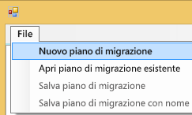
2. Nella finestra di dialogo **Select Power BI Embedded Resource Group** selezionare l'elenco a discesa Environment e selezionare prod.
3. Verrà richiesto di eseguire l'accesso. Usare i dati di accesso della sottoscrizione di Azure.
   
   > [!IMPORTANT]
   > **Non** si tratta dell'account aziendale di Office 365 con cui si accede a Power BI.
   > 
   > 
4. Selezionare la sottoscrizione di Azure che archivia le raccolte di aree di lavoro di Power BI Embedded.
   
    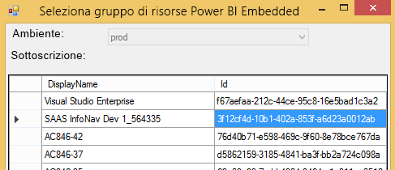
5. Sotto l'elenco delle sottoscrizioni, in **Resource Group** selezionare il gruppo di risorse che contiene le raccolte di aree di lavoro e scegliere **Select**.
   
    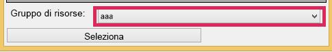
6. Selezionare **Analizza**. Verrà visualizzato un inventario degli elementi nella sottoscrizione di Azure per poter iniziare il piano.
   
    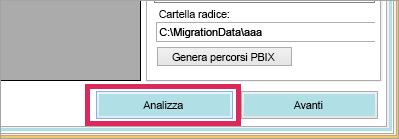
   
   > [!NOTE]
   > Il processo di analisi potrebbe richiedere alcuni minuti a seconda del numero di raccolte di aree di lavoro e della quantità di contenuto presente nella raccolta di aree di lavoro.
   > 
   > 
7. Quando l'operazione **Analizza** è completata, verrà richiesto di salvare il piano di migrazione.

A questo punto, il piano di migrazione è stato connesso alla sottoscrizione di Azure. Leggere quanto riportato di seguito per comprendere il flusso di utilizzo del piano di migrazione. Ciò include l'analisi e la pianificazione della migrazione, il download, la creazione di gruppi e l'upload.

### <a name="save-your-migration-plan"></a>Salvare il piano di migrazione
È possibile salvare il piano di migrazione per un utilizzo successivo. Verrà creato un file XML contenente tutte le informazioni nel piano di migrazione.

Per salvare il piano di migrazione, effettuare le operazioni seguenti.

1. Selezionare **File** > **Save Migration Plan**.
   
    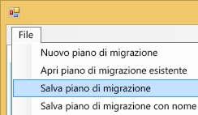
2. Assegnare un nome al file o usare il nome file generato e selezionare **Save**.

### <a name="open-an-existing-migration-plan"></a>Aprire un piano di migrazione esistente
È possibile aprire un piano di migrazione salvato per continuare a elaborare la migrazione.

Per aprire il piano di migrazione esistente, eseguire le operazioni seguenti.

1. Selezionare **File** > **Open Existing Migration Plan**.
   
    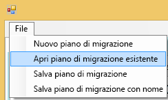
2. Selezionare il file di migrazione, quindi scegliere **Open**.

## <a name="step-1-analyze--plan-migration"></a>Passaggio 1: Analizzare e pianificare la migrazione
La scheda **Analyze & Plan Migration** visualizza il contenuto attuale del gruppo di risorse della sottoscrizione di Azure.


Come esempio, verrà esaminato *SampleResourceGroup*.

### <a name="paas-topology"></a>Topologia PaaS
Si tratta di un elenco di *Gruppo di risorse > Raccolte di aree di lavoro > Aree di lavoro*. Per il gruppo di risorse e le raccolte di aree di lavoro verrà visualizzato un nome descrittivo. Per le aree di lavoro verrà visualizzato un GUID.

Gli elementi nell'elenco vengono contrassegnati da un colore e un numero nel formato (#/#), che indica il numero di report che possono essere scaricati. Il colore nero indica che tutti i report possono essere scaricati.

Il colore rosso indica che alcuni report non possono essere scaricati. Il numero a sinistra indica il numero totale di report che possono essere scaricati. Il numero a destra indica il numero totale di report all'interno del raggruppamento.

È possibile selezionare un elemento all'interno della topologia di PaaS per visualizzare i report nella sezione report.

### <a name="reports"></a>Relazioni
La sezione del report elencherà i report disponibili indicando se possono essere scaricati o no.

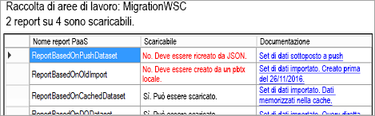

### <a name="target-structure"></a>Struttura di destinazione
La **struttura di destinazione** è quella in cui si indica allo strumento dove verranno scaricati i report e come caricarli.

#### <a name="download-plan"></a>Download Plan (Piano di download)
Verrà creato automaticamente un percorso per l'utente, che è possibile modificare a piacimento. Se si modifica il percorso, è necessario selezionare **Update paths** (Aggiorna percorsi).

> [!NOTE]
> Questa operazione non esegue il download, ma consente solo di specificare la struttura in cui verranno scaricati i report.
> 
> 

#### <a name="upload-plan"></a>Upload Plan (Piano di upload)
Qui è possibile specificare un prefisso da usare per le aree di lavoro per le app che verranno create all'interno del servizio Power BI. Dopo il prefisso ci sarà il GUID per l'area di lavoro esistente in Azure.

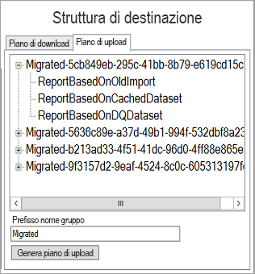

> [!NOTE]
> Questo non comporta la creazione di gruppi all'interno del servizio Power BI, ma definisce solo la struttura di denominazione per i gruppi.
> 
> 

Se si modifica il prefisso, è necessario selezionare **Generate Upload Plan**.

È possibile fare clic con il pulsante destro su un gruppo e scegliere di rinominarlo all'interno del piano di upload direttamente, se necessario.

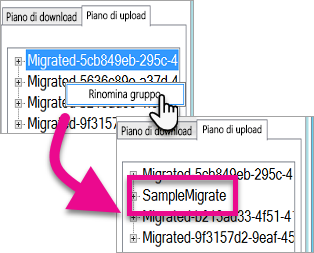

> [!NOTE]
> Il nome del *gruppo* non deve contenere spazi o caratteri non validi.
> 
> 

## <a name="step-2-download"></a>Passaggio 2: Download
Nella scheda **Download** verrà visualizzato l'elenco di report e metadati associati. È possibile vedere qual è lo stato di esportazione attuale assieme allo stato di esportazione precedente.

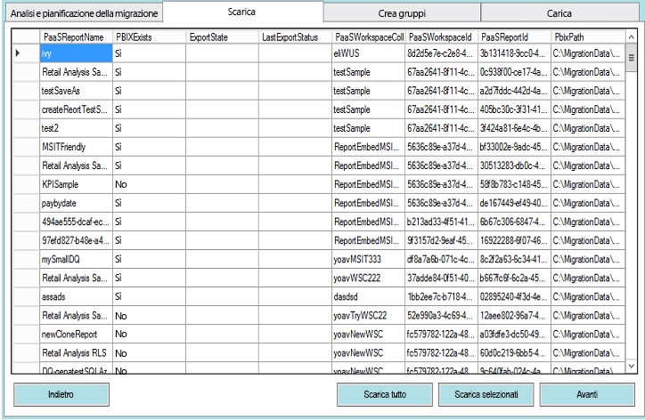

Sono disponibili due opzioni:

* Selezionare i report specifici e selezionare **Scarica selezionato**
* Selezionare **Scarica tutto**.

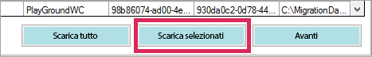

Lo stato *Fine* indicherà che il download è stato completato direttamente, riflettendo l'esistenza del file PBIX.

Una volta completato il download, selezionare la scheda **Create Groups**.

## <a name="step-3-create-groups"></a>Passaggio 3: Creare gruppi
Dopo avere scaricato i report disponibili, è possibile passare alla scheda **Create Groups**, che creerà le aree di lavoro per le app all'interno del servizio Power BI in base al piano di migrazione creato, con il nome fornito nella scheda **Upload** in **Analyze & Plan Migration**.

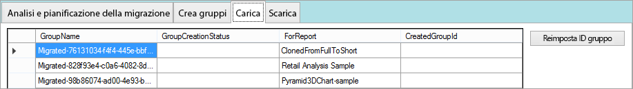

Per creare le aree di lavoro per le app, è possibile selezionare **Create Selected Groups** o **Create All Missing Groups**.

Quando si seleziona una di queste opzioni, verrà richiesto di accedere. *È consigliabile usare le credenziali per il servizio Power BI in cui si vogliono creare le aree di lavoro per le app.*


Verrà creata un'area di lavoro per le app all'interno del servizio Power BI, ma i report non verranno caricati nell'area di lavoro per le app.

È possibile verificare che l'area di lavoro per le app sia stata creata eseguendo l'accesso a Power BI e confermando l'esistenza dell'area di lavoro. Si noterà che l'area di lavoro è priva di contenuto.

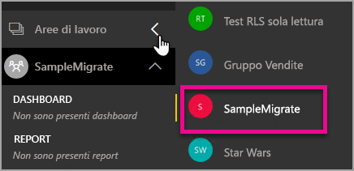

Dopo aver creato l'area di lavoro, è possibile passare alla scheda **Upload**.

## <a name="step-4-upload"></a>Passaggio 4: Upload
Nella scheda **Upload** verranno caricati i report nel servizio Power BI. Verrà visualizzato un elenco dei report caricati nella scheda Download assieme al nome del gruppo di destinazione basato sul piano di migrazione.

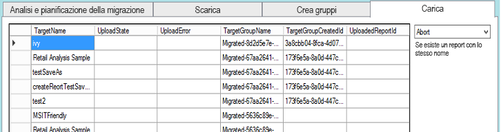

È possibile caricare report selezionati o tutti i report. È anche possibile reimpostare lo stato di upload per caricare nuovamente gli elementi.

Si ha anche la possibilità di selezionare cosa fare se esiste un report con lo stesso nome. È possibile scegliere tra **Abort** (Interrompi), **Ignore** (Ignora) e **Overwrite** (Sovrascrivi).

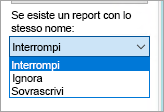

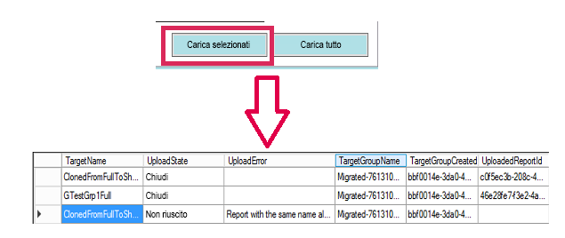

### <a name="duplicate-report-names"></a>Nomi di report duplicati
Se si ha un report differente con lo stesso nome, sarà necessario modificare il **TargetName** del report. È possibile cambiare il nome modificando manualmente il codice XML del piano di migrazione.

È necessario chiudere lo strumento di migrazione per apportare la modifica e quindi aprire nuovamente lo strumento e il piano di migrazione.

Nell'esempio precedente, uno dei report clonati non è riuscito e indica che esiste un report con lo stesso nome. Se si sceglie di esaminare il codice XML del piano di migrazione, si vedrà quanto segue.

```
<ReportMigrationData>
    <PaaSWorkspaceCollectionName>SampleWorkspaceCollection</PaaSWorkspaceCollectionName>
    <PaaSWorkspaceId>4c04147b-d8fc-478b-8dcb-bcf687149823</PaaSWorkspaceId>
    <PaaSReportId>525a8328-b8cc-4f0d-b2cb-c3a9b4ba2efe</PaaSReportId>
    <PaaSReportLastImportTime>1/3/2017 2:10:19 PM</PaaSReportLastImportTime>
    <PaaSReportName>cloned</PaaSReportName>
    <IsPushDataset>false</IsPushDataset>
    <IsBoundToOldDataset>false</IsBoundToOldDataset>
    <PbixPath>C:\MigrationData\SampleResourceGroup\SampleWorkspaceCollection\4c04147b-d8fc-478b-8dcb-bcf687149823\cloned-525a8328-b8cc-4f0d-b2cb-c3a9b4ba2efe.pbix</PbixPath>
    <ExportState>Done</ExportState>
    <LastExportStatus>OK</LastExportStatus>
    <SaaSTargetGroupName>SampleMigrate</SaaSTargetGroupName>
    <SaaSTargetGroupId>6da6f072-0135-4e6c-bc92-0886d8aeb79d</SaaSTargetGroupId>
    <SaaSTargetReportName>cloned</SaaSTargetReportName>
    <SaaSImportState>Failed</SaaSImportState>
    <SaaSImportError>Report with the same name already exists</SaaSImportError>
</ReportMigrationData>
```

Per l'elemento non riuscito, è possibile modificare il nome del valore SaaSTargetReportName.

```
<SaaSTargetReportName>cloned2</SaaSTargetReportName>
```

Sarà quindi possibile aprire nuovamente il piano nello strumento di migrazione e caricare il report non riuscito.

Tornando a Power BI, si noterà che sono stati caricati i report e i set di dati nell'area di lavoro per le app.

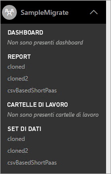

<a name="upload-local-file"></a>

### <a name="upload-a-local-pbix-file"></a>Caricare un file PBIX locale
È possibile caricare una versione locale di un file di Power BI Desktop. È necessario chiudere lo strumento, modificare il file XML e inserire il percorso completo per il file PBIX nella proprietà **PbixPath** locale.

```
<PbixPath>[Full Path to PBIX file]</PbixPath>
```

Dopo aver modificato il file XML, aprire nuovamente il piano nello strumento di migrazione e caricare il report.

<a name="directquery-reports"></a>

### <a name="directquery-reports"></a>Report di DirectQuery
È necessario eseguire l'aggiornamento per aggiornare la stringa di connessione per i report di DirectQuery. Questa operazione può essere eseguita all'interno di *powerbi.com* oppure è possibile eseguire una query a livello di codice sulla stringa di connessione da Power BI Embedded (Paas). Per un esempio, vedere [Estrarre la stringa di connessione DirectQuery dal report PaaS](migrate-code-snippets.md#extract-directquery-connection-string-from-paas-report).

È quindi possibile aggiornare la stringa di connessione per il set di dati all'interno del servizio Power BI (Saas) e impostare le credenziali per l'origine dati. Esaminare gli esempi seguenti per informazioni su come eseguire questa operazione.

* [Aggiornare la stringa di connessione DirectQuery nell'area di lavoro SaaS](migrate-code-snippets.md#update-directquery-connection-string-is-saas-workspace)
* [Impostare le credenziali di DirectQuery nell'area di lavoro SaaS](migrate-code-snippets.md#set-directquery-credentials-in-saas-workspace)

## <a name="embedding"></a>Incorporamento
Ora che è stata eseguita la migrazione dei report dal servizio di Azure di Power BI Embedded al servizio Power BI, è possibile aggiornare l'applicazione e iniziare a incorporare i report nell'area di lavoro per le app.

Per altre informazioni, vedere [Come eseguire la migrazione del contenuto della raccolta di aree di lavoro di Power BI Embedded in Power BI](migrate-from-powerbi-embedded.md).

## <a name="next-steps"></a>Passaggi successivi
[Incorporamento con Power BI](embedding.md)  
[Come eseguire la migrazione del contenuto della raccolta di aree di lavoro di Power BI Embedded in Power BI](migrate-from-powerbi-embedded.md)  
[Power BI Premium: di cosa si tratta?](../service-premium.md)  
[Archivio GIT API JavaScript](https://github.com/Microsoft/PowerBI-JavaScript)  
[Archivio GIT C# di Power BI](https://github.com/Microsoft/PowerBI-CSharp)  
[Esempio di incorporamento JavaScript](https://microsoft.github.io/PowerBI-JavaScript/demo/)  
[White paper su Power BI Premium](https://aka.ms/pbipremiumwhitepaper)  

Altre domande? [Provare a rivolgersi alla community di Power BI](http://community.powerbi.com/)

