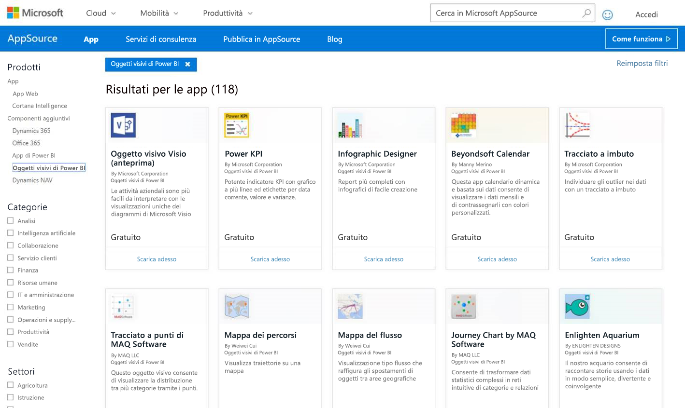
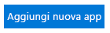
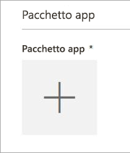
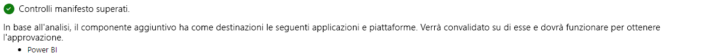
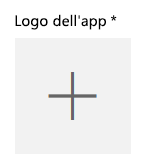
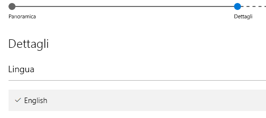

# Pubblicare oggetti visivi personalizzati in AppSource

Informazioni su come pubblicare l'oggetto visivo personalizzato in AppSource in modo che altri utenti possano individuarlo e usarlo.

Dopo aver creato l'oggetto visivo personalizzato può essere utile pubblicarlo in AppSource in modo che altri utenti possano individuarlo e usarlo. A tale scopo, sono necessarie alcune operazioni preliminari. Per altre informazioni su come creare un oggetto visivo personalizzato, vedere [Sviluppo di un oggetto visivo personalizzato di Power BI](custom-visual-develop-tutorial.md).

   

## Informazioni su AppSource

**AppSource** è la posizione in cui è possibile trovare app SaaS e componenti aggiuntivi per i prodotti e i servizi Microsoft. [AppSource](https://appsource.microsoft.com/marketplace/apps?product=power-bi-visuals) connette milioni di utenti di Office 365, Dynamics 365, Cortana Intelligence e altro ancora a soluzioni che li aiutano a lavorare in modo più efficiente, più intelligente o migliore rispetto a prima.

## Preparazione per l'invio dell'oggetto visivo personalizzato

Dopo aver terminato le operazioni di codifica e test dell'oggetto visivo personalizzato e averlo inserito in un pacchetto PBIVIZ, è anche necessario che quanto segue sia pronto per l'invio.

| Item | Obbligatorio | Descrizione |
| --- | --- | --- |
| Pacchetto PBIVIZ contenente tutti i metadati richiesti |Sì |Nome oggetto visivo Nome visualizzato GUID Versione Descrizione Nome e indirizzo di posta elettronica dell'autore |
| File di report PBIX di esempio |Sì |Per presentare l'oggetto visivo, aiutare gli utenti ad acquisire familiarità con lo stesso. Sottolineare il valore che l'oggetto visivo conferisce all'utente e fornire esempi di utilizzo, opzioni di formattazione, ecc. È anche possibile aggiungere una pagina *"suggerimenti"* alla fine con alcuni suggerimenti e trucchi, cose da evitare e simili. Il file di report di esempio con estensione pbix deve funzionare offline, senza alcuna connessione esterna |
| Icona |Sì |È necessario includere il logo dell'oggetto visivo personalizzato che verrà visualizzato nella pagina principale dello store. Il formato può essere PNG, JPG, JPEG o GIF. Deve avere dimensioni pari esattamente a 300 px (larghezza) x 300 px (altezza). **Importante** Leggere attentamente questa [breve guida](https://docs.microsoft.com/office/dev/store/craft-effective-appsource-store-images) prima di inviare l'icona. |
| Schermate |Sì |È necessario fornire almeno una schermata. Il formato può essere PNG, JPG, JPEG o GIF. Deve avere dimensioni pari esattamente a 1366 px (larghezza) x 768 px (altezza). Le dimensioni del file non possono essere maggiori di 1024 KB. *Per un migliore utilizzo, aggiungere fumetti di testo per descrivere la proposta di valore delle caratteristiche basilari in ogni schermata.* |
| Collegamento per il download di supporto |Sì |Fornire l'URL per supportare i clienti che hanno problemi con l'oggetto visivo. Questo collegamento viene immesso come parte della presentazione di SellerDashboard ed è visibile agli utenti quando accedono alla presentazione dell'oggetto visivo in AppSource. Il formato dell'URL deve includere https:// o http://. |
| Collegamento al documento sulla privacy |Sì |Fornire un collegamento all'informativa sulla privacy per i clienti che usano l'oggetto visivo. Questo collegamento viene immesso come parte della presentazione di SellerDashboard ed è visibile agli utenti quando accedono alla presentazione dell'oggetto visivo in AppSource. Il formato del collegamento deve includere https:// o http://. |
| Contratto di licenza con l'utente finale (EULA) |Sì |È necessario caricare un file del contratto di licenza. Può trattarsi del proprio contratto di licenza oppure si può usare il contratto di licenza predefinito in Office Store per oggetti visivi personalizzati di Power BI. Per usare il contratto di licenza predefinito, incollare l'URL seguente nella finestra di dialogo di caricamento del file "Contratto di licenza con l'utente finale" del dashboard del venditore: [https://visuals.azureedge.net/app-store/Power BI - Default Custom Visual EULA.pdf](https://visuals.azureedge.net/app-store/Power%20BI%20-%20Default%20Custom%20Visual%20EULA.pdf). |
| Collegamento video |No |Per aumentare l'interesse degli utenti per l'oggetto visivo personalizzato, è consigliabile fornire un collegamento a un video sull'oggetto visivo. Il formato dell'URL deve includere https:// o http://. |
| Repository GitHub |No |È preferibile avere un collegamento valido e pubblico a un repository [GitHub](https://www.github.com) contenente le origini dell'oggetto visivo e dati di esempio per consentire ad altri sviluppatori di fornire commenti e suggerimenti e proporre miglioramenti al codice. |

## Invio a Power BI

L'invio inizia con l'invio di un messaggio di posta elettronica al team di invio degli oggetti visivi personalizzati di Power BI. È possibile inviare il messaggio a [pbivizsubmit@microsoft.com](mailto:pbivizsubmit@microsoft.com).

> [!IMPORTANT]
> È necessario compilare i campi seguenti nel file pbiviz.json: "description", "supportUrl", "author", "name" ed "email" prima di creare il pacchetto con estensione pbiviz.

Allegare il **file PBIVIZ** e il **file PBIX del report di esempio** al messaggio. Il team di Power BI risponderà con le istruzioni e un file XML del pacchetto dell'app da caricare. Questo pacchetto dell'app XML è necessario per inviare l'oggetto visivo attraverso il centro per sviluppatori Office.

> [!NOTE]
> Per migliorare la qualità e garantire che i report esistenti non subiscano danni, gli aggiornamenti agli oggetti visivi esistenti richiederanno due settimane in più per raggiungere l'ambiente di produzione dopo l'approvazione nello store.

## Invio ad AppSource

Dopo aver ottenuto il file XML del pacchetto dell'app dal team di Power BI, passare al [centro per sviluppatori](https://sellerdashboard.microsoft.com/Application/Summary) per inviare l'oggetto visivo ad AppSource.

> [!NOTE]
> Per accedere al [centro per sviluppatori Office](https://dev.office.com/) occorre avere un account sviluppatore di Office valido, che deve essere un account Microsoft (Live ID, ad esempio hotmail.com o outlook.com).

> [!IMPORTANT]
> È necessario inviare un messaggio di posta elettronica con allegati il file PBIVIZ e il file PBIX al team di Power BI prima dell'invio ad AppSource. Ciò consente al team di Power BI di caricare i file nel server di condivisione pubblico. In caso contrario, lo Store non potrà recuperare i file. È necessario inviare i file con ogni nuovo invio di oggetti visivi, eseguire l'aggiornamento agli oggetti visivi esistenti e correzioni degli invii rifiutati.

### Procedura di invio oggetti visivi

Per completare l'invio, seguire questa procedura.

1. Selezionare **Aggiungi una nuova app**.

    

2. Selezionare **Oggetto visivo personalizzato di Microsoft Power BI** e quindi **Avanti**.

3. Selezionare il segno **+** sotto **Pacchetto dell'app** e selezionare il file XML del pacchetto dell'app ricevuto dal team di Power BI dalla finestra di dialogo Apri file.

    

4. Si dovrebbe ricevere la conferma della validità del pacchetto dell'app di Power BI.

    

5. Compilare i dettagli in **Informazioni generiche**.

   * *Titolo invio:* il modo in cui verrà denominato l'invio nel centro sviluppatori
   * *Versione:* il numero di versione viene compilato automaticamente dal pacchetto dell'app del componente aggiuntivo.
   * *Data di rilascio (UTC):* selezionare una data per il rilascio della versione nello store. Se si sceglie una data futura, l'app non sarà disponibile nello store fino al raggiungimento di tale data.
   * *Categoria:* la prima categoria verrà automaticamente compilata come "Visualizzazione dati + BI". In questo stesso modo verranno contrassegnati tutti gli oggetti visivi personalizzati di Power BI. È possibile fornire fino a due altre categorie, per aiutare gli utenti a cercare facilmente l'oggetto visivo
   * *Note per i test:* facoltativo, se si vogliono fornire istruzioni per i tester di Microsoft
   * *L'app chiama, supporta, contiene o usa la crittografia:* lasciare deselezionato
   * *Rendi disponibile questo componente aggiuntivo nel catalogo dei componenti aggiuntivi per Office per iPad:* lasciare deselezionato
6. Caricare il logo dell'oggetto visivo selezionando il segno **+** sotto **Logo dell'app**. Selezionare quindi il file dell'icona nella finestra di dialogo Apri file. Il file deve essere in formato PNG, JPG, JPEG o GIF. Le dimensioni devono essere esattamente pari a 300 px (larghezza) x 300 px (altezza) e il file deve avere dimensioni massime di 512 KB.

    

7. Compilare i dettagli in **Documenti di supporto**.

   * Collegamento al documento di supporto
   * Collegamento al documento sulla privacy
   * Collegamento video
   * Contratto di licenza con l'utente finale (EULA)

       È necessario caricare un file del contratto di licenza. Può trattarsi del proprio contratto di licenza oppure si può usare il contratto di licenza predefinito in Office Store per oggetti visivi personalizzati di Power BI. Per usare il contratto di licenza predefinito, incollare l'URL seguente nella finestra di dialogo di caricamento del file "Contratto di licenza con l'utente finale" del dashboard del venditore: [https://visuals.azureedge.net/app-store/Power BI - Default Custom Visual EULA.pdf](https://visuals.azureedge.net/app-store/Power%20BI%20-%20Default%20Custom%20Visual%20EULA.pdf).

8. Selezionare **Avanti** e proseguire alla pagina **Dettagli**.

9. Selezionare **Lingua** e scegliere una lingua dall'elenco.

    

10. Immettere le informazioni necessarie in "Descrizione".

    * *Nome app (per questa lingua):* immettere il titolo dell'app così come dovrebbe apparire nella pagina principale dello store.
    * *Descrizione breve:* immettere una breve descrizione dell'app, fino a 100 caratteri, così come dovrebbe apparire nella pagina principale dello store. Questa descrizione verrà visualizzata nelle pagine di livello superiore insieme al logo. È possibile usare la descrizione del pacchetto PBIVIZ.
    * *Descrizione lunga:* fornire una descrizione più dettagliata dell'app che i clienti vedranno nella pagina dei dettagli dell'app. Per chiedere alla community di migliorare il proprio oggetto visivo rendendolo open source, fornire qui il collegamento all'archivio pubblico, ad esempio GitHub.

11. Caricare almeno una schermata. Il formato può essere PNG, JPG, JPEG o GIF. Deve avere dimensioni pari esattamente a 1366 px (larghezza) x 768 px (altezza). Le dimensioni del file non possono essere maggiori di 1024 KB. *Per un migliore utilizzo, aggiungere fumetti di testo per descrivere la proposta di valore delle caratteristiche basilari in ogni schermata.*

12. Per aggiungere altre lingue, selezionare **Aggiungi una lingua** e ripetere i passaggi 10 e 11. L'aggiunta di altre lingue consentirà agli utenti di visualizzare i dettagli dell'oggetto visivo personalizzato nella propria lingua. Per impostazione predefinita, per le lingue non elencate verrà configurata la prima lingua selezionata.

13. Dopo aver aggiunto le lingue, selezionare **Avanti** per proseguire alla pagina **Blocca accesso**.

14. Se si vuole impedire a clienti in paesi specifici di usare o acquistare l'app, selezionare la casella di controllo e selezionare dall'elenco.

15. Selezionare **Avanti** e proseguire alla pagina **Prezzi**.

16. Attualmente, sono supportati solo oggetti visivi *gratuiti* e gli acquisti aggiuntivi all'interno dell'oggetto visivo (acquisto in-app) non sono consentiti. Selezionare **Questa app è gratuita**.

    > [!NOTE]
    > Se si seleziona un'altra opzione diversa da gratuita o se è presente del contenuto acquistato in-app nell'oggetto visivo inviato, l'invio verrà rifiutato.

17. È ora possibile selezionare **Salva come bozza** e inviare in seguito oppure selezionare **Invia per approvazione** per inviare l'oggetto visivo personalizzato a Office Store.

## Rilevamento dello stato e dell'utilizzo dell'invio

È possibile esaminare il [criteri di convalida](https://dev.office.com/officestore/docs/validation-policies#13-power-bi-custom-visuals).

Dopo l'invio, sarà possibile visualizzare lo stato di invio nel [dashboard dell'app](https://sellerdashboard.microsoft.com/Application/Summary/).

## Certificare l'oggetto visivo

Dopo aver creato l'oggetto visivo, è possibile ottenere facoltativamente la certificazione per tale oggetto. Per questo motivo, è possibile eseguirlo all'interno del servizio Power BI e usarlo con altre funzionalità del servizio, quali l'esportazione in PowerPoint. Per altre informazioni, vedere [*Certificare* un oggetto visivo personalizzato](../power-bi-custom-visuals-certified.md).

## Passaggi successivi

[Developing a Power BI custom visual](custom-visual-develop-tutorial.md) (Sviluppo di un oggetto visivo personalizzato di Power BI)  
[Visualizzazioni in Power BI](../visuals/power-bi-report-visualizations.md)  
[Visualizzazioni personalizzate in Power BI](../power-bi-custom-visuals.md)  
[*Certificare* un oggetto visivo personalizzato](../power-bi-custom-visuals-certified.md)

Altre domande? [Provare a rivolgersi alla community di Power BI](http://community.powerbi.com/)
