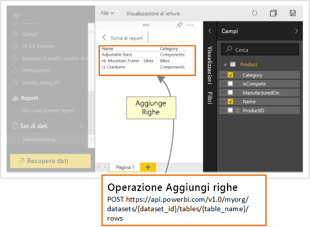

# Quali operazioni possono eseguire gli sviluppatori con l'API Power BI?

L'API REST di Power BI consente di creare app che si integrano con i report, i dashboard e i riquadri di Power BI.

Con l'API REST di Power BI è possibile eseguire attività di gestione su oggetti di Power BI come i report, i set di dati e le aree di lavoro.

Ecco alcune delle operazioni che è possibile eseguire con le API di Power BI.

| **Per altre informazioni** | **Vedere questo argomento** |
|----------------------------------------------------------------------------------|------------------------------------------------------------------------------------|
| Incorporare report, dashboard e riquadri per utenti di Power BI e utenti esterni a Power BI. | [Come incorporare i dashboard, i report e i riquadri di Power BI](embedding-content.md) |
| Eseguire attività di gestione per oggetti di Power BI. | [Riferimento all'API REST di Power BI](https://docs.microsoft.com/rest/api/power-bi/) |
| Estendere un flusso di lavoro aziendale esistente per eseguire il push dei dati in un dashboard di Power BI. | [Eseguire il push dei dati in un dashboard](walkthrough-push-data.md) |
| Eseguire l'autenticazione a Power BI. | [Eseguire l'autenticazione in Power BI](get-azuread-access-token.md) |

> [!NOTE]
> Le API Power BI fanno ancora riferimento alle aree di lavoro come gruppi. I riferimenti ai gruppi indicano che si stanno usando le aree di lavoro.

## Strumenti per sviluppatori di API

| Strumento/i | Descrizione |  |  |
|-------------------------|---------------------------------------------------------------------------------------------------------------------------------------------------|---|---|
| [Strumento playground](https://microsoft.github.io/PowerBI-JavaScript/demo) | Un esempio d'uso completo delle API JavaScript di Power BI. Questo strumento consente di riprodurre in modo rapido vari tipi di esempi di Power BI Embedded. |  |  |
| [Wiki JavaScript di Power BI](https://github.com/Microsoft/powerbi-javascript/wiki) | Offre informazioni aggiuntive sulle API JavaScript di Power BI. |  |  |
| [Postman](https://www.getpostman.com/) | Consente di eseguire richieste, test, operazioni di debug, monitoraggio, test automatici e altro ancora. |

## Push dei dati in Power BI

È possibile usare l'API Power BI per [eseguire il push dei dati in un set di dati](walkthrough-push-data.md). Questa funzionalità consente di aggiungere una riga a una tabella all'interno di un set di dati. I nuovi dati vengono quindi riportati nei riquadri di un dashboard e negli oggetti visivi inclusi in un report.

## Repository GitHub

* [Esempi di Power BI Developer](https://github.com/Microsoft/PowerBI-Developer-Samples)
* [.NET SDK](https://github.com/Microsoft/PowerBI-CSharp)
* [API JavaScript](https://github.com/Microsoft/PowerBI-JavaScript)

## Passaggi successivi

* [Eseguire il push dei dati in un set di dati](walkthrough-push-data.md)
* [Developing a Power BI custom visual](visuals/custom-visual-develop-tutorial.md) (Sviluppo di un oggetto visivo personalizzato di Power BI)
* [Riferimento all'API REST di Power BI](rest-api-reference.md)
* [API REST di Power BI](https://docs.microsoft.com/rest/api/power-bi/)

Altre domande? [Provare a rivolgersi alla community di Power BI](https://community.powerbi.com/)
