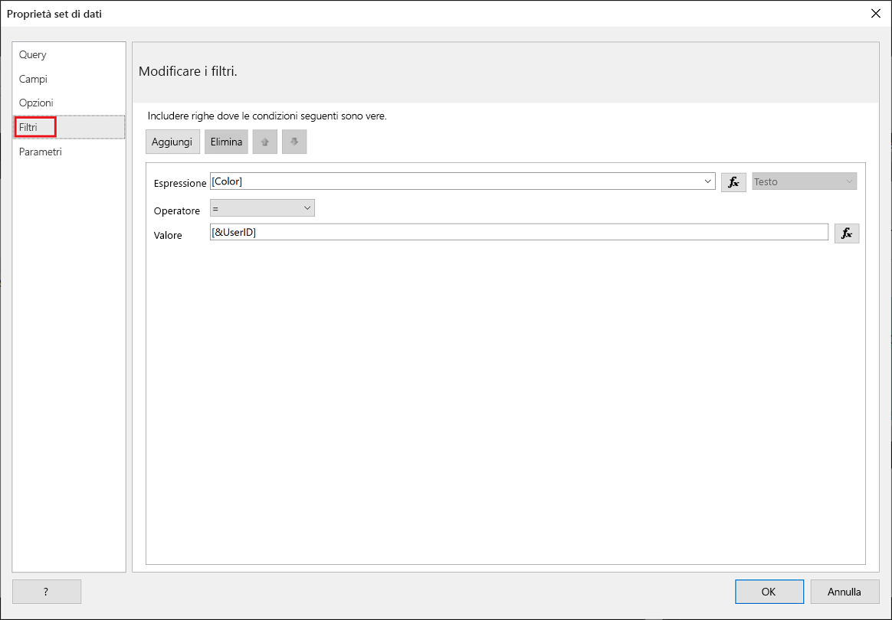
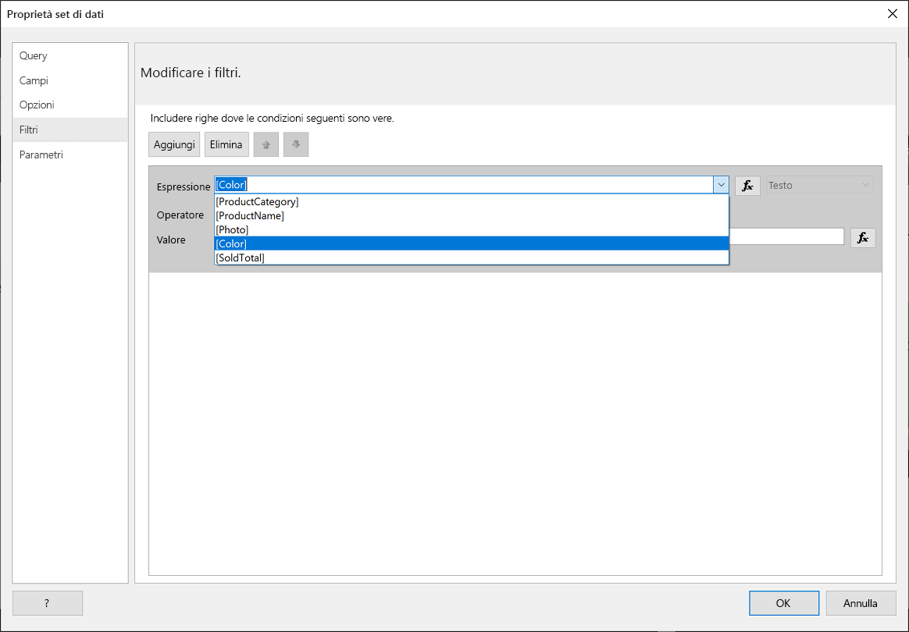
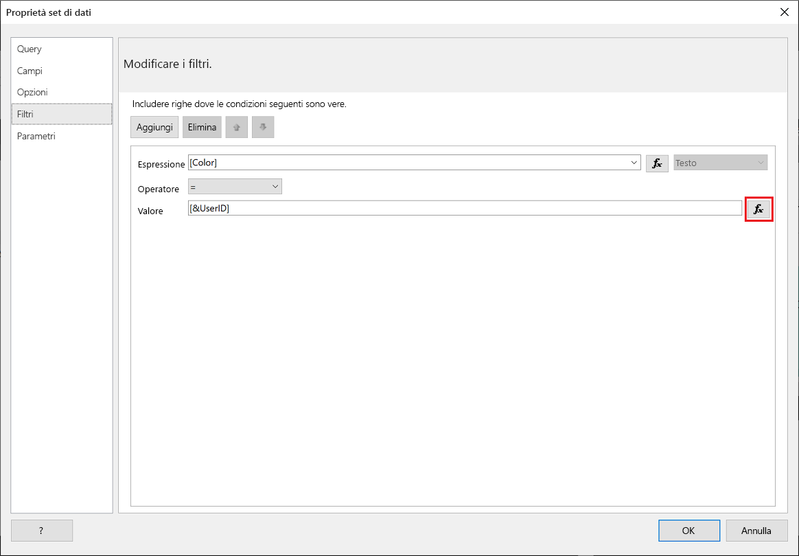
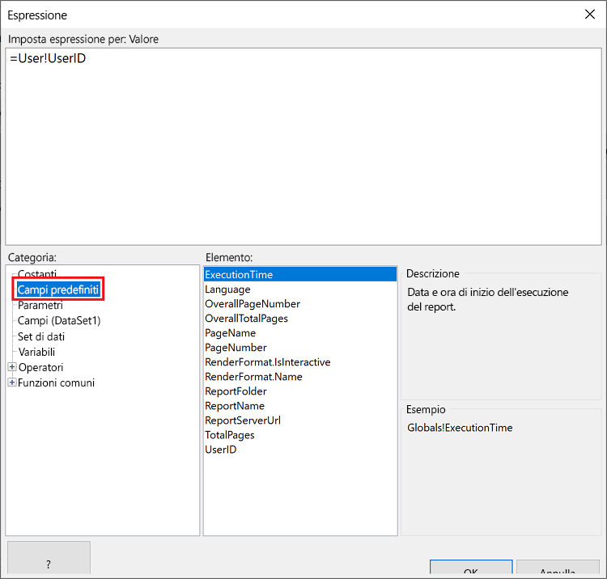
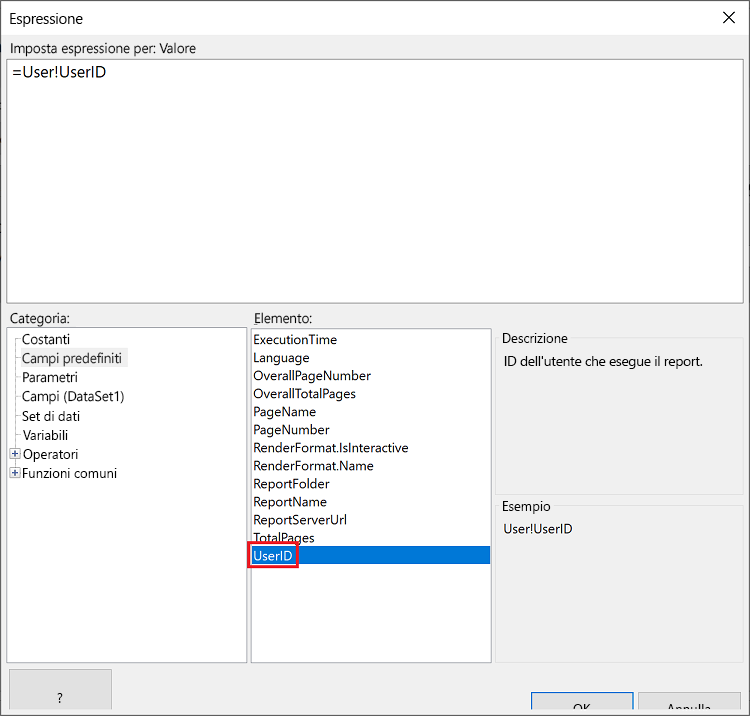
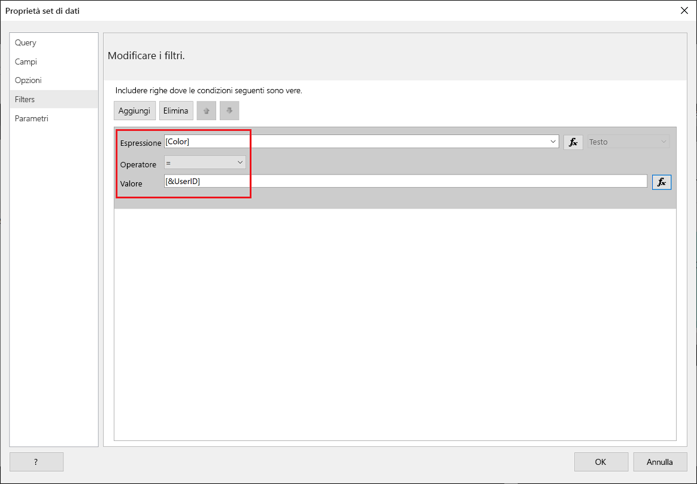
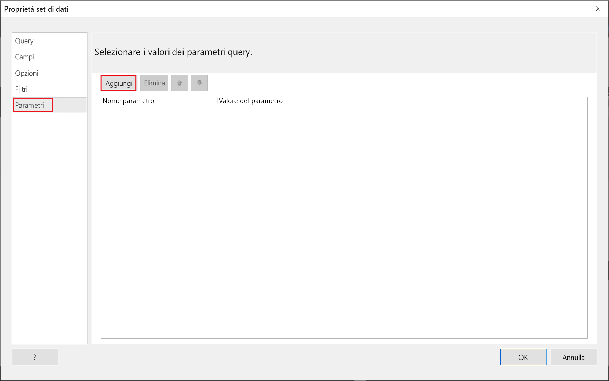
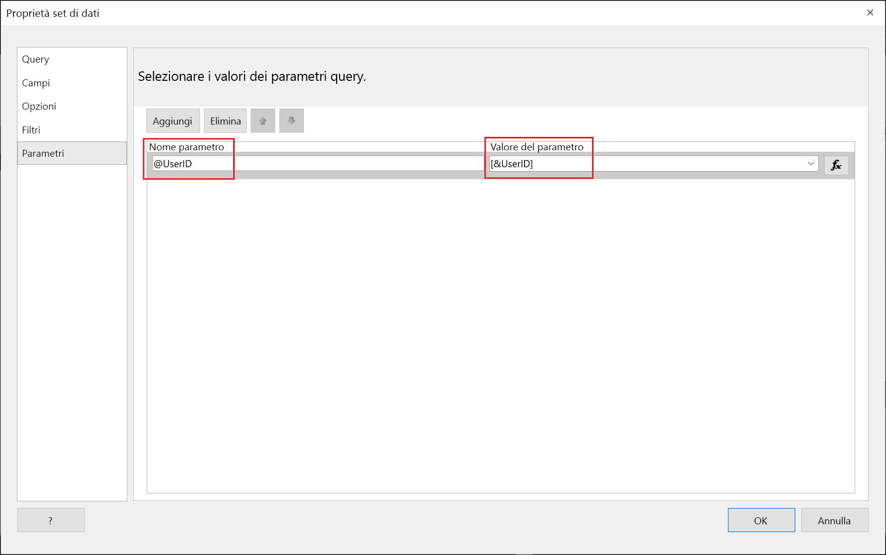
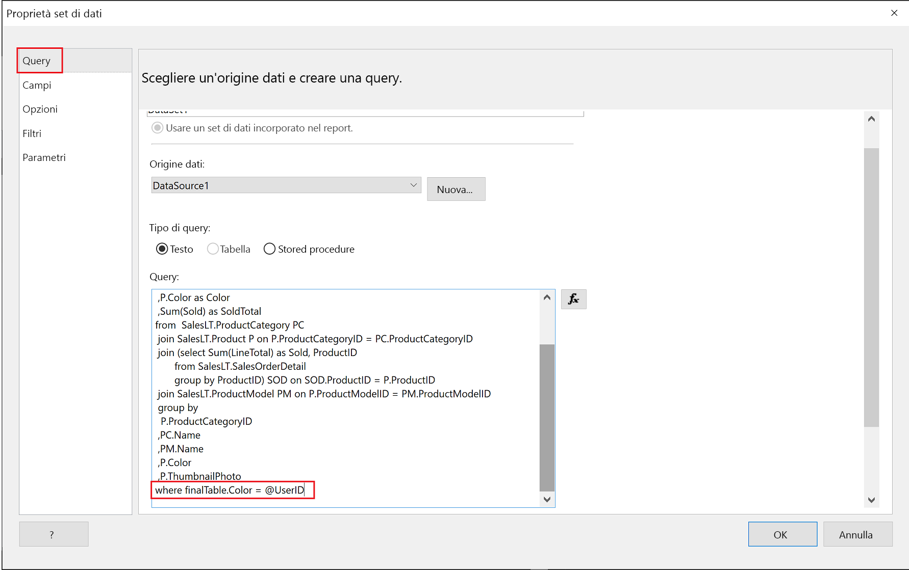

# <a name="implementing-row-level-security-in-embedded-paginated-reports-preview"></a>Implementazione della sicurezza a livello di riga nei report impaginati incorporati (anteprima)

Quando si incorpora un report impaginato, è possibile controllare quali dati vengono visualizzati. In questo modo è possibile personalizzare le informazioni visualizzate in base all'utente. Se, ad esempio, si dispone di un report impaginato di Power BI che include i risultati delle vendite a livello globale, è possibile incorporarlo in modo che visualizzi solo i risultati delle vendite di un'area geografica specifica.

Questa funzionalità offre un modo sicuro per visualizzare un subset dei dati, senza compromettere i dati rimanenti. È simile alla funzionalità [Sicurezza a livello di riga](embedded-row-level-security.md), che offre un modo sicuro per visualizzare i dati in report (non impaginati), dashboard, riquadri e set di dati di Power BI.  

> [!Note]
> Questa funzionalità funziona con l'incorporamento di report impaginati per i clienti.

## <a name="configuring-a-parameter-to-filter-the-dataset"></a>Configurazione di un parametro per filtrare il set di dati

Quando si applica la sicurezza a livello di riga a un report impaginato di Power BI, è necessario assegnare un [parametro](../report-builder-parameters.md) all'attributo **UserID**. Questo parametro consente di limitare i dati estratti dal set di dati, prima che il report venga incorporato.

Dopo aver assegnato il parametro a **UserID**, usare l'API [Reports GenerateTokenForCreateInGroup](https://docs.microsoft.com/rest/api/power-bi/embedtoken/reports_generatetokenforcreateingroup) per ottenere il token di incorporamento.

## <a name="use-uderid-as-a-filter-at-report-or-query-level"></a>Usare UserID come filtro a livello di report o di query

È possibile usare **UserId** come *filtro* o in una *query* sull'origine dati nel [Generatore report impaginati di Power BI](../report-builder-power-bi.md).

### <a name="using-the-filter"></a>Uso del filtro

1. Nella finestra **Proprietà set di dati** selezionare **Filtro** nel riquadro sinistro.

    

2. Nel menu a discesa **Espressione** selezionare il parametro che si vuole usare per filtrare i dati.

     

3. Fare clic sul pulsante di funzione **Valore**. 

    

4. Nella finestra **Espressione** selezionare **Campi predefiniti** nell'elenco **Categoria**.

    

5. Nell'elenco **Elemento** selezionare **UserID** e fare clic su **OK**.

    

6. Nella finestra **Proprietà set di dati** verificare che l'espressione sia *parametro selezionato = UserID* e fare clic su **OK**.

    

### <a name="using-a-query"></a>Uso di una query

1. Nella finestra **Proprietà set di dati** selezionare **Parametri** nel riquadro sinistro e fare clic su **Aggiungi**.

    

2. In **Nome parametro** immettere **@UserID** e in **Valore parametro** aggiungere **[&UserID]** .

     

3. Nel riquadro sinistro selezionare **Query**, nella query aggiungere il parametro **UserID** come parte della query e fare clic su **OK**.
    > [!NOTE]
    > Nello screenshot seguente viene usato come esempio il parametro Color (whereFinalTable. Color = @UserID). Se necessario, è possibile creare una query più complessa.

    

## <a name="passing-the-configured-parameter-using-the-embed-token"></a>Passaggio del parametro configurato tramite il token di incorporamento

Quando si incorpora un report impaginato per i clienti, si usa l'API [Reports GenerateTokenForCreateInGroup](https://docs.microsoft.com/rest/api/power-bi/embedtoken/reports_generatetokenforcreateingroup) per ottenere il token di incorporamento. Questo token può essere usato anche per filtrare alcuni dati estratti dal report impaginato.

Per esporre solo alcuni dati, assegnare al campo `username` le informazioni che dovranno essere visualizzate. Ad esempio, in un report impaginato con un parametro color, se si immette *verde* nel campo `username`, il token di incorporamento limiterà i dati incorporati in modo da visualizzare solo i dati che hanno il valore *verde* nella colonna del colore.

```JSON
{
    "accessLevel": "View",
    "reportId": "cfafbeb1-8037-4d0c-896e-a46fb27ff229",
    "identities": [
            {
                    // Replace the 'username' with a paginated report parameter
                    "username":     "...",
                    "reports: [
                        "cfafbeb1-8037-4d0c-896e-a46fb27ff229"
                    ]
            }
    ]
}
```
