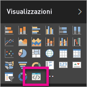

# Risoluzione dei problemi relativi agli oggetti visivi di Power BI

## Debug

**Comando Pbiviz non trovato (o errori simili)**

Se si esegue `pbiviz` nella riga di comando del terminal, verrà visualizzata la schermata della Guida in linea. In caso contrario, l'installazione non è stata eseguita correttamente. Assicurarsi di avere almeno la versione 4.0 di NodeJS installata.

**Non è possibile trovare l'oggetto visivo di debug nella scheda Visualizzazioni**

L'oggetto visivo di debug all'interno della scheda **Visualizzazioni** ha l'aspetto di un'icona di prompt dei comandi.

Se non è visualizzata, verificare che sia stata abilitata nelle impostazioni di Power BI.

> [!NOTE]
> L'oggetto visivo di debug è attualmente disponibile solo nel servizio Power BI e non in Power BI Desktop o nell'app per dispositivi mobili. L'oggetto visivo in pacchetto continuerà a funzionare ovunque.

**Non è possibile contattare il server dell'oggetto visivo**

Eseguire il server dell'oggetto visivo con il comando `pbiviz start` nella riga di comando del terminal dalla radice del progetto di oggetto visivo. Se il server non è in esecuzione, è probabile che i certificati SSL non siano stati installati correttamente.

È possibile contattare il team di supporto per gli oggetti visivi di Power BI: *pbicvsupport@microsoft.com*  per eventuali domande, commenti o problemi.

## Passaggi successivi

Per altre informazioni, vedere le [Domande frequenti sugli oggetti visivi di Power BI](power-bi-custom-visuals-faq.md#organizational-visuals).