# Oggetti visivi in Power BI

Quando si crea o si modifica un report di Power BI, è possibile usare vari tipi di oggetti visivi. Le icone di questi oggetti visivi vengono visualizzate nel riquadro **Visualizzazioni**. Quando si scarica [Power BI Desktop](https://powerbi.microsoft.com/desktop/) o si apre il [servizio Power BI](https://app.powerbi.com), questi oggetti visivi sono inclusi nel pacchetto per impostazione predefinita.

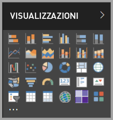

Tuttavia, l'offerta non si limita a questo set di oggetti visivi. Se si seleziona **Altre opzioni** (...) nella parte inferiore, diventano disponibili oggetti visivi per i report di un'altra origine: gli *oggetti visivi di Power BI*.

Gli sviluppatori creano oggetti visivi di Power BI con Power BI Visuals SDK. Questi oggetti visivi consentono agli utenti aziendali di visualizzare i dati nel modo che meglio si adatta alle loro attività. Gli autori dei report possono quindi importare i file degli oggetti visivi personalizzati nei report e usarli come qualsiasi altro oggetto visivo di Power BI. Gli oggetti visivi di Power BI sono elementi di primaria importanza in Power BI e possono essere filtrati, evidenziati, modificati, condivisi e così via.

Gli oggetti visivi di Power BI vengono distribuiti in tre modi:

* File di oggetti visivi personalizzati
* Oggetti visivi organizzazione
* Oggetti visivi del Marketplace

## File di oggetti visivi personalizzati

Gli oggetti visivi di Power BI sono pacchetti che includono il codice per il rendering dei dati a loro passati. Chiunque può creare un oggetto visivo personalizzato e assemblarlo in un pacchetto come singolo file con estensione `.pbiviz`, che può essere poi importato in un report di Power BI.

> [!WARNING]
> Un oggetto visivo personalizzato può contenere codice che comporta rischi per la sicurezza o per la privacy. Prima di importarlo nel report, assicurarsi che l'autore e l'origine dell'oggetto visivo possano essere considerati affidabili.

## Oggetti visivi organizzazione

Gli amministratori di Power BI approvano e distribuiscono gli oggetti visivi di Power BI nell'organizzazione e da quel momento gli autori di report possono facilmente individuarli, aggiornarli e usarli. La gestione di questi oggetti visivi, ad esempio l'aggiornamento della versione o l'abilitazione/disabilitazione, è molto semplice per gli amministratori.

 [Altre informazioni sugli oggetti visivi aziendali](power-bi-custom-visuals-organization.md).

## Oggetti visivi del Marketplace

I membri della community, insieme con Microsoft, hanno offerto il loro contributo pubblicando oggetti visivi di Power BI nel Marketplace [AppSource](https://appsource.microsoft.com/marketplace/apps?product=power-bi-visuals), a beneficio di tutti. È possibile scaricare questi oggetti visivi e aggiungerli ai report di Power BI. Sono stati testati e approvati da Microsoft per funzionalità e qualità.

Informazioni su [AppSource](office-store.md) È il posto in cui è possibile trovare app, componenti aggiuntivi ed estensioni per il software Microsoft. AppSource connette milioni di utenti di prodotti come Office 365, Azure, Dynamics 365, Cortana e Power BI a soluzioni che li aiutano a lavorare in modo più efficiente, più intelligente e migliore rispetto a prima.

### Oggetti visivi certificati

Gli oggetti visivi certificati di Power BI sono oggetti visivi del Marketplace che hanno superato test di qualità rigorosi e sono supportati anche in altri scenari, quali [sottoscrizioni di messaggi di posta elettronica](../service-report-subscribe.md) ed [esportazione in PowerPoint](../consumer/end-user-powerpoint.md).
Per visualizzare l'elenco di oggetti visivi di Power BI certificati o per inviare il proprio, vedere [Oggetti visivi di Power BI certificati](power-bi-custom-visuals-certified.md).

Gli sviluppatori Web interessati a creare visualizzazioni personalizzate e ad aggiungerle in AppSource, possono Vedere [Developing a Power BI custom visual](visuals/custom-visual-develop-tutorial.md) (Sviluppo di un oggetto visivo personalizzato di Power BI) e le informazioni su come [Pubblicare oggetti visivi personalizzati in AppSource](office-store.md).

### Importare un oggetto visivo personalizzato da un file

1. Nel riquadro **Visualizzazioni** selezionare i puntini di sospensione.

    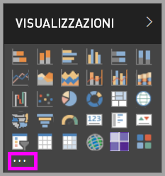

2. Nell'elenco a discesa selezionare **Importa da file**.

    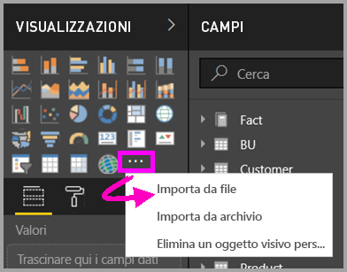

3. Nel menu **Apri** selezionare il file con estensione `.pbiviz` che si vuole importare e quindi selezionare **Apri**. L'icona dell'oggetto visivo personalizzato viene aggiunta nella parte inferiore del riquadro **Visualizzazioni** e può essere usata nei report.

    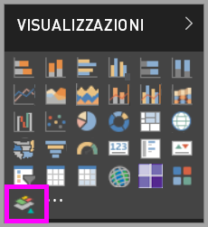

### Importare oggetti visivi dell'organizzazione

1. Nel riquadro **Visualizzazioni** selezionare i puntini di sospensione.

    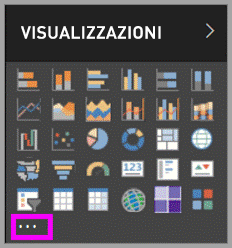

2. Nell'elenco a discesa selezionare **Importa dal Marketplace**.

    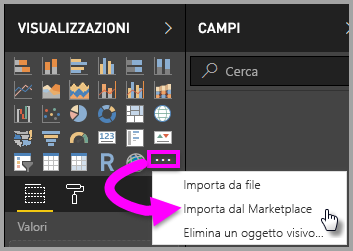

3. Selezionare **ORGANIZZAZIONE PERSONALE** dal menu della scheda superiore.

    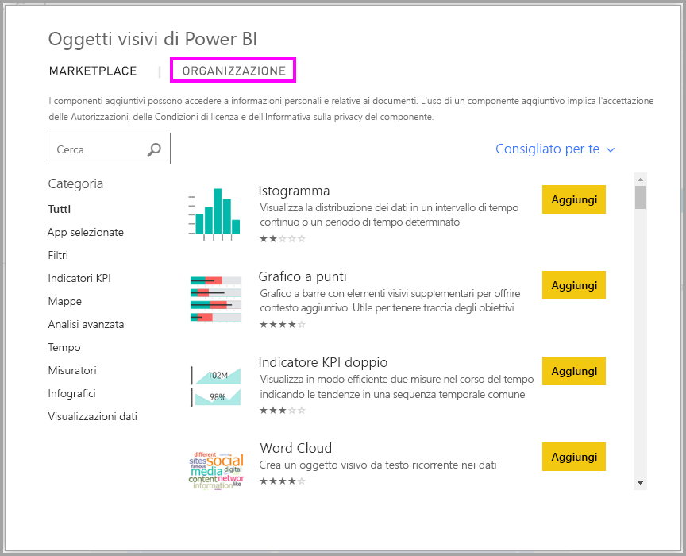

4. Scorrere l'elenco per trovare l'oggetto visivo da importare.

    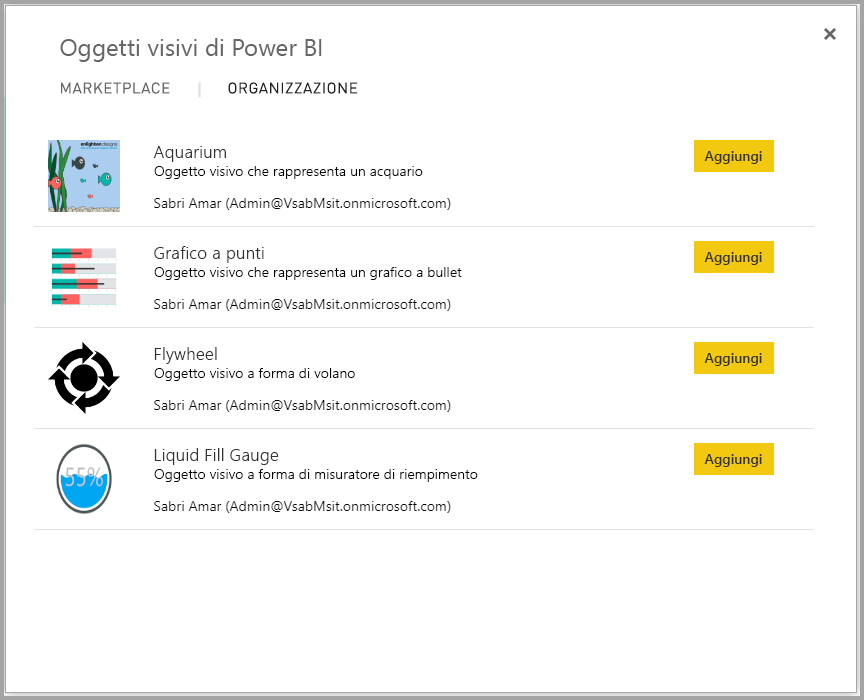

5. Selezionare **Aggiungi** per importare l'oggetto visivo personalizzato. La relativa icona viene aggiunta nella parte inferiore del riquadro **Visualizzazioni** e può essere usata nei report.

    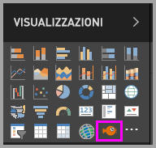

## Scaricare o importare oggetti visivi di Power BI da Microsoft AppSource

Sono disponibili due opzioni per scaricare e importare gli oggetti visivi di Power BI: da Power BI e dal [sito Web AppSource](https://appsource.microsoft.com/).

### Importare oggetti visivi di Power BI da Power BI

1. Nel riquadro **Visualizzazioni** selezionare i puntini di sospensione.

    

2. Nell'elenco a discesa selezionare **Importa dal Marketplace**.

    

3. Scorrere l'elenco per trovare l'oggetto visivo da importare.

    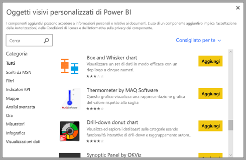

4. Per altre informazioni su uno degli oggetti visivi, evidenziarlo e selezionarlo.

    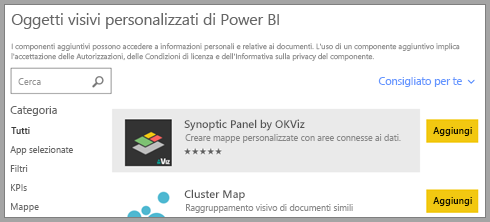

5. Nella pagina dei dettagli è possibile visualizzare schermate, video, una descrizione dettagliata e altro ancora.

    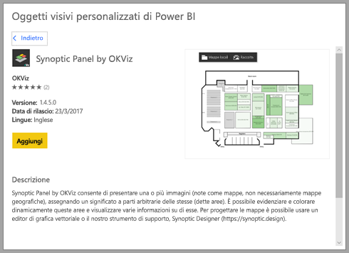

6. Scorrere verso il basso per visualizzare i commenti.

    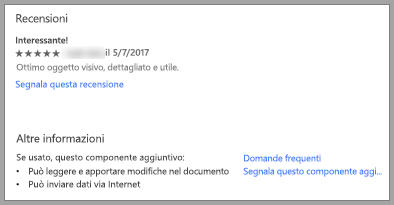

7. Selezionare **Aggiungi** per importare l'oggetto visivo personalizzato. La relativa icona viene aggiunta nella parte inferiore del riquadro **Visualizzazioni** e può essere usata nei report.

    

### Scaricare e importare oggetti visivi di Power BI da Microsoft AppSource

1. Accedere a [Microsoft AppSource](https://appsource.microsoft.com) e selezionare la scheda **App**.

    

2. Andare alla [pagina dei risultati per le app](https://appsource.microsoft.com/marketplace/apps) in cui sono mostrate le app più popolari per ogni categoria, incluse le *app di Power BI*. Per visualizzare gli oggetti visivi di Power BI selezionare **Oggetti visivi di Power BI** nel riquadro di spostamento, per limitare i risultati.

    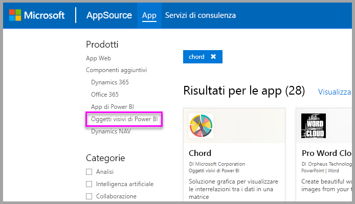

3. AppSource mostra un riquadro per ogni oggetto visivo personalizzato.  Ogni riquadro presenta uno snapshot dell'oggetto visivo personalizzato con una breve descrizione e un collegamento per il download. Per visualizzare altri dettagli, selezionare il riquadro.

    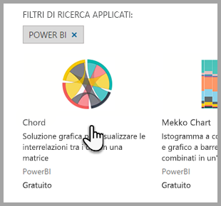

4. Nella pagina dei dettagli è possibile visualizzare schermate, video, una descrizione dettagliata e altro ancora. Per scaricare l'oggetto visivo personalizzato e accettare le Condizioni per l'utilizzo, selezionare **Scarica adesso**.

    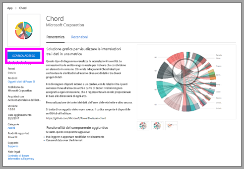

5. Selezionare il collegamento per scaricare l'oggetto visivo personalizzato.

    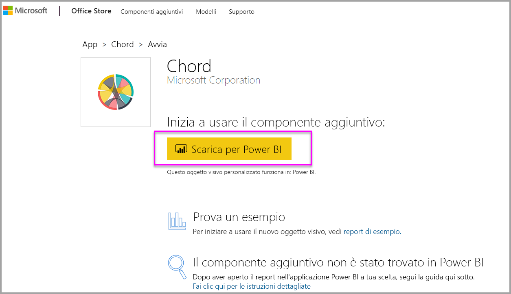

    La pagina di download include anche le istruzioni su come importare l'oggetto visivo personalizzato in Power BI Desktop e nel servizio Power BI.

    È possibile scaricare anche un report di esempio che include l'oggetto visivo personalizzato e ne illustra le funzionalità.

    

6. Salvare il file con estensione `.pbiviz` e quindi aprire Power BI.

7. Importare il file con estensione `.pbiviz` nel report. Vedere la sezione [Importare un oggetto visivo personalizzato da un file](#import-a-custom-visual-from-a-file) più indietro.

## Considerazioni e limitazioni

* Un oggetto visivo personalizzato viene aggiunto a un determinato report durante l'importazione. Se si vuole usare l'oggetto visivo in un altro report, è necessario importarlo anche in tale report. Quando un report con un oggetto visivo personalizzato viene salvato usando l'opzione **Salva con nome** , una copia dell'oggetto visivo personalizzato viene salvata con il nuovo report.

* Se il riquadro **Visualizzazioni** non è visualizzato, significa che l'utente non dispone delle autorizzazioni di modifica per il report.  È possibile aggiungere oggetti visivi di Power BI solo ai report che si è autorizzati a modificare e non ai report che sono stati semplicemente condivisi.

## Risoluzione dei problemi

Per risolvere i problemi, vedere [Risoluzione dei problemi relativi agli oggetti visivi di Power BI](power-bi-custom-visuals-troubleshoot.md).

## DOMANDE FREQUENTI

Per altre informazioni e risposte, vedere [Domande frequenti sugli oggetti visivi di Power BI](power-bi-custom-visuals-faq.md#organizational-visuals).

## Passaggi successivi

* [Visualizzazioni nei report di Power BI](../visuals/power-bi-report-visualizations.md)

Altre domande? [Provare la community di Power BI](https://community.powerbi.com/).
