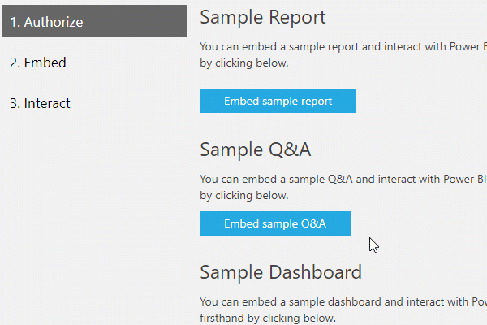

# <a name="qa-in-power-bi-embedded"></a>Domande e risposte in Power BI Embedded

Power BI Embedded offre un modo per incorporare Domande e risposte in un'applicazione e per consentire agli utenti di porre domande usando il linguaggio naturale e ricevere risposte immediate sotto forma di oggetti visivi quali grafici o grafi.



Sono disponibili due modalità per incorporare Domande e risposte nell'applicazione, ovvero **interattiva** e **solo risultato**. La modalità **interattiva** consente di digitare domande e visualizzarle nell'oggetto visivo. Se è stata salvata una domanda o una domanda configurata da visualizzare, è possibile usare la modalità **solo risultato** popolando la domanda nella configurazione di incorporamento.

Il codice JavaScript avrà un aspetto simile al seguente.

```javascript
// Embed configuration used to describe the what and how to embed.
// This object is used when calling powerbi.embed within the JavaScript API.
// You can find more information at https://github.com/Microsoft/PowerBI-JavaScript/wiki/Embed-Configuration-Details.
var config= {
    type: 'qna',
    tokenType:   models.TokenType.Embed | models.TokenType.Aad,
    accessToken: access token value,
    embedUrl:    https://app.powerbi.com/qnaEmbed (groupId to be appended as query parameter if required),
    datasetIds:  array of requested data set ids (at the moment we support only one dataset),
    viewMode:    models.QnAMode.Interactive | models.QnAMode.ResultOnly,
    question:    optional parameter for Explore mode (QnAMode.Interactive) and mandatory for Render Result mode (QnAMode.ResultOnly)
};

// Get a reference to the embedded QNA HTML element
var qnaContainer = $('#qnaContainer')[0];

// Embed the QNA and display it within the div container.
var qna = powerbi.embed(qnaContainer, config);
```

## <a name="set-question"></a>Domanda configurata

Se è stata usata la **modalità solo risultato** con una domanda configurata, è possibile inserire domande aggiuntive nel frame e ottenere immediatamente risposta sostituendo il risultato precedente. Viene eseguito il rendering di un nuovo oggetto visivo corrispondente alla nuova domanda.

Un esempio di questo utilizzo è costituito da un elenco di domande frequenti. L'utente può esaminare le domande e ottenere risposte nella stessa parte incorporata.

**Frammento di codice per l'utilizzo di JS SDK:**  

```javascript
// Get a reference to the embedded Q&A HTML element
var qnaContainer = $('#qnaContainer')[0];

// Get a reference to the embedded Q&A.
qna = powerbi.get(qnaContainer);

qna.setQuestion("This year sales")
    .then(function (result) {
        …….
    })
    .catch(function (errors) {
        …….
    });
```

## <a name="visual-rendered-event"></a>Evento con rendering in oggetto visivo

Per la modalità **interattiva** l'applicazione può ricevere notifiche con un evento di modifica di dati ogni volta che l'oggetto visivo con rendering viene modificato per adeguarsi alla query di input aggiornata durante la digitazione.

Rimanere in attesa dell'evento *visualRendered* consente di salvare le domande per un uso futuro. 

**Frammento di codice per l'utilizzo di JS SDK:**  

```javascript
// Get a reference to the embedded Q&A HTML element
var qnaContainer = $('#qnaContainer')[0];

// Get a reference to the embedded Q&A.
qna = powerbi.get(qnaContainer);

// qna.off removes a given event listener if it exists.
qna.off("visualRendered");

// qna.on will add an event listener.
qna.on("visualRendered", function(event) {
     …….
});
```

## <a name="embed-token"></a>Token di incorporamento

Creare un token di incorporamento da un set di dati per iniziare a creare una parte Domande e risposte. Per altre informazioni, vedere [Generate token](https://docs.microsoft.com/rest/api/power-bi/embedtoken) (Generare token).

## <a name="next-steps"></a>Passaggi successivi

Per provare a usare l'incorporamento di Domande e risposte, vedere l'[esempio di incorporamento di JavaScript](https://microsoft.github.io/PowerBI-JavaScript/demo/).

Altre domande? [Provare a rivolgersi alla community di Power BI](http://community.powerbi.com/)