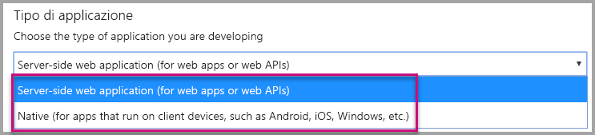
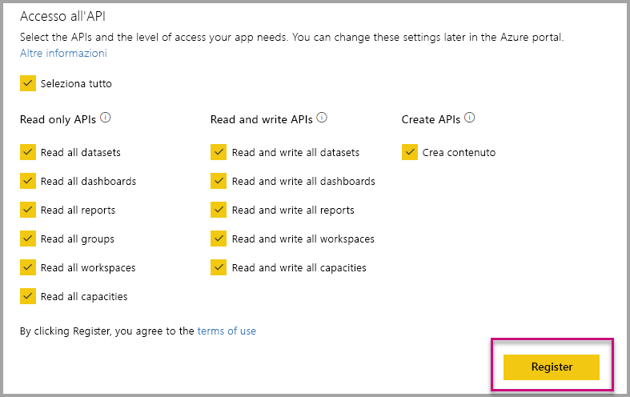
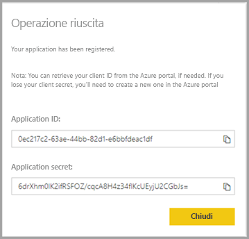
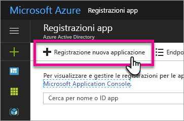
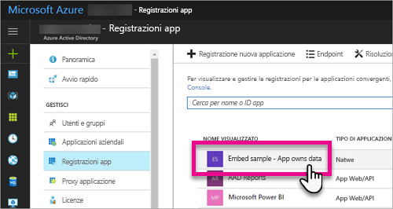
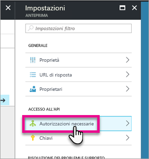
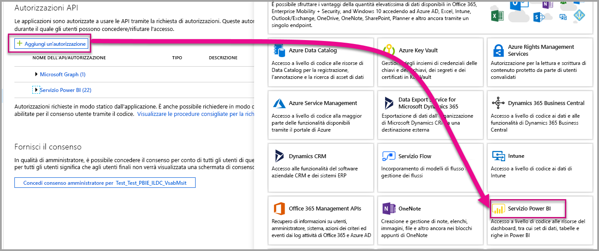
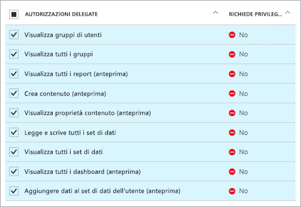
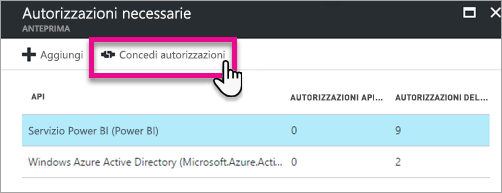

# <a name="register-an-azure-ad-application-to-use-with-power-bi"></a>Registrare un'applicazione di Azure AD da usare con Power BI

Informazioni su come registrare un'applicazione in Azure Active Directory (Azure AD) per incorporare il contenuto di Power BI.

Registrare l'applicazione con Azure AD per consentire l'accesso dell'applicazione alle [API REST di Power BI](https://docs.microsoft.com/rest/api/power-bi/). Dopo aver registrato l'applicazione, è possibile definire un'identità per l'applicazione e specificare le autorizzazioni per le risorse REST di Power BI.

> [!IMPORTANT]
> Prima di registrare un'app Power BI è necessario un [tenant di Azure Active Directory e un utente aziendale](create-an-azure-active-directory-tenant.md). Se non è stata effettuata l'iscrizione a Power BI tramite un utente nel tenant, la registrazione dell'app non viene completata correttamente.

Esistono due modi per registrare l'applicazione. Il primo consiste nell'uso dello [strumento di registrazione app di Power BI](https://dev.powerbi.com/apps/), il secondo è la registrazione diretta nel portale di Azure. Lo strumento di registrazione delle app di Power BI è più comodo da usare perché richiede di compilare solo pochi campi. Usare il portale di Azure se si vuole apportare modifiche all'app.

## <a name="register-with-the-power-bi-application-registration-tool"></a>Eseguire la registrazione con lo strumento di registrazione app di Power BI

Registrare l'applicazione in **Azure Active Directory** per stabilire un'identità per l'applicazione e specificare le autorizzazioni per le risorse REST di Power BI. Quando si registra un'applicazione, ad esempio un'app console o un sito Web, si riceve un identificatore che l'applicazione usa per la propria identificazione presso gli utenti a cui richiede le autorizzazioni.

Di seguito è illustrato come registrare un'applicazione con lo strumento di registrazione app di Power BI:

1. Passare a [dev.powerbi.com/apps](https://dev.powerbi.com/apps).

2. Selezionare **Accedi** per accedere con l'account esistente, quindi **Avanti**.

3. Specificare un **nome di applicazione**.

4. Specificare un **tipo di applicazione**.

    Di seguito sono riportate le differenze da tenere presenti quando si sceglie un'**applicazione nativa** piuttosto che un'**applicazione Web lato server** come tipo di applicazione.

    Applicazione nativa:
    * Si prevede di creare un'applicazione [progettata per i clienti](embed-sample-for-customers.md) usando un account utente master, ovvero una licenza Power BI Pro usata per l'accesso a Power BI, per l'autenticazione.

    Applicazione Web lato server:
    * Si prevede di creare un'applicazione [progettata per l'organizzazione](embed-sample-for-your-organization.md).
    * Si prevede di creare un'applicazione [progettata per i clienti](embed-sample-for-customers.md) usando l'entità servizio per l'autenticazione.
    * Si prevede di creare app Web o API Web.

    

5. Se come tipo di applicazione è stata selezionata l'**applicazione Web lato server**, continuare con l'immissione di un valore per l'**URL della pagina iniziale** e l'**URL di reindirizzamento**. L'**URL di reindirizzamento** funziona con qualsiasi URL valido e deve corrispondere all'applicazione creata. Se è stato selezionato il tipo **nativo**, procedere al passaggio 6.

6. Scegliere le API di Power BI necessarie per l'applicazione. Per altre informazioni sulle autorizzazioni di accesso di Power BI, vedere [Autorizzazioni di Power BI](power-bi-permissions.md). Selezionare **Registra**.

    

    > [!Important]
    > Se si abilitano le entità servizio da usare con Power BI, le autorizzazioni di Azure Active Directory non hanno più effetto. Le autorizzazioni vengono gestite dal portale di amministrazione di Power BI.

7. Se si sceglie l'applicazione **nativa**, si riceve un **ID applicazione**. Se si sceglie l'**applicazione Web lato server** come tipo di applicazione, si riceve un **ID applicazione** e un **segreto dell'applicazione**.

    > [!Note]
    > Se necessario, è possibile recuperare l'**ID applicazione** dal portale di Azure in un secondo momento. Se si perde il **segreto dell'applicazione**, sarà necessario crearne uno nuovo nel portale di Azure.

| Nativo | Applicazione Web lato server |
|--------|-----------------------------|
|  |  |

È ora possibile usare l'applicazione registrata come parte dell'applicazione personalizzata per interagire con il servizio Power BI e l'applicazione Power BI Embedded.

## <a name="register-with-the-azure-portal"></a>Eseguire la registrazione con il portale di Azure

L'altra opzione per la registrazione dell'applicazione consiste nell'eseguire l'operazione direttamente nel portale di Azure. Per registrare l'applicazione, seguire questa procedura.

1. Accettare le [condizioni relative all'API di Microsoft Power BI](https://powerbi.microsoft.com/api-terms).

2. Accedere al [portale di Azure](https://portal.azure.com).

3. Scegliere il tenant di Azure AD selezionando l'account nell'angolo in alto a destra della pagina.

4. Nel riquadro di spostamento a sinistra in **Tutti i servizi**, **Azure Active Directory** selezionare **Registrazioni per l'app** e quindi **Registrazione nuova applicazione**.

    

5. Seguire le istruzioni e creare una nuova applicazione.

   * Per le applicazioni Web specificare l'URL di accesso per gli utenti, ovvero l'URL di base dell'app, ad esempio `http://localhost:13526`.
   * Per le applicazioni native, specificare un **URI di reindirizzamento**, che verrà usato da Azure AD per restituire le risposte del token. Verificare di immettere un valore specifico per l'applicazione, ad esempio `http://myapplication/Redirect`.

Per altre informazioni su come registrare le applicazioni in Azure Active Directory, vedere [Integrazione di applicazioni con Azure Active Directory](https://docs.microsoft.com/azure/active-directory/develop/active-directory-integrating-applications)

## <a name="how-to-get-the-application-id"></a>Come ottenere l'ID applicazione

Quando si registra un'applicazione, si riceve un [ID applicazione](embed-sample-for-customers.md#application-id).  L'applicazione usa l'**ID applicazione** per la propria identificazione quando richiede le autorizzazioni agli utenti.

## <a name="how-to-get-the-service-principal-object-id"></a>Come ottenere l'ID oggetto entità servizio

Quando si usano le [API di Power BI](https://docs.microsoft.com/rest/api/power-bi/), assicurarsi di definire le operazioni usando l'[ID oggetto entità servizio](embed-service-principal.md#how-to-get-the-service-principal-object-id) per fare riferimento all'entità servizio, ad esempio applicando un'entità servizio come amministratore a un'area di lavoro.

## <a name="apply-permissions-to-your-application-within-azure-ad"></a>Applicare le autorizzazioni all'applicazione in Azure AD

Oltre a quanto visualizzato nella pagina di registrazione dell'app, abilitare altre autorizzazioni per l'applicazione. Questa attività può essere eseguita dal portale di Azure AD o a livello di codice.

È consigliabile accedere con l'account *master*, usato per l'incorporamento, o con un account di amministratore globale.

### <a name="using-the-azure-ad-portal"></a>Uso del portale di Azure AD

1. Passare a [Registrazioni per l'app](https://portal.azure.com/#blade/Microsoft_AAD_IAM/ApplicationsListBlade) nel portale di Azure e selezionare l'app che si usa per l'incorporamento.

    
2. Selezionare **Autorizzazioni necessarie** sotto **Accesso all'API**.

    

3. In **Autorizzazioni necessarie** selezionare **Servizio Power BI (Power BI)**.

    

   > [!NOTE]
   > Se l'app è stata creata direttamente nel portale di Azure AD, il **servizio Power BI (Power BI)** potrebbe non essere presente. In caso contrario, selezionare **+ Aggiungi** e quindi **selezionare un'API**. Selezionare **Servizio Power BI** nell'elenco delle API e scegliere **Seleziona**.  Se **Servizio Power BI (Power BI)** non è disponibile in **+ Aggiungi**, iscriversi a Power BI con almeno un utente.

4. Selezionare tutte le autorizzazioni in **Autorizzazioni delegate**. Per salvare le selezioni, selezionarle una alla volta. Al termine, selezionare **Salva**.

    
5. In **Autorizzazioni necessarie** selezionare **Concedi autorizzazioni**.

    L'azione **Concedi autorizzazioni** è necessaria per evitare che Azure AD richieda il consenso all'*account master*. Se l'account che esegue questa azione è un amministratore globale, vengono concesse autorizzazioni per questa applicazione a tutti gli utenti dell'organizzazione. Se l'account che esegue questa azione è l'*account master* e non un amministratore globale, per questa applicazione vengono concesse autorizzazioni solo all'*account master*.

    

### <a name="applying-permissions-programmatically"></a>Applicazione di autorizzazioni a livello di codice

1. È necessario ottenere le entità servizio (utenti) esistenti all'interno del tenant. Per informazioni su come eseguire questa operazione, vedere [Get servicePrincipal](https://developer.microsoft.com/graph/docs/api-reference/beta/api/serviceprincipal_get).

    Per ottenere tutte le entità servizio all'interno del tenant è possibile chiamare l'API *Get servicePrincipal* senza {ID}.

2. Cercare un'entità servizio usando l'ID applicazione dell'app come proprietà **appId**.

3. Creare un nuovo piano di servizio se non è stato creato per l'app.

    ```json
    Post https://graph.microsoft.com/beta/servicePrincipals
    Authorization: Bearer ey..qw
    Content-Type: application/json
    {
    "accountEnabled" : true,
    "appId" : "{App_Client_ID}",
    "displayName" : "{App_DisplayName}"
    }
    ```

4. Concedere le autorizzazioni app all'API Power BI

   Se si usa un tenant esistente, ma non si è interessati alla concessione di autorizzazioni per conto di tutti gli utenti del tenant, è possibile concedere autorizzazioni a un utente specifico sostituendo il valore di **contentType** con **Principal**.

   Il valore di **consentType** può essere **AllPrincipals** o **Principal**.

   * **AllPrincipals** può essere usato solo da un amministratore del tenant per concedere autorizzazioni per conto di tutti gli utenti nel tenant.
   * **Principal** viene usato per concedere autorizzazioni per conto di un utente specifico. In questo caso, è necessario aggiungere al corpo della richiesta una proprietà aggiuntiva: *principalId={User_ObjectId}*.

     *Concedi autorizzazioni* è un'azione necessaria per evitare che Azure AD chieda il consenso all'account master, operazione che non risulta possibile quando si esegue un accesso non interattivo.

     ```json
     Post https://graph.microsoft.com/beta/OAuth2PermissionGrants
     Authorization: Bearer ey..qw
     Content-Type: application/json
     {
     "clientId":"{Service_Plan_ID}",
     "consentType":"AllPrincipals",
     "resourceId":"c78a3685-1ce7-52cd-95f7-dc5aea8ec98e",
     "scope":"Dataset.ReadWrite.All Dashboard.Read.All Report.Read.All Group.Read Group.Read.All Content.Create Metadata.View_Any Dataset.Read.All Data.Alter_Any",
     "expiryTime":"2018-03-29T14:35:32.4943409+03:00",
     "startTime":"2017-03-29T14:35:32.4933413+03:00"
     }
     ```

    Il **resourceId** *c78a3685-1ce7-52cd-95f7-dc5aea8ec98e* non è universale, ma dipende dal tenant. Questo valore è il valore objectId dell'applicazione "Servizio Power BI" nel tenant di Azure Active Directory (AAD).

    L'utente può ottenere rapidamente questo valore nel portale di Azure:
    1. https://portal.azure.com/#blade/Microsoft_AAD_IAM/StartboardApplicationsMenuBlade/AllApps

    2. è sufficiente cercare "Servizio Power BI" nella casella di ricerca

5. Concedere le autorizzazioni app ad Azure Active Directory (AAD)

   Il valore di **consentType** può essere **AllPrincipals** o **Principal**.

   * **AllPrincipals** può essere usato solo da un amministratore del tenant per concedere autorizzazioni per conto di tutti gli utenti nel tenant.
   * **Principal** viene usato per concedere autorizzazioni per conto di un utente specifico. In questo caso, è necessario aggiungere al corpo della richiesta una proprietà aggiuntiva: *principalId={User_ObjectId}*.

   *Concedi autorizzazioni* è un'azione necessaria per evitare che Azure AD chieda il consenso all'account master, operazione che non risulta possibile quando si esegue un accesso non interattivo.

   ```json
   Post https://graph.microsoft.com/beta/OAuth2PermissionGrants
   Authorization: Bearer ey..qw
   Content-Type: application/json
   { 
   "clientId":"{Service_Plan_ID}",
   "consentType":"AllPrincipals",
   "resourceId":"61e57743-d5cf-41ba-bd1a-2b381390a3f1",
   "scope":"User.Read Directory.AccessAsUser.All",
   "expiryTime":"2018-03-29T14:35:32.4943409+03:00",
   "startTime":"2017-03-29T14:35:32.4933413+03:00"
   }
   ```

## <a name="next-steps"></a>Passaggi successivi

Dopo avere registrato l'applicazione in Azure AD è necessario autenticare gli utenti all'interno dell'applicazione. Per altre informazioni, vedere [Autenticare gli utenti e ottenere un token di accesso di Azure AD per l'app Power BI](get-azuread-access-token.md).

Altre domande? [Provare a rivolgersi alla community di Power BI](http://community.powerbi.com/)