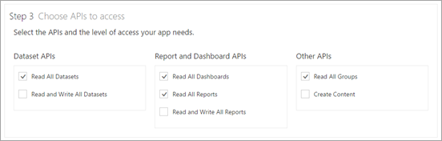
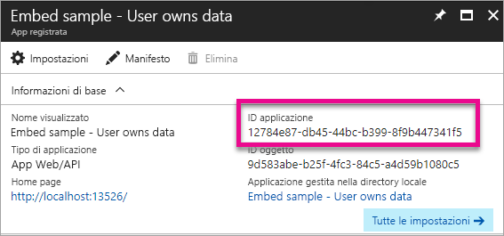
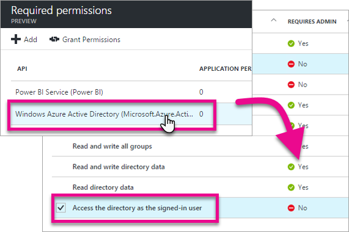

# <a name="register-an-azure-ad-app-to-embed-power-bi-content"></a>Registrare un'app di Azure AD per incorporare il contenuto di Power BI
Informazioni su come registrare un'applicazione in Azure Active Directory (Azure AD) per incorporare il contenuto di Power BI.

Registrare l'applicazione con Azure AD per consentire l'accesso dell'applicazione alle API REST di Power BI. Ciò permetterà di stabilire un'identità per l'applicazione e specificare le autorizzazioni per accedere alle risorse REST di Power BI.

> [!IMPORTANT]
> Prima di registrare un'app Power BI è necessario un [tenant di Azure Active Directory e un utente aziendale](create-an-azure-active-directory-tenant.md). Se non è ancora stata effettuata l'iscrizione a Power BI tramite un utente nel tenant, la registrazione dell'app non verrà completata correttamente.
> 
> 

Esistono due modi per registrare l'applicazione. Il primo consiste nell'usare lo [strumento di registrazione app di Power BI](https://dev.powerbi.com/apps/), il secondo nell'eseguire la registrazione direttamente nel portale di Azure. Lo strumento di registrazione delle app di Power BI è l'opzione più semplice, perché richiede di compilare solo pochi campi. Se si desidera apportare modifiche all'app, usare il portale di Azure.

## <a name="register-with-the-power-bi-app-registration-tool"></a>Registrazione con lo strumento di registrazione app di Power BI
È necessario registrare l'applicazione in **Azure Active Directory** per stabilire un'identità per l'applicazione e specificare le autorizzazioni per le risorse REST di Power BI. Quando si registra un'applicazione, ad esempio un'app console o un sito Web, si riceve un identificatore usato dall'applicazione per identificarsi con gli utenti a cui si richiedono le autorizzazioni.

Di seguito è illustrato come registrare un'applicazione con lo strumento di registrazione app di Power BI:

1. Passare a [dev.powerbi.com/apps](https://dev.powerbi.com/apps).
2. Selezionare **Accedere con l'account esistente**.
3. Immettere un nome in **Nome app**.
4. La selezione del tipo di app dipenderà dal tipo di applicazione in uso.
   
   * Usare **Server-side Web app** (App Web lato server) per le app Web oppure le API Web.
   * Usare **Native app** (App nativa) per le app eseguite su dispositivi client. ***Inoltre si sceglierà **App nativa** se si intende incorporare il contenuto per i clienti indipendentemente dal tipo di applicazione effettiva, anche se si tratta di applicazioni Web.***
5. Immettere un valore per **URL di reindirizzamento** e **URL della pagina iniziale**. Funzionerà qualsiasi URL valido.
   
    **URL della pagina iniziale** è disponibile solo se si sceglie **Server-side Web app** (App Web lato server) per il tipo di applicazione.
   
    Per gli esempi *embedding for your customers* e *integrate-dashboard-web-app*, l'URL di reindirizzamento sarà `http://localhost:13526/redirect`. Per l'esempio relativo al report e al riquadro, l'URL di reindirizzamento sarà `http://localhost:13526/`.
6. Scegliere le API a cui questa applicazione avrà accesso. Per altre informazioni sulle autorizzazioni di accesso di Power BI, vedere [Autorizzazioni di Power BI](power-bi-permissions.md).
   
    
7. Selezionare **Registra l'app**.
   
    Verrà quindi dato all'utente un **ID client**. Se si seleziona **Server-side Web app** (App Web lato server), si riceverà anche un **Segreto client**. Se necessario, è possibile recuperare l'**ID client** dal portale di Azure in un secondo momento. Se si perde il **Segreto client**, sarà necessario crearne uno nuovo nel portale di Azure.

8. È necessario passare ad Azure per selezionare **Concedi autorizzazioni**.
> [!Note]
    > Per eseguire questa operazione, è necessario essere un amministratore globale nel tenant di Azure
>

* Passare ad Azure.
* Cercare e selezionare **Registrazioni per l'app**.
* Scegliere l'app.
* Selezionare **Impostazioni**.
* Selezionare **Autorizzazioni necessarie**.
* Selezionare **Servizio Power BI** per verificare le autorizzazioni selezionate dal sito di registrazione per l'app.
* Selezionare **Concedi autorizzazioni**.

È ora possibile usare l'applicazione registrata come parte dell'applicazione personalizzata per interagire con il servizio Power BI.

> [!IMPORTANT]
> Se si incorpora contenuto per i clienti, sarà necessario configurare autorizzazioni aggiuntive nel portale di Azure. Per altre informazioni, vedere [Applicare autorizzazioni all'applicazione](#apply-permissions-to-your-application).
> 
> 

## <a name="register-with-the-azure-portal"></a>Eseguire la registrazione con il portale di Azure
L'altra opzione per la registrazione dell'applicazione consiste nell'eseguire l'operazione direttamente nel portale di Azure. Per registrare l'applicazione, seguire questa procedura.

1. Accettare le [condizioni relative all'API di Microsoft Power BI](https://powerbi.microsoft.com/api-terms).
2. Accedere al [portale di Azure](https://portal.azure.com).
3. Scegliere il tenant di Azure AD selezionando l'account nell'angolo in alto a destra della pagina.
4. Nel riquadro di spostamento a sinistra scegliere **Altri servizi**, selezionare **Registrazioni per l'app** in **Sicurezza e identità** e infine selezionare **Registrazione nuova applicazione**.
   
    
5. Seguire le istruzioni e creare una nuova applicazione.
   
   * Per le applicazioni Web specificare l'URL di accesso, ovvero l'URL di base dell'app, a cui gli utenti possono accedere, ad esempio http://localhost:13526.
   * Per le applicazioni native, specificare un URI di reindirizzamento, che verrà usato da Azure AD per restituire le risposte del token. Immettere un valore specifico per l'applicazione, ad esempio http://myapplication/redirect

Per altre informazioni su come registrare le applicazioni in Azure Active Directory, vedere [Integrazione di applicazioni con Azure Active Directory](https://docs.microsoft.com/azure/active-directory/develop/active-directory-integrating-applications)

## <a name="how-to-get-the-client-id"></a>Come ottenere l'ID client
Quando si registra un'applicazione, si riceve un **ID client**.  L' **ID client** viene usato dall'applicazione per identificare se stessa nei confronti degli utenti che richiedono le autorizzazioni.

Ecco come ottenere un ID client:

1. Accedere al [portale di Azure](https://portal.azure.com).
2. Scegliere il tenant di Azure AD selezionando l'account nell'angolo in alto a destra della pagina.
3. Nel riquadro di spostamento a sinistra, scegliere **Altri servizi** e selezionare **Registrazioni per l'app**.
4. Selezionare l'applicazione per cui si desidera recuperare l'ID client.
5. L'**ID applicazione** verrà elencato come GUID. Questo è l'ID client per l'applicazione.
   
    

## <a name="apply-permissions-to-your-application-within-azure-ad"></a>Applicare le autorizzazioni all'applicazione in Azure AD
> [!IMPORTANT]
> Questa sezione vale solo per le applicazioni che **incorporano il contenuto per l'organizzazione**.
> 
> 

È necessario abilitare le autorizzazioni aggiuntive all'applicazione oltre a quello fornito nella pagina di registrazione dell'app. Questa operazione può esser eseguita dal portale di Azure AD o a livello di codice.

È consigliabile accedere con l'account *master*, usato per l'incorporamento, o con un account di amministratore globale.

### <a name="using-the-azure-ad-portal"></a>Uso del portale di Azure AD
1. Passare a [Registrazioni per l'app](https://portal.azure.com/#blade/Microsoft_AAD_IAM/ApplicationsListBlade) nel portale di Azure e selezionare l'app che si usa per l'incorporamento.
   
    
2. Selezionare **Autorizzazioni necessarie** sotto **Accesso all'API**.
   
    
3. Selezionare **Microsoft Azure Active Directory** e quindi accertarsi che l'opzione **Accede alla directory come utente registrato** sia selezionata. Selezionare **Salva**.
   
    
4. In **Autorizzazioni necessarie** selezionare **Servizio Power BI (Power BI)**.
   
    
   
   > [!NOTE]
   > Se l'app è stata creata direttamente nel portale di Azure AD, il **servizio Power BI (Power BI)** potrebbe non essere presente. In caso contrario, selezionare **+ Aggiungi** e quindi **selezionare un'API**. Selezionare **Servizio Power BI** nell'elenco delle API e scegliere **Seleziona**.  Se **Servizio Power BI (Power BI)** non è disponibile in **+ Aggiungi**, iscriversi a Power BI con almeno un utente.
   > 
   > 
5. Selezionare tutte le autorizzazioni in **Autorizzazioni delegate**. Per salvare le selezioni è necessario selezionarle una alla volta. Al termine, selezionare **Salva**.
   
    
6. In **Autorizzazioni necessarie** selezionare **Concedi autorizzazioni**.
   
    L'azione **Concedi autorizzazioni** è necessaria per l'*account master*, in modo da evitare che venga richiesto il consenso da Azure AD. Se l'account che esegue questa azione è un amministratore globale, si concederanno autorizzazioni a tutti gli utenti dell'organizzazione per questa applicazione. Se l'account che esegue questa azione è l'*account master* e non un amministratore globale, si concederanno autorizzazioni solo all'*account master* per questa applicazione.
   
    

### <a name="applying-permissions-programmatically"></a>Applicazione di autorizzazioni a livello di codice
1. È necessario ottenere le entità (utenti) del servizio esistente all'interno del tenant. Per informazioni su come eseguire questa operazione, vedere [Get servicePrincipal](https://developer.microsoft.com/en-us/graph/docs/api-reference/beta/api/serviceprincipal_get).
   
    È possibile chiamare l'API *Get servicePrincipal* senza {id} per visualizzare tutte le entità servizio nel tenant.
2. Cercare un'entità servizio usando l'id client dell'app come proprietà **appId**.
3. Creare un nuovo piano di servizio se manca per l'applicazione.
   
    ```
    Post https://graph.microsoft.com/beta/servicePrincipals
    Authorization: Bearer ey..qw
    Content-Type: application/json
    {
    "accountEnabled" : true,
    "appId" : "{App_Client_ID}",
    "displayName" : "{App_DisplayName}"
    }
    ```
4. Concedere l'autorizzazione delle app all'API di Power BI
   
    ```
    Post https://graph.microsoft.com/beta/OAuth2PermissionGrants
    Authorization: Bearer ey..qw
    Content-Type: application/json
    { 
    "clientId":"{Service_Plan_ID}",
    "consentType":"AllPrincipals",
    "resourceId":"c78b2585-1df6-41de-95f7-dc5aeb7dc98e",
    "scope":"Dataset.ReadWrite.All Dashboard.Read.All Report.Read.All Group.Read Group.Read.All Content.Create Metadata.View_Any Dataset.Read.All Data.Alter_Any",
    "expiryTime":"2018-03-29T14:35:32.4943409+03:00",
    "startTime":"2017-03-29T14:35:32.4933413+03:00"
    }
    ```
5. Concedere l'autorizzazione delle app a AAD
   
    Il valore per **consentType** dipenderà dall'utente che esegue la richiesta. È possibile fornire il valore **AllPrincipals** o **Principal**. **AllPrincipals** può essere usato solo da un amministratore per concedere autorizzazioni a tutti gli utenti. **Principal** viene usato per concedere autorizzazioni a un utente specifico. 
   
    La concessione delle autorizzazioni è necessaria per l'*account master*, in modo da evitare che venga richiesto il consenso da Azure AD. 
   
    Se si usa un tenant esistente, ma non si è interessati alla concessione di autorizzazioni per conto di tutti gli utenti del tenant, è possibile concedere autorizzazioni a un utente specifico sostituendo il valore di **contentType** con **Principal**.
   
    ```
    Post https://graph.microsoft.com/beta/OAuth2PermissionGrants
    Authorization: Bearer ey..qw
    Content-Type: application/json
    { 
    "clientId":"{Service_Plan_ID}",
    "consentType":"AllPrincipals",
    "resourceId":"61e57743-d5cf-41ba-bd1a-2b381390a3f1",
    "scope":"User.Read Directory.AccessAsUser.All",
    "expiryTime":"2018-03-29T14:35:32.4943409+03:00",
    "startTime":"2017-03-29T14:35:32.4933413+03:00"
    }
    ```

## <a name="next-steps"></a>Passaggi successivi
Dopo avere registrato l'applicazione in Azure AD, sarà necessario autenticare gli utenti nell'applicazione. Per altre informazioni, vedere [Autenticare gli utenti e ottenere un token di accesso di Azure AD per l'app Power BI](get-azuread-access-token.md).

Altre domande? [Provare a rivolgersi alla community di Power BI](http://community.powerbi.com/)


