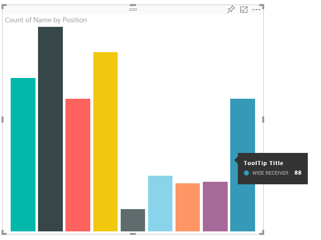
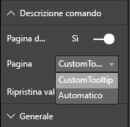

# <a name="power-bi-visuals-tooltips"></a>Descrizioni comando degli oggetti visivi di Power BI

Gli oggetti visivi possono ora usare il supporto per le descrizioni comando di Power BI. Le descrizioni comando di Power BI gestiscono le interazioni seguenti:

Visualizzazione di una descrizione comando.
Rimozione di una descrizione comando.
Spostamento di una descrizione comando.

Le descrizioni comando possono visualizzare un elemento di testo con un titolo in un colore e con un'opacità specificati in corrispondenza di un set di coordinate indicato. Questi dati vengono forniti all'API. L'host Power BI ne esegue il rendering nello stesso modo in cui esegue il rendering delle descrizioni comando per gli oggetti visivi nativi.

Ad esempio, le descrizioni comando nell'oggetto BarChart di esempio.



La descrizione comando precedente presenta una singola categoria e un valore per la barra. Può essere estesa per visualizzare più valori all'interno di una singola descrizione comando.

## <a name="handling-tooltips"></a>Gestione delle descrizioni comando

L'interfaccia tramite cui vengono gestite le descrizioni comando è "ITooltipService". Questa interfaccia viene usata per indicare all'host che è necessario visualizzare, rimuovere o spostare una descrizione comando.

```typescript
    interface ITooltipService {
        enabled(): boolean;
        show(options: TooltipShowOptions): void;
        move(options: TooltipMoveOptions): void;
        hide(options: TooltipHideOptions): void;
    }
```

L'oggetto visivo dovrà essere in ascolto degli eventi del mouse al suo interno e chiamare i delegati `show()`, `move()` e `hide()` in base alle esigenze con il contenuto appropriato immesso negli oggetti `Tooltip****Options`.
`TooltipShowOptions` e `TooltipHideOptions` a loro volta definiscono cosa visualizzare e come comportarsi in presenza di questi eventi.
Poiché la chiamata di questi metodi comporterebbe eventi utente come gli spostamenti del mouse o eventi di tocco, è consigliabile creare listener per questi eventi, che a loro volta richiameranno i membri `TooltipService`.
Aggregati di esempio in una classe denominata `TooltipServiceWrapper`.

### <a name="tooltipservicewrapper-class"></a>Classe TooltipServiceWrapper

L'idea di base riguardo a questa classe consiste nel mantenere l'istanza di `TooltipService`, ascoltare gli eventi del mouse D3 sugli elementi pertinenti e quindi effettuare le chiamate a `show()` e `hide()` come necessario.
La classe include e gestisce tutti gli stati pertinenti e la logica per questi eventi, per lo più finalizzati all'interazione con il codice D3 sottostante. L'interazione e la conversione del codice D3 non rientrano nell'ambito di questo documento.

Il codice di esempio completo è disponibile nel [repository dell'oggetto visivo SampleBarChart](https://github.com/Microsoft/PowerBI-visuals-sampleBarChart/commit/981b021612d7b333adffe9f723ab27783c76fb14)

### <a name="creating-tooltipservicewrapper"></a>Creazione di TooltipServiceWrapper

Il costruttore BarChart include ora un membro `tooltipServiceWrapper`, di cui viene creata un'istanza nel costruttore con l'istanza `tooltipService` host.

```typescript
        private tooltipServiceWrapper: ITooltipServiceWrapper;

        this.tooltipServiceWrapper = createTooltipServiceWrapper(this.host.tooltipService, options.element);
```

La classe `TooltipServiceWrapper` contiene l'istanza `tooltipService`, anche come elemento D3 radice dei parametri visual e touch.

```typescript
    class TooltipServiceWrapper implements ITooltipServiceWrapper {
        private handleTouchTimeoutId: number;
        private visualHostTooltipService: ITooltipService;
        private rootElement: Element;
        private handleTouchDelay: number;

        constructor(tooltipService: ITooltipService, rootElement: Element, handleTouchDelay: number) {
            this.visualHostTooltipService = tooltipService;
            this.handleTouchDelay = handleTouchDelay;
            this.rootElement = rootElement;
        }
        .
        .
        .
    }
```

Il singolo punto di ingresso per questa classe per la registrazione dei listener di eventi è il metodo `addTooltip`.

### <a name="addtooltip-method"></a>Metodo addTooltip

```typescript
        public addTooltip<T>(
            selection: d3.Selection<Element>,
            getTooltipInfoDelegate: (args: TooltipEventArgs<T>) => VisualTooltipDataItem[],
            getDataPointIdentity: (args: TooltipEventArgs<T>) => ISelectionId,
            reloadTooltipDataOnMouseMove?: boolean): void {

            if (!selection || !this.visualHostTooltipService.enabled()) {
                return;
            }
        ...
        ...
        }
```

* **selection: d3.Selection<Element>**
* Elementi D3 su cui vengono gestite le descrizioni comando
* **getTooltipInfoDelegate: (args: TooltipEventArgs<T>) => VisualTooltipDataItem[]**
* Delegato per l'immissione del contenuto della descrizione comando (cosa visualizzare) per contesto
* **getDataPointIdentity: (args: TooltipEventArgs<T>) => ISelectionId**
* Delegato per il recupero dell'ID punto dati, non usato in questo esempio 
* **reloadTooltipDataOnMouseMove?: boolean**
* Valore booleano che indica se aggiornare i dati della descrizione comando durante un evento mouseMove, non usato in questo esempio

Come si può notare, il metodo `addTooltip` termina senza alcuna azione se `tooltipService` è disabilitato o se non esiste una selezione reale.

### <a name="call-of-show-method-to-display-a-tooltip"></a>Chiamata del metodo Show per visualizzare una descrizione comando

`addTooltip` è in ascolto dell'evento D3 `mouseover`.

```typescript
        ...
        ...
        selection.on("mouseover.tooltip", () => {
            // Ignore mouseover while handling touch events
            if (!this.canDisplayTooltip(d3.event))
                return;

            let tooltipEventArgs = this.makeTooltipEventArgs<T>(rootNode, true, false);
            if (!tooltipEventArgs)
                return;

            let tooltipInfo = getTooltipInfoDelegate(tooltipEventArgs);
            if (tooltipInfo == null)
                return;

            let selectionId = getDataPointIdentity(tooltipEventArgs);

            this.visualHostTooltipService.show({
                coordinates: tooltipEventArgs.coordinates,
                isTouchEvent: false,
                dataItems: tooltipInfo,
                identities: selectionId ? [selectionId] : [],
            });
        });
```

* **makeTooltipEventArgs**
* Estrae il contesto dagli elementi D3 selezionati in un oggetto tooltipEventArgs. Calcola anche le coordinate.
* **getTooltipInfoDelegate**
* Compila quindi il contenuto della descrizione comando da tooltipEventArgs. Questo è un callback alla classe BarChart, in quanto si tratta della logica dell'oggetto visivo. È l'effettivo contenuto di testo da visualizzare nella descrizione comando.
* **getDataPointIdentity**
* Non usato in questo esempio
* **this.visualHostTooltipService.show**
* Chiamata per visualizzare la descrizione comando  

Altre informazioni sulla gestione sono disponibili nell'esempio per gli eventi `mouseout` e `mousemove`.

Per altre informazioni, vedere il [repository dell'oggetto visivo SampleBarChart](https://github.com/Microsoft/PowerBI-visuals-sampleBarChart/commit/981b021612d7b333adffe9f723ab27783c76fb14).

### <a name="populating-the-tooltip-content-by-gettooltipdata-method"></a>Immissione del contenuto della descrizione comando tramite il metodo getTooltipData

L'oggetto `BarChart` è stato aggiunto con un membro `getTooltipData` che estrae semplicemente la categoria, il valore e il colore del punto dati in un elemento VisualTooltipDataItem[].

```typescript
        private static getTooltipData(value: any): VisualTooltipDataItem[] {
            return [{
                displayName: value.category,
                value: value.value.toString(),
                color: value.color,
                header: 'ToolTip Title'
            }];
        }
```

Nell'implementazione precedente il membro `header` è costante, ma può essere usato per implementazioni più complesse, che richiedono valori dinamici. È possibile immettere più di un elemento in `VisualTooltipDataItem[]` per aggiungere più righe alla descrizione comando. Questo può essere utile negli oggetti visivi, ad esempio i grafici a barre in pila, in cui la descrizione comando può visualizzare dati da più di un punto dati.

### <a name="calling-addtooltip-method"></a>Chiamata del metodo addTooltip

Il passaggio finale consiste nel chiamare `addTooltip` quando i dati effettivi possono cambiare. Questa chiamata viene eseguita nel metodo `BarChart.update()`. Di conseguenza, viene effettuata una chiamata per monitorare la selezione di tutti gli elementi "bar", passando solo `BarChart.getTooltipData()` come indicato in precedenza.

```typescript
        this.tooltipServiceWrapper.addTooltip(this.barContainer.selectAll('.bar'),
            (tooltipEvent: TooltipEventArgs<number>) => BarChart.getTooltipData(tooltipEvent.data),
            (tooltipEvent: TooltipEventArgs<number>) => null);
```

## <a name="adding-report-page-tooltips"></a>Aggiunta di descrizioni comando della pagina del report

Per aggiungere il supporto per le descrizioni comando della pagina del report, la maggior parte delle modifiche si troverà in capabilities.json.

Uno schema di esempio è

```json
{
    "tooltips": {
        "supportedTypes": {
            "default": true,
            "canvas": true
        },
        "roles": [
            "tooltips"
        ]
    }
}
```

La definizione delle descrizioni comando della pagina del report può essere eseguita nel riquadro Formato.



`supportedTypes` è la configurazione delle descrizioni comando supportata dall'oggetto visivo e riflessa nell'area campi. `default` specifica se è supportata l'associazione di descrizioni comando "automatiche" tramite il campo dati. canvas specifica se sono supportate le descrizioni comando della pagina del report.

`roles` è facoltativo. Se definito, indica quali ruoli dati verranno associati all'opzione selezionata per le descrizioni comando nell'area campi.

Per altre informazioni, vedere le linee guida sull'utilizzo delle descrizioni comando della pagina del report in [Descrizioni comando per la pagina del report](https://powerbi.microsoft.com/blog/power-bi-desktop-march-2018-feature-summary/#tooltips)

Per visualizzare la descrizione comando della pagina del report durante la chiamata di `ITooltipService.Show(options: TooltipShowOptions)` o `ITooltipService.Move(options: TooltipMoveOptions)`, l'host Power BI userà selectionID (proprietà `options` dell'argomento `identities` precedente). SelectionId deve rappresentare i dati selezionati (categoria, serie e così via) dell'elemento su cui è stato posizionato il puntatore del mouse da recuperare tramite la descrizione comando.

Esempio di invio di selectionId alle chiamate di visualizzazione delle descrizioni comando:

```typescript
    this.tooltipServiceWrapper.addTooltip(this.barContainer.selectAll('.bar'),
        (tooltipEvent: TooltipEventArgs<number>) => BarChart.getTooltipData(tooltipEvent.data),
        (tooltipEvent: TooltipEventArgs<number>) => tooltipEvent.data.selectionID);
```
