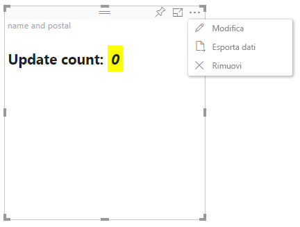

# Modalità di modifica avanzata negli oggetti visivi di Power BI

Se sono necessari controlli dell'interfaccia utente avanzati nell'oggetto visivo di Power BI, è possibile sfruttare la modalità di modifica avanzata. In modalità di modifica report si seleziona un pulsante **Modifica** per impostare la modalità di modifica su **Avanzata**. L'oggetto visivo può usare il flag `EditMode` per determinare se visualizzare questo controllo dell'interfaccia utente.

Per impostazione predefinita, l'oggetto visivo non supporta la modalità di modifica avanzata. Se è necessario un comportamento diverso, è possibile dichiararlo in modo esplicito nel file *capabilities.json* dell'oggetto visivo, impostando la proprietà `advancedEditModeSupport`.

I valori possibili sono:

- `0`: NotSupported

- `1`: SupportedNoAction

- `2`: SupportedInFocus

## Attivare la modalità di modifica avanzata

Un pulsante **Modifica** viene visualizzato se:

* La proprietà `advancedEditModeSupport` è impostata nel file *capabilities.json* su `SupportedNoAction` o `SupportedInFocus`.

* L'oggetto visivo viene visualizzato in modalità di modifica report.

Se la proprietà `advancedEditModeSupport` non è presente nel file *capabilities.json* o è impostata su `NotSupported`, il pulsante **Modifica** non viene visualizzato.

Quando si seleziona **Modifica**, l'oggetto visivo ottiene una chiamata a update() con EditMode impostato su `Advanced`. A seconda del valore impostato nel file *capabilities.json*, vengono eseguite le azioni seguenti:

* `SupportedNoAction`: nessun'altra azione richiesta da parte dell'host.
* `SupportedInFocus`: l'host espande l'oggetto visivo in modalità messa a fuoco.

## Disattivare la modalità di modifica avanzata

Il pulsante **Torna al report** viene visualizzato se:

* La proprietà `advancedEditModeSupport` è impostata nel file *capabilities.json* su `SupportedInFocus`.
