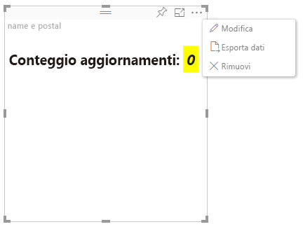

# Modalità di modifica avanzata

Gli oggetti visivi che richiedono controlli dell'interfaccia utente avanzati possono dichiarare il supporto della modalità di modifica avanzata.
Se la modalità è supportata, quando si usa la modalità di modifica report nel menu dell'oggetto visivo viene visualizzato un pulsante `Edit`.
Quando si fa clic sul pulsante `Edit`, EditMode è impostato su `Advanced`.
L'oggetto visivo può usare il flag EditMode per determinare se visualizzare tali controlli dell'interfaccia utente.

Per impostazione predefinita, l'oggetto visivo non supporta la modalità di modifica avanzata.
Se è necessario un comportamento diverso, deve essere dichiarato in modo esplicito nel file `capabilities.json` dell'oggetto visivo, impostando la proprietà `advancedEditModeSupport`.

I possibili valori sono:

- 0 - NotSupported

- 1 - SupportedNoAction

- 2 - SupportedInFocus

## Attivazione della modalità di modifica avanzata

Il pulsante `Edit` verrà visualizzato se:

 1\. La proprietà `advancedEditModeSupport` nel file capabilities.json è impostata su `SupportedNoAction` o `SupportedInFocus`.

 2\. L'oggetto visivo viene visualizzato in modalità di modifica report.

Se la proprietà `advancedEditModeSupport` non è presente nel file capabilities.json o è impostata su `NotSupported`, il pulsante "Modifica" non viene visualizzato.

Quando l'utente fa clic su `Edit`, l'oggetto visivo riceve una chiamata update() con EditMode impostato su `Advanced`.
In base al valore impostato nelle funzionalità, verranno eseguite le azioni seguenti:

* `SupportedNoAction`: nessun'altra azione da parte dell'host.
* `SupportedInFocus`: l'host espande l'oggetto visivo in modalità messa a fuoco.

## Disattivazione della modalità di modifica avanzata

Il pulsante `Back to report` verrà visualizzato se:

1\. La proprietà `advancedEditModeSupport` nel file capabilities.json è impostata su `SupportedInFocus`.
