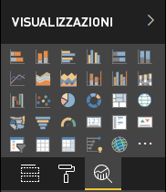

# <a name="the-analytics-pane-in-power-bi-visuals"></a>Riquadro Analisi negli oggetti visivi di Power BI

Il riquadro **Analisi** è stato introdotto per gli [oggetti visivi nativi](https://docs.microsoft.com/power-bi/desktop-analytics-pane) a novembre 2018.
Questo articolo illustra come gli oggetti visivi di Power BI con l'API v2.5.0 possono presentare e gestire le proprie proprietà nel riquadro **Analisi**.



## <a name="manage-the-analytics-pane"></a>Gestire il riquadro Analisi

Analogamente a come si gestiscono le proprietà nel [riquadro **Formato**](https://docs.microsoft.com/power-bi/developer/visuals/custom-visual-develop-tutorial-format-options), per gestire il riquadro **Analisi** si definisce un oggetto nel file *capabilities.json* dell'oggetto visivo.

Per il riquadro **Analisi**, le differenze sono le seguenti:

* Nella definizione dell'oggetto si aggiunge un campo **objectCategory** con il valore 2.

    > [!NOTE]
    > Il campo `objectCategory` facoltativo è stato introdotto nell'API 2.5.0. Definisce l'aspetto dell'oggetto visivo controllato dall'oggetto (1 = Formatting, 2 = Analytics). `Formatting` viene usato per elementi come l'aspetto, i colori, gli assi e le etichette. `Analytics` viene usato per elementi come le previsioni, le linee di tendenza, le linee di riferimento e le forme.
    >
    > Se il valore non è specificato, `objectCategory` viene impostato su "Formatting".

* L'oggetto deve avere le due proprietà seguenti:
    * `show` di tipo `bool`, con il valore predefinito `false`.
    * `displayName` di tipo `text`. Il valore predefinito scelto diventa il nome visualizzato iniziale dell'istanza.

```json
{
  "objects": {
    "YourAnalyticsPropertiesCard": {
      "displayName": "Your analytics properties card's name",
      "objectCategory": 2,
      "properties": {
        "show": {
          "type": {
            "bool": true
          }
        },
        "displayName": {
          "type": {
            "text": true
          }
        },
      ... //any other properties for your Analytics card
      }
    }
  ...
  }
}
```

È possibile definire altre proprietà come è possibile fare per gli oggetti **Format** ed è possibile enumerare gli oggetti come si fa nel riquadro **Format**.

## <a name="known-limitations-and-issues-of-the-analytics-pane"></a>Limitazioni e problemi noti del riquadro Analisi

* Il riquadro **Analytics** non supporta ancora più istanze. Gli oggetti non possono avere un [selettore](https://microsoft.github.io/PowerBI-visuals/docs/concepts/objects-and-properties/#selector) diverso da uno statico, ovvero "selector" = null, e gli oggetti visivi di Power BI non possono avere più istanze di una scheda definite dall'utente.
* Le proprietà di tipo `integer` non vengono visualizzate correttamente. Come soluzione alternativa, usare invece il tipo `numeric`.

> [!NOTE]
> * Usare il riquadro **Analisi** solo per gli oggetti che aggiungono nuove informazioni o fanno luce sulle informazioni presentate (ad esempio, le linee di riferimento dinamiche che illustrano tendenze importanti).
> * Tutte le opzioni che controllano l'aspetto dell'oggetto visivo (ovvero la formattazione) devono essere limitate al riquadro **Formattazione**.
