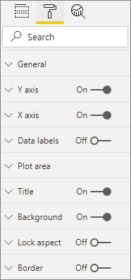

# <a name="build-a-bar-chart"></a>Creare un grafico a barre

Questo articolo è una guida dettagliata per creare un semplice oggetto visivo grafico a barre di Power BI tramite il codice. L'esempio di codice completo è disponibile in [https://github.com/Microsoft/PowerBI-visuals-sampleBarChart](https://github.com/Microsoft/PowerBI-visuals-sampleBarChart).

## <a name="view-model"></a>Visualizzare il modello
È importante definire in primo luogo il modello di visualizzazione del grafico a barre e quindi eseguire un'iterazione sugli elementi esposti all'oggetto visivo durante la compilazione.

```typescript
/**
 * Interface for BarCharts viewmodel.
 *
 * @interface
 * @property {BarChartDataPoint[]} dataPoints - Set of data points the visual will render.
 * @property {number} dataMax                 - Maximum data value in the set of data points.
 */
interface BarChartViewModel {
    dataPoints: BarChartDataPoint[];
    dataMax: number;
};

/**
 * Interface for BarChart data points.
 *
 * @interface
 * @property {number} value    - Data value for the point.
 * @property {string} category - Corresponding category of the data value.
 */
interface BarChartDataPoint {
    value: number;
    category: string;
};
```

### <a name="use-static-data"></a>Usare dati statici

L'uso di dati statici è un ottimo modo per testare l'oggetto visivo senza data binding. Il modello di visualizzazione non cambia, anche dopo l'aggiunta del data binding in un passaggio successivo.

```typescript
let testData: BarChartDataPoint[] = [
    {
        value: 10,
        category: 'a'
    },
    {
        value: 20,
        category: 'b'
    },
    {
        value: 1,
        category: 'c'
    },
    {
        value: 100,
        category: 'd'
    },
    {
        value: 500,
        category: 'e'
    }];

let viewModel: BarChartViewModel = {
    dataPoints: testData,
    dataMax: d3.max(testData.map((dataPoint) => dataPoint.value))
};
```

## <a name="data-binding"></a>Data binding 
È possibile aggiungere il data binding definendo le funzionalità dell'oggetto visivo in *capabilities.json*. Il codice di esempio include già uno schema da usare.

Il data binding agisce su un'**area campi** in Power BI.


### <a name="add-data-roles"></a>Aggiungere i ruoli dati
Il codice di esempio include già i ruoli dati, ma è possibile personalizzare questi ruoli.

- `displayName` è il nome visualizzato nell'**area campi**.
- `name` è il nome interno usato per fare riferimento al ruolo dati.
- `kind` corrisponde al tipo di campo. I campi *Grouping* (0) hanno valori discreti. I campi *Measure* (1) hanno valori di dati numerici.

```json
"dataRoles": [
    {
        "displayName": "Category Data",
        "name": "category",
        "kind": 0
    },
    {
        "displayName": "Measure Data",
        "name": "measure",
        "kind": 1
    }
],
```

Per altre informazioni, vedere [Ruoli dati](./capabilities.md#define-the-data-fields-that-your-visual-expects-dataroles).

### <a name="add-conditions-to-dataviewmapping"></a>Aggiungere condizioni a DataViewMapping
Definire le condizioni in `dataViewMappings` per impostare il numero di campi che ogni area campi può associare. Usare il valore `name` interno del ruolo dati per fare riferimento a ogni campo.

```json
    "dataViewMappings": [
        {
            "conditions": [
                {
                    "category": {
                        "max": 1
                    },
                    "measure": {
                        "max": 1
                    }
                }
            ],
        }
    ]
```

Per altre informazioni, vedere [Mapping di viste dati](./dataview-mappings.md).

### <a name="define-and-use-visualtransform"></a>Definire e usare visualTransform
`DataView` è la struttura che Power BI rende disponibile all'oggetto visivo e contiene i dati risultanti da query che si vuole visualizzare. Tuttavia `DataView` può specificare dati in formati diversi, ad esempio sotto forma di categorie o tabelle. Per creare un oggetto visivo in un formato a categorie, come un grafico a barre, è sufficiente usare la proprietà della categoria in `DataView`. La definizione di `visualTransform` consente di convertire `DataView` in un modello di visualizzazione che verrà usato dall'oggetto visivo.

Per assegnare i colori e selezionarli durante la definizione di singoli punti dati, usare `IVisualHost`. 

```typescript
/**
 * Function that converts queried data into a view model that will be used by the visual
 *
 * @function
 * @param {VisualUpdateOptions} options - Contains references to the size of the container
 *                                        and the dataView which contains all the data
 *                                        the visual had queried.
 * @param {IVisualHost} host            - Contains references to the host which contains services
 */
function visualTransform(options: VisualUpdateOptions, host: IVisualHost): BarChartViewModel {
    /*Convert dataView to your viewModel*/
}

```

## <a name="color"></a>Colore 
Il colore viene esposto come uno dei servizi disponibili in `IVisualHost`.

### <a name="add-color-to-data-points"></a>Aggiungere il colore ai punti dati
Ogni punto dati è rappresentato da un colore diverso. Il colore viene aggiunto all'interfaccia `BarChartDataPoint`.

```typescript
/**
 * Interface for BarChart data points.
 *
 * @interface
 * @property {number} value    - Data value for the point.
 * @property {string} category - Corresponding category of the data value.
 * @property {string} color    - Color corresponding to the data point.
 */
interface BarChartDataPoint {
    value: number;
    category: string;
    color: string;
};
```

### <a name="the-colorpalette-service"></a>Il servizio colorPalette
Il servizio `colorPalette` gestisce i colori usati nell'oggetto visivo. L'istanza corrispondente è disponibile in `IVisualHost`.

### <a name="assign-color-to-data-points"></a>Assegnare il colore ai punti dati
`visualTransform` è stato definito come costrutto per convertire `dataView` in un modello di visualizzazione che può essere usato da un grafico a barre. Poiché si scorrono i punti dati in `visualTransform`, questa è anche la posizione ideale per assegnare i colori.

```typescript
let colorPalette: IColorPalette = host.colorPalette; // host: IVisualHost
for (let i = 0, len = Math.max(category.values.length, dataValue.values.length); i < len; i++) {
    barChartDataPoints.push({
        category: category.values[i],
        value: dataValue.values[i],
        color: colorPalette.getColor(category.values[i]).value,
    });
}
```

## <a name="selection-and-interactions"></a>Selezione e interazioni
La selezione consente all'utente di interagire con l'oggetto visivo corrente e con altri oggetti visivi. 

### <a name="add-selection-to-each-data-point"></a>Aggiungere la selezione a ogni punto dati
Poiché ogni punto dati è univoco, aggiungere la selezione a ogni punto dati. È possibile aggiungere la proprietà di selezione nell'interfaccia `BarChartDataPoint`.

```typescript
/**
 * Interface for BarChart data points.
 *
 * @interface
 * @property {number} value             - Data value for the point.
 * @property {string} category          - Corresponding category of data value.
 * @property {string} color             - Color corresponding to data point.
 * @property {ISelectionId} selectionId - Id assigned to data point for cross filtering
 *                                        and visual interaction.
 */
interface BarChartDataPoint {
    value: number;
    category: string;
    color: string;
    selectionId: ISelectionId;
};
```

### <a name="assign-selection-ids-to-each-data-point"></a>Assegnare ID di selezione a ogni punto dati
Poiché si scorrono i punti dati in `visualTransform`, questa è anche la posizione ideale per creare gli ID di selezione. La variabile host è un `IVisualHost`, che contiene i servizi che possono essere usati dall'oggetto visivo, come il generatore di colori e di selezione. 

Usare il metodo factory `createSelectionIdBuilder` su `IVisualHost` per creare un nuovo ID di selezione. Creare un nuovo generatore di selezione per ogni punto dati.

Poiché si effettuano selezioni basate solo sulla categoria, è sufficiente definire le selezioni `withCategory`.

```typescript
for (let i = 0, len = Math.max(category.values.length, dataValue.values.length); i < len; i++) {
    barChartDataPoints.push({
        category: category.values[i],
        value: dataValue.values[i],
        color: colorPalette.getColor(category.values[i]).value,
        selectionId: host.createSelectionIdBuilder()
            .withCategory(category, i)
            .createSelectionId()
    });
}
```

Per altre informazioni, vedere [Creare un'istanza del generatore di selezione](./selection-api.md#create-an-instance-of-the-selection-builder).

### <a name="interact-with-data-points"></a>Interagire con i punti dati
Dopo l'assegnazione di un ID di selezione al punto dati è possibile interagire con ogni barra del grafico a barre. Il grafico a barre è in ascolto per gli eventi `click`.

Usare il metodo factory `selectionManager` su `IVisualHost` per creare un gestore di selezione per il filtro incrociato e la cancellazione delle selezioni.

```typescript
let selectionManager = this.selectionManager;

//This must be an anonymous function instead of a lambda because
//d3 uses 'this' as the reference to the element that was clicked.
bars.on('click', function(d) {
    selectionManager.select(d.selectionId).then((ids: ISelectionId[]) => {
        bars.attr({
            'fill-opacity': ids.length > 0 ? BarChart.Config.transparentOpacity : BarChart.Config.solidOpacity
        });

        d3.select(this).attr({
            'fill-opacity': BarChart.Config.solidOpacity
        });
    });

    (<Event>d3.event).stopPropagation();
});
```

Per altre informazioni, vedere [Come usare SelectionManager](./selection-api.md#how-to-use-selectionmanager-to-select-data-points).

## <a name="static-objects"></a>Oggetti statici

È possibile aggiungere oggetti al **riquadro delle proprietà** per personalizzare ulteriormente l'oggetto visivo. Queste personalizzazioni possono essere modifiche dell'interfaccia utente o modifiche correlate ai dati restituiti dalle query. Nell'esempio vengono usati oggetti statici per eseguire il rendering dell'asse X del grafico a barre.

È possibile attivare o disattivare gli oggetti nel **riquadro delle proprietà**.



### <a name="define-objects-in-capabilities"></a>Definire oggetti nelle funzionalità
Definire una proprietà `objects` nel file *capabilities.json* per far sì che gli oggetti vengano visualizzati nel **riquadro delle proprietà**.
- `enableAxis` è il nome interno a cui fa riferimento `dataView`. 
- `displayName` è il nome visualizzato nel **riquadro delle proprietà**.
- `bool` è un valore primitivo usato in genere con oggetti statici come caselle di testo o commutatori.
- `show` è una proprietà speciale per `properties` che abilita il commutatore `show` sull'oggetto. Poiché `show` è un commutatore, viene tipizzato come `bool`.


```typescript
"objects": {
    "enableAxis": {
        "displayName": "Enable Axis",
        "properties": {
            "show": {
                "displayName": "Enable Axis",
                "type": { "bool": true }
            }
        }
    }
}
```

Per altre informazioni, vedere [Oggetti](./objects-properties.md).

### <a name="define-property-settings"></a>Definire le impostazioni delle proprietà

Le sezioni seguenti descrivono i principi di base per la definizione delle impostazioni delle proprietà. È anche possibile usare le classi di utilità definite nel pacchetto `powerbi-visuals-utils-dataviewutils` per definire le impostazioni delle proprietà. Per altre informazioni, vedere la documentazione e gli esempi per la classe [DataViewObjectsParser](https://github.com/Microsoft/powerbi-visuals-utils-dataviewutils/blob/master/docs/api/data-view-objects-parser.md).


Sebbene facoltativo, è preferibile posizionare la maggior parte delle impostazioni in un singolo oggetto, per semplificare il riferimento.

```typescript
/**
 * Interface for BarCharts viewmodel.
 *
 * @interface
 * @property {BarChartDataPoint[]} dataPoints - Set of data points the visual will render.
 * @property {number} dataMax                 - Maximum data value in the set of data points.
 * @property {BarChartSettings} settings      - Object property settings
 */
interface BarChartViewModel {
    dataPoints: BarChartDataPoint[];
    dataMax: number;
    settings: BarChartSettings;
};

/**
 * Interface for BarChart settings.
 *
 * @interface
 * @property "show" enableAxis - Object property that allows axis to be enabled.
 */
interface BarChartSettings {
    enableAxis: {
        show: boolean;
    };
}
```

### <a name="define-and-use-objectenumerationutility"></a>Definire e usare ObjectEnumerationUtility
I valori delle proprietà dell'oggetto sono disponibili come metadati in `dataView`, ma non esiste un servizio per recuperare queste proprietà. `ObjectEnumerationUtility` è un set di funzioni statiche che è possibile usare per recuperare i valori degli oggetti da `dataView` e per altri progetti di oggetti visivi. `ObjectEnumerationUtility` è facoltativo, ma è ideale per l'iterazione in `dataView` e il recupero delle proprietà dell'oggetto.

```typescript
/**
 * Gets property value for a particular object.
 *
 * @function
 * @param {DataViewObjects} objects - Map of defined objects.
 * @param {string} objectName       - Name of desired object.
 * @param {string} propertyName     - Name of desired property.
 * @param {T} defaultValue          - Default value of desired property.
 */
export function getValue<T>(objects: DataViewObjects, objectName: string, propertyName: string, defaultValue: T ): T {
    if(objects) {
        let object = objects[objectName];
        if(object) {
            let property: T = object[propertyName];
            if(property !== undefined) {
                return property;
            }
        }
    }
    return defaultValue;
}
```

Per il codice sorgente, vedere [objectEnumerationUtility.ts](https://github.com/Microsoft/PowerBI-visuals-sampleBarChart/blob/master/src/objectEnumerationUtility.ts).

### <a name="retrieve-property-values-from-dataview"></a>Recuperare i valori delle proprietà da dataView
`visualTransform` è la posizione ideale per modificare il modello di visualizzazione dell'oggetto visivo. Per continuare con questo approccio, recuperare le proprietà dell'oggetto da `dataView`.

Definire lo stato predefinito della proprietà e usare `getValue` per recuperare la proprietà da `dataView`.

```typescript
let defaultSettings: BarChartSettings = {
    enableAxis: {
        show: false,
    }
};

let barChartSettings: BarChartSettings = {
    enableAxis: {
        show: getValue<boolean>(objects, 'enableAxis', 'show', defaultSettings.enableAxis.show),
    }
}
```

### <a name="populate-property-pane-with-enumerateobjectinstances"></a>Compilare il riquadro delle proprietà con enumerateObjectInstances
Il metodo facoltativo `enumerateObjectInstances` in `IVisual` enumera tutti gli oggetti e li inserisce nel **riquadro delle proprietà**. Ogni oggetto viene chiamato con `enumerateObjectInstances`. Il nome dell'oggetto è disponibile in `EnumerateVisualObjectInstancesOptions`.

Per ogni oggetto, definire la proprietà con lo stato corrente.

```typescript
/**
 * Enumerates through the objects defined in the capabilities and adds the properties to the format pane
 *
 * @function
 * @param {EnumerateVisualObjectInstancesOptions} options - Map of defined objects
 */
public enumerateObjectInstances(options: EnumerateVisualObjectInstancesOptions): VisualObjectInstanceEnumeration {
    let objectName = options.objectName;
    let objectEnumeration: VisualObjectInstance[] = [];

    switch(objectName) {
        case 'enableAxis':
            objectEnumeration.push({
                objectName: objectName,
                properties: {
                    show: this.barChartSettings.enableAxis.show,
                },
                selector: null
            });
    };

    return objectEnumeration;
}
```

### <a name="control-property-update-logic"></a>Controllare la logica di aggiornamento della proprietà
Dopo che un oggetto è stato aggiunto al **riquadro delle proprietà**, ogni interruttore attiva un aggiornamento. Aggiungere codice specifico per gli oggetti nei blocchi `if`:

```typescript
if(settings.enableAxis.show) {
    let margins = BarChart.Config.margins;
    height -= margins.bottom;
}
```

## <a name="databound-objects"></a>Oggetti associati a dati
Gli oggetti associati a dati sono simili agli oggetti statici, ma in genere gestiscono la selezione dei dati. Ad esempio, è possibile modificare il colore associato al punto dati.


### <a name="define-object-in-capabilities"></a>Definire l'oggetto nelle funzionalità
Come per gli oggetti statici, definire un altro oggetto in *capabilities.json*. 
- `colorSelector` è il nome interno a cui fa riferimento `dataView`.
- `displayName` è il nome visualizzato nel **riquadro delle proprietà**.
- `fill` è un valore di oggetto strutturale non associato a un tipo primitivo.

```typescript
"colorSelector": {
    "displayName": "Data Colors",
    "properties": {
        "fill": {
            "displayName": "Color",
            "type": {
                "fill": {
                    "solid": {
                        "color": true
                    }
                }
            }
        }
    }
}
```

Per altre informazioni, vedere [Oggetti](./objects-properties.md).

### <a name="use-objectenumerationutility"></a>Usare ObjectEnumerationUtility
Come per gli oggetti statici, è necessario recuperare i dettagli dell'oggetto da `dataView`. Tuttavia, anziché trovarsi all'interno dei metadati, i valori dell'oggetto sono associati a ogni categoria.

```typescript
/**
 * Gets property value for a particular object in a category.
 *
 * @function
 * @param {DataViewCategoryColumn} category - List of category objects.
 * @param {number} index                    - Index of category object.
 * @param {string} objectName               - Name of desired object.
 * @param {string} propertyName             - Name of desired property.
 * @param {T} defaultValue                  - Default value of desired property.
 */
export function getCategoricalObjectValue<T>(category: DataViewCategoryColumn, index: number, objectName: string, propertyName: string, defaultValue: T): T {
    let categoryObjects = category.objects;

    if(categoryObjects) {
        let categoryObject: DataViewObject = categoryObjects[index];
        if(categoryObject) {
            let object = categoryObject[objectName];
            if(object) {
                let property: T = object[propertyName];
                if(property !== undefined) {
                    return property;
                }
            }
        }
    }
    return defaultValue;
}
```

Per il codice sorgente, vedere [objectEnumerationUtility.ts](https://github.com/Microsoft/PowerBI-visuals-sampleBarChart/blob/master/src/objectEnumerationUtility.ts).

### <a name="define-default-color-and-retrieve-categorical-object-from-dataview"></a>Definire il colore predefinito e recuperare l'oggetto categoria da dataView
Ogni colore è ora associato a una singola categoria in `dataView`. È possibile impostare ogni punto dati sul colore corrispondente.

```typescript
for (let i = 0, len = Math.max(category.values.length, dataValue.values.length); i < len; i++) {
    let defaultColor: Fill = {
        solid: {
            color: colorPalette.getColor(category.values[i]).value
        }
    }

    barChartDataPoints.push({
        category: category.values[i],
        value: dataValue.values[i],
        color: getCategoricalObjectValue<Fill>(category, i, 'colorSelector', 'fill', defaultColor).solid.color,
        selectionId: host.createSelectionIdBuilder()
            .withCategory(category, i)
            .createSelectionId()
    });
}
```

### <a name="populate-property-pane-with-enumerateobjectinstances"></a>Compilare il riquadro delle proprietà con enumerateObjectInstances
Usare `enumerateObjectInstances` per compilare il **riquadro delle proprietà** con oggetti. 

Per questa istanza, aggiungere una selezione colori per eseguire il rendering di ogni categoria nel **riquadro delle proprietà**. A tale scopo, aggiungere un caso aggiuntivo all'istruzione `switch` per `colorSelector` e scorrere ogni punto dati con il colore associato. 

La selezione è necessaria per associare il colore al punto dati.

```typescript
/**
 * Enumerates through the objects defined in the capabilities and adds the properties to the format pane
 *
 * @function
 * @param {EnumerateVisualObjectInstancesOptions} options - Map of defined objects
 */
public enumerateObjectInstances(options: EnumerateVisualObjectInstancesOptions): VisualObjectInstanceEnumeration {
    let objectName = options.objectName;
    let objectEnumeration: VisualObjectInstance[] = [];

    switch(objectName) {
        case 'enableAxis':
            objectEnumeration.push({
                objectName: objectName,
                properties: {
                    show: this.barChartSettings.enableAxis.show,
                },
                selector: null
            });
            break;
        case 'colorSelector':
            for(let barDataPoint of this.barDataPoints) {
                objectEnumeration.push({
                    objectName: objectName,
                    displayName: barDataPoint.category,
                    properties: {
                        fill: {
                            solid: {
                                color: barDataPoint.color
                            }
                        }
                    },
                    selector: barDataPoint.selectionId.getSelector()
                });
            }
            break;
    };

    return objectEnumeration;
}
```

Dopo aver specificato un selettore per ogni proprietà, si ottiene la seguente matrice di oggetti `dataView`:


Ogni elemento nella matrice `dataViews[0].categorical.categories[0].objects` corrisponde alla categoria concreta del set di dati.

La funzione `getCategoricalObjectValue` è semplicemente un modo pratico per accedere alle proprietà in base al relativo indice di categoria. È necessario specificare `objectName` e `propertyName` corrispondenti all'oggetto e alla proprietà in *capabilities.json*.

## <a name="other-features"></a>Altre funzionalità 
È possibile aggiungere un controllo dispositivo di scorrimento o descrizioni comandi al grafico a barre. Per il codice necessario, vedere i commit in [Aggiungere un dispositivo di scorrimento del riquadro delle proprietà per controllare l'opacità](https://github.com/Microsoft/PowerBI-visuals-sampleBarChart/commit/e2e0bc5888d9a3ca305a7a7af5046068645c8b30) e [Aggiungere supporto per le descrizioni comando](https://github.com/Microsoft/PowerBI-visuals-sampleBarChart/commit/981b021612d7b333adffe9f723ab27783c76fb14). Per altre informazioni sulle descrizioni comando, vedere [Descrizioni comando negli oggetti visivi di Power BI](./add-tooltips.md).

## <a name="packaging"></a>Imballaggi

Prima di caricare l'oggetto visivo in [Power BI Desktop](https://powerbi.microsoft.com/desktop/) o condividerlo con la community nella [raccolta di oggetti visivi di Power BI](https://visuals.powerbi.com/), è necessario includerlo in un pacchetto. Passare alla cartella radice del progetto di oggetto visivo, che contiene il file *pbiviz.json* e quindi usare il comando seguente per generare un file con estensione *pbiviz*:

```bash
pbiviz package
```
Questo comando crea un file con estensione *pbiviz* nella directory *dist/* del progetto di oggetto visivo e sovrascrive qualsiasi file con estensione *pbiviz* creato da operazioni precedenti di creazione pacchetto.

## <a name="next-steps"></a>Passaggi successivi
È possibile aggiungere le funzionalità seguenti all'oggetto visivo:
* [Aggiungere un menu di scelta rapida a un oggetto visivo](./context-menu.md)
* [Pagina di destinazione](./landing-page.md)
* [URL di avvio](./launch-url.md)
* [Supporto delle impostazioni locali](./localization.md)