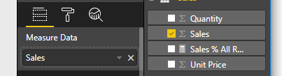

# <a name="tutorial-create-a-react-based-visual"></a>Esercitazione: Creare un oggetto visivo basato su React

Questa esercitazione illustra come creare un oggetto visivo di Power BI usando [React](https://reactjs.org/). L'oggetto visivo visualizza un valore racchiuso in un cerchio e include impostazioni e dimensioni adattive che consentono di personalizzarlo. Con le informazioni contenute in questo articolo è possibile creare oggetti visivi di Power BI personalizzati usando React.


In questa esercitazione viene illustrato come:

> [!div class="checklist"]
>
> * Configurazione dell'ambiente di sviluppo
> * Creare un oggetto visivo React
> * Configurare le funzionalità per l'oggetto visivo
> * Eseguire il rendering di dati da Power BI
> * Ridimensionare l'oggetto visivo
> * Rendere personalizzabile l'oggetto visivo

## <a name="prerequisites"></a>Prerequisiti

* Un **account di Power BI Pro**. [Iscriversi per una versione di valutazione gratuita](https://powerbi.microsoft.com/pricing/) prima di iniziare.
* [Visual Studio Code](https://www.visualstudio.com/).
* [Windows PowerShell](https://docs.microsoft.com/powershell/scripting/install/installing-windows-powershell?view=powershell-6) versione 4 o versioni successive per gli utenti di Windows o il [Terminale](https://macpaw.com/how-to/use-terminal-on-mac) per gli utenti OSX.
* Un ambiente come quello descritto in [Configurazione dell'ambiente di sviluppo](custom-visual-develop-tutorial.md#setting-up-the-developer-environment).

## <a name="getting-started"></a>Attività iniziali

Per iniziare, creare un oggetto visivo Power BI semplice usando `pbiviz`. Per altre informazioni sui progetti e sulla struttura del progetto, vedere [Struttura del progetto per un oggetto visivo di Power BI](visual-project-structure.md). Per il codice sorgente completo di questo oggetto visivo, vedere [Circle Card React Visual](https://github.com/Microsoft/powerbi-visuals-circlecard-react) (Oggetto visivo React Circle Card).

È possibile clonare o scaricare il codice sorgente completo dell'oggetto visivo da [GitHub](https://github.com/Microsoft/powerbi-visuals-circlecard-react).

1. Aprire PowerShell ed eseguire il comando seguente:

   ```powershell
   pbiviz new ReactCircleCard
   ```

   Il comando crea una cartella denominata *ReactCircleCard*.

1. Passare alla cartella e aprire Visual Studio Code.

   ```powershell
   cd ./ReactCircleCard
   code .
   ```

1. Avviare il server di sviluppo per l'oggetto visivo.

   ```powershell
   pbiviz start
   ```

   

Questo oggetto visivo di base rappresenta il numero di aggiornamenti. Nel passaggio successivo verrà trasformato in un oggetto denominato circle card (scheda circolare).

## <a name="change-the-visual-to-a-circle-card"></a>Convertire l'oggetto visivo in una circle card

Questo oggetto visivo di base rappresenta un conteggio di aggiornamenti. Ora lo si trasformerà in un oggetto circle card, che rappresenta una misura e il relativo titolo.

1. Eseguire il comando seguente per installare le dipendenze necessarie:

   ```powershell
   npm i react react-dom
   ```

1. Eseguire il comando seguente per installare React 16 e le versioni corrispondenti di `react-dom` e le tipizzazioni necessarie:

   ```powershell
   npm i @types/react @types/react-dom
   ```

1. Creare una classe componente di React. In Visual Studio Code selezionare **File** > **Nuovo file**. Copiare il seguente codice nel file.

    ```typescript
    import * as React from "react";

    export class ReactCircleCard extends React.Component<{}>{
        render(){
            return (
                <div className="circleCard">
                    Hello, React!
                </div>
            )
        }
    }

    export default ReactCircleCard;
    ```

1. Selezionare **Salva con nome**. Passare alla directory *src*. Immettere il nome *component*. In **Salva come** selezionare **TypeScript React**.

1. Aprire *src/visual.ts*. Sostituire il codice corrente con il codice seguente:

    ```typescript
    "use strict";
    import powerbi from "powerbi-visuals-api";

    import DataView = powerbi.DataView;
    import VisualConstructorOptions = powerbi.extensibility.visual.VisualConstructorOptions;
    import VisualUpdateOptions = powerbi.extensibility.visual.VisualUpdateOptions;
    import IVisual = powerbi.extensibility.visual.IVisual;

    import "./../style/visual.less";

    export class Visual implements IVisual {

        constructor(options: VisualConstructorOptions) {

        }

        public update(options: VisualUpdateOptions) {

        }
    }
    ```

1. Importare le dipendenze React e il componente appena aggiunto.

    ```typescript
    import * as React from "react";
    import * as ReactDOM from "react-dom";
    ...
    import ReactCircleCard from "./component";
    ```

   Le impostazioni predefinite TypeScript di Power BI non accettano i file con estensione *tsx* di React. Visual Studio Code evidenzia `component` come un errore.

1. Aprire il file *tsconfig.json* e aggiungere due righe all'inizio dell'elemento `compilerOptions`.

    ```json
    {
      "compilerOptions": {
        "jsx": "react",
        "types": ["react", "react-dom"],
        //...
      }
    }
    ```

   L'errore `component` non verrà più visualizzato.

   Per eseguire il rendering del componente, aggiungere l'elemento HTML di destinazione. Questo elemento è `HTMLElement` in `VisualConstructorOptions`, che viene passato al costruttore.

1. Modificare la classe `Visual` come nel codice seguente:

    ```typescript
      private target: HTMLElement;
      private reactRoot: React.ComponentElement<any, any>;

      constructor(options: VisualConstructorOptions) {
          this.reactRoot = React.createElement(ReactCircleCard, {});
          this.target = options.element;

          ReactDOM.render(this.reactRoot, this.target);
      }
    ```

1. Salvare le modifiche ed eseguire il codice esistente usando il comando seguente:

    ```bash
    pbiviz start
    ```

   > [!NOTE]
   > Se in precedenza è stato eseguito `pbiviz` è necessario riavviarlo per applicare le modifiche in *tsconfig.json*.

  

## <a name="configure-capabilities"></a>Configurare le funzionalità

È possibile configurare le funzionalità dell'oggetto visivo.

1. Aprire `capabilities.json`. Rimuovere l'oggetto `Category Data` da `dataRoles`. `ReactCircleCard` visualizza un solo valore, quindi è necessario solo `Measure Data`. La chiave `dataRoles` ora ha l'aspetto seguente:

    ```json
    "dataRoles": [
        {
            "displayName": "Measure Data",
            "name": "measure",
            "kind": "Measure"
        }
    ],
    ```

1. Rimuovere tutto il contenuto della chiave `objects`. Verrà compilato in un secondo momento.

    ```json
        "objects": {},
    ```

1. Copiare il codice seguente della proprietà `dataViewMappings`. Il valore `max: 1` indica che è possibile inviare una sola colonna di misura.

    ```json
        "dataViewMappings": [
            {
                "conditions": [
                    {
                        "measure": {
                            "max": 1
                        }
                    }
                ],
                "single": {
                    "role": "measure"
                }
            }
        ]
    ```

A questo punto è possibile importare i dati dal riquadro `Fields` alle impostazioni dell'oggetto visivo.



## <a name="receive-properties-from-power-bi"></a>Ricevere proprietà da Power BI

È possibile eseguire il rendering dei dati tramite React. Il componente può visualizzare i dati del proprio stato.

1. Modificare *src/component.tsx*.

    ```javascript
    export interface State {
        textLabel: string,
        textValue: string
    }

    export const initialState: State = {
        textLabel: "",
        textValue: ""
    }

    export class ReactCircleCard extends React.Component<{}, State>{
        constructor(props: any){
            super(props);
            this.state = initialState;
        }

        render(){
            const { textLabel, textValue } = this.state;

            return (
                <div className="circleCard">
                    <p>
                        {textLabel}
                        <br/>
                        <em>{textValue}</em>
                    </p>
                </div>
            )
        }
    }
    ```

1. Aggiungere stili per il nuovo markup modificando *styles/visual.less*.

    ```css
    .circleCard {
        position: relative;
        box-sizing: border-box;
        border: 1px solid #000;
        border-radius: 50%;
        width: 200px;
        height: 200px;
    }

    p {
        text-align: center;
        line-height: 30px;
        font-size: 20px;
        font-weight: bold;

        position: relative;
        top: -30px;
        margin: 50% 0 0 0;
    }
    ```

1. Gli oggetti visivi ricevono i dati correnti come argomento del metodo `update`. Aprire *src/visual.ts* e aggiungere il codice a `ReactCircleCard.update`.

    ```typescript
    //...
    import { ReactCircleCard, initialState } from "./component";
    //...

    export class Visual implements IVisual {
        //...
        public update(options: VisualUpdateOptions) {

            if(options.dataViews && options.dataViews[0]){
                const dataView: DataView = options.dataViews[0];

                ReactCircleCard.update({
                    textLabel: dataView.metadata.columns[0].displayName,
                    textValue: dataView.single.value.toString()
                });
            }
            } else {
                this.clear();
            }
        }

        private clear() {
            ReactCircleCard.update(initialState);
        }
    }
    ```

    Il codice seleziona `textLabel` e `textValue` da `DataView` e, se i dati esistono, aggiorna lo stato del componente.

1. Per inviare aggiornamenti all'istanza del componente, inserire il codice seguente nella classe `ReactCircleCard`:

    ```typescript
        private static updateCallback: (data: object) => void = null;

        public static update(newState: State) {
            if(typeof ReactCircleCard.updateCallback === 'function'){
                ReactCircleCard.updateCallback(newState);
            }
        }

        public state: State = initialState;

        public componentWillMount() {
            ReactCircleCard.updateCallback = (newState: State): void => { this.setState(newState); };
        }

        public componentWillUnmount() {
            ReactCircleCard.updateCallback = null;
        }
    ```

1. Eseguire il test dell'oggetto visivo. Assicurarsi che `pbiviz start` sia stata eseguita e salvare tutti i file. Aggiornare l'oggetto visivo.

   

## <a name="make-component-resizable"></a>Rendere il componente ridimensionabile

In questa sezione il componente viene reso ridimensionabile. Attualmente il componente ha una larghezza e un'altezza fisse.

Ottenere le dimensioni correnti del viewport dell'oggetto visivo dall'oggetto `options`.

1. Aprire *src/visual.ts*. Importare l'interfaccia `IViewport` e aggiungere la proprietà `viewport` alla classe `visual`.

    ```typescript
    import IViewport = powerbi.IViewport;

    //...

    export class Visual implements IVisual {
        private viewport: IViewport;
        //...
    }
    ```

1. Aggiungere il codice seguente al metodo `update` di `visual`.

    ```typescript
      if (options.dataViews && options.dataViews[0]) {
          const dataView: DataView = options.dataViews[0];

          this.viewport = options.viewport;
          const { width, height } = this.viewport;
          const size = Math.min(width, height);

          ReactCircleCard.update({
              size,
              //...
          });
      }
    ```

1. Aggiungere proprietà all'interfaccia `State` in *src/component.tsx*.

    ```typescript
    export interface State {
        //...
        size: number
    }

    const initialState: State = {
        //...
        size: 200
    }
    ```

1. Apportare le modifiche seguenti nel metodo `render` in *src/component.tsx*:

    ```typescript
        render() {
            const { textLabel, textValue, size } = this.state;

            const style: React.CSSProperties = { width: size, height: size };

            return (
                <div className="circleCard" style={style}>
                    {/* ... */}
                </div>
            )
        }
    ```

1. Sostituire le regole `width` e `height` in *style/visual.less* con `min-width` e `min-height`.

    ```css
        min-width: 200px;
        min-height: 200px;
    ```

A questo punto è possibile ridimensionare il viewport. Il diametro del cerchio corrisponde alla dimensione minima come larghezza o altezza.

## <a name="make-your-power-bi-visual-customizable"></a>Rendere personalizzabile l'oggetto visivo di Power BI

In questa sezione l'oggetto visivo viene reso personalizzabile.

1. Aprire *capabilities.json*. Aggiungere le impostazioni seguenti alla proprietà `objects`.

    ```json
    //...
        "objects": {
            "circle": {
                "displayName": "Circle",
                "properties": {
                    "circleColor": {
                        "displayName": "Color",
                        "description": "The fill color of the circle.",
                        "type": {
                            "fill": {
                                "solid": {
                                    "color": true
                                }
                            }
                        }
                    },
                    "circleThickness": {
                        "displayName": "Thickness",
                        "description": "The circle thickness.",
                        "type": {
                            "numeric": true
                        }
                    }
                }
            }
        },
    //...
    ```

1. Sostituire il codice esistente in *src/settings.ts* con il codice seguente:

    ```typescript
    "use strict";

    import { dataViewObjectsParser } from "powerbi-visuals-utils-dataviewutils";
    import DataViewObjectsParser = dataViewObjectsParser.DataViewObjectsParser;

    export class CircleSettings {
        public circleColor: string = "white";
        public circleThickness: number = 2;
    }

    export class VisualSettings extends DataViewObjectsParser {
        public circle: CircleSettings = new CircleSettings();
    }
    ```

1. Aggiungere queste istruzioni `import` nella parte superiore di *src/visual.ts*:

    ```typescript
    import VisualObjectInstance = powerbi.VisualObjectInstance;
    import EnumerateVisualObjectInstancesOptions = powerbi.EnumerateVisualObjectInstancesOptions;
    import VisualObjectInstanceEnumerationObject = powerbi.VisualObjectInstanceEnumerationObject;

    import { VisualSettings } from "./settings";

    ```

1. Aggiungere il metodo `enumerateObjectInstances` a *src/visual.ts*. Questo metodo viene usato per applicare le impostazioni dell'oggetto visivo.

    ```typescript
    export class Visual implements IVisual {
        private settings: VisualSettings;

        //...

        public enumerateObjectInstances(
            options: EnumerateVisualObjectInstancesOptions
        ): VisualObjectInstance[] | VisualObjectInstanceEnumerationObject {

            return VisualSettings.enumerateObjectInstances(this.settings || VisualSettings.getDefault(), options);
        }
    }
    ```

1. Aggiungere il codice in modo che l'oggetto `dataView` ora possa ricevere le impostazioni.

    ```typescript
        public update(options: VisualUpdateOptions) {

            if(options.dataViews && options.dataViews[0]){
                //...
                this.settings = VisualSettings.parse(dataView) as VisualSettings;
                const object = this.settings.circle;

                ReactCircleCard.update({
                    borderWidth: object && object.circleThickness ? object.circleThickness : undefined,
                    background: object && object.circleColor ? object.circleColor : undefined,
                    //...
                });
            }
        }
    }
    ```

1. Applicare le modifiche corrispondenti a *src/component.tsx*. Per iniziare, aggiungere questi valori a `State`:

    ```typescript
    export interface State {
        //...
        background?: string,
        borderWidth?: number
    }
    ```

1. Quindi aggiungere il codice seguente al metodo `render`:

    ```typescript
        const { /*...*/ background, borderWidth } = this.state;

        const style: React.CSSProperties = { /*...*/ background, borderWidth };
    ```

    

## <a name="next-steps"></a>Passaggi successivi

Per altre informazioni sullo sviluppo di Power BI, vedere [Linee guida per gli oggetti visivi di Power BI](guidelines-powerbi-visuals.md) e [Oggetti visivi in Power BI](power-bi-visuals-concept.md).