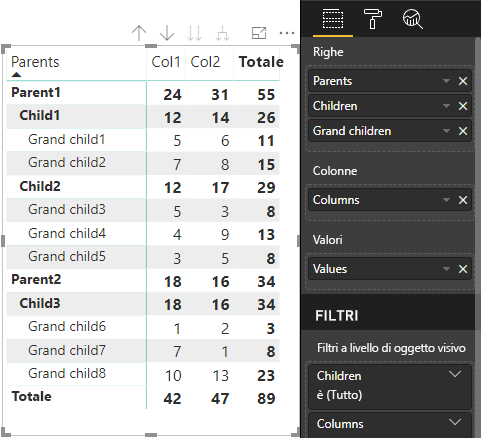

# <a name="data-view-mappings-in-power-bi-visuals"></a>Mapping di viste dati in oggetti visivi di Power BI

Un oggetto `dataViewMappings` descrive il modo in cui i ruoli dati sono correlati tra loro e permette di specificare i requisiti condizionali per i ruoli.
È disponibile una sezione per ogni `dataMappings`.

Ogni mapping valido produrrà un oggetto `DataView`, ma attualmente è supportata l'esecuzione di una sola query per ogni oggetto visivo e di conseguenza nella maggior parte dei casi si ottiene solo un oggetto `DataView`. Tuttavia, è possibile fornire più mapping dei dati con condizioni diverse, che consentono

```json
"dataViewMappings": [
    {
        "conditions": [ ... ],
        "categorical": { ... },
        "single": { ... },
        "table": { ... },
        "matrix": { ... }
    }
]
```

> [!NOTE]
> È importante tenere presente che Power BI crea un mapping a un oggetto DataView solo se il mapping valido viene specificato in `dataViewMappings`.

In altre parole, se in `dataViewMappings` è definito `categorical`, ma altri mapping come `table`, `single` e così via no, come nell'esempio seguente:
```json
"dataViewMappings": [
    {
        "categorical": { ... }
    }
]
```

Power BI produrrà un oggetto `DataView` con un unico mapping `categorical` (`table` e gli altri mapping saranno `undefined`):
```javascript
{
    "categorical": {
        "categories": [ ... ],
        "values": [ ... ]
    },
    "metadata": { ... }
}
```

## <a name="conditions"></a>conditions

Descrive le condizioni per un determinato mapping dei dati. È possibile specificare più set di condizioni per fare in modo che, se i dati corrispondono a uno dei set di condizioni descritti, l'oggetto visivo accetterà i dati come validi.

Attualmente, per ogni campo è possibile specificare un valore minimo e uno massimo. Questi valori rappresentano il numero di campi che possono essere associati al ruolo dati. 

> [!NOTE]
> Se un ruolo dati viene omesso nella condizione, può essere presente un numero qualsiasi di campi.

### <a name="example-1"></a>Esempio 1

È possibile trascinare più campi in ogni ruolo dati. In questo esempio la categoria è limitata a un solo campo dati, la misura a due campi dati.

```json
"conditions": [
    { "category": { "max": 1 }, "y": { "max": 2 } },
]
```

### <a name="example-2"></a>Esempio 2

In questo esempio è necessario specificare una tra due condizioni. Esattamente un campo dati categoria e due campi dati misura oppure esattamente due categorie e una misura.

```json
"conditions": [
    { "category": { "min": 1, "max": 1 }, "measure": { "min": 2, "max": 2 } },
    { "category": { "min": 2, "max": 2 }, "measure": { "min": 1, "max": 1 } }
]
```

## <a name="single-data-mapping"></a>Mapping dei dati singolo

Il mapping dei dati singolo è la forma più semplice di mapping dei dati. Accetta un solo campo misura e fornisce il totale. Se il campo è numerico, restituisce la somma. In caso contrario, restituisce un conteggio di valori univoci.

Per usare il mapping dei dati singolo, è necessario definire il nome del ruolo dati di cui si vuole eseguire il mapping. Questo mapping funzionerà solo con un solo campo misura. Se viene assegnato un secondo campo, non verrà generata alcuna vista dati. Di conseguenza, è consigliabile includere anche una condizione che limita i dati a un singolo campo.

> [!NOTE]
> Questo mapping dei dati non può essere usato insieme ad altri mapping dei dati. Ha lo scopo di ridurre i dati in un singolo valore numerico.

### <a name="example-3"></a>Esempio 3

```json
"dataViewMappings": {
    "conditions": [
        { "Y": { "max": 1 } }
    ],
    "single": {
        "role": "Y"
    }
}  
```

La vista dati risultante conterrà comunque gli altri tipi (tabella, categoria e così via), ma ogni mapping conterrà solo il valore singolo. La procedura consigliata consiste nell'accedere al valore in modalità singola.

```JSON
{
    "dataView": [
        {
            "metadata": null,
            "categorical": null,
            "matrix": null,
            "table": null,
            "tree": null,
            "single": {
                "value": 94163140.3560001
            }
        }
    ]
}
```

## <a name="categorical-data-mapping"></a>Mapping dei dati categorico

Il mapping dei dati categorico viene usato per ottenere uno o due raggruppamenti indipendenti di dati.

### <a name="example-4"></a>Esempio 4

Ecco la definizione dall'esempio precedente su DataRoles.

```json
"dataRole":[
    {
        "displayName": "Category",
        "name": "category",
        "kind": "Grouping"
    },
    {
        "displayName": "Y Axis",
        "name": "measure",
        "kind": "Measure"
    }
]
```

Per il mapping:

```json
"dataViewMappings": {
    "categorical": {
        "categories": {
            "for": { "in": "category" }
        },
        "values": {
            "select": [
                { "bind": { "to": "measure" } }
            ]
        }
    }
}
```

Si tratta di un semplice esempio che indica di eseguire il mapping del ruolo dati `category` in modo che per ogni campo trascinato in `category` venga eseguito il mapping a `categorical.categories`. Indica anche di eseguire anche il mapping del ruolo dati `measure` a `categorical.values`.

* **for...in**: include tutti gli elementi in questo ruolo dati nella query dati.
* **bind...to**: genera lo stesso risultato di for...in, ma prevede che DataRole sia associato a una condizione che lo limita a un singolo campo.

### <a name="example-5"></a>Esempio 5

In questo esempio verranno usati i primi due oggetti DataRole dell'esempio precedente, definendo inoltre `grouping` e `measure2`.

```json
"dataRole":[
    {
        "displayName": "Category",
        "name": "category",
        "kind": "Grouping"
    },
    {
        "displayName": "Y Axis",
        "name": "measure",
        "kind": "Measure"
    },
    {
        "displayName": "Grouping with",
        "name": "grouping",
        "kind": "Grouping"
    },
    {
        "displayName": "X Axis",
        "name": "measure2",
        "kind": "Grouping"
    }
]
```

Per il mapping:

```json
"dataViewMappings":{
    "categorical": {
        "categories": {
            "for": { "in": "category" }
        },
        "values": {
            "group": {
                "by": "grouping",
                "select":[
                    { "bind": { "to": "measure" } },
                    { "bind": { "to": "measure2" } }
                ]
            }
        }
    }
}
```

Qui la differenza consiste nel modo in cui viene eseguito il mapping di categorical.values. È come specificare di eseguire il mapping dei ruoli dati `measure` e `measure2` da raggruppare in base al ruolo dati `grouping`.

### <a name="example-6"></a>Esempio 6

Ecco gli oggetti dataRole.

```json
"dataRoles": [
    {
        "displayName": "Categories",
        "name": "category",
        "kind": "Grouping"
    },
    {
        "displayName": "Measures",
        "name": "measure",
        "kind": "Measure"
    },
    {
        "displayName": "Series",
        "name": "series",
        "kind": "Measure"
    }
]
```

Ecco l'oggetto dataViewMapping.

```json
"dataViewMappings": [
    {
        "categorical": {
            "categories": {
                "for": {
                    "in": "category"
                }
            },
            "values": {
                "group": {
                    "by": "series",
                    "select": [{
                            "for": {
                                "in": "measure"
                            }
                        }
                    ]
                }
            }
        }
    }
]
```

L'oggetto `dataview` categorico potrebbe essere visualizzato in questo modo.

| Categorical |  |  | | | |
|-----|-----|------|------|------|------|
| | Anno | 2013 | 2014 | 2015 | 2016 |
| Paese | | |
| USA | | x | x | 125 | 100 |
| Canada | | x | 50 | 200 | x |
| Messico | | 300 | x | x | x |
| Regno Unito | | x | x | 75 | x |

Power BI lo produrrà come vista dati categorica. Si tratta del set di categorie.

```JSON
{
    "categorical": {
        "categories": [
            {
                "source": {...},
                "values": [
                    "Canada",
                    "Mexico",
                    "UK",
                    "USA"
                ],
                "identity": [...],
                "identityFields": [...],
            }
        ]
    }
}
```

Ogni categoria viene mappata anche a un set di valori. Ognuno di questi valori è raggruppato per serie, ovvero years.

Ad esempio, le vendite in Canada nel 2013 sono null, mentre quelle nel 2014 sono pari a 50.

```JSON
{
    "values": [
        {
            "source": {...},
            "values": [
                null,
                300,
                null,
                null
            ],
            "identity": [...],
        },
        {
            "source": {...},
            "values": [
                50,
                null,
                150,
                null
            ],
            "identity": [...],
        },
        {
            "source": {...},
            "values": [
                200,
                null,
                null,
                125
            ],
            "identity": [...],
        },
        {
            "source": {...},
            "values": [
                null,
                null,
                null,
                100
            ],
            "identity": [...],
        }
    ]
}
```

## <a name="table-data-mapping"></a>Mapping di dati tabella

La vista dati tabella è un semplice mapping dei dati. Si tratta essenzialmente di un elenco di punti dati, in cui è possibile aggregare punti dati numerici.

### <a name="example-7"></a>Esempio 7

Con le funzionalità specificate:

```json
"dataRoles": [
    {
        "displayName": "Values",
        "name": "values",
        "kind": "Measure"
    }
]
```

```json
"dataViewMappings": [
    {
        "table": {
            "rows": {
                "for": {
                    "in": "values"
                }
            }
        }
    }
]
```

L'oggetto `dataview` tabella può essere visualizzato in questo modo.  

| Paese| Anno | Sales |
|-----|-----|------|
| USA | 2016 | 100 |
| USA | 2015 | 50 |
| Canada | 2015 | 200 |
| Canada | 2015 | 50 |
| Messico | 2013 | 300 |
| Regno Unito | 2014 | 150 |
| USA | 2015 | 75 |

Power BI lo produrrà come vista dati tabella. Non presupporre che esista un ordine.

```JSON
{
    "table" : {
        "columns": [...],
        "rows": [
            [
                "Canada",
                2014,
                50
            ],
            [
                "Canada",
                2015,
                200
            ],
            [
                "Mexico",
                2013,
                300
            ],
            [
                "UK",
                2014,
                150
            ],
            [
                "USA",
                2015,
                100
            ],
            [
                "USA",
                2015,
                75
            ],
            [
                "USA",
                2016,
                100
            ]
        ]
    }
}
```

I dati possono essere aggregati selezionando il campo desiderato e facendo clic su Somma.  


## <a name="matrix-data-mapping"></a>Mapping di dati matrice

Il mapping di dati matrice è simile al mapping di dati tabella, ma le righe vengono presentate in modo gerarchico. Uno dei valori `dataRole` può essere usato come valore di intestazione di colonna.

```json
{
    "dataRoles": [
        {
            "name": "Category",
            "displayName": "Category",
            "displayNameKey": "Visual_Category",
            "kind": "Grouping"
        },
        {
            "name": "Column",
            "displayName": "Column",
            "displayNameKey": "Visual_Column",
            "kind": "Grouping"
        },
        {
            "name": "Measure",
            "displayName": "Measure",
            "displayNameKey": "Visual_Values",
            "kind": "Measure"
        }
    ],
    "dataViewMappings": [
        {
            "matrix": {
                "rows": {
                    "for": {
                        "in": "Category"
                    }
                },
                "columns": {
                    "for": {
                        "in": "Column"
                    }
                },
                "values": {
                    "select": [
                        {
                            "for": {
                                "in": "Measure"
                            }
                        }
                    ]
                }
            }
        }
    ]
}
```

Power BI crea la struttura dei dati gerarchici. La radice dell'albero include i dati della prima colonna del ruolo dati `Category` con elementi figlio della seconda colonna del ruolo dati.

Set di dati:

| Parents | Children | Grand children | Colonne | Valori |
|-----|-----|------|-------|-------|
| Parent1 | Child1 | Grand child1 | Col1 | 5 |
| Parent1 | Child1 | Grand child1 | Col2 | 6 |
| Parent1 | Child1 | Grand child2 | Col1 | 7 |
| Parent1 | Child1 | Grand child2 | Col2 | 8 |
| Parent1 | Child2 | Grand child3 | Col1 | 5 |
| Parent1 | Child2 | Grand child3 | Col2 | 3 |
| Parent1 | Child2 | Grand child4 | Col1 | 4 |
| Parent1 | Child2 | Grand child4 | Col2 | 9 |
| Parent1 | Child2 | Grand child5 | Col1 | 3 |
| Parent1 | Child2 | Grand child5 | Col2 | 5 |
| Parent2 | Child3 | Grand child6 | Col1 | 1 |
| Parent2 | Child3 | Grand child6 | Col2 | 2 |
| Parent2 | Child3 | Grand child7 | Col1 | 7 |
| Parent2 | Child3 | Grand child7 | Col2 | 1 |
| Parent2 | Child3 | Grand child8 | Col1 | 10 |
| Parent2 | Child3 | Grand child8 | Col2 | 13 |

L'oggetto visivo matrice di base di Power BI ne esegue il rendering come tabella.



L'oggetto visivo ottiene la struttura dei dati come descritto di seguito (vengono presentate solo le prime due righe):

```json
{
    "metadata": {...},
    "matrix": {
        "rows": {
            "levels": [...],
            "root": {
                "childIdentityFields": [...],
                "children": [
                    {
                        "level": 0,
                        "levelValues": [...],
                        "value": "Parent1",
                        "identity": {...},
                        "childIdentityFields": [...],
                        "children": [
                            {
                                "level": 1,
                                "levelValues": [...],
                                "value": "Child1",
                                "identity": {...},
                                "childIdentityFields": [...],
                                "children": [
                                    {
                                        "level": 2,
                                        "levelValues": [...],
                                        "value": "Grand child1",
                                        "identity": {...},
                                        "values": {
                                            "0": {
                                                "value": 5 // value for Col1
                                            },
                                            "1": {
                                                "value": 6 // value for Col2
                                            }
                                        }
                                    },
                                    ...
                                ]
                            },
                            ...
                        ]
                    },
                    ...
                ]
            }
        },
        "columns": {
            "levels": [...],
            "root": {
                "childIdentityFields": [...],
                "children": [
                    {
                        "level": 0,
                        "levelValues": [...],
                        "value": "Col1",
                        "identity": {...}
                    },
                    {
                        "level": 0,
                        "levelValues": [...],
                        "value": "Col2",
                        "identity": {...}
                    },
                    ...
                ]
            }
        },
        "valueSources": [...]
    }
}
```

## <a name="data-reduction-algorithm"></a>Algoritmo di riduzione dei dati

È possibile applicare un oggetto `DataReductionAlgorithm` se si vuole controllare la quantità di dati ricevuti nell'oggetto DataView.

Per impostazione predefinita, a tutti gli oggetti visivi personalizzati è applicato l'oggetto DataReductionAlgorithm superiore con "count" impostato su 1000 DataPoint. Questo equivale a impostare le proprietà seguenti nel file capabilities.json:

```json
"dataReductionAlgorithm": {
    "top": {
        "count": 1000
    }
}
```

È possibile modificare il valore "count" con qualsiasi valore intero fino a 30.000. Gli oggetti visivi personalizzati basati su R possono supportare fino a 150.000 righe.

## <a name="data-reduction-algorithm-types"></a>Tipi di algoritmo di riduzione dei dati

Sono disponibili quattro tipi di impostazioni `DataReductionAlgorithm`:

* `top`: se si vuole limitare i dati ai valori acquisiti dalla parte superiore del set di dati. Dal set di dati vengono acquisiti i primi valori "count" superiori.
* `bottom`: se si vuole limitare i dati ai valori acquisiti dalla parte inferiore del set di dati. Dal set di dati vengono acquisiti gli ultimi valori "count".
* `sample`: riduce il set di dati in base a un semplice algoritmo di campionamento limitato a un numero "count" di elementi. Significa che vengono inclusi il primo e l'ultimo elemento, insieme a un numero "count" di elementi con intervalli uguali tra loro.
Ad esempio, con un set di dati [0, 1, 2,... 100] e `count: 9`, si riceveranno i valori [0, 10, 20... 100]
* `window`: carica una "finestra" di punti dati per volta contenente elementi "count". Attualmente `top` e `window` sono equivalenti. A breve sarà disponibile il supporto completo per un'impostazione di definizione delle finestre.

## <a name="data-reduction-algorithm-usage"></a>Utilizzo dell'algoritmo di riduzione dei dati

`DataReductionAlgorithm` può essere usato in mapping di oggetti `dataview` categorici, tabella o matrice.

Può essere impostato in `categories` e/o nella sezione di gruppo `values` per il mapping dei dati categorico.

### <a name="example-8"></a>Esempio 8

```json
"dataViewMappings": {
    "categorical": {
        "categories": {
            "for": { "in": "category" },
            "dataReductionAlgorithm": {
                "window": {
                    "count": 300
                }
            }  
        },
        "values": {
            "group": {
                "by": "series",
                "select": [{
                        "for": {
                            "in": "measure"
                        }
                    }
                ],
                "dataReductionAlgorithm": {
                    "top": {
                        "count": 100
                    }
                }  
            }
        }
    }
}
```

L'algoritmo di riduzione dei dati può essere applicato alla sezione `rows` del mapping di oggetti `dataview` tabella.

### <a name="example-9"></a>Esempio 9

```json
"dataViewMappings": [
    {
        "table": {
            "rows": {
                "for": {
                    "in": "values"
                },
                "dataReductionAlgorithm": {
                    "top": {
                        "count": 2000
                    }
                } 
            }
        }
    }
]
```

L'algoritmo di riduzione dei dati può essere applicato alle sezioni `rows` e/o `columns` del mapping di oggetti `dataview` `matrix`.
