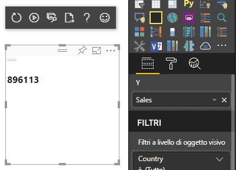
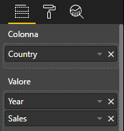
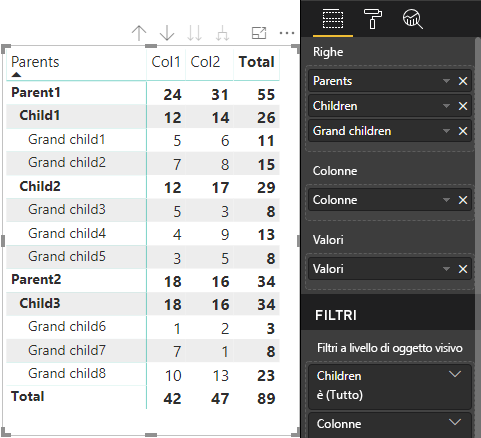

# <a name="understand-data-view-mapping-in-power-bi-visuals"></a>Informazioni sul mapping di viste dati in oggetti visivi di Power BI

Questo articolo illustra il mapping di viste dati e descrive il modo in cui i ruoli dati sono correlati tra loro e consentono di specificare i requisiti condizionali per i ruoli. Viene inoltre descritto ogni tipo `dataMappings`.

Ogni mapping valido produce una vista dati, ma attualmente è supportata l'esecuzione di una sola query per ogni oggetto visivo. Normalmente si ottiene una sola vista dati. Tuttavia, è possibile fornire più mapping dei dati in determinate condizioni, che consentono:

```json
"dataViewMappings": [
    {
        "conditions": [ ... ],
        "categorical": { ... },
        "single": { ... },
        "table": { ... },
        "matrix": { ... }
    }
]
```

Power BI crea un mapping a una vista dati solo se il mapping valido viene specificato in `dataViewMappings`.

In altre parole, `categorical` potrebbe essere definito in `dataViewMappings`, ma altri mapping, come `table` o `single`, potrebbero non esserlo. Ad esempio:

```json
"dataViewMappings": [
    {
        "categorical": { ... }
    }
]
```

Power BI produce una vista dati con un unico mapping `categorical`, mentre `table` e gli altri mapping non sono definiti:

```javascript
{
    "categorical": {
        "categories": [ ... ],
        "values": [ ... ]
    },
    "metadata": { ... }
}
```

## <a name="conditions"></a>Condizioni

Questa sezione descrive le condizioni per un determinato mapping dei dati. È possibile specificare più set di condizioni per fare in modo che, se i dati corrispondono a uno dei set di condizioni descritti, l'oggetto visivo accetti i dati come validi.

Attualmente, per ogni campo è possibile specificare un valore minimo e uno massimo. Il valore rappresenta il numero di campi che possono essere associati al ruolo dati. 

> [!NOTE]
> Se un ruolo dati viene omesso nella condizione, può essere presente un numero qualsiasi di campi.

### <a name="example-1"></a>Esempio 1

È possibile trascinare più campi in ogni ruolo dati. In questo esempio la categoria è limitata a un solo campo dati, la misura a due campi dati.

```json
"conditions": [
    { "category": { "max": 1 }, "y": { "max": 2 } },
]
```

### <a name="example-2"></a>Esempio 2

In questo esempio è necessario specificare una tra due condizioni:
* Esattamente un campo dati categoria e due misure
* Esattamente due categorie e una misura.

```json
"conditions": [
    { "category": { "min": 1, "max": 1 }, "measure": { "min": 2, "max": 2 } },
    { "category": { "min": 2, "max": 2 }, "measure": { "min": 1, "max": 1 } }
]
```

## <a name="single-data-mapping"></a>Mapping dei dati singolo

Il mapping dei dati singolo è la forma più semplice di mapping dei dati. Accetta un solo campo misura e fornisce il totale. Se il campo è numerico, restituisce la somma. In caso contrario, restituisce un conteggio di valori univoci.

Per usare il mapping dei dati singolo, è necessario definire il nome del ruolo dati di cui si vuole eseguire il mapping. Questo mapping funziona solo con un solo campo misura. Se si assegna un secondo campo, non viene generata alcuna vista dati. Di conseguenza, è consigliabile includere anche una condizione che limita i dati a un singolo campo.

> [!NOTE]
> Questo mapping dei dati non può essere usato insieme ad altri mapping dei dati. Ha lo scopo di ridurre i dati in un singolo valore numerico.

### <a name="example-3"></a>Esempio 3

```json
{
    "dataRoles": [
        {
            "displayName": "Y",
            "name": "Y",
            "kind": "Measure"
        }
    ],
    "dataViewMappings": [
        {
            "conditions": [
                {
                    "Y": {
                        "max": 1
                    }
                }
            ],
            "single": {
                "role": "Y"
            }
        }
    ]
}
```

La vista dati risultante contiene comunque gli altri tipi (tabella, categoria e così via), ma ogni mapping contiene solo il valore singolo. La procedura consigliata consiste nell'accedere al valore solo in modalità singola.

```JSON
{
    "dataView": [
        {
            "metadata": null,
            "categorical": null,
            "matrix": null,
            "table": null,
            "tree": null,
            "single": {
                "value": 94163140.3560001
            }
        }
    ]
}
```

Esempio di codice per elaborare il mapping di vista dati semplice

```typescript
"use strict";
import powerbi from "powerbi-visuals-api";
import DataView = powerbi.DataView;
import DataViewSingle = powerbi.DataViewSingle;
// standart imports
// ...

export class Visual implements IVisual {
    private target: HTMLElement;
    private host: IVisualHost;
    private valueText: HTMLParagraphElement;

    constructor(options: VisualConstructorOptions) {
        // constructor body
        this.target = options.element;
        this.host = options.host;
        this.valueText = document.createElement("p");
        this.target.appendChild(this.valueText);
        // ...
    }

    public update(options: VisualUpdateOptions) {
        const dataView: DataView = options.dataViews[0];
        const singleDataView: DataViewSingle = dataView.single;

        if (!singleDataView ||
            !singleDataView.value ) {
            return
        }

        this.valueText.innerText = singleDataView.value.toString();
    }
}
```

Di conseguenza, l'oggetto visivo mostra un valore singolo da Power BI:



## <a name="categorical-data-mapping"></a>Mapping dei dati categorico

Il mapping dei dati categorico viene usato per ottenere uno o due raggruppamenti indipendenti di dati.

### <a name="example-4"></a>Esempio 4

Ecco la definizione dall'esempio precedente per i ruoli dati:

```json
"dataRole":[
    {
        "displayName": "Category",
        "name": "category",
        "kind": "Grouping"
    },
    {
        "displayName": "Y Axis",
        "name": "measure",
        "kind": "Measure"
    }
]
```

Ecco il mapping:

```json
"dataViewMappings": {
    "categorical": {
        "categories": {
            "for": { "in": "category" }
        },
        "values": {
            "select": [
                { "bind": { "to": "measure" } }
            ]
        }
    }
}
```

Si tratta di un semplice esempio. Indica di eseguire il mapping del ruolo dati `category` in modo che per ogni campo trascinato in `category` venga eseguito il mapping a `categorical.categories`. Indica anche di eseguire anche il mapping del ruolo dati `measure` a `categorical.values`.

* **for...in**: include tutti gli elementi in questo ruolo dati nella query dati.
* **bind...to**: genera lo stesso risultato di *for...in*, ma prevede che il ruolo dati sia associato a una condizione che lo limita a un singolo campo.

### <a name="example-5"></a>Esempio 5

In questo esempio vengono usati i primi due ruoli dati dell'esempio precedente e vengono inoltre definiti `grouping` e `measure2`.

```json
"dataRole":[
    {
        "displayName": "Category",
        "name": "category",
        "kind": "Grouping"
    },
    {
        "displayName": "Y Axis",
        "name": "measure",
        "kind": "Measure"
    },
    {
        "displayName": "Grouping with",
        "name": "grouping",
        "kind": "Grouping"
    },
    {
        "displayName": "X Axis",
        "name": "measure2",
        "kind": "Grouping"
    }
]
```

Ecco il mapping:

```json
"dataViewMappings":{
    "categorical": {
        "categories": {
            "for": { "in": "category" }
        },
        "values": {
            "group": {
                "by": "grouping",
                "select":[
                    { "bind": { "to": "measure" } },
                    { "bind": { "to": "measure2" } }
                ]
            }
        }
    }
}
```

Qui la differenza consiste nel modo in cui viene eseguito il mapping di categorical.values. È come specificare di eseguire il mapping dei ruoli dati `measure` e `measure2`, da raggruppare in base al ruolo dati `grouping`.

### <a name="example-6"></a>Esempio 6

Ecco i ruoli dati:

```json
"dataRoles": [
    {
        "displayName": "Categories",
        "name": "category",
        "kind": "Grouping"
    },
    {
        "displayName": "Measures",
        "name": "measure",
        "kind": "Measure"
    },
    {
        "displayName": "Series",
        "name": "series",
        "kind": "Measure"
    }
]
```

Ecco il mapping della vista dati:

```json
"dataViewMappings": [
    {
        "categorical": {
            "categories": {
                "for": {
                    "in": "category"
                }
            },
            "values": {
                "group": {
                    "by": "series",
                    "select": [{
                            "for": {
                                "in": "measure"
                            }
                        }
                    ]
                }
            }
        }
    }
]
```

La vista dati categorica potrebbe essere visualizzata in questo modo:

| Categorical |  |  | | | |
|-----|-----|------|------|------|------|
| | Year | 2013 | 2014 | 2015 | 2016 |
| Country | | |
| USA | | x | x | 650 | 350 |
| Canada | | x | 630 | 490 | x |
| Messico | | 645 | x | x | x |
| Regno Unito | | x | x | 831 | x |

Power BI lo produce come vista dati categorica. Si tratta del set di categorie.

```JSON
{
    "categorical": {
        "categories": [
            {
                "source": {...},
                "values": [
                    "Canada",
                    "USA",
                    "UK",
                    "Mexico"
                ],
                "identity": [...],
                "identityFields": [...],
            }
        ]
    }
}
```

Ogni categoria viene mappata anche a un set di valori. Ognuno di questi valori è raggruppato per serie, espresse in anni.

Ogni matrice di `values` rappresenta ad esempio i dati per ogni anno.
Ogni matrice di `values` ha anche 4 valori, rispettivamente per Canada, Stati Uniti, Regno Unito e Messico:

```JSON
{
    "values": [
        // Values for 2013 year
        {
            "source": {...},
            "values": [
                null, // Value for `Canada` category
                null, // Value for `USA` category
                null, // Value for `UK` category
                645 // Value for `Mexico` category
            ],
            "identity": [...],
        },
        // Values for 2014 year
        {
            "source": {...},
            "values": [
                630, // Value for `Canada` category
                null, // Value for `USA` category
                null, // Value for `UK` category
                null // Value for `Mexico` category
            ],
            "identity": [...],
        },
        // Values for 2015 year
        {
            "source": {...},
            "values": [
                490, // Value for `Canada` category
                650, // Value for `USA` category
                831, // Value for `UK` category
                null // Value for `Mexico` category
            ],
            "identity": [...],
        },
        // Values for 2016 year
        {
            "source": {...},
            "values": [
                null, // Value for `Canada` category
                350, // Value for `USA` category
                null, // Value for `UK` category
                null // Value for `Mexico` category
            ],
            "identity": [...],
        }
    ]
}
```

Di seguito viene descritto un esempio di codice per l'elaborazione del mapping di vista dati categorico. L'esempio crea la struttura gerarchica `Country => Year => Value`

```typescript
"use strict";
import powerbi from "powerbi-visuals-api";
import DataView = powerbi.DataView;
import DataViewDataViewCategoricalSingle = powerbi.DataViewCategorical;
import DataViewValueColumnGroup = powerbi.DataViewValueColumnGroup;
import PrimitiveValue = powerbi.PrimitiveValue;
// standart imports
// ...

export class Visual implements IVisual {
    private target: HTMLElement;
    private host: IVisualHost;
    private categories: HTMLElement;

    constructor(options: VisualConstructorOptions) {
        // constructor body
        this.target = options.element;
        this.host = options.host;
        this.categories = document.createElement("pre");
        this.target.appendChild(this.categories);
        // ...
    }

    public update(options: VisualUpdateOptions) {
        const dataView: DataView = options.dataViews[0];
        const categoricalDataView: DataViewCategorical = dataView.categorical;

        if (!categoricalDataView ||
            !categoricalDataView.categories ||
            !categoricalDataView.categories[0] ||
            !categoricalDataView.values) {
            return;
        }

        // Categories have only one column in data buckets
        // If you want to support several columns of categories data bucket, you should iterate categoricalDataView.categories array.
        const categoryFieldIndex = 0;
        // Measure has only one column in data buckets.
        // If you want to support several columns on data bucket, you should iterate years.values array in map function
        const measureFieldIndex = 0;
        let categories: PrimitiveValue[] = categoricalDataView.categories[categoryFieldIndex].values;
        let values: DataViewValueColumnGroup[] = categoricalDataView.values.grouped();

        let data = {};
        // iterate categories/countries
        categories.map((category: PrimitiveValue, categoryIndex: number) => {
            data[category.toString()] = {};
            // iterate series/years
            values.map((years: DataViewValueColumnGroup) => {
                if (!data[category.toString()][years.name] && years.values[measureFieldIndex].values[categoryIndex]) {
                    data[category.toString()][years.name] = []
                }
                if (years.values[0].values[categoryIndex]) {
                    data[category.toString()][years.name].push(years.values[measureFieldIndex].values[categoryIndex]);
                }
            });
        });

        this.categories.innerText = JSON.stringify(data, null, 6);
        console.log(data);
    }
}
```

Risultato dell'oggetto visivo:


## <a name="table-data-mapping"></a>Mapping di dati tabella

La vista dati tabella è un semplice mapping dei dati. Si tratta essenzialmente di un elenco di punti dati, in cui è possibile aggregare punti dati numerici.

### <a name="example-7"></a>Esempio 7

Con le funzionalità specificate:

```json
"dataRoles": [
    {
        "displayName": "Column",
        "name": "column",
        "kind": "Grouping"
    },
    {
        "displayName": "Value",
        "name": "value",
        "kind": "Measure"
    }
]
```

```json
"dataViewMappings": [
    {
        "table": {
            "rows": {
                "select": [
                    {
                        "for": {
                            "in": "column"
                        }
                    },
                    {
                        "for": {
                            "in": "value"
                        }
                    }
                ]
            }
        }
    }
]
```

È possibile visualizzare la vista dati tabella come segue:  

Esempio di dati:

| Country| Year | Sales |
|-----|-----|------|
| USA | 2016 | 100 |
| USA | 2015 | 50 |
| Canada | 2015 | 200 |
| Canada | 2015 | 50 |
| Messico | 2013 | 300 |
| Regno Unito | 2014 | 150 |
| USA | 2015 | 75 |

Associazione dati:



Power BI visualizza i dati come vista dati tabella. I dati non sono necessariamente ordinati.

```JSON
{
    "table" : {
        "columns": [...],
        "rows": [
            [
                "Canada",
                2014,
                630
            ],
            [
                "Canada",
                2015,
                490
            ],
            [
                "Mexico",
                2013,
                645
            ],
            [
                "UK",
                2014,
                831
            ],
            [
                "USA",
                2015,
                650
            ],
            [
                "USA",
                2016,
                350
            ]
        ]
    }
}
```

È possibile aggregare i dati selezionando il campo desiderato e quindi selezionando Somma.  


Esempio di codice per elaborare il mapping della vista dati tabella.

```typescript
"use strict";
import "./../style/visual.less";
import powerbi from "powerbi-visuals-api";
// ...
import DataViewMetadataColumn = powerbi.DataViewMetadataColumn;
import DataViewTable = powerbi.DataViewTable;
import DataViewTableRow = powerbi.DataViewTableRow;
import PrimitiveValue = powerbi.PrimitiveValue;
// other imports
// ...

export class Visual implements IVisual {
    private target: HTMLElement;
    private host: IVisualHost;
    private table: HTMLParagraphElement;

    constructor(options: VisualConstructorOptions) {
        // constructor body
        this.target = options.element;
        this.host = options.host;
        this.table = document.createElement("table");
        this.target.appendChild(this.table);
        // ...
    }

    public update(options: VisualUpdateOptions) {
        const dataView: DataView = options.dataViews[0];
        const tableDataView: DataViewTable = dataView.table;

        if (!tableDataView) {
            return
        }
        while(this.table.firstChild) {
            this.table.removeChild(this.table.firstChild);
        }

        //draw header
        const tableHeader = document.createElement("th");
        tableDataView.columns.forEach((column: DataViewMetadataColumn) => {
            const tableHeaderColumn = document.createElement("td");
            tableHeaderColumn.innerText = column.displayName
            tableHeader.appendChild(tableHeaderColumn);
        });
        this.table.appendChild(tableHeader);

        //draw rows
        tableDataView.rows.forEach((row: DataViewTableRow) => {
            const tableRow = document.createElement("tr");
            row.forEach((columnValue: PrimitiveValue) => {
                const cell = document.createElement("td");
                cell.innerText = columnValue.toString();
                tableRow.appendChild(cell);
            })
            this.table.appendChild(tableRow);
        });
    }
}
```

Il file degli stili dell'oggetto visivo `style/visual.less` contiene il layout per la tabella:

```less
table {
    display: flex;
    flex-direction: column;
}

tr, th {
    display: flex;
    flex: 1;
}

td {
    flex: 1;
    border: 1px solid black;
}
```


## <a name="matrix-data-mapping"></a>Mapping di dati matrice

Il mapping di dati matrice è simile al mapping di dati tabella, ma le righe vengono presentate in modo gerarchico. Qualsiasi dei valori dei ruoli dati può essere usato come valore di intestazione di colonna.

```json
{
    "dataRoles": [
        {
            "name": "Category",
            "displayName": "Category",
            "displayNameKey": "Visual_Category",
            "kind": "Grouping"
        },
        {
            "name": "Column",
            "displayName": "Column",
            "displayNameKey": "Visual_Column",
            "kind": "Grouping"
        },
        {
            "name": "Measure",
            "displayName": "Measure",
            "displayNameKey": "Visual_Values",
            "kind": "Measure"
        }
    ],
    "dataViewMappings": [
        {
            "matrix": {
                "rows": {
                    "for": {
                        "in": "Category"
                    }
                },
                "columns": {
                    "for": {
                        "in": "Column"
                    }
                },
                "values": {
                    "select": [
                        {
                            "for": {
                                "in": "Measure"
                            }
                        }
                    ]
                }
            }
        }
    ]
}
```

Power BI crea una struttura di dati gerarchici. La radice della gerarchia dell'albero include i dati della colonna **Parents** del ruolo dati `Category`, con elementi figlio della colonna **Children** della tabella del ruolo dati.

Set di dati:

| Parents | Children | Grandchildren | Colonne | Valori |
|-----|-----|------|-------|-------|
| Parent1 | Child1 | Grand child1 | Col1 | 5 |
| Parent1 | Child1 | Grand child1 | Col2 | 6 |
| Parent1 | Child1 | Grand child2 | Col1 | 7 |
| Parent1 | Child1 | Grand child2 | Col2 | 8 |
| Parent1 | Child2 | Grand child3 | Col1 | 5 |
| Parent1 | Child2 | Grand child3 | Col2 | 3 |
| Parent1 | Child2 | Grand child4 | Col1 | 4 |
| Parent1 | Child2 | Grand child4 | Col2 | 9 |
| Parent1 | Child2 | Grand child5 | Col1 | 3 |
| Parent1 | Child2 | Grand child5 | Col2 | 5 |
| Parent2 | Child3 | Grand child6 | Col1 | 1 |
| Parent2 | Child3 | Grand child6 | Col2 | 2 |
| Parent2 | Child3 | Grand child7 | Col1 | 7 |
| Parent2 | Child3 | Grand child7 | Col2 | 1 |
| Parent2 | Child3 | Grand child8 | Col1 | 10 |
| Parent2 | Child3 | Grand child8 | Col2 | 13 |

L'oggetto visivo matrice di base di Power BI esegue il rendering dei dati come tabella.



L'oggetto visivo ottiene la struttura dei dati come descritto nel codice seguente (vengono visualizzate solo le prime due righe della tabella):

```json
{
    "metadata": {...},
    "matrix": {
        "rows": {
            "levels": [...],
            "root": {
                "childIdentityFields": [...],
                "children": [
                    {
                        "level": 0,
                        "levelValues": [...],
                        "value": "Parent1",
                        "identity": {...},
                        "childIdentityFields": [...],
                        "children": [
                            {
                                "level": 1,
                                "levelValues": [...],
                                "value": "Child1",
                                "identity": {...},
                                "childIdentityFields": [...],
                                "children": [
                                    {
                                        "level": 2,
                                        "levelValues": [...],
                                        "value": "Grand child1",
                                        "identity": {...},
                                        "values": {
                                            "0": {
                                                "value": 5 // value for Col1
                                            },
                                            "1": {
                                                "value": 6 // value for Col2
                                            }
                                        }
                                    },
                                    ...
                                ]
                            },
                            ...
                        ]
                    },
                    ...
                ]
            }
        },
        "columns": {
            "levels": [...],
            "root": {
                "childIdentityFields": [...],
                "children": [
                    {
                        "level": 0,
                        "levelValues": [...],
                        "value": "Col1",
                        "identity": {...}
                    },
                    {
                        "level": 0,
                        "levelValues": [...],
                        "value": "Col2",
                        "identity": {...}
                    },
                    ...
                ]
            }
        },
        "valueSources": [...]
    }
}
```

## <a name="data-reduction-algorithm"></a>Algoritmo di riduzione dei dati

Per controllare la quantità di dati da ricevere nella vista dati, è possibile applicare un algoritmo di riduzione dei dati.

Per impostazione predefinita, a tutti gli oggetti visivi di Power BI viene applicato l'algoritmo di riduzione dei dati superiore con *count* impostato su 1000 punti dati. Questo equivale a impostare le proprietà seguenti nel file *capabilities.json*:

```json
"dataReductionAlgorithm": {
    "top": {
        "count": 1000
    }
}
```

È possibile modificare il valore *count* con qualsiasi valore intero fino a 30000. Gli oggetti visivi di Power BI basati su R possono supportare fino a 150.000 righe.

## <a name="data-reduction-algorithm-types"></a>Tipi di algoritmo di riduzione dei dati

Sono disponibili quattro tipi di impostazioni per l'algoritmo di riduzione dei dati:

* `top`: se si vuole limitare i dati ai valori acquisiti dalla parte superiore del set di dati. Dal set di dati vengono acquisiti i primi valori superiori, in base al numero *count*.
* `bottom`: se si vuole limitare i dati ai valori acquisiti dalla parte inferiore del set di dati. Dal set di dati vengono acquisiti gli ultimi valori, in base al numero "count".
* `sample`: riduce il set di dati in base a un semplice algoritmo di campionamento limitato a un numero *count* di elementi. Significa che vengono inclusi il primo e l'ultimo elemento, insieme a un numero *count* di elementi con intervalli uguali tra loro.
Ad esempio, con un set di dati [0, 1, 2,... 100] e un numero *count* pari a 9, si riceveranno i valori [0, 10, 20... 100].
* `window`: carica una *finestra* di punti dati per volta contenente elementi *count*. Attualmente, `top` e `window` sono equivalenti. A breve sarà disponibile il supporto completo per un'impostazione di definizione delle finestre.

## <a name="data-reduction-algorithm-usage"></a>Uso dell'algoritmo di riduzione dei dati

L'algoritmo di riduzione dei dati può essere usato in mapping di viste dati categoriche, tabella o matrice.

È possibile impostare l'algoritmo in `categories` e/o nella sezione di gruppo `values` per il mapping dei dati categorico.

### <a name="example-8"></a>Esempio 8

```json
"dataViewMappings": {
    "categorical": {
        "categories": {
            "for": { "in": "category" },
            "dataReductionAlgorithm": {
                "window": {
                    "count": 300
                }
            }  
        },
        "values": {
            "group": {
                "by": "series",
                "select": [{
                        "for": {
                            "in": "measure"
                        }
                    }
                ],
                "dataReductionAlgorithm": {
                    "top": {
                        "count": 100
                    }
                }  
            }
        }
    }
}
```

È possibile applicare l'algoritmo di riduzione dei dati alla sezione `rows` della tabella di mapping della vista dati.

### <a name="example-9"></a>Esempio 9

```json
"dataViewMappings": [
    {
        "table": {
            "rows": {
                "for": {
                    "in": "values"
                },
                "dataReductionAlgorithm": {
                    "top": {
                        "count": 2000
                    }
                }
            }
        }
    }
]
```

È possibile applicare l'algoritmo di riduzione dei dati alle sezioni `rows` e `columns` della matrice di mapping della vista dati.

## <a name="next-steps"></a>Passaggi successivi

Informazioni su come [aggiungere il supporto per il drill-down per i mapping delle viste dati in oggetti visivi di Power BI](drill-down-support.md).
