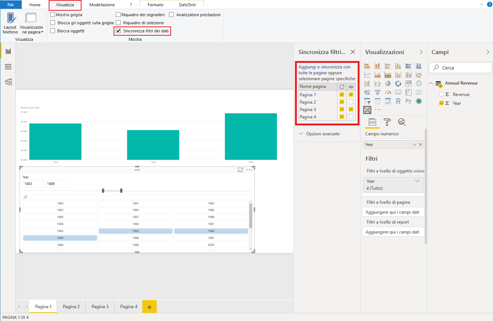

# <a name="sync-slicers-in-power-bi-visuals"></a>Sincronizzare i filtri dei dati negli oggetti visivi di Power BI

Per supportare la funzionalità [Sincronizza filtri dei dati](https://docs.microsoft.com/power-bi/desktop-slicers), l'oggetto visivo filtro dei dati personalizzato deve usare l'API versione 1.13 o successiva.

È anche necessario abilitare l'opzione nel file *capabilities.json*, come illustrato nel codice seguente:

```json
{
    ...
    "supportsHighlight": true,
    "suppressDefaultTitle": true,
    "supportsSynchronizingFilterState": true,
    "sorting": {
        "default": {}
    }
}
```

Dopo aver aggiornato il file *capabilities.json* è possibile visualizzare il riquadro delle opzioni **Sincronizza filtri dei dati** quando si seleziona l'oggetto visivo filtro dei dati personalizzato.

> [!NOTE]
> La funzionalità Sincronizza filtri dei dati non supporta più di un campo. Se il filtro dei dati ha più di un campo (**Categoria** o **Misura**), la funzionalità è disabilitata.



Nel riquadro **Sincronizza filtri dei dati** è possibile osservare che la visibilità del filtro dei dati e l'operazione di filtro possono essere applicate a diverse pagine del report.
