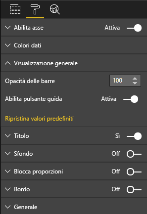

# <a name="create-a-launch-url"></a>Creare un URL di avvio

Creando un URL di avvio, è possibile aprire una nuova scheda o finestra del browser, delegando l'effettiva operazione a Power BI.

## <a name="sample"></a>Esempio

```typescript
   this.host.launchUrl('https://powerbi.microsoft.com');
```

## <a name="usage"></a>Usage

Usare la chiamata API `host.launchUrl()`, passando l'URL di destinazione come argomento stringa:

```typescript
this.host.launchUrl('https://some.link.net');
```

## <a name="restrictions"></a>Restrizioni

* Usare solo i percorsi assoluti, non quelli relativi. Ad esempio, usare un percorso assoluto come `https://some.link.net/subfolder/page.html`. Il percorso relativo, `/page.html`, non verrà aperto.

* Attualmente sono supportati solo i protocolli *HTTP* e *HTTPS*. Evitare *FTP*, *MAILTO* e così via.

## <a name="best-practices"></a>Procedure consigliate

* In genere, è preferibile aprire un collegamento solo come risposta a un'azione esplicita dell'utente. Spiegare chiaramente all'utente che facendo clic sul collegamento o sul pulsante verrà aperta una nuova scheda. L'attivazione di una chiamata `launchUrl()` senza un'azione da parte dell'utente o come effetto collaterale di un'azione diversa può causare confusione o frustrazione nell'utente.

* Se il collegamento non è essenziale per il corretto funzionamento dell'oggetto visivo, è consigliabile fornire all'autore del report un modo per disabilitare e nascondere il collegamento. Questo è particolarmente importante per i casi d'uso speciali di Power BI, ad esempio l'incorporamento di un report in un'applicazione di terze parti o la sua pubblicazione sul Web.

* Evitare di attivare una chiamata `launchUrl()` all'interno di un ciclo, della funzione `update` dell'oggetto visivo o di qualsiasi altro codice che ricorre di frequente.

## <a name="a-step-by-step-example"></a>Esempio dettagliato

### <a name="add-a-link-launching-element"></a>Aggiungere un elemento di avvio di un collegamento

Sono state aggiunte le righe seguenti alla funzione `constructor`:

```typescript
    this.helpLinkElement = this.createHelpLinkElement();
    options.element.appendChild(this.helpLinkElement);
```

È stata aggiunta una funzione privata che crea e collega l'elemento di ancoraggio:

```typescript
private createHelpLinkElement(): Element {
    let linkElement = document.createElement("a");
    linkElement.textContent = "?";
    linkElement.setAttribute("title", "Open documentation");
    linkElement.setAttribute("class", "helpLink");
    linkElement.addEventListener("click", () => {
        this.host.launchUrl("https://docs.microsoft.com/power-bi/developer/visuals/custom-visual-develop-tutorial");
    });
    return linkElement;
};
```

Infine, una voce nel file *visual.less* definisce lo stile per l'elemento link:

```less
.helpLink {
    position: absolute;
    top: 0px;
    right: 12px;
    display: block;
    width: 20px;
    height: 20px;
    border: 2px solid #80B0E0;
    border-radius: 20px;
    color: #80B0E0;
    text-align: center;
    font-size: 16px;
    line-height: 20px;
    background-color: #FFFFFF;
    transition: all 900ms ease;

    &:hover {
        background-color: #DDEEFF;
        color: #5080B0;
        border-color: #5080B0;
        transition: all 250ms ease;
    }

    &.hidden {
        display: none;
    }
}
```

### <a name="add-a-toggling-mechanism"></a>Aggiungere un meccanismo di attivazione/disattivazione

Per aggiungere un meccanismo di attivazione/disattivazione, è necessario aggiungere un oggetto statico, in modo che l'autore del report possa attivare o disattivare la visibilità dell'elemento link. Il valore predefinito è *hidden*. Per altre informazioni, vedere l'[esercitazione sugli oggetti statici](https://microsoft.github.io/PowerBI-visuals/docs/concepts/objects-and-properties).

Un oggetto statico booleano `showHelpLink` è stato aggiunto alla voce objects del file *capabilities.json*, come illustrato nel codice seguente:

```typescript
"objects": {
    "generalView": {
            "displayName": "General View",
            "properties":
                "showHelpLink": {
                    "displayName": "Show Help Button",
                    "type": {
                        "bool": true
                    }
                }
            }
        }
    }
```



Nella funzione `update` sono state inoltre aggiunte le righe seguenti:

```typescript
if (settings.generalView.showHelpLink) {
    this.helpLinkElement.classList.remove("hidden");
} else {
    this.helpLinkElement.classList.add("hidden");
}
```

Nel file *visual.less* è stata definita la classe *hidden* per controllare la visualizzazione dell'elemento.
