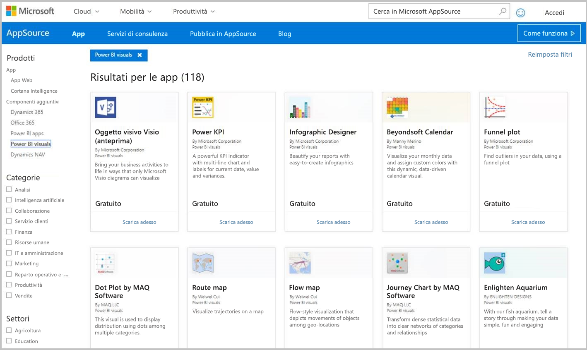
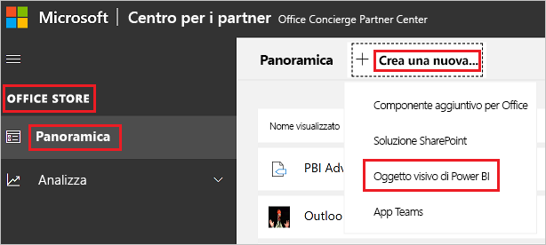

# Pubblicare oggetti visivi di Power BI nel Centro per i partner

Dopo aver creato l'oggetto visivo di Power BI può essere utile pubblicarlo in AppSource in modo che altri utenti possano individuarlo e usarlo. Per altre informazioni sulla creazione di un oggetto visivo di Power BI, vedere [Sviluppo di un oggetto visivo di Power BI](custom-visual-develop-tutorial.md).

## Informazioni su AppSource

[AppSource](https://appsource.microsoft.com/marketplace/apps?product=power-bi-visuals) è la posizione in cui è possibile trovare app SaaS e componenti aggiuntivi per i prodotti e i servizi Microsoft.

## Preparazione per l'invio dell'oggetto visivo di Power BI

Prima di inviare un oggetto visivo di Power BI ad AppSource, assicurarsi di avere letto le [linee guida per gli oggetti visivi di Power BI](guidelines-powerbi-visuals.md) e di [aver testato l'oggetto visivo personalizzato](https://github.com/Microsoft/PowerBI-visuals/blob/master/Tutorial/SubmissionTesting.md).

Quando si è pronti a inviare l'oggetto visivo di Power BI, verificare che l'oggetto soddisfi tutti i requisiti indicati di seguito.

| Elemento | Obbligatoria | Descrizione |
| --- | --- | --- |
| Pacchetto Pbiviz |Sì |Comprimere l'oggetto visivo di Power BI in un pacchetto Pbiviz contenente tutti i metadati necessari. Nome oggetto visivo Nome visualizzato GUID Versione Descrizione Nome e indirizzo di posta elettronica dell'autore |
| File di report PBIX di esempio |Sì |Per presentare l'oggetto visivo, aiutare gli utenti ad acquisire familiarità con lo stesso. Evidenziare il valore che l'oggetto visivo offre all'utente con esempi di utilizzo e opzioni di formattazione. È anche possibile aggiungere una pagina *"hints"* alla fine con alcuni suggerimenti, trucchi e cose da evitare. Il file di report PBIX di esempio deve funzionare offline, senza connessioni esterne. |
| Icona |Sì |È necessario includere il logo dell'oggetto visivo personalizzato che verrà visualizzato nella pagina principale dello store. Il formato può essere PNG, JPG, JPEG o GIF. Deve avere dimensioni pari esattamente a 300 px (larghezza) x 300 px (altezza). **Importante** Leggere attentamente la [guida alle immagini dello store di AppSource](https://docs.microsoft.com/office/dev/store/craft-effective-appsource-store-images) prima di inviare l'icona. |
| Screenshots (Schermate) |Sì |Aggiungere almeno una schermata. Il formato può essere PNG, JPG, JPEG o GIF. Le dimensioni devono essere esattamente 1366 px (larghezza) per 768 px (altezza). La dimensione del file non può superare 1024 KB. Per un migliore utilizzo, aggiungere fumetti di testo per descrivere la proposta di valore delle caratteristiche principali in ogni schermata. |
| Collegamento per il download di supporto |Sì |Specificare un URL di supporto per i clienti. Questo collegamento viene immesso come parte della presentazione del Centro per i partner ed è visibile agli utenti quando accedono alla presentazione dell'oggetto visivo in AppSource. Il formato dell'URL deve includere https:// o http://. |
| Collegamento al documento sulla privacy |Sì |Specificare un collegamento all'informativa sulla privacy dell'oggetto visivo. Questo collegamento viene immesso come parte della presentazione del Centro per i partner ed è visibile agli utenti quando accedono alla presentazione dell'oggetto visivo in AppSource. Il formato del collegamento deve includere https:// o http://. |
| Contratto di licenza con l'utente finale (EULA) |Sì |Specificare un file EULA per l'oggetto visivo di Power BI. È possibile usare il [contratto standard](https://go.microsoft.com/fwlink/?linkid=2041178), il [contratto di Power BI per gli oggetti visivi](https://visuals.azureedge.net/app-store/Power%20BI%20-%20Default%20Custom%20Visual%20EULA.pdf) o il proprio contratto di licenza con l'utente finale. |
| Collegamento video |No |Per aumentare l'interesse degli utenti per l'oggetto visivo personalizzato, aggiungere un collegamento a un video sull'oggetto visivo. Il formato dell'URL deve includere https:// o http://. |
| GitHub repository (Repository GitHub) |No |Condividere un collegamento pubblico a un repository [GitHub](https://www.github.com) con le origini dei dati di esempio e dell'oggetto visivo di Power BI. Ciò offre ad altri sviluppatori la possibilità di inviare un feedback e suggerire miglioramenti da apportare al codice. |

## Richiedere un file XML del pacchetto dell'app

Per inviare un oggetto visivo di Power BI è necessario richiedere un file XML del pacchetto dell'app al team di Power BI. Per ricevere il file XML del pacchetto dell'app, inviare un messaggio di posta elettronica al team incaricato dell'invio degli oggetti visivi di Power BI ([pbivizsubmit@microsoft.com](mailto:pbivizsubmit@microsoft.com)).

Prima di creare il pacchetto **PBVIZ**, è necessario compilare i campi seguenti nel file **pbiviz.json**:
* description
* supportUrl
* author
* name
* email

Allegare il **file PBIVIZ** e il **file PBIX del report di esempio** al messaggio. Il team di Power BI risponderà con le istruzioni e un file XML del pacchetto dell'app da caricare. Questo pacchetto dell'app XML è necessario per inviare l'oggetto visivo attraverso il centro per sviluppatori Office.

> [!NOTE]
> Per migliorare la qualità e garantire che i report esistenti non subiscano danni, gli aggiornamenti agli oggetti visivi esistenti richiederanno due settimane in più per raggiungere l'ambiente di produzione dopo l'approvazione nello store.

## Invio ad AppSource

Per inviare l'oggetto visivo di Power BI ad AppSource, è necessario ottenere un pacchetto dell'app dal team di Power BI e quindi inviarlo al Centro per i partner. 

### Recupero del pacchetto dell'app

È necessario inviare un messaggio di posta elettronica con i file **PBIVIZ** e **PBIX** al team di Power BI prima dell'invio ad AppSource. Ciò consente al team di Power BI di caricare i file nel server di condivisione pubblico. In caso contrario, lo Store non potrà recuperare i file. 

Il team di Power BI deve controllare i file per verificare la presenza di nuovi invii di oggetti visivi di Power BI, aggiornamenti degli oggetti di Power BI esistenti e correzioni degli invii rifiutati.

### Invio al Centro per i partner

Per inviare l'oggetto visivo di Power BI al Centro per i partner, è necessario essere registrati nel Centro. Se non è ancora stata eseguita la registrazione, [aprire un account per sviluppatore nel Centro per i partner](https://docs.microsoft.com/office/dev/store/open-a-developer-account).

Attenersi alla procedura seguente per inviare l'oggetto visivo di Power BI al Centro per i partner. Per altre informazioni sul processo di invio, vedere l'articolo relativo all'[invio delle soluzioni Office ad AppSource attraverso il Centro per i partner](https://docs.microsoft.com/office/dev/store/use-partner-center-to-submit-to-appsource).

1. Accedere al **Centro per i partner**.

2. Nel riquadro sinistro selezionare **OFFICE STORE**.

3. Selezionare la scheda di **informazioni generali**.

4. Selezionare **Creare un nuovo** e dal menu a discesa selezionare **Oggetto visivo di Power BI**.

    

5. Nella finestra **Creare un nuovo oggetto visivo di Power BI** immettere un nome per l'oggetto visivo di Power BI e selezionare **Crea**.

6. Selezionare **Pacchetti** e caricare il pacchetto dell'app XML dell'oggetto visivo di Power BI.

7. Selezionare **Proprietà** e inserire le informazioni necessarie.

8. Se il prodotto richiede ulteriori acquisti, selezionare **Configurazione prodotto** e quindi la casella di controllo **Acquisto del servizio associato**.

9. (Facoltativo) Per [certificare](power-bi-custom-visuals-certified.md) l'oggetto visivo, selezionare **Configurazione prodotto** e quindi la casella di controllo **Certificazione di Power BI**.
    >[!TIP]
    >Il processo di certificazione di Power BI può richiedere tempo. Se si sta creando un nuovo oggetto visivo di Power BI, è consigliabile pubblicarlo attraverso il Centro per i partner prima di richiedere la certificazione di Power BI. In questo modo si garantisce che la pubblicazione dell'oggetto visivo non subisca ritardi.

10. Selezionare **Configurazione prodotto** e fare clic su **Rivedi e pubblica**.

## Rilevamento dello stato e dell'utilizzo dell'invio

* È possibile verificare i [criteri di convalida](https://docs.microsoft.com/legal/marketplace/certification-policies#1180-power-bi-visuals).

* Dopo l'invio, sarà possibile visualizzare lo stato di invio nel [dashboard dell'app](https://sellerdashboard.microsoft.com/Application/Summary/).

* Per comprendere quando l'oggetto visivo di Power BI sarà disponibile per il download da AppSource, vedere le [tempistiche per la pubblicazione](power-bi-custom-visuals-certified.md#publication-timeline) degli oggetti visivi di Power BI.

## Certificare l'oggetto visivo

Dopo aver creato l'oggetto visivo è possibile ottenere la [certificazione](power-bi-custom-visuals-certified.md) per l'oggetto.

## Passaggi successivi

* [Developing a Power BI custom visual](custom-visual-develop-tutorial.md) (Sviluppo di un oggetto visivo personalizzato di Power BI)

* [Visualizzazioni in Power BI](../../visuals/power-bi-report-visualizations.md)  

* [Oggetti visivi in Power BI](power-bi-custom-visuals.md)  

* [Ottenere la certificazione di un oggetto visivo di Power BI](power-bi-custom-visuals-certified.md)

* Altre domande? [Provare a rivolgersi alla community di Power BI](https://community.powerbi.com/)
