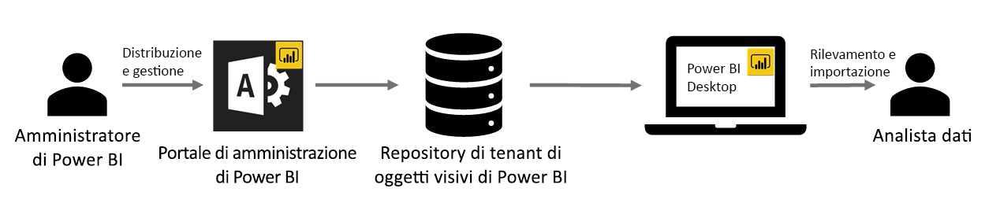

# Oggetti visivi dell'organizzazione in Power BI

È possibile usare oggetti visivi di Power BI in Power BI per creare un tipo di oggetto visivo esclusivo su misura. Gli oggetti visivi di Power BI vengono creati dagli sviluppatori e spesso vengono creati quando la grande varietà di oggetti visivi inclusi in Power BI non soddisfa esigenze specifiche.

In alcune organizzazioni, gli oggetti visivi di Power BI sono ancora più importanti: potrebbero essere necessari per comunicare dati o informazioni approfondite specifici dell'organizzazione, potrebbero avere requisiti speciali per i dati oppure mettere in evidenza metodi aziendali privati. Queste organizzazioni hanno la necessità di sviluppare oggetti visivi di Power BI, condividerli in tutta l'organizzazione e accertarsi che vengano gestiti correttamente. Gli oggetti visivi di Power BI soddisfano proprio queste esigenze delle organizzazioni.

La figura seguente illustra il processo di flusso degli oggetti visivi di Power BI dell'organizzazione in Power BI dall'amministratore allo sviluppo e alla manutenzione, fino all'analista di dati.

Gli oggetti visivi dell'organizzazione vengono distribuiti e gestiti dall'amministratore di Power BI dal portale di amministrazione. Dopo la distribuzione nel repository dell'organizzazione, gli utenti dell'organizzazione possono facilmente individuarli e importarli nei loro report direttamente da Power BI Desktop.

Per altre informazioni su come usare gli oggetti visivi di Power BI dell'organizzazione nei report creati, vedere l'articolo seguente: [Altre informazioni sull'importazione di oggetti visivi dell'organizzazione nei report](power-bi-custom-visuals.md).

## Amministrare oggetti visivi di Power BI dell'organizzazione

Per altre informazioni su come amministrare, distribuire e gestire gli oggetti visivi di Power BI dell'organizzazione all'interno dell'organizzazione, vedere l'articolo seguente: [Altre informazioni sulla distribuzione e gestione degli oggetti visivi di Power BI dell'organizzazione](https://go.microsoft.com/fwlink/?linkid=866790).

> [!WARNING]
> Un oggetto visivo di Power BI installato da un file può contenere codice che comporta rischi per la sicurezza o la privacy. Assicurarsi che l'autore e l'origine del file dell'oggetto visivo di Power BI siano attendibili prima di distribuirlo nel repository dell'organizzazione.

## Considerazioni e limitazioni

Esistono diverse considerazioni e limitazioni di cui è necessario tenere conto.

Amministratore:

* Se un oggetto visivo di Power BI proveniente da ApSource o un file viene eliminato dal repository, non verrà più eseguito il rendering di tutti i report esistenti che usano l'oggetto visivo eliminato. L'operazione di eliminazione dal repository non è reversibile. Per disabilitare temporaneamente un oggetto visivo di Power BI proveniente da ApSource o un file, usare la funzionalità "Disabilita".

* Gli oggetti visivi di Power BI aziendali non sono supportati nel server di report di Power BI.

Utenti finali:

* Gli oggetti visivi di Power BI dell'organizzazione sono oggetti visivi privati importati dal repository dell'organizzazione. Come tutti gli oggetti visivi privati non possono essere [esportati in PowerPoint](https://docs.microsoft.com/power-bi/consumer/end-user-powerpoint) o visualizzati nei messaggi di posta elettronica ricevuti quando un utente [effettua la sottoscrizione alle pagine del report](https://docs.microsoft.com/power-bi/consumer/end-user-subscribe). Solo gli [oggetti visivi di Power BI certificati](power-bi-custom-visuals-certified.md) importati direttamente dal marketplace supportano queste funzionalità.

* Non viene eseguito il rendering degli oggetti visivi Visio, PowerApps, Mappa e GlobeMap dal Marketplace AppSource se vengono distribuiti tramite il repository dell'organizzazione.

## Risoluzione dei problemi

Per informazioni sulla risoluzione dei problemi, vedere [Risoluzione dei problemi relativi agli oggetti visivi di Power BI](power-bi-custom-visuals-troubleshoot.md).

## Domande frequenti

Per altre informazioni e risposte, vedere [Domande frequenti sugli oggetti visivi di Power BI](power-bi-custom-visuals-faq.md#organizational-power-bi-visuals).

Altre domande? [Provare la community di Power BI](https://community.powerbi.com/).
