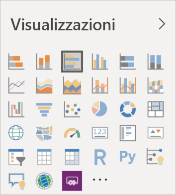

# Oggetti visivi in Power BI

Power BI viene fornito con molti oggetti visivi predefiniti. Questi oggetti visivi sono disponibili nel riquadro Visualizzazione di [Power BI Desktop](https://powerbi.microsoft.com/desktop/) e del [servizio Power BI](https://app.powerbi.com) e possono essere usati per creare e modificare contenuti di Power BI.

Molti altri oggetti visivi di Power BI sono disponibili in Microsoft [AppSource](https://nam06.safelinks.protection.outlook.com/?url=https%3A%2F%2Fappsource.microsoft.com%2Fen-us%2Fmarketplace%2Fapps%3Fpage%3D1%26product%3Dpower-bi-visuals&data=02%7C01%7CKesem.Sharabi%40microsoft.com%7C6d9286afacb3468d4cde08d740b76694%7C72f988bf86f141af91ab2d7cd011db47%7C1%7C0%7C637049028749147718&sdata=igWm0e1vXdgGcbyvngQBrHQVAkahPnxPC1ZhUPntGI8%3D&reserved=0) o tramite Power BI. Questi oggetti visivi vengono creati da Microsoft e partner Microsoft e sono testati e approvati dal team di convalida di AppSource.

È anche possibile sviluppare un oggetto visivo di Power BI personalizzato, che può essere usato personalmente, ma anche dall'organizzazione o dall'intera community di Power BI.

## Oggetti visivi di Power BI predefiniti

Si tratta degli oggetti visivi di Power BI predefiniti disponibili dal riquadro Visualizzazione in *Power BI Desktop* e nel *servizio Power BI*.

Per rimuovere un oggetto visivo di Power BI dal riquadro Visualizzazione, fare clic con il pulsante destro del mouse sull'oggetto e scegliere **Rimuovi**.

Per ripristinare gli oggetti visivi di Power BI predefiniti nel riquadro Visualizzazione, fare clic su **Importa un oggetto visivo personalizzato** e selezionare **Ripristina gli oggetti visivi predefiniti**. 

## Oggetti visivi di Power BI in AppSource

Microsoft e i membri della community contribuiscono alla creazione di oggetti visivi di Power BI e li pubblicano in [AppSource](https://appsource.microsoft.com/marketplace/apps?product=power-bi-visuals) a beneficio di tutti gli utenti. È possibile scaricare questi oggetti visivi e aggiungerli ai report di Power BI. Sono stati testati e approvati da Microsoft per funzionalità e qualità.

### Informazioni su AppSource

[AppSource](https://appsource.microsoft.com/marketplace/apps?product=power-bi-visuals) è il sito Web per app, componenti aggiuntivi ed estensioni per il software Microsoft. AppSource connette milioni di utenti di prodotti come Microsoft 365, Azure, Dynamics 365, Cortana e Power BI a soluzioni che li aiutano a lavorare in modo più efficiente, più intelligente e migliore che mai.

### Oggetti visivi di Power BI certificati

Gli oggetti visivi di Power BI certificati sono oggetti visivi disponibili in [AppSource](https://nam06.safelinks.protection.outlook.com/?url=https%3A%2F%2Fappsource.microsoft.com%2Fen-us%2Fmarketplace%2Fapps%3Fpage%3D1%26product%3Dpower-bi-visuals&data=02%7C01%7CKesem.Sharabi%40microsoft.com%7C6d9286afacb3468d4cde08d740b76694%7C72f988bf86f141af91ab2d7cd011db47%7C1%7C0%7C637049028749147718&sdata=igWm0e1vXdgGcbyvngQBrHQVAkahPnxPC1ZhUPntGI8%3D&reserved=0) che soddisfano determinati requisiti di codice specificati e che sono stati testati e approvati dal team di Microsoft Power BI. I test sono studiati per verificare che l'oggetto visivo non abbia accesso a risorse o servizi esterni.

Per visualizzare l'elenco degli oggetti visivi di Power BI certificati o per inviarne uno personalizzato, vedere [Oggetti visivi di Power BI certificati](power-bi-custom-visuals-certified.md).

### Campioni per gli oggetti visivi di Power BI

Per ogni oggetto visivo di Power BI è disponibile un campione di dati che mostra il funzionamento dell'oggetto visivo. Per scaricare il campione, in [AppSource](https://nam06.safelinks.protection.outlook.com/?url=https%3A%2F%2Fappsource.microsoft.com%2Fen-us%2Fmarketplace%2Fapps%3Fpage%3D1%26product%3Dpower-bi-visuals&data=02%7C01%7CKesem.Sharabi%40microsoft.com%7C6d9286afacb3468d4cde08d740b76694%7C72f988bf86f141af91ab2d7cd011db47%7C1%7C0%7C637049028749147718&sdata=igWm0e1vXdgGcbyvngQBrHQVAkahPnxPC1ZhUPntGI8%3D&reserved=0) selezionare un oggetto visivo di Power BI e nella sezione *Prova un esempio* fare clic sul collegamento **Report di esempio**.

## Archivio dell'organizzazione

Gli amministratori di Power BI approvano e distribuiscono oggetti visivi di Power BI nell'organizzazione. In questo modo, gli autori di report possono individuare, aggiornare e usare facilmente gli oggetti visivi di Power BI. Gli amministratori possono gestire facilmente questi oggetti visivi con azioni come l'aggiornamento delle versioni o la disabilitazione e l'abilitazione di oggetti visivi di Power BI.

Per accedere all'archivio dell'organizzazione, nel riquadro *Visualizzazione* fare clic su **Importa un oggetto visivo personalizzato**, selezionare **Importa dal Marketplace** e nella parte superiore della finestra *Oggetti visivi di Power BI* selezionare la scheda **Organizzazione**.

[Altre informazioni sugli oggetti visivi aziendali](power-bi-custom-visuals-organization.md).

## File di oggetti visivi

Gli oggetti visivi di Power BI sono pacchetti che includono il codice per il rendering dei dati a loro passati. Chiunque può creare un oggetto visivo personalizzato e assemblarlo in un pacchetto come singolo file con estensione `.pbiviz`, che può essere poi importato in un report di Power BI.

Per importare un oggetto visivo di Power BI, nel riquadro *Visualizzazione* fare clic su **Importa un oggetto visivo personalizzato** e selezionare **Importa da file**.

Gli sviluppatori Web interessati a creare un oggetto visivo personalizzato e ad aggiungerlo in AppSource possono ottenere informazioni su come [sviluppare un oggetto visivo di Power BI](custom-visual-develop-tutorial.md) e [pubblicare un oggetto visivo di Power BI in AppSource](office-store.md).

> [!WARNING]
> Un oggetto visivo di Power BI può contenere codice che comporta rischi per la sicurezza o la privacy. Prima di importarlo nel report, assicurarsi che l'autore e l'origine dell'oggetto visivo di Power BI siano attendibili.

## Passaggi successivi

* Gli sviluppatori possono iniziare dall'esercitazione [Sviluppo di un oggetto visivo di Power BI](custom-visual-develop-tutorial.md).

* Vedere [Struttura di un progetto di oggetto visivo di Power BI](visual-project-structure.md).

* Vedere [Linee guida per gli oggetti visivi di Power BI](guidelines-powerbi-visuals.md).

Altre domande? Vedere la pagina [Domande frequenti sugli oggetti visivi di Power BI](power-bi-custom-visuals-faq.md) o fare riferimento alla [community di Power BI](https://community.powerbi.com/).