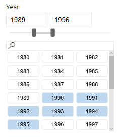
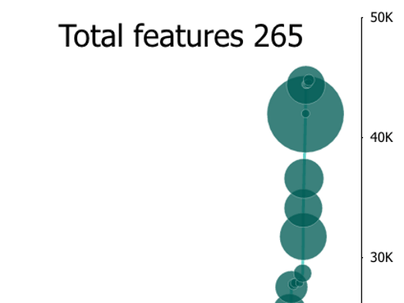

# Esempi di oggetti visivi di Power BI

È possibile scaricare, usare e modificare questi oggetti visivi Power BI da GitHub. Questi esempi illustrano come gestire situazioni comuni quando si usa Power BI per lo sviluppo.

## Filtri dei dati

Un filtro dei dati riduce la quantità di dati visualizzati in altre visualizzazioni all'interno del report. I filtri dei dati sono uno dei diversi modi per filtrare i dati in Power BI.

|   |  | |
| ------------- | ------------- | -------------|
| [Chiclet Slicer](https://github.com/Microsoft/powerbi-visuals-chicletslicer/)   Visualizza pulsanti con immagini o testo che fungono da filtro interno all'area di disegno per altri oggetti visivi | [Filtro dei dati sequenza temporale](https://github.com/Microsoft/powerbi-visuals-timeline/)  Selettore di intervallo di date grafico che filtra per data | [Esempio di filtro dei dati](https://github.com/Microsoft/powerbi-visuals-sampleslicer/)  Illustra l'uso dell'API di filtro avanzato

## Grafici

È possibile ispirarsi alla raccolta, inclusi grafici a barre, grafici a torta, Word Cloud e altro ancora.

|   |  | |
| ------------- | ------------- | -------------|
| [Aster Plot](https://github.com/Microsoft/powerbi-visuals-asterplot/)   Torsione su un grafico ad anello standard che usa un secondo valore per orientare l'angolo di apertura | [Grafico a punti](https://github.com/Microsoft/powerbi-visuals-bulletchart/)  Grafico a barre con elementi visivi aggiuntivi che forniscono contesto utile per tenere traccia degli obiettivi | [Chord](https://github.com/Microsoft/powerbi-visuals-chord/)  Soluzione grafica che visualizza le relazioni tra i dati in una matrice
|  | |  
| [Dot Plot](https://github.com/Microsoft/powerbi-visuals-dotplot/)  Visualizza la distribuzione delle frequenze in modo accattivante | [Indicatore KPI doppio](https://github.com/Microsoft/powerbi-visuals-dualkpi/)  Visualizza in modo efficiente due misure nel corso del tempo indicando le tendenze in una sequenza temporale comune | [Enhanced Scatter](https://github.com/Microsoft/powerbi-visuals-enhancedscatter/)  Miglioramenti del grafico a dispersione esistente
| | | 
| [Force Graph](https://github.com/Microsoft/powerbi-visuals-forcegraph/)  Diagramma di layout Force con tracciato curvo, utile per visualizzare le connessioni tra entità | [Gantt](https://github.com/Microsoft/powerbi-visuals-gantt/)  Grafico a barre che illustra una sequenza temporale o una pianificazione del progetto con risorse | [Mappa termina con tabella](https://github.com/Microsoft/powerbi-visuals-heatmap/)  Confrontare i dati in modo semplice e intuitivo usando i colori di una tabella
|  |  |  
| [Istogramma](https://github.com/Microsoft/powerbi-visuals-histogram/)  Visualizza la distribuzione dei dati in un intervallo di tempo continuo o in un periodo di tempo determinato | [Grafico LineDot](https://github.com/Microsoft/powerbi-visuals-linedotchart/)  Grafico a linee animato con punti animati per presentare dati al pubblico | [Grafico Mekko](https://github.com/Microsoft/powerbi-visuals-mekkochart/)  Istogramma a colonne in pila 100% e grafico a barre in pila 100% combinati in un'unica vista
|  |  |  
| [Multi KPI](https://github.com/microsoft/PowerBI-visuals-MultiKPI/)   Una potente visualizzazione Multi KPI con una chiave KPI oltre a più grafici sparkline di dati di supporto | [Power KPI](https://github.com/microsoft/PowerBI-visuals-PowerKPI/)  Potente indicatore KPI con grafico a più linee ed etichette per data corrente, valore e varianze | [Power KPI Matrix](https://github.com/microsoft/PowerBI-visuals-PowerKPIMatrix/)  Esegue il monitoraggio delle scorecard bilanciate e di un numero illimitato di metriche e indicatori KPI in un elenco compatto e facile da leggere
| |  |  
| [Grafico degli impulsi](https://github.com/Microsoft/powerbi-visuals-pulsechart/)  Questo grafico a linee con annotazioni per gli eventi principali è perfetto per raccontare storie con i dati| [Grafico radar](https://github.com/Microsoft/powerbi-visuals-radarchart/)  Presenta più misure tracciate su un asse categorico, utile per confrontare gli attributi | [Diagramma di Sankey](https://github.com/Microsoft/powerbi-visuals-sankey/)  Diagramma di flusso in cui la larghezza della serie è proporzionale alla quantità del flusso
|  | | 
| [Grafico di flusso](https://github.com/Microsoft/powerbi-visuals-streamgraph/)  Grafico ad area in pila con interpolazione uniforme, usato spesso per visualizzare valori nel tempo | [Grafico radiale](https://github.com/Microsoft/powerbi-visuals-sunburst/)  Grafico ad anello multilivello per visualizzare i dati gerarchici| [Grafico Tornado](https://github.com/Microsoft/powerbi-visuals-tornado/)  Confronto dell'importanza relativa delle variabili tra due gruppi
 | 
 | [Cloud di parole](https://github.com/Microsoft/powerbi-visuals-wordcloud/)  Crea un oggetto visivo da testo ricorrente nei dati

## WebGL

WebGL consente ai contenuti Web di usare un'API basata su OpenGL ES 2.0 per eseguire il rendering 2D e 3D in un canvas HTML.

| |
| ------------- |
| [Globe Map](https://github.com/Microsoft/powerbi-visuals-globemap/)  Rilevamento delle posizioni in una mappa 3D interattiva

## Oggetti visivi R

Questi esempi illustrano come sfruttare la potenza analitica e visiva degli oggetti visivi R e degli script R.

| | | |
|------------- |------------- |------------- |------------- |
| [Regole di associazione](https://github.com/Microsoft/powerbi-visuals-assorules/)  Individuare le relazioni tra dati apparentemente non correlati usando istruzioni if-then | [Clustering](https://github.com/Microsoft/powerbi-visuals-clustering-kmeans/)  Trovare i gruppi di somiglianza nei dati usando l'algoritmo K-medie | [Clustering con outlier](https://github.com/microsoft/PowerBI-visuals-dbscan/)  Trovare i gruppi di somiglianza e gli outlier nei dati
|  |  |  
| [Correlation plot](https://github.com/Microsoft/powerbi-visuals-corrplot/)  Evidenziare le variabili più correlate in una tabella dati | [Grafico albero delle decisioni](https://github.com/Microsoft/powerbi-visuals-decision-tree/)  Diagramma a forma di albero schematico per determinare la probabilità statistica tramite il partizionamento ricorsivo | [Forecasting TBATS](https://github.com/Microsoft/powerbi-visuals-forcasting-tbats/)  Previsioni di serie temporali per serie con più stagionalità tramite il modello TBATS
|  |  |  
| [Forecasting with ARIMA](https://github.com/Microsoft/powerbi-visuals-forcastingarima/)  Stimare i valori futuri in base ai dati cronologici usando ARIMA (Autoregressive Integrated Moving Avg) | [Tracciato a imbuto](https://github.com/Microsoft/powerbi-visuals-funnel/)  Individuare gli outlier nei dati con un tracciato a imbuto | [Rilevamento outlier](https://github.com/Microsoft/powerbi-visuals-outliers-det/)  Trovare gli outlier nei dati usando il metodo e il tracciato più appropriati
|  |  | 
| [Spline chart](https://github.com/Microsoft/powerbi-visuals-spline/)  Visualizzare e comprendere i dati rumorosi | [Time series decomposition chart](https://github.com/Microsoft/powerbi-visuals-timeseriesdecomposition/)  Comprendere i componenti delle serie temporali usando la "scomposizione di stagionalità e tendenza con Loess" | [Grafico delle previsioni basate su serie temporali](https://github.com/Microsoft/powerbi-visuals-forcasting-exp/)  Uso del modello di livellamento esponenziale per stimare valori futuri in base a valori osservati in precedenza

## Passaggi successivi

Per provare a creare oggetti visivi Power BI, vedere [esercitazione: Sviluppo di un oggetto visivo di Power BI](custom-visual-develop-tutorial.md).
