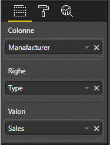

# <a name="add-interactivity-into-visual-by-power-bi-visuals-selections"></a>Aggiungere interattività negli oggetti visivi tramite le selezioni degli oggetti visivi di Power BI

Power BI offre due modi di interazione tra gli oggetti visivi: la selezione e il filtro. Nell'esempio seguente viene illustrato come selezionare qualsiasi elemento in un oggetto visivo e inviare una notifica agli altri oggetti visivi nel report sul nuovo stato di selezione.

L'oggetto `Selection` corrisponde all'interfaccia:

```typescript
export interface ISelectionId {
    equals(other: ISelectionId): boolean;
    includes(other: ISelectionId, ignoreHighlight?: boolean): boolean;
    getKey(): string;
    getSelector(): Selector;
    getSelectorsByColumn(): SelectorsByColumn;
    hasIdentity(): boolean;
}
```

## <a name="how-to-use-selectionmanager-to-select-data-points"></a>Come usare SelectionManager per selezionare i punti dati

L'oggetto host dell'oggetto visivo fornisce il metodo per la creazione di un'istanza di gestione selezione. La gestione selezione è responsabile di selezionare, annullare la selezione, visualizzare il menu di scelta rapida, archiviare le selezioni correnti e verificare lo stato della selezione. La gestione selezione ha anche i metodi corrispondenti per queste azioni.

### <a name="create-an-instance-of-the-selection-manager"></a>Creare un'istanza della gestione selezione

Per usare la gestione selezione è necessario creare la relativa istanza. Gli oggetti visivi creano in genere un'istanza di gestione selezione nell'elemento `constructor` dell'oggetto visivo.

```typescript
export class Visual implements IVisual {
    private target: HTMLElement;
    private host: IVisualHost;
    private selectionManager: ISelectionManager;
    // ...
    constructor(options: VisualConstructorOptions) {
        this.host = options.host;
        // ...
        this.selectionManager = this.host.createSelectionManager();
    }
    // ...
}
```

### <a name="create-an-instance-of-the-selection-builder"></a>Creare un'istanza del generatore di selezione

Quando viene creata l'istanza di gestione selezione, è necessario creare `selections` per ogni punto dati dell'oggetto visivo. L'oggetto host dell'oggetto visivo offre il metodo `createSelectionIdBuilder` per generare la selezione per ogni punto dati. Questo metodo restituisce l'istanza dell'oggetto con l'interfaccia `powerbi.visuals.ISelectionIdBuilder`:

```typescript
export interface ISelectionIdBuilder {
    withCategory(categoryColumn: DataViewCategoryColumn, index: number): this;
    withSeries(seriesColumn: DataViewValueColumns, valueColumn: DataViewValueColumn | DataViewValueColumnGroup): this;
    withMeasure(measureId: string): this;
    withMatrixNode(matrixNode: DataViewMatrixNode, levels: DataViewHierarchyLevel[]): this;
    withTable(table: DataViewTable, rowIndex: number): this;
    createSelectionId(): ISelectionId;
}
```

Questo oggetto ha metodi corrispondenti per creare `selections` per diversi tipi di mapping di visualizzazione dati.

> [!NOTE]
> I metodi `withTable` e `withMatrixNode` sono stati introdotti nell'API 2.5.0 degli oggetti visivi di Power BI.
> Se è necessario usare le selezioni per i mapping di visualizzazione dati di tabella o di matrice, è necessario aggiornare l'API alla versione 2.5.0 o successiva.

### <a name="create-selections-for-categorical-data-view-mapping"></a>Creare selezioni per il mapping di visualizzazione dati categorica

Esaminiamo il modo in cui le selezioni vengono rappresentate nel mapping di visualizzazione dati categorica per il set di dati di esempio:

| Produttore | Tipo | Valore |
| - | - | - |
| Chrysler | Domestic Car | 28883 |
| Chrysler | Domestic Truck | 117131 |
| Chrysler | Import Car | 0 |
| Chrysler | Import Truck | 6362 |
| Ford | Domestic Car | 50032 |
| Ford | Domestic Truck | 122446 |
| Ford | Import Car | 0 |
| Ford | Import Truck | 0 |
| GM | Domestic Car | 65426 |
| GM | Domestic Truck | 138122 |
| GM | Import Car | 197 |
| GM | Import Truck | 0 |
| Honda | Domestic Car | 51450 |
| Honda | Domestic Truck | 46115 |
| Honda | Import Car | 2932 |
| Honda | Import Truck | 0 |
| Nissan | Domestic Car | 51476 |
| Nissan | Domestic Truck | 47343 |
| Nissan | Import Car | 5485 |
| Nissan | Import Truck | 1430 |
| Toyota | Domestic Car | 55643 |
| Toyota | Domestic Truck | 61227 |
| Toyota | Import Car | 20799 |
| Toyota | Import Truck | 23614 |

L'oggetto visivo usa il mapping di visualizzazione dati seguente:

```json
{
    "dataRoles": [
        {
            "displayName": "Columns",
            "name": "columns",
            "kind": "Grouping"
        },
        {
            "displayName": "Rows",
            "name": "rows",
            "kind": "Grouping"
        },
        {
            "displayName": "Values",
            "name": "values",
            "kind": "Measure"
        }
    ],
    "dataViewMappings": [
        {
            "categorical": {
                "categories": {
                    "for": {
                        "in": "columns"
                    }
                },
                "values": {
                    "group": {
                        "by": "rows",
                        "select": [
                            {
                                "for": {
                                    "in": "values"
                                }
                            }
                        ]
                    }
                }
            }
        }
    ]
}
```

Nell'esempio `Manufacturer` è `columns` e `Type` è `rows`. Sono presenti serie create da valori di raggruppamenti per `rows` (`Type`).

L'oggetto visivo può anche filtrare i dati per `Manufacturer` e `Type`.

Quando ad esempio l'utente seleziona `Chrysler` per `Manufacturer`, gli altri oggetti visivi visualizzano i dati seguenti:

| Produttore | Tipo | Valore |
| - | - | - |
| **Chrysler** | Domestic Car | 28883 |
| **Chrysler** | Domestic Truck | 117131 |
| **Chrysler** | Import Car | 0 |
| **Chrysler** | Import Truck | 6362 |

Quando l'utente seleziona `Import Car` per `Type` (seleziona i dati in base alla serie), gli altri oggetti visivi visualizzano i dati seguenti:

| Produttore | Tipo | Valore |
| - | - | - |
| Chrysler | **Import Car** | 0 |
| Ford | **Import Car** | 0 |
| GM | **Import Car** | 197 |
| Honda | **Import Car** | 2932 |
| Nissan | **Import Car** | 5485 |
| Toyota | **Import Car** | 20799 |


È necessario compilare i carrelli dati degli oggetti visivi.



Sono presenti `Manufacturer` come categoria (colonne), `Type` come serie (righe) e `Value` come `Values` per le serie.

> [!NOTE]
> Gli elementi `Values` sono necessari per le serie perché in base al mapping di visualizzazione dati l'oggetto visivo prevede che `Values` verrà raggruppato in base ai dati `Rows`.

#### <a name="create-selections-for-categories"></a>Creare selezioni per le categorie

```typescript
// categories
const categories = dataView.categorical.categories;

// create label for 'Manufacturer' column
const p = document.createElement("p") as HTMLParagraphElement;
p.innerText = categories[0].source.displayName.toString();
this.target.appendChild(p);

// get count of category elements
const categoriesCount = categories[0].values.length;

// iterate all categories to generate selection and create button elements to use selections
for (let categoryIndex = 0; categoryIndex < categoriesCount; categoryIndex++) {
    const categoryValue: powerbi.PrimitiveValue = categories[0].values[categoryIndex];

    const categorySelectionId = this.host.createSelectionIdBuilder()
        .withCategory(categories[0], categoryIndex) // we have only one category (only one `Manufacturer` column)
        .createSelectionId();
    this.dataPoints.push({
        value: categoryValue,
        selection: categorySelectionId
    });
    console.log(categorySelectionId);

    // create button element to apply selection on click
    const button = document.createElement("button") as HTMLButtonElement;
    button.value = categoryValue.toString();
    button.innerText = categoryValue.toString();
    button.addEventListener("click", () => {
        // handle click event to apply correspond selection
        this.selectionManager.select(categorySelectionId);
    });
    this.target.appendChild(button);
}
```

Nel codice di esempio si può osservare che viene eseguita l'iterazione di tutte le categorie. In ogni iterazione viene chiamato il metodo `createSelectionIdBuilder` per creare la selezione successiva per ogni categoria chiamando il metodo `withCategory` del generatore di selezione. Il metodo `createSelectionId` viene usato come metodo finale per restituire l'oggetto `selection` generato.

Nel metodo `withCategory` viene passata la colonna di `category`. Nell'esempio si tratta di `Manufacturer` e dell'indice dell'elemento categoria.

#### <a name="create-selections-for-series"></a>Creare selezioni per le serie

```typescript
// get groupped values for series
const series: powerbi.DataViewValueColumnGroup[] = dataView.categorical.values.grouped();

// create label for 'Type' column
const p2 = document.createElement("p") as HTMLParagraphElement;
p2.innerText = dataView.categorical.values.source.displayName;
this.target.appendChild(p2);

// iterate all series to generate selection and create button elements to use selections
series.forEach( (ser: powerbi.DataViewValueColumnGroup) => {
    // create selection id for series
    const seriesSelectionId = this.host.createSelectionIdBuilder()
        .withSeries(dataView.categorical.values, ser)
        .createSelectionId();

    this.dataPoints.push({
        value: ser.name,
        selection: seriesSelectionId
    });

    // create button element to apply selection on click
    const button = document.createElement("button") as HTMLButtonElement;
    button.value =ser.name.toString();
    button.innerText = ser.name.toString();
    button.addEventListener("click", () => {
        // handle click event to apply correspond selection
        this.selectionManager.select(seriesSelectionId);
    });
    this.target.appendChild(button);
});
```

### <a name="create-selections-for-table-data-view-mapping"></a>Creare selezioni per il mapping di visualizzazione dati di tabella

Esempio di mapping di visualizzazione dati di tabella

```json
{
    "dataRoles": [
        {
            "displayName": "Values",
            "name": "values",
            "kind": "GroupingOrMeasure"
        }
    ],
    "dataViewMappings": [
        {
            "table": {
                "rows": {
                    "for": {
                        "in": "values"
                    }
                }
            }
        }
    ]
}
```

Per creare una selezione per ogni riga del mapping di visualizzazione dati di tabella, è necessario chiamare il metodo `withTable` del generatore di selezione.

```typescript
public update(options: VisualUpdateOptions) {
    const dataView = options.dataViews[0];
    dataView.table.rows.forEach((row: DataViewTableRow, rowIndex: number) => {
        this.target.appendChild(rowDiv);
        const selection: ISelectionId = this.host.createSelectionIdBuilder()
            .withTable(dataView.table, rowIndex)
            .createSelectionId();
    }
}
```

Il codice visivo esegue l'iterazione delle righe della tabella e ogni riga chiama il metodo tabella `withTable`. I parametri del metodo `withTable` sono l'oggetto `table` e l'indice della riga della tabella.

### <a name="create-selections-for-matrix-data-view-mapping"></a>Creare selezioni per il mapping di visualizzazione dati di matrice

```typescript
public update(options: VisualUpdateOptions) {
    const host = this.host;
    const rowLevels: powerbi.DataViewHierarchyLevel[] = dataView.matrix.rows.levels;
    const columnLevels: powerbi.DataViewHierarchyLevel[] = dataView.matrix.rows.levels;

    // iterate rows hierarchy
    nodeWalker(dataView.matrix.rows.root, rowLevels);
    // iterate columns hierarchy
    nodeWalker(dataView.matrix.columns.root, columnLevels);

    function nodeWalker(node: powerbi.DataViewMatrixNode, levels: powerbi.DataViewHierarchyLevel[]) {
        const nodeSelection = host.createSelectionIdBuilder().withMatrixNode(node, levels);

        if (node.children && node.children.length) {
            node.children.forEach(child => {
                nodeWalker(child, levels);
            });
        }
    }
}
```

Nell'esempio `nodeWalker` esegue chiamate in modo ricorsivo per ogni nodo e nodo figlio.

`nodeWalker` crea l'oggetto `nodeSelection` a ogni chiamata. Ogni `nodeSelection` rappresenta l'elemento `selection` dei nodi corrispondenti.

## <a name="select-datapoints-to-slice-other-visuals"></a>Selezionare i punti dati per filtrare altri oggetti visivi

Nei codici di esempio delle selezioni per il mapping di visualizzazione dati categorica è stato creato un gestore degli eventi clic per gli elementi pulsante. Il gestore chiama il metodo `select` di gestione selezione e passa l'oggetto di selezione.

```typescript
button.addEventListener("click", () => {
    // handle click event to apply correspond selection
    this.selectionManager.select(categorySelectionId);
});
```

L'interfaccia del metodo `select` è

```typescript
interface ISelectionManager {
    // ...
    select(selectionId: ISelectionId | ISelectionId[], multiSelect?: boolean): IPromise<ISelectionId[]>;
    // ...
}
```

Si noti che `select` può accettare una matrice di selezioni. Ciò significa che l'oggetto visivo può selezionare diversi punti dati. Il secondo parametro `multiSelect` è responsabile della selezione multipla. Se il valore è True, Power BI non annulla lo stato della selezione precedente e applica la selezione corrente. In caso contrario, viene ripristinata la selezione precedente.

Scenario tipico dell'uso di `multiSelect` per la gestione dello stato del pulsante CTRL su un evento clic.

```typescript
button.addEventListener("click", (mouseEvent) => {
    const multiSelect = (mouseEvent as MouseEvent).ctrlKey;
    this.selectionManager.select(seriesSelectionId, multiSelect);
});
```

## <a name="next-steps"></a>Passaggi successivi

* [Informazioni su come usare le selezioni per associare le proprietà degli oggetti visivi ai punti dati ](objects-properties.md#objects-selector)

* [Informazioni su come gestire le selezioni sul passaggio tra segnalibri](bookmarks-support.md#visuals-with-selection)

* [Informazioni su come aggiungere un menu di scelta rapida per i punti dati degli oggetti visivi](context-menu.md)

* [Informazioni su come usare InteractivityUtils per aggiungere selezioni negli oggetti visivi di Power BI](utils-interactivity-selections.md)
