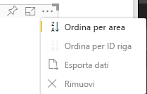

# <a name="sorting-options"></a>Opzioni di ordinamento

`Sorting` specifica il comportamento di ordinamento predefinito per l'oggetto visivo.
La funzionalità richiede uno dei parametri descritti di seguito:

## <a name="default-sorting"></a>Ordinamento predefinito

L'opzione `default` è la forma più semplice. Permette di ordinare i dati presentati nella sezione "DataMappings".
Questa opzione permette l'ordinamento di "DataMappings" da parte dell'utente e l'impostazione della direzione di ordinamento.

```json
    "sorting": {
        "default": {   }
    }
```



## <a name="implicit-sorting"></a>Ordinamento implicito

`implicit` esegue l'ordinamento con il parametro di matrice `clauses`, che descrive l'ordinamento per ogni ruolo di dati.
`implicit` indica che l'utente dell'oggetto visivo non può modificare l'ordinamento.
Power BI non visualizzerà le opzioni di ordinamento nel menu dell'oggetto visivo. Tuttavia, Power BI ordinerà i dati in base alle impostazioni specificate.

I parametri `clauses` possono contenere diversi oggetti con due parametri:

- `role`: determina l'oggetto `DataMapping` per l'ordinamento.

- `direction`: determina la direzione di ordinamento (1 = crescente, 2 = decrescente).

```json
    "sorting": {
        "implicit": {
            "clauses": [
                {
                    "role": "category",
                    "direction": 1
                },
                {
                    "role": "measure",
                    "direction": 2
                }
            ]
        }
    }
```

## <a name="custom-sorting"></a>Ordinamento personalizzato

`custom` indica che l'ordinamento viene gestito dallo sviluppatore nel codice dell'oggetto visivo.
