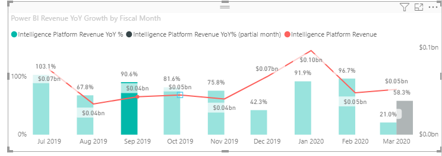

# <a name="use-the-supportskeyboardfocus-feature"></a>Usare la funzionalità supportsKeyboardFocus

Questo articolo descrive come usare la funzionalità `supportsKeyboardFocus` negli oggetti visivi di Power BI.
La funzionalità `supportsKeyboardFocus` consente di spostarsi tra i punti dati dell'oggetto visivo usando solo la tastiera.

Per altre informazioni sulla navigazione da tastiera per gli oggetti visivi, vedere [Navigazione da tastiera](../../create-reports/desktop-accessibility-consuming-tools.md#keyboard-navigation).

## <a name="example"></a>Esempio

Aprire un oggetto visivo che usa la funzionalità `supportsKeyboardFocus`. Selezionare un punto dati all'interno dell'oggetto visivo e selezionare TAB. Ogni volta che si seleziona TAB, lo stato attivo passa al punto dati successivo. Selezionare INVIO per selezionare il punto dati evidenziato.



## <a name="requirements"></a>Requisiti

Questa funzionalità richiede l'API v2.1.0 o versione successiva.

Questa funzionalità può essere applicata a tutti gli oggetti visivi ad eccezione degli oggetti visivi immagine.

## <a name="usage"></a>Usage

Per usare la funzionalità `supportsKeyboardFocus`, aggiungere il codice seguente al file *capabilities.json* dell'oggetto visivo.
Questa funzionalità consente all'oggetto visivo di ricevere lo stato attivo tramite la navigazione da tastiera.

```json
    {   
            ...
        "supportsKeyboardFocus": true
            ...
    }

```

## <a name="next-steps"></a>Passaggi successivi

Per altre informazioni sulle funzionalità di accessibilità, vedere [Progettare report di Power BI per l'accessibilità](../../create-reports/desktop-accessibility-creating-reports.md).

Per provare lo sviluppo in Power BI, vedere [Sviluppo di un oggetto visivo di Power BI](custom-visual-develop-tutorial.md).
