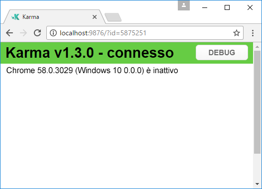
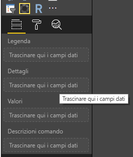
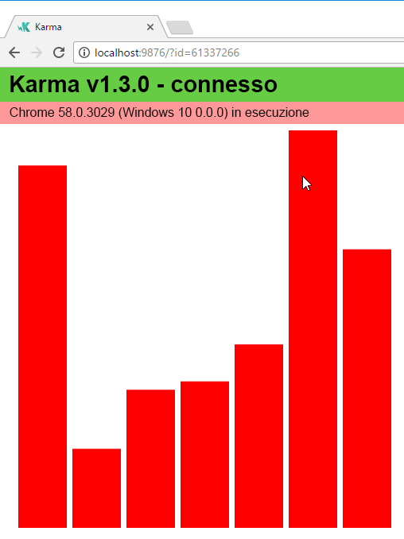
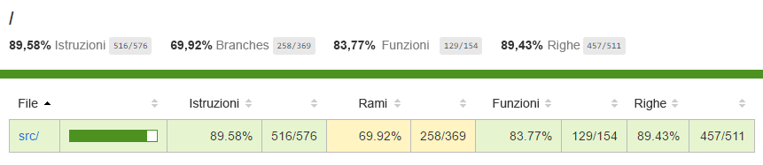
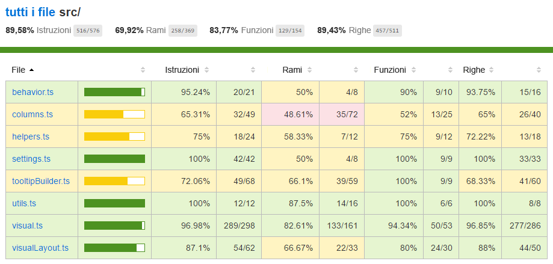

# <a name="tutorial-add-unit-tests-for-power-bi-visual-projects"></a>Esercitazione: Aggiungere unit test per progetti con oggetti visivi di Power BI

Questa esercitazione contiene le nozioni di base per la scrittura di unit test per gli oggetti visivi di Power BI.

In questa esercitazione viene descritto:

* Come usare lo strumento di esecuzione di test karma.js e il framework di test jasmine.js
* Come usare il pacchetto powerbi-visuals-utils-testutils
* In che modo il set di simulazioni contribuisce a semplificare gli unit test per gli oggetti visivi di Power BI.

## <a name="prerequisites"></a>Prerequisiti

* Progetto con oggetti visivi di Power BI esistente
* Ambiente Node.JS configurato

## <a name="install-and-configure-karmajs-and-jasmine"></a>Installare e configurare karma.js e jasmine

Aggiungere le librerie necessarie in package.json nella sezione `devDependencies`:

```json
"@babel/polyfill": "^7.2.5",
"@types/d3": "5.5.0",
"@types/jasmine": "2.5.37",
"@types/jasmine-jquery": "1.5.28",
"@types/jquery": "2.0.41",
"@types/karma": "3.0.0",
"@types/lodash-es": "4.17.1",
"coveralls": "3.0.2",
"istanbul-instrumenter-loader": "^3.0.1",
"jasmine": "2.5.2",
"jasmine-core": "2.5.2",
"jasmine-jquery": "2.1.1",
"jquery": "3.1.1",
"karma": "3.1.1",
"karma-chrome-launcher": "2.2.0",
"karma-coverage": "1.1.2",
"karma-coverage-istanbul-reporter": "^2.0.4",
"karma-jasmine": "2.0.1",
"karma-junit-reporter": "^1.2.0",
"karma-sourcemap-loader": "^0.3.7",
"karma-typescript": "^3.0.13",
"karma-typescript-preprocessor": "0.4.0",
"karma-webpack": "3.0.5",
"puppeteer": "1.17.0",
"style-loader": "0.23.1",
"ts-loader": "5.3.0",
"ts-node": "7.0.1",
"tslint": "^5.12.0",
"webpack": "4.26.0"
```

Per altre informazioni sul pacchetto, vedere la descrizione seguente.

Salvare `package.json` e sulla riga di comando eseguire il codice seguente nel percorso di `package.json`:

```cmd
npm install
```

La gestione pacchetti installerà tutti i nuovi pacchetti aggiunti a `package.json`

Per l'esecuzione degli unit test, è necessario configurare lo strumento di esecuzione dei test e la configurazione `webpack`. L'esempio di configurazione è disponibile qui

Esempio di `test.webpack.config.js`:

```typescript
const path = require('path');
const webpack = require("webpack");

module.exports = {
    devtool: 'source-map',
    mode: 'development',
    optimization : {
        concatenateModules: false,
        minimize: false
    },
    module: {
        rules: [
            {
                test: /\.tsx?$/,
                use: 'ts-loader',
                exclude: /node_modules/
            },
            {
                test: /\.json$/,
                loader: 'json-loader'
            },
            {
                test: /\.tsx?$/i,
                enforce: 'post',
                include: /(src)/,
                exclude: /(node_modules|resources\/js\/vendor)/,
                loader: 'istanbul-instrumenter-loader',
                options: { esModules: true }
            },
            {
                test: /\.less$/,
                use: [
                    {
                        loader: 'style-loader'
                    },
                    {
                        loader: 'css-loader'
                    },
                    {
                        loader: 'less-loader',
                        options: {
                            paths: [path.resolve(__dirname, 'node_modules')]
                        }
                    }
                ]
            }
        ]
    },
    externals: {
        "powerbi-visuals-api": '{}'
    },
    resolve: {
        extensions: ['.tsx', '.ts', '.js', '.css']
    },
    output: {
        path: path.resolve(__dirname, ".tmp/test")
    },
    plugins: [
        new webpack.ProvidePlugin({
            'powerbi-visuals-api': null
        })
    ]
};
```

Esempio di `karma.conf.ts`

```typescript
"use strict";

const webpackConfig = require("./test.webpack.config.js");
const tsconfig = require("./test.tsconfig.json");
const path = require("path");

const testRecursivePath = "test/visualTest.ts";
const srcOriginalRecursivePath = "src/**/*.ts";
const coverageFolder = "coverage";

process.env.CHROME_BIN = require("puppeteer").executablePath();

import { Config, ConfigOptions } from "karma";

module.exports = (config: Config) => {
    config.set(<ConfigOptions>{
        mode: "development",
        browserNoActivityTimeout: 100000,
        browsers: ["ChromeHeadless"], // or Chrome to use locally installed Chrome browser
        colors: true,
        frameworks: ["jasmine"],
        reporters: [
            "progress",
            "junit",
            "coverage-istanbul"
        ],
        junitReporter: {
            outputDir: path.join(__dirname, coverageFolder),
            outputFile: "TESTS-report.xml",
            useBrowserName: false
        },
        singleRun: true,
        plugins: [
            "karma-coverage",
            "karma-typescript",
            "karma-webpack",
            "karma-jasmine",
            "karma-sourcemap-loader",
            "karma-chrome-launcher",
            "karma-junit-reporter",
            "karma-coverage-istanbul-reporter"
        ],
        files: [
            "node_modules/jquery/dist/jquery.min.js",
            "node_modules/jasmine-jquery/lib/jasmine-jquery.js",
            {
                pattern: './capabilities.json',
                watched: false,
                served: true,
                included: false
            },
            testRecursivePath,
            {
                pattern: srcOriginalRecursivePath,
                included: false,
                served: true
            }
        ],
        preprocessors: {
            [testRecursivePath]: ["webpack", "coverage"]
        },
        typescriptPreprocessor: {
            options: tsconfig.compilerOptions
        },
        coverageIstanbulReporter: {
            reports: ["html", "lcovonly", "text-summary", "cobertura"],
            dir: path.join(__dirname, coverageFolder),
            'report-config': {
                html: {
                    subdir: 'html-report'
                }
            },
            combineBrowserReports: true,
            fixWebpackSourcePaths: true,
            verbose: false
        },
        coverageReporter: {
            dir: path.join(__dirname, coverageFolder),
            reporters: [
                // reporters not supporting the `file` property
                { type: 'html', subdir: 'html-report' },
                { type: 'lcov', subdir: 'lcov' },
                // reporters supporting the `file` property, use `subdir` to directly
                // output them in the `dir` directory
                { type: 'cobertura', subdir: '.', file: 'cobertura-coverage.xml' },
                { type: 'lcovonly', subdir: '.', file: 'report-lcovonly.txt' },
                { type: 'text-summary', subdir: '.', file: 'text-summary.txt' },
            ]
        },
        mime: {
            "text/x-typescript": ["ts", "tsx"]
        },
        webpack: webpackConfig,
        webpackMiddleware: {
            stats: "errors-only"
        }
    });
};
```

Se necessario, è possibile modificare questa configurazione.

Alcune impostazioni di `karma.conf.js`:

* La variabile `recursivePathToTests` individua la posizione del codice dei test.

* La variabile `srcRecursivePath` individua il codice JS di output dopo la compilazione.

* La variabile `srcCssRecursivePath` individua i CSS di output dopo la compilazione di un numero inferiore di file con stili.

* La variabile `srcOriginalRecursivePath` individua il codice sorgente dell'oggetto visivo.

* La variabile `coverageFolder` determina una posizione in cui verrà creato il report della code coverage.

Alcune proprietà della configurazione:

* `singleRun: true`: i test vengono eseguiti nel sistema di integrazione continua. È sufficiente una sola esecuzione.
È possibile passare a `false` per il debug dei test. Karma mantiene il browser in esecuzione e permette di usare la console per il debug.

* `files: [...]`: in questa matrice è possibile impostare file per il caricamento nel browser.
In genere, si tratta di file di origine, test case e librerie (jasmine, testutils). Se necessario, è possibile aggiungere altri file all'elenco.

* `preprocessors`: questa sezione di configurazione permette di configurare le azioni che vengono eseguite prima dell'esecuzione degli unit test. Vengono eseguite la precompilazione di typescript in JS, la preparazione dei file della mappa di origine e la generazione del report della code coverage. È possibile disabilitare `coverage` per il debug dei test. La code coverage genera codice aggiuntivo per il codice di controllo per la code coverage dei test e complica i test di debug.

**La descrizione di tutte le configurazioni è disponibile nella [documentazione](https://karma-runner.github.io/1.0/config/configuration-file.html) di karma.js**

Per un uso pratico, è possibile aggiungere il comando di test in `scripts`:

```json
{
    "scripts": {
        "pbiviz": "pbiviz",
        "start": "pbiviz start",
        "typings":"node node_modules/typings/dist/bin.js i",
        "lint": "tslint -r \"node_modules/tslint-microsoft-contrib\"  \"+(src|test)/**/*.ts\"",
        "pretest": "pbiviz package --resources --no-minify --no-pbiviz --no-plugin",
        "test": "karma start"
    }
    ...
}
```

È quindi possibile iniziare la scrittura degli unit test.

## <a name="simple-unit-test-for-check-dom-element-of-the-visual"></a>Semplice unit test per il controllo dell'elemento DOM dell'oggetto visivo

Per il test dell'oggetto visivo, è necessario creare un'istanza dell'oggetto visivo stesso.

### <a name="creating-visual-instance-builder"></a>Creazione di un generatore dell'istanza dell'oggetto visivo

Aggiungere il file `visualBuilder.ts` nella cartella `test` con il codice seguente:

```typescript
import {
    VisualBuilderBase
} from "powerbi-visuals-utils-testutils";

import {
    BarChart as VisualClass
} from "../src/visual";

import  powerbi from "powerbi-visuals-api";
import VisualConstructorOptions = powerbi.extensibility.visual.VisualConstructorOptions;

export class BarChartBuilder extends VisualBuilderBase<VisualClass> {
    constructor(width: number, height: number) {
        super(width, height);
    }

    protected build(options: VisualConstructorOptions) {
        return new VisualClass(options);
    }

    public get mainElement() {
        return this.element.children("svg.barChart");
    }
}
```

È disponibile un metodo `build` per la creazione di un'istanza dell'oggetto visivo. `mainElement` è un metodo Get che restituisce un'istanza dell'elemento DOM "radice" nell'oggetto visivo. Il metodo Get è facoltativo, ma semplifica la scrittura dello unit test.

È stato creato il generatore di un'istanza dell'oggetto visivo. Verrà ora scritto il test case. Si tratta di un test case per controllare gli elementi SVG creati quando viene visualizzato l'oggetto visivo.

### <a name="creating-typescript-file-to-write-test-cases"></a>Creazione di un file typescript per la scrittura di test case

Aggiungere il file `visualTest.ts` per i test case con questo codice:

```typescript
import powerbi from "powerbi-visuals-api";

import { BarChartBuilder } from "./VisualBuilder";

import {
    BarChart as VisualClass
} from "../src/visual";

import VisualBuilder = powerbi.extensibility.visual.test.BarChartBuilder;

describe("BarChart", () => {
    let visualBuilder: VisualBuilder;
    let dataView: DataView;

    beforeEach(() => {
        visualBuilder = new VisualBuilder(500, 500);
    });

    it("root DOM element is created", () => {
        expect(visualBuilder.mainElement).toBeInDOM();
    });
});
```

Vengono chiamati diversi metodi.

* Il metodo [`describe`](https://jasmine.github.io/api/2.6/global.html#describe) descrive il test case. Nel contesto del framework jasmine viene spesso denominato una suite o un gruppo di specifiche.

* Il metodo `beforeEach` verrà chiamato prima di ogni chiamata del metodo `it`, definito all'interno del metodo [`describe`](https://jasmine.github.io/api/2.6/global.html#beforeEach).

* `it` definisce una singola specifica. Il metodo [`it`](https://jasmine.github.io/api/2.6/global.html#it) deve contenere uno o più oggetti `expectations`.

* Il metodo [`expect`](https://jasmine.github.io/api/2.6/global.html#expect) crea una previsione per una specifica. Una specifica ha esito positivo se tutte le previsioni vengono passate senza errori.

* `toBeInDOM` è uno dei metodi matcher. Per informazioni sui metodi matcher esistenti, vedere la [documentazione](https://jasmine.github.io/api/2.6/matchers.html) del framework jasmine.

**Per altre informazioni sul framework jasmine, vedere la [documentazione](https://jasmine.github.io/) ufficiale.**

È quindi possibile eseguire lo unit test digitando un comando nello strumento da riga di comando.

Questo test verifica che venga creato l'elemento SVG radice degli oggetti visivi.

### <a name="launch-unit-tests"></a>Avviare gli unit test

Per eseguire lo unit test, è possibile digitare questo comando nello strumento da riga di comando.

```cmd
npm run test
```

`karma.js` esegue il browser Chrome e quindi il test case.



> [!NOTE]
> Google Chrome deve essere installato in locale.

Nella riga di comando si ottiene l'output seguente:

```cmd
> karma start

23 05 2017 12:24:26.842:WARN [watcher]: Pattern "E:/WORKSPACE/PowerBI/PowerBI-visuals-sampleBarChart/data/*.csv" does not match any file.
23 05 2017 12:24:30.836:WARN [karma]: No captured browser, open http://localhost:9876/
23 05 2017 12:24:30.849:INFO [karma]: Karma v1.3.0 server started at http://localhost:9876/
23 05 2017 12:24:30.850:INFO [launcher]: Launching browser Chrome with unlimited concurrency
23 05 2017 12:24:31.059:INFO [launcher]: Starting browser Chrome
23 05 2017 12:24:33.160:INFO [Chrome 58.0.3029 (Windows 10 0.0.0)]: Connected on socket /#2meR6hjXFmsE_fjiAAAA with id 5875251
Chrome 58.0.3029 (Windows 10 0.0.0): Executed 1 of 1 SUCCESS (0.194 secs / 0.011 secs)

=============================== Coverage summary ===============================
Statements   : 27.43% ( 65/237 )
Branches     : 19.84% ( 25/126 )
Functions    : 43.86% ( 25/57 )
Lines        : 20.85% ( 44/211 )
================================================================================
```

### <a name="how-to-add-static-data-for-unit-tests"></a>Come aggiungere dati statici per gli unit test

Creare il file `visualData.ts` nella cartella `test`. Con questo codice:

```typescript
import powerbi from "powerbi-visuals-api";
import DataView = powerbi.DataView;

import {
    testDataViewBuilder,
    getRandomNumbers
} from "powerbi-visuals-utils-testutils";

export class SampleBarChartDataBuilder extends TestDataViewBuilder {
    public static CategoryColumn: string = "category";
    public static MeasureColumn: string = "measure";

    public constructor() {
        super();
        ...
    }

    public getDataView(columnNames?: string[]): DataView {
        let dateView: any = this.createCategoricalDataViewBuilder([
            ...
        ],
        [
            ...
        ], columnNames).build();

        // there's client side computed maxValue
        let maxLocal = 0;
        this.valuesMeasure.forEach((item) => {
                if (item > maxLocal) {
                    maxLocal = item;
                }
        });
        (<any>dataView).categorical.values[0].maxLocal = maxLocal;
    }
}
```

La classe `SampleBarChartDataBuilder` estende `TestDataViewBuilder` e implementa il metodo astratto `getDataView`.

Quando si inseriscono i dati in bucket di campi dati, Power BI produce un oggetto `dataview` categorico basato sui dati.



Negli unit test non sono disponibili funzioni di base di Power BI per riprodurlo. Tuttavia, è necessario eseguire il mapping dei dati statici all'oggetto `dataview` categorico. La classe `TestDataViewBuilder` può essere utile a questo scopo.

[Altre informazioni su DataViewMapping](https://github.com/Microsoft/PowerBI-visuals/blob/master/Capabilities/DataViewMappings.md)

Nel metodo `getDataView` è sufficiente chiamare il metodo `createCategoricalDataViewBuilder` con i dati.

[capabilities.json](https://github.com/Microsoft/PowerBI-visuals-sampleBarChart/blob/master/capabilities.json#L2) per l'oggetto visivo `sampleBarChart` include gli oggetti dataRoles and dataViewMapping:

```json
"dataRoles": [
    {
        "displayName": "Category Data",
        "name": "category",
        "kind": "Grouping"
    },
    {
        "displayName": "Measure Data",
        "name": "measure",
        "kind": "Measure"
    }
],
"dataViewMappings": [
    {
        "conditions": [
            {
                "category": {
                    "max": 1
                },
                "measure": {
                    "max": 1
                }
            }
        ],
        "categorical": {
            "categories": {
                "for": {
                    "in": "category"
                }
            },
            "values": {
                "select": [
                    {
                        "bind": {
                            "to": "measure"
                        }
                    }
                ]
            }
        }
    }
],
```

Per generare lo stesso mapping, è necessario impostare i parametri seguenti sul metodo `createCategoricalDataViewBuilder`:

```typescript
([
    {
        source: {
            displayName: "Category",
            queryName: SampleBarChartData.ColumnCategory,
            type: ValueType.fromDescriptor({ text: true }),
            roles: {
                Category: true
            },
        },
        values: this.valuesCategory
    }
],
[
    {
        source: {
            displayName: "Measure",
            isMeasure: true,
            queryName: SampleBarChartData.MeasureColumn,
            type: ValueType.fromDescriptor({ numeric: true }),
            roles: {
                Measure: true
            },
        },
        values: this.valuesMeasure
    },
], columnNames)
```

Dove `this.valuesCategory` è la matrice di categorie.

```ts
public valuesCategory: string[] = ["Monday", "Tuesday", "Wednesday", "Thursday", "Friday", "Saturday", "Sunday"];
```

Mentre `this.valuesMeasure` è la matrice di misure per ogni categoria. Esempio:

```ts
public valuesMeasure: number[] = [742731.43, 162066.43, 283085.78, 300263.49, 376074.57, 814724.34, 570921.34];
```

È ora possibile usare la classe `SampleBarChartDataBuilder` nello unit test.

La classe `ValueType` viene definita nel pacchetto `powerbi-visuals-utils-testutils`. Il metodo `createCategoricalDataViewBuilder` richiede la libreria `lodash`.

Aggiungere questi pacchetti alle dipendenze.

In `package.json` nella sezione `devDependencies`

```json
"lodash-es": "4.17.1",
"powerbi-visuals-utils-testutils": "2.2.0"
```

Chiamare

```cmd
npm install
```

Per installare la libreria `lodash-es`.

È ora possibile eseguire di nuovo lo unit test. Si otterrà questo output

```cmd
> karma start

23 05 2017 16:19:54.318:WARN [watcher]: Pattern "E:/WORKSPACE/PowerBI/PowerBI-visuals-sampleBarChart/data/*.csv" does not match any file.
23 05 2017 16:19:58.333:WARN [karma]: No captured browser, open http://localhost:9876/
23 05 2017 16:19:58.346:INFO [karma]: Karma v1.3.0 server started at http://localhost:9876/
23 05 2017 16:19:58.346:INFO [launcher]: Launching browser Chrome with unlimited concurrency
23 05 2017 16:19:58.394:INFO [launcher]: Starting browser Chrome
23 05 2017 16:19:59.873:INFO [Chrome 58.0.3029 (Windows 10 0.0.0)]: Connected on socket /#NcNTAGH9hWfGMCuEAAAA with id 3551106
Chrome 58.0.3029 (Windows 10 0.0.0): Executed 1 of 1 SUCCESS (1.266 secs / 1.052 secs)

=============================== Coverage summary ===============================
Statements   : 56.72% ( 135/238 )
Branches     : 32.54% ( 41/126 )
Functions    : 66.67% ( 38/57 )
Lines        : 52.83% ( 112/212 )
================================================================================
```

Inoltre, dovrebbe essere visualizzato il browser Chrome con l'oggetto visivo.



Osservare che il riepilogo della code coverage è aumentato. Aprire `coverage\index.html` per ottenere altre informazioni sulla code coverage corrente



O nell'ambito della cartella `src`



Nell'ambito del file è possibile esaminare il codice sorgente. L'utilità `Coverage` contrassegna lo sfondo della riga in rosso se non è stato eseguito codice durante l'esecuzione degli unit test.


> [!IMPORTANT]
> Tuttavia, il valore della code coverage non significa che la code coverage della funzionalità sia appropriata per l'oggetto visivo. Un semplice unit test ha fornito il 96% di code coverage in `src\visual.ts`.

## <a name="next-steps"></a>Passaggi successivi

Quando l'oggetto visivo è pronto, è possibile inviarlo per la pubblicazione.

[Altre informazioni sulla pubblicazione di oggetti visivi in AppSource](../office-store.md)
