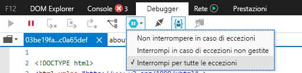
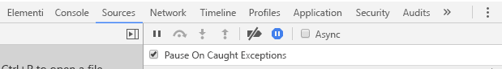

# <a name="how-to-debug-power-bi-visuals"></a>Come eseguire il debug degli oggetti visivi di Power BI

Questa pagina illustra alcuni suggerimenti per eseguire il debug durante la compilazione dell'oggetto visivo. Vengono illustrati i passaggi di base e le differenze tra l'esecuzione del dubug nelle applicazioni front-end standard e negli oggetti visivi di Power BI.
Dopo aver letto l'articolo, sarà possibile eseguire il debug di oggetti visivi di Power BI usando i punti di interruzione, registrare le eccezioni e intercettarle in Chrome ed Edge.

## <a name="using-breakpoints"></a>Uso dei punti di interruzione

Poiché il codice JavaScript dell'oggetto visivo viene completamente ricaricato ogni volta che l'oggetto visivo viene aggiornato, eventuali punti di interruzione aggiunti andranno persi quando l'oggetto visivo di debug viene aggiornato. Come soluzione alternativa, è possibile usare istruzioni `debugger` nel codice. Quando si usa `debugger` nel codice, è consigliabile disattivare il ricaricamento automatico.

```typescript
public update(options: VisualUpdateOptions) {
    console.log('Visual update', options);
    debugger;
    this.target.innerHTML = `<p>Update count: <em>${(this.updateCount</em></p>`;
}
```


## <a name="showing-exceptions"></a>Visualizzazione delle eccezioni

Quando si lavora sull'oggetto visivo, si noterà che tutti gli errori vengono 'utilizzati' dal servizio Power BI. Si tratta di una funzionalità intenzionale di Power BI per impedire che gli oggetti visivi con un comportamento anomalo rendano instabile l'intera app.

Come soluzione alternativa, aggiungere codice per rilevare e registrare le eccezioni oppure impostare il debugger in modo che interrompa le eccezioni rilevate.


## <a name="log-exceptions"></a>Registrare le eccezioni

Per registrare le eccezioni nell'oggetto visivo di Power BI, aggiungere il codice seguente all'oggetto visivo per definire un elemento Decorator di registrazione delle eccezioni.

```typescript
export function logExceptions(): MethodDecorator {
    return function (target: Object, propertyKey: string, descriptor: TypedPropertyDescriptor<any>): TypedPropertyDescriptor<any> {
        return {
            value: function () {
                try {
                    return descriptor.value.apply(this, arguments);
                } catch (e) {
                    console.error(e);
                    throw e;
                }
            }
        }
    }
}
```
Tale elemento Decorator potrà quindi essere usato in qualsiasi funzione per visualizzare la registrazione degli errori.

```typescript
@logExceptions()
public update(options: VisualUpdateOptions) {
```

## <a name="break-on-exceptions"></a>Interrompere le eccezioni

È anche possibile impostare il browser in modo che interrompa le eccezioni rilevate. In questo modo si interrompe l'esecuzione del codice ogni volta che si verifica un errore ed è possibile eseguire il debug da questa posizione.

### <a name="edge"></a>Microsoft Edge

1. Aprire Strumenti di sviluppo (F12).
2. Andare alla scheda **Debugger**.
3. Fare clic sull'icona che consente di **interrompere in caso di eccezioni** (esagono con un simbolo di pausa).
4. Selezionare **Interrompi per tutte le eccezioni**.



## <a name="chrome"></a>Chrome

1. Aprire Strumenti per sviluppatori (F12).
2. Passare alla scheda **Sources** (Origini).
3. Fare clic sull'icona che consente di **interrompere in caso di eccezioni** (segnale di arresto con un simbolo di pausa).
4. Selezionare la casella di controllo **Pause On Caught Exceptions** (Sospendi per le eccezioni rilevate).



## <a name="next-steps"></a>Passaggi successivi
* [Risoluzione dei problemi relativi agli oggetti visivi di Power BI](power-bi-custom-visuals-troubleshoot.md)
* Per altre informazioni e risposte, vedere [Domande frequenti sugli oggetti visivi di Power BI](power-bi-custom-visuals-faq.md#organizational-power-bi-visuals)
