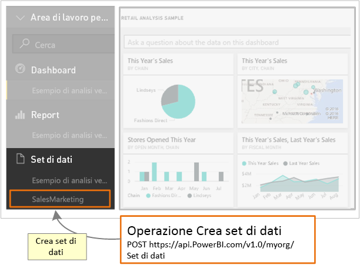

# <a name="step-3-create-a-dataset-in-power-bi"></a>Passaggio 3: Creare un set di dati in Power BI
Questo articolo fa parte di una procedura dettagliata per il [push dei dati in un set di dati](walkthrough-push-data.md).

Nel **passaggio 2** [Ottenere un token di accesso per l'autenticazione](walkthrough-push-data-get-token.md) della procedura per il push dei dati in un set di dati è stato ottenuto un token per l'autenticazione in **Azure AD**. In questo passaggio il token viene usato per chiamare l'operazione [PostDataset](https://docs.microsoft.com/rest/api/power-bi/pushdatasets).

Per effettuare una chiamata a una risorsa REST, si usa un URL che individua la risorsa e si invia una stringa JSON (JavaScript Object Notation), che descrive il set di dati, alla risorsa del servizio Power BI. Una risorsa REST identifica la parte del servizio Power BI con cui si vuole lavorare. Per il push dei dati nel set di dati, la risorsa di destinazione è un **set di dati**. L'URL che identifica un set di dati è https://api.PowerBI.com/v1.0/myorg/datasets. Se si effettua il push dei dati all'interno di un gruppo, l'url è https://api.PowerBI.com/v1.0/myorg/groups/{group_id}/datasets.

Per autenticare un'operazione REST di Power BI, si aggiunge il token ottenuto in [Ottenere un token di accesso per l'autenticazione](walkthrough-push-data-get-token.md) a un'intestazione della richiesta:

Quando si chiama l'operazione [PostDataset](https://docs.microsoft.com/rest/api/power-bi/pushdatasets), viene creato un nuovo set di dati. 



Ecco come creare un set di dati in un dashboard in Power BI.

## <a name="create-a-dataset-in-power-bi"></a>Creare un set di dati in Power BI
> [!NOTE]
> Prima di iniziare, assicurarsi di aver seguito i passaggi precedenti della procedura dettagliata per il [push dei dati in un set di dati](walkthrough-push-data.md).
> 
> 

1. Nel progetto Applicazione console creato nel [Passaggio 2: Ottenere un token di accesso per l'autenticazione](walkthrough-push-data-get-token.md) aggiungere **using System.Net;** e **using System.IO;** a Program.cs.
2. In Program.cs aggiungere il codice seguente.
3. Eseguire l'app console e accedere al proprio account di Power BI. Nella finestra della console dovrebbe comparire **Set di dati creato** . È anche possibile accedere a Power BI per visualizzare il nuovo set di dati.

**Push di dati di esempio in un set di dati**

Aggiungere questo codice in Program.cs.

* In static void Main(string[] args):
  
    ```csharp
    static void Main(string[] args)
    {
        //Get an authentication access token
        token = GetToken();
  
        //Create a dataset in Power BI
        CreateDataset();
    }
    ```
* Aggiungere un metodo CreateDataset():
  
    ```csharp
    #region Create a dataset in Power BI
    private static void CreateDataset()
    {
        //TODO: Add using System.Net and using System.IO
  
        string powerBIDatasetsApiUrl = "https://api.powerbi.com/v1.0/myorg/datasets";
        //POST web request to create a dataset.
        //To create a Dataset in a group, use the Groups uri: https://api.PowerBI.com/v1.0/myorg/groups/{group_id}/datasets
        HttpWebRequest request = System.Net.WebRequest.Create(powerBIDatasetsApiUrl) as System.Net.HttpWebRequest;
        request.KeepAlive = true;
        request.Method = "POST";
        request.ContentLength = 0;
        request.ContentType = "application/json";
  
        //Add token to the request header
        request.Headers.Add("Authorization", String.Format("Bearer {0}", token));
  
        //Create dataset JSON for POST request
        string datasetJson = "{\"name\": \"SalesMarketing\", \"tables\": " +
            "[{\"name\": \"Product\", \"columns\": " +
            "[{ \"name\": \"ProductID\", \"dataType\": \"Int64\"}, " +
            "{ \"name\": \"Name\", \"dataType\": \"string\"}, " +
            "{ \"name\": \"Category\", \"dataType\": \"string\"}," +
            "{ \"name\": \"IsCompete\", \"dataType\": \"bool\"}," +
            "{ \"name\": \"ManufacturedOn\", \"dataType\": \"DateTime\"}" +
            "]}]}";
  
        //POST web request
        byte[] byteArray = System.Text.Encoding.UTF8.GetBytes(datasetJson);
        request.ContentLength = byteArray.Length;
  
        //Write JSON byte[] into a Stream
        using (Stream writer = request.GetRequestStream())
        {
            writer.Write(byteArray, 0, byteArray.Length);
  
            var response = (HttpWebResponse)request.GetResponse();
  
            Console.WriteLine(string.Format("Dataset {0}", response.StatusCode.ToString()));
  
            Console.ReadLine();
        }
    }
    #endregion
    ```

Il passaggio successivo illustra come [ottenere un set di dati per aggiungere righe in una tabella di Power BI](walkthrough-push-data-get-datasets.md).

Di seguito è riportato il [listato di codice completo](#code).

<a name="code"/>

## <a name="complete-code-listing"></a>Listato di codice completo

```csharp
using System;
using Microsoft.IdentityModel.Clients.ActiveDirectory;
using System.Net;
using System.IO;

namespace walkthrough_push_data
{
    class Program
    {
        private static string token = string.Empty;

        static void Main(string[] args)
        {

            //Get an authentication access token
            token = GetToken();

            //Create a dataset in Power BI
            CreateDataset();

        }

        #region Get an authentication access token
        private static string GetToken()
        {
            // TODO: Install-Package Microsoft.IdentityModel.Clients.ActiveDirectory -Version 2.21.301221612
            // and add using Microsoft.IdentityModel.Clients.ActiveDirectory

            //The client id that Azure AD created when you registered your client app.
            string clientID = "{Client_ID}";

            //RedirectUri you used when you register your app.
            //For a client app, a redirect uri gives Azure AD more details on the application that it will authenticate.
            // You can use this redirect uri for your client app
            string redirectUri = "https://login.live.com/oauth20_desktop.srf";

            //Resource Uri for Power BI API
            string resourceUri = "https://analysis.windows.net/powerbi/api";

            //OAuth2 authority Uri
            string authorityUri = "https://login.microsoftonline.com/common/";

            //Get access token:
            // To call a Power BI REST operation, create an instance of AuthenticationContext and call AcquireToken
            // AuthenticationContext is part of the Active Directory Authentication Library NuGet package
            // To install the Active Directory Authentication Library NuGet package in Visual Studio,
            //  run "Install-Package Microsoft.IdentityModel.Clients.ActiveDirectory" from the nuget Package Manager Console.

            // AcquireToken will acquire an Azure access token
            // Call AcquireToken to get an Azure token from Azure Active Directory token issuance endpoint
            AuthenticationContext authContext = new AuthenticationContext(authorityUri);
            string token = authContext.AcquireToken(resourceUri, clientID, new Uri(redirectUri)).AccessToken;

            Console.WriteLine(token);
            Console.ReadLine();

            return token;
        }

        #endregion


        #region Create a dataset in Power BI
        private static void CreateDataset()
        {
            //TODO: Add using System.Net and using System.IO

            string powerBIDatasetsApiUrl = "https://api.powerbi.com/v1.0/myorg/datasets";
            //POST web request to create a dataset.
            //To create a Dataset in a group, use the Groups uri: https://api.PowerBI.com/v1.0/myorg/groups/{group_id}/datasets
            HttpWebRequest request = System.Net.WebRequest.Create(powerBIDatasetsApiUrl) as System.Net.HttpWebRequest;
            request.KeepAlive = true;
            request.Method = "POST";
            request.ContentLength = 0;
            request.ContentType = "application/json";

            //Add token to the request header
            request.Headers.Add("Authorization", String.Format("Bearer {0}", token));

            //Create dataset JSON for POST request
            string datasetJson = "{\"name\": \"SalesMarketing\", \"tables\": " +
                "[{\"name\": \"Product\", \"columns\": " +
                "[{ \"name\": \"ProductID\", \"dataType\": \"Int64\"}, " +
                "{ \"name\": \"Name\", \"dataType\": \"string\"}, " +
                "{ \"name\": \"Category\", \"dataType\": \"string\"}," +
                "{ \"name\": \"IsCompete\", \"dataType\": \"bool\"}," +
                "{ \"name\": \"ManufacturedOn\", \"dataType\": \"DateTime\"}" +
                "]}]}";

            //POST web request
            byte[] byteArray = System.Text.Encoding.UTF8.GetBytes(datasetJson);
            request.ContentLength = byteArray.Length;

            //Write JSON byte[] into a Stream
            using (Stream writer = request.GetRequestStream())
            {
                writer.Write(byteArray, 0, byteArray.Length);

                var response = (HttpWebResponse)request.GetResponse();

                Console.WriteLine(string.Format("Dataset {0}", response.StatusCode.ToString()));

                Console.ReadLine();
            }
        }
        #endregion
    }
}
```

[Passaggio successivo >](walkthrough-push-data-get-datasets.md)

## <a name="next-steps"></a>Passaggi successivi
[Ottenere un set di dati per aggiungere righe in una tabella di Power BI](walkthrough-push-data-get-datasets.md)  
[Ottenere un token di accesso per l'autenticazione](walkthrough-push-data-get-token.md)  
[PostDataset](https://docs.microsoft.com/rest/api/power-bi/pushdatasets/datasets_postdataset)  
[PostDatasetInGroup](https://docs.microsoft.com/rest/api/power-bi/pushdatasets/datasets_postdatasetingroup)  
[Eseguire il push dei dati in un dashboard di Power BI](walkthrough-push-data.md)  
[Panoramica dell'API REST di Power BI](overview-of-power-bi-rest-api.md)  
[Riferimento all'API REST di Power BI](https://docs.microsoft.com/rest/api/power-bi/)  

Altre domande? [Provare la community di Power BI](http://community.powerbi.com/)

