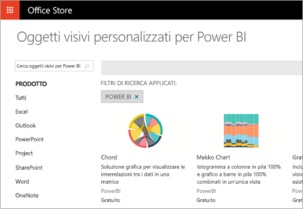

# Quali operazioni possono eseguire gli sviluppatori con Power BI?

Gli sviluppatori hanno diverse opzioni per provare a includere contenuto di Power BI nelle applicazioni. Queste opzioni includono **incorporamento con Power BI**, **oggetti visivi personalizzati** e **push dei dati in Power BI**.

## Incorporamento
Il servizio Power BI (SaaS) e il servizio Power BI Embedded in Azure (PaaS) offrono API per l'incorporamento di dashboard e report. Questo significa che si avrà un set di funzionalità e l'accesso alle ultime funzionalità di Power BI, ad esempio dashboard, gateway e aree di lavoro per le app, quando si incorpora il contenuto.

## Sviluppare oggetti visivi personalizzati
Gli oggetti visivi personalizzati consentono di creare oggetti visivi da usare all'interno dei report di Power BI. Gli oggetti visivi personalizzati sono scritti in TypeScript, un soprainsieme di JavaScript. TypeScript supporta caratteristiche più avanzate e l'accesso anticipato alla funzionalità ES6/ES7. L'applicazione di stili visivi viene gestita usando i fogli di stile CSS. Per praticità verrà usato il servizio di pre-compilazione Less, che supporta alcune funzionalità avanzate come l'annidamento, le variabili, i cicli e così via. Se non si vuole usare nessuna di queste funzionalità, è possibile scrivere semplicemente fogli di stile CSS normali nel file di Less.

## Push dei dati in Power BI
È possibile usare l'API Power BI per eseguire il push dei dati in un set di dati. Ciò consente di aggiungere una riga a una tabella all'interno di un set di dati. I nuovi dati possono quindi essere riflessi nei riquadri in un dashboard e all'interno di oggetti visivi in un report.

## Passaggi successivi
[Incorporamento con Power BI](embedding.md)  
[Pubblicare oggetti visivi personalizzati in Office Store](office-store.md)  
[Eseguire il push dei dati in un dashboard](walkthrough-push-data.md)
