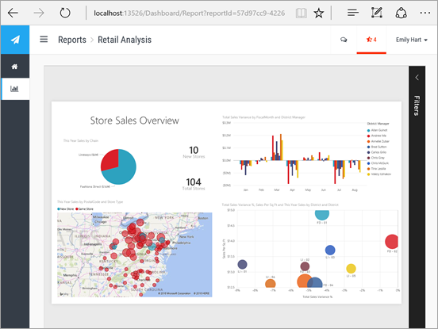

# Quali operazioni possono eseguire gli sviluppatori con Power BI?
Power BI offre un'ampia gamma di opzioni per gli sviluppatori, che vanno dall'incorporamento agli oggetti visivi personalizzati fino ai set di dati in streaming.

## Incorporamento
Il servizio Power BI e Power BI Embedded in Azure vengono assemblati per offrire un'unica API per l'incorporamento di dashboard e report. Questo significa che si avrà una sola superficie dell'API, un set coerente di funzionalità e l'accesso alle ultime funzionalità di Power BI, ad esempio dashboard, gateway e aree di lavoro per le app, quando si incorpora il contenuto. Per altre informazioni, vedere la [Incorporamento con Power BI](embedding.md).

## Oggetti visivi personalizzati
Gli oggetti visivi personalizzati consentono di creare oggetti visivi da usare all'interno dei report di Power BI. Gli oggetti visivi personalizzati sono scritti in TypeScript, cioè un soprainsieme di JavaScript che supporta caratteristiche più avanzate e l'accesso anticipato alla funzionalità ES6/ES7. L'applicazione di stili visivi viene gestita usando i fogli di stile CSS. Per praticità, verrà usato il servizio di pre-compilazione Less che supporta alcune funzionalità avanzate, ad esempio la nidificazione, le variabili, le combinazioni, le condizioni, i cicli e così via. Se non si vuole usare nessuna di queste funzionalità, è possibile scrivere semplicemente fogli di stile CSS normali nel file di Less.

Per altre informazioni su come sviluppare e pubblicare un oggetto visivo personalizzato, vedere [Pubblicare oggetti visivi personalizzati in Office Store](office-store.md).

## Push dei dati in Power BI
È possibile usare l'API Power BI per eseguire il push dei dati in un set di dati. Ciò consente di aggiungere una riga a una tabella all'interno di un set di dati. I nuovi dati possono quindi essere riflessi nei riquadri in un dashboard e all'interno di oggetti visivi in un report.

Per altre informazioni, vedere [Eseguire il push dei dati in un dashboard](walkthrough-push-data.md)

## Passaggi successivi
[Incorporamento con Power BI](embedding.md)  
[Come eseguire la migrazione del contenuto della raccolta di aree di lavoro di Power BI Embedded in Power BI](migrate-from-powerbi-embedded.md)  
[Archivio GIT API JavaScript](https://github.com/Microsoft/PowerBI-JavaScript)  
[Archivio GIT C# di Power BI](https://github.com/Microsoft/PowerBI-CSharp)  
[Pubblicare oggetti visivi personalizzati in Office Store](office-store.md)  
[Archivio GIT di oggetti visivi di Power BI](https://github.com/Microsoft/PowerBI-visuals)  
[Esempio di incorporamento JavaScript](https://microsoft.github.io/PowerBI-JavaScript/demo/)  
[White paper su Power BI Premium](https://aka.ms/pbipremiumwhitepaper)  
Altre domande? [Provare la community di Power BI](http://community.powerbi.com/)

