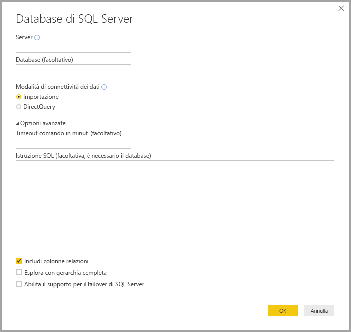
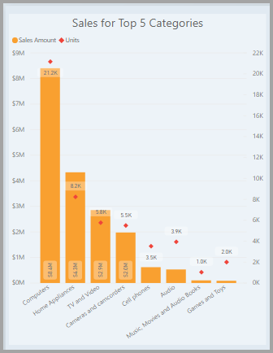

# Che cos'è Power BI Desktop?

*Power BI Desktop* è un'applicazione gratuita che viene essere installata nel computer locale e consente di connettersi ai dati, trasformandoli e visualizzandoli. Con Power BI Desktop è possibile connettersi a molte origini dati diverse e combinarle (*modellazione*) in un modello di dati che consente di creare oggetti visivi e raccolte di oggetti visivi condivisibili come report con altri utenti all'interno dell'organizzazione. La maggior parte degli utenti che lavora a progetti di business intelligence usa Power BI Desktop per creare report e il *servizio Power BI* per condividere i report con altri utenti.

Di seguito sono elencati gli usi più comuni di Power BI Desktop:

* Connettersi ai dati
* Trasformare e pulire i dati per creare un modello di dati
* Creare oggetti visivi, come grafici o grafi, che forniscono rappresentazioni visive dei dati
* Creare report che raccolgono gli oggetti visivi in una o più pagine di report
* Condividere i report con altri utenti tramite il servizio Power BI

Gli utenti che si occupano di queste attività spesso sono chiamati *analisti di dati* (talvolta *analisti*) o professionisti di Business Intelligence (spesso chiamati anche *creatori di report*). Tuttavia, molte persone che non si considerano analisti né creatori di report usano Power BI Desktop per creare report efficaci o per eseguire il pull dei dati da origini diverse e creare modelli di dati condivisibili con i colleghi e le organizzazioni.

In Power BI Desktop sono disponibili tre viste, che è possibile selezionare sul lato sinistro dell'area di disegno. Le viste, nell'ordine in cui sono visualizzate, sono:
* **Report**: in questa vista si creano report e oggetti visivi e ci si dedica alle attività di creazione.
* **Data**: in questa vista è possibile visualizzare le tabelle, le misure e altri dati usati nel modello di dati associato al report, nonché trasformare i dati per un uso ottimale nel modello del report.
* **Model** (Modella): in questa vista vengono visualizzate e gestite le relazioni tra le tabelle nel modello di dati.

Nella figura seguente vengono illustrate le tre viste, così come vengono visualizzate sul lato sinistro dell'area di disegno:

 

## Connettersi ai dati
Per iniziare a usare Power BI Desktop, il primo passaggio consiste nel connettersi ai dati. È possibile connettersi a molte origini dati diverse da Power BI Desktop. 

Per connettersi ai dati,

1. nella scheda **Home** della barra multifunzione selezionare **Recupera dati** > **Altro**. 

   Viene visualizzata la finestra **Recupera dati**, in cui sono elencate le diverse categorie a cui Power BI Desktop può connettersi.

   

2. Quando si seleziona un tipo di dati, vengono chieste alcune informazioni, ad esempio l'URL e le credenziali, necessarie per la connessione all'origine dati da Power BI Desktop.

   

3. Dopo essersi connessi a una o più origini dati, è possibile trasformare i dati in modo che siano utili per l'utente.

## Trasformare e pulire i dati e creare un modello

In Power BI Desktop è possibile pulire e trasformare i dati usando l'[editor di Power Query](https://docs.microsoft.com/power-bi/desktop-query-overview) predefinito. L'editor di Power Query consente di apportare modifiche ai dati, ad esempio modificando un tipo di dati, rimuovendo colonne o combinando i dati da più origini. È come partire da un blocco di dati di grandi dimensioni e rimuovere o aggiungere porzioni di dati in base alle necessità, finché i dati non ottengono esattamente la forma desiderata. 

Per avviare l'editor di Power Query:

- Selezionare **Modifica query** > **Modifica query** nella scheda **Home** della barra multifunzione.

   Verrà visualizzata la finestra **Editor di query**.

   

Ogni passaggio messo in atto durante la trasformazione dei dati (ad esempio rinominare una tabella, trasformare un tipo di dati o eliminare una colonna) viene registrato dall'editor di Power Query. Ogni volta che la query si connette all'origine dati, vengono eseguiti questi passaggi in modo che i dati abbiano sempre la forma specificata.

La figura seguente mostra la finestra **Editor di Power Query** per una query per cui è stata definita la forma e che è stata quindi trasformata in un modello.

 

Quando i dati hanno l'aspetto desiderato, è possibile creare oggetti visivi. 

## Creare oggetti visivi 

Dopo aver creato un modello di dati, è possibile trascinare i *campi* nell'area di disegno del report per creare *oggetti visivi*. Un oggetto visivo è una rappresentazione grafica dei dati nel modello. Esistono molti tipi diversi di oggetti visivi tra cui scegliere in Power BI Desktop. L'oggetto visivo seguente mostra un semplice istogramma. 

Per creare o modificare un oggetto visivo: 

- Nel riquadro **Visualizzazioni** selezionare l'icona dell'oggetto visivo. 

   

   Se nell'area di disegno del report è già stato selezionato un oggetto visivo, verrà modificato nel tipo selezionato. 

   Se invece nell'area di disegno non è stato selezionato alcun oggetto visivo, ne verrà creato uno nuovo in base alla selezione.

## Creare report

In alcuni casi è necessario creare una raccolta di oggetti visivi che illustrano i vari aspetti dei dati usati per creare il modello in Power BI Desktop. Una raccolta di oggetti visivi, in un file di Power BI Desktop, viene chiamata *report*. Un report può avere una o più pagine, proprio come un file di Excel può avere uno o più fogli di lavoro. 

Con Power BI Desktop è possibile creare report complessi e visivamente dettagliati usando dati provenienti da più origini, in un unico report che è possibile condividere con altri utenti nell'organizzazione.

Nella figura seguente viene visualizzata la prima pagina di un report di Power BI Desktop denominata **Overview** (come indicato nella scheda presente nella parte inferiore dell'immagine). 

## Condividere i report

Quando un report è pronto per essere condiviso con altri utenti, è possibile usare il comando *Pubblica* per pubblicare il report nel servizio Power BI e renderlo disponibile agli altri utenti dell'organizzazione che dispongono di una licenza per Power BI. 

Per pubblicare un report di Power BI Desktop: 

1. Sulla scheda **Home** della barra multifunzione selezionare **Pubblica**.

   

   Power BI Desktop consente all'utente di collegarsi al servizio Power BI con il proprio account Power BI. 

2. Chiede quindi di selezionare la posizione nel servizio Power BI in cui si vuole condividere il report, ad esempio l'area di lavoro dell'utente, un'area di lavoro del team o un'altra posizione nel servizio Power BI. 

   È necessario disporre una licenza per Power BI per condividere i report nel servizio Power BI.

## Passaggi successivi

Per iniziare a usare Power BI Desktop, per prima cosa occorre scaricare e installare l'applicazione. Esistono due modi per ottenere Power BI Desktop:

* [Ottenere Power BI Desktop da Windows Store](https://aka.ms/pbidesktopstore)
* [Scaricare Power BI Desktop dal Web](https://docs.microsoft.com/power-bi/desktop-get-the-desktop#download-power-bi-desktop-directly)

