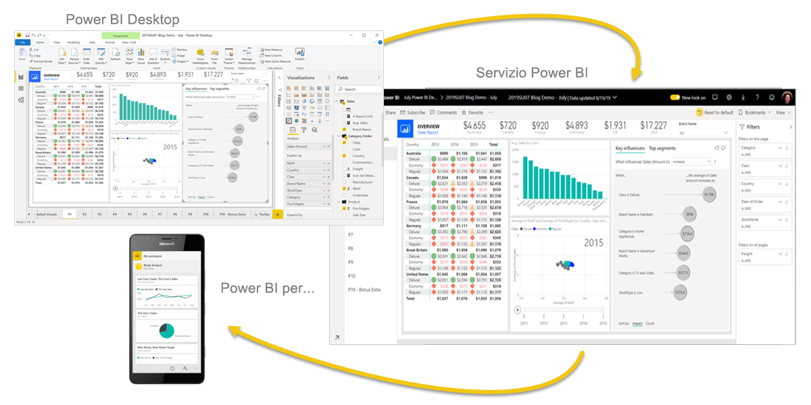
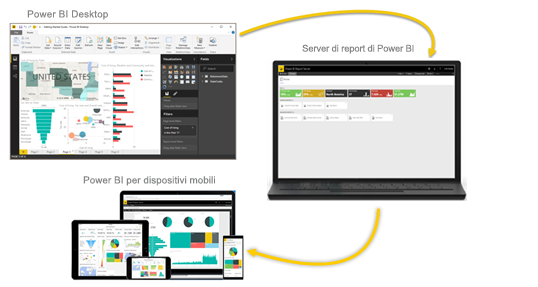

# Che cos'è Power BI?
**Power BI** è una raccolta di servizi software, app e connettori che interagiscono per trasformare le origini dei dati non correlate in un insieme di informazioni coerenti, visivamente accattivanti e interattive. I dati potrebbero essere un foglio di calcolo di Excel o una raccolta di data warehouse basati sul cloud o ibridi locali. Power BI consente di connettersi facilmente alle origini dati, visualizzare e scoprire le informazioni importanti e condividerle con tutti gli utenti o con quelli necessari.

## Gli elementi di Power BI
Power BI è costituito da: 
- Un'applicazione desktop Windows denominata **Power BI Desktop**.
- Un servizio SaaS (*Software as a Service*) online denominato **servizio Power BI**. 
- **App per dispositivi mobili** Power BI per dispositivi Windows, iOS e Android.

Questi tre elementi, ovvero &mdash;Power BI Desktop, il servizio e le app per dispositivi mobili&mdash;, sono progettati per consentire agli utenti di creare, condividere e sfruttare al meglio le informazioni aziendali a livello personale o professionale.

Un quarto elemento, **Server di report di Power BI**, consente di pubblicare report di Power BI in un server di report in locale dopo la creazione in Power BI Desktop. Altre informazioni sul [server di report Power BI](#on-premises-reporting-with-power-bi-report-server).

## Vantaggi di Power BI in base al ruolo
Il modo di usare Power BI può variare in base al ruolo ricoperto all'interno di un progetto o di un team. Utenti con altri ruoli possono usare Power BI in modo completamente diverso.

Ad esempio, può capitare che un utente usi principalmente il **servizio Power BI** per visualizzare report e dashboard e che i suoi colleghi addetti a calcoli e report aziendali usino invece **Power BI Desktop** per creare i report e pubblicarli nel servizio Power BI, dove l'utente iniziale può visualizzarli. Un altro collega che si occupa di vendite potrebbe sfruttare in misura maggiore l'**app per telefoni di Power BI** per monitorare l'avanzamento delle quote di vendita e accedere ai dettagli sui nuovi clienti potenziali.

Gli sviluppatori possono usare le API di Power BI per eseguire il push dei dati in un set di dati oppure per incorporare dashboard e report in applicazioni personalizzate. Se si ha un'idea per un nuovo oggetto visivo, è possibile crearlo e condividerlo con altri utenti.  

Può capitare anche che i singoli elementi di Power BI vengano usati in momenti diversi a seconda degli obiettivi da raggiungere o del ruolo ricoperto in un determinato progetto.

Il modo in cui si usa Power BI può essere basato sulla funzionalità o sul servizio di Power BI che rappresenta lo strumento ottimale per ogni situazione. È possibile ad esempio usare Power BI Desktop per creare report per il team sulle statistiche relative al coinvolgimento del cliente e visualizzare l'inventario e l'avanzamento della produzione in un dashboard in tempo reale nel servizio Power BI. Tutte le parti di Power BI sono a disposizione ed è questo il motivo per cui questo strumento è così flessibile ed efficace.

Esplorare i documenti pertinenti al ruolo:
- Power BI Desktop per [*progettisti*](desktop-what-is-desktop.md)
- Power BI per [*consumer*](../consumer/end-user-consumer.md)
- Power BI per [*amministratori*](../admin/service-admin-administering-power-bi-in-your-organization.md)
- Power BI per *sviluppatori*
    * [Analisi incorporata con Power BI](../developer/embedded/embedding.md)
    * [Che cos'è Power BI Embedded in Azure?](../developer/embedded/azure-pbie-what-is-power-bi-embedded.md)
    * [Oggetti visivi in Power BI](../developer/visuals/power-bi-custom-visuals.md)
    * [Quali operazioni possono eseguire gli sviluppatori con le API Power BI?](../developer/automation/overview-of-power-bi-rest-api.md)

## Il flusso di lavoro in Power BI
Un flusso di lavoro comune in Power BI inizia con la connessione alle origini dati e la creazione di un report in Power BI Desktop. Il report viene poi pubblicato da Power BI Desktop nel servizio Power BI e condiviso, in modo che gli utenti finali del servizio Power BI e dei dispositivi mobili possano visualizzare e interagire con il report.
Questo flusso di lavoro è comune e illustra le interazioni e la complementarietà dei tre elementi principali di Power BI.

Di seguito viene proposto un [confronto dettagliato tra Power BI Desktop e il servizio Power BI](../fundamentals/service-service-vs-desktop.md).

## Report locali con Server di report di Power BI

Se non si è pronti a passare al cloud ed è necessario mantenere i report dietro un firewall aziendale,  continuare a leggere.

È possibile creare, distribuire e gestire Power BI per dispositivi mobili e i report impaginati in locale con la gamma di strumenti e servizi pronti per l'uso offerti dal Server di report di Power BI.

Server di report di Power BI è una soluzione che si distribuisce dietro il firewall per poi recapitare i report agli utenti appropriati in vari modi, ad esempio per consentire di visualizzarli in un Web browser, in un dispositivo mobile o in un messaggio di posta elettronica. Poiché Server di report di Power BI è compatibile con Power BI nel cloud, quando si sarà pronti sarà possibile passare facilmente al cloud. 

Altre informazioni sul [server di report Power BI](../report-server/get-started.md).

## Passaggi successivi
- [Avvio rapido: Orientarsi nel servizio Power BI](../service-the-new-power-bi-experience.md)   
- [Esercitazione: Introduzione al servizio Power BI](service-get-started.md)
- [Avvio rapido: Connettersi ai dati in Power BI Desktop](../connect-data/desktop-quickstart-connect-to-data.md)
