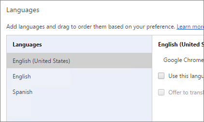
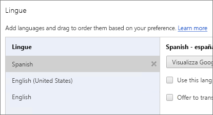
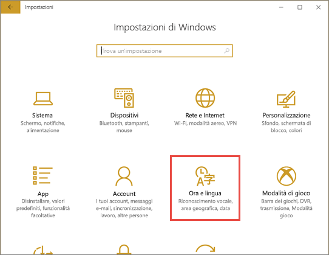
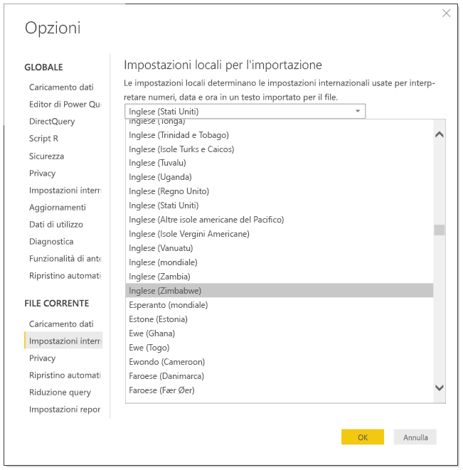
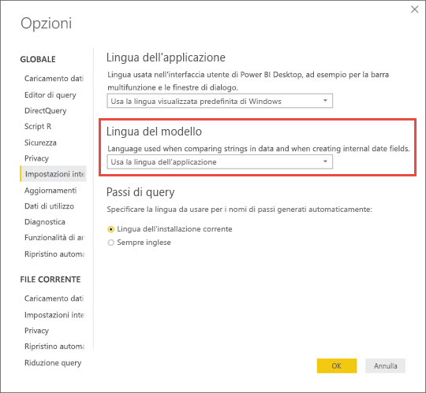

# Lingue e paesi/aree geografiche supportate per Power BI

Questo articolo elenca le lingue e i paesi/aree geografiche supportati per il servizio Power BI, Power BI Desktop e la documentazione di Power BI.

## Paesi e aree geografiche in cui Power BI è disponibile
Per conoscere i paesi e le aree geografiche in cui Power BI è disponibile, vedere questo [elenco relativo alla disponibilità internazionale](https://products.office.com/business/international-availability). 

## Lingue per il servizio Power BI
Il servizio Power BI (nel browser) è disponibile nelle 44 lingue seguenti:

* Arabo
* Basco - Basque
* Bulgaro - Български
* Catalano - català
* Cinese (semplificato) - 中文(简体)
* Cinese (tradizionale) - 中文(繁體)
* Croato - hrvatski
* Ceco - čeština
* Danese - dansk
* Olandese - Nederlands
* Inglese - English
* Estone - eesti
* Finlandese - suomi
* Francese - français
* Galiziano - galiziano
* Tedesco - Deutsch
* Greco - Ελληνικά
* Ebraico
* Hindi - हिंदी
* Ungherese - magyar
* Indonesiano - Bahasa Indonesia
* Italiano - italiano
* Giapponese - 日本語
* Kazako - Қазақ
* Coreano - 한국어
* Lettone - latviešu
* Lituano - lietuvių
* Malese - Bahasa Melayu
* Norvegese bokmål - norsk (bokmål)
* Polacco - Polski
* Portoghese (Brasile) - Português
* Portoghese (Portogallo) - português
* Rumeno - română
* Russo - Русский
* Serbo (alfabeto cirillico) - српски
* Serbo (alfabeto latino) - srpski
* Slovacco - slovenčina
* Sloveno - slovenski
* Spagnolo - español
* Svedese - svenska
* Thai - ไทย
* Turco - Türkçe
* Ucraino - українська
* Vietnamita - Tiếng Việt

### Elementi tradotti
Menu, pulsanti, messaggi e altri elementi dell'esperienza di Power BI sono tradotti nelle varie lingue. Power BI, ad esempio, traduce il contenuto dei report, come titoli, filtri e descrizioni comando generati automaticamente. Tuttavia, i dati non vengono tradotti automaticamente. All'interno dei report, il layout degli oggetti visivi non cambia se si usa una lingua da destra a sinistra, ad esempio l'ebraico.

Al momento alcune funzionalità sono disponibili solo in inglese:

* Dashboard e report creati da Power BI quando ci si connette a servizi come Microsoft Dynamics CRM, Google Analytics e Salesforce. È comunque possibile creare dashboard e report personalizzati nella propria lingua.
* Esplorazione dei dati con Domande e risposte.

In futuro è prevista l'aggiunta di ulteriori funzionalità in altre lingue. 

### Scegliere la lingua nel servizio Power BI
1. Nel servizio Power BI selezionare l'icona **Impostazioni** > **Impostazioni**.
2. Nella scheda **Generale** > **Lingua**.
3. Selezionare la lingua > **Applica**.

### Scegliere la lingua nel browser
Power BI rileva la lingua in base alle preferenze del computer usato. Le modalità di accesso e modifica di queste preferenze possono variare a seconda del sistema operativo e del browser usati. Le istruzioni seguenti spiegano come accedere a queste preferenze da Internet Explorer e Google Chrome.

#### Internet Explorer (versione 11)
1. Fare clic sul pulsante **Strumenti** nell'angolo in alto a destra della finestra del browser:
   
   
2. Fare clic su **Opzioni Internet**.
3. Nella scheda Generale della finestra di dialogo Opzioni Internet fare clic sul pulsante **Lingue** nella sezione Aspetto.

#### Google Chrome (versione 42)
1. Fare clic sul menu Strumenti nell'angolo in alto a destra della finestra del browser:
   
   
2. Fare clic su **Impostazioni**.
3. Fare clic su **Mostra impostazioni avanzate**.
4. In Lingue fare clic sul pulsante **Impostazioni della lingua e di immissione** .
5. Fare clic su **Aggiungi**, selezionare una lingua e fare clic su **OK**.
   
   
   
   La nuova lingua viene visualizzata alla fine dell'elenco. 
6. Trascinare la nuova lingua nella parte superiore dell'elenco e fare clic su **Visualizza Google Chrome in questa lingua**.
   
   
   
   Per visualizzare la modifica potrebbe essere necessario chiudere e riaprire il browser.

## Scegliere la lingua o le impostazioni locali di Power BI Desktop
È possibile ottenere Power BI Desktop in due modi: scaricarlo come programma di installazione autonomo o installarlo da Windows Store.

* Quando si installa Power BI Desktop da Windows Store, vengono installate tutte le lingue e per impostazione predefinita viene visualizzata la lingua corrispondente alla lingua predefinita di Windows.
* Quando si scarica Power BI Desktop come programma di installazione autonomo, è possibile scegliere la lingua predefinita quando si esegue il programma di installazione. La lingua può essere modificata in un secondo momento.
* È anche possibile [scegliere le impostazioni locali da usare durante l'importazione di dati](#choose-the-locale-for-importing-data-into-power-bi-desktop) per un report specifico.

> [!NOTE]
> Se si sta installando la versione di Power BI Desktop ottimizzata per Server di report di Power BI, scegliere la lingua durante il download. Per informazioni, vedere [Installare Power BI Desktop ottimizzato per il server di report di Power BI](../report-server/install-powerbi-desktop.md).

### Scegliere una lingua per Power BI Desktop 
1. Installare Power BI Desktop [da Windows Store](https://aka.ms/pbidesktopstore) o come [programma di installazione autonomo](https://aka.ms/pbiSingleInstaller).
2. Per modificare la lingua, scegliere **Impostazioni** dal menu di Windows.

3. In **Impostazioni di Windows** selezionare **Data/ora e lingua**.
   
     
4. Selezionare **Lingua** e selezionare una lingua. Selezionare **Aggiungi una lingua di visualizzazione di Windows in Microsoft Store** se necessario.
   
     
   
     Al successivo avvio di Power BI Desktop verrà usata la lingua configurata come predefinita. 

Per eseguire l'override dell'impostazione predefinita e usare Power BI Desktop in una lingua diversa da quella di Windows, eseguire questa procedura.
1. In Power BI Desktop passare a **File** > **Opzioni e impostazioni** > **Opzioni**.
2. In **Impostazioni globali** selezionare **Impostazioni internazionali**.
3. Nella casella **Lingua dell'applicazione** selezionare impostazioni locali diverse. 

Il supporto della lingua in Power BI Desktop è limitato alle lingue visualizzate nell'elenco a discesa Lingua dell'applicazione.

### Verificare la formattazione predefinita per numeri e date di Power BI Desktop

Power BI Desktop ottiene la formattazione predefinita per numeri e date dalle impostazioni per l'area geografica di Windows. Se necessario, è possibile controllare o modificare tali impostazioni.

1. Scegliere **Impostazioni** dal menu di Windows.

2. In **Impostazioni di Windows** selezionare **Data/ora e lingua**.
   
     

3. Selezionare **Area geografica** > **Impostazioni aggiuntive di data, ora e internazionali**.

    :::image type="content" source="media/supported-languages-countries-regions/power-bi-service-region-settings.png" alt-text="Impostazioni aggiuntive di data, ora e internazionali":::

4. In **Orologio e area geografica** selezionare **Cambia data, ora o formato dei numeri**.

    :::image type="content" source="media/supported-languages-countries-regions/power-bi-service-check-region-settings.png" alt-text="Impostazioni Orologio e area geografica":::

5. Verificare che sia selezionata l'opzione **Usa lingua di visualizzazione di Windows** o modificarla, se necessario.

    :::image type="content" source="media/supported-languages-countries-regions/power-bi-service-match-windows.png" alt-text="Usa lingua di visualizzazione di Windows":::

### Scegliere le impostazioni locali da usare per l'importazione di dati in Power BI Desktop
Quando si scarica Power BI Desktop o lo si installa da Windows Store, è possibile scegliere impostazioni locali diverse per un report specifico rispetto alle impostazioni locali della versione di Power BI Desktop in uso. Le impostazioni locali cambiano il modo in cui Power BI interpreta i dati quando vengono importati dall'origine dati. Ad esempio, "3/4/2017" può essere interpretato come 3 aprile o 4 marzo.

1. In Power BI Desktop passare a **File** > **Opzioni e impostazioni** > **Opzioni**.
2. In **File corrente** selezionare **Impostazioni internazionali**.
3. Nella casella **Impostazioni locali per l'importazione** selezionare un'opzione diversa per le impostazioni locali. 
   
   
4. Selezionare **OK**.

### Scegliere la lingua per il modello in Power BI Desktop

Oltre a impostare la lingua per l'applicazione Power BI Desktop, è anche possibile impostare la lingua del modello. La lingua del modello influisce principalmente su due aspetti:

- Il modo in cui le stringhe vengono confrontate e ordinate. Ad esempio, poiché l'alfabeto turco contiene due lettere i, a seconda delle regole di confronto del database, l'ordinamento può risultare diverso. 
- La lingua usata da Power BI Desktop per la creazione di tabelle data nascoste dai campi data. Ad esempio, i campi sono denominati Month/Monat/Mese e così via.

> [!NOTE]
> Attualmente, il modello di Power BI usa impostazioni locali che non fanno distinzione tra maiuscole/minuscole (o non applicano la distinzione Kana), quindi "ABC" e "abc" verranno considerati equivalenti. Se la stringa "ABC" viene caricata nel database per prima, le altre stringhe diverse solo in base alle lettere maiuscole e minuscole, ad esempio "Abc", non verranno caricate come valore separato.
> 
>

Ecco come impostare la lingua del modello.

1. In Power BI Desktop passare a **File** > **Opzioni e impostazioni** > **Opzioni**.
2. In **Globale** selezionare **Impostazioni internazionali**.
3. Nella casella **Lingua del modello** selezionare un'altra lingua. 

    

> [!NOTE]
> Dopo la creazione, non è possibile modificare la lingua di un modello di Power BI.
> 
>

## Lingue per la documentazione della Guida
La Guida è localizzata nelle 10 lingue seguenti: 

* Cinese (semplificato) - 中文(简体)
* Cinese (tradizionale) - 中文(繁體)
* Francese - français
* Tedesco - Deutsch
* Italiano - italiano
* Giapponese - 日本語
* Coreano - 한국어
* Portoghese (Brasile) - Português
* Russo - Русский
* Spagnolo - español

## Passaggi successivi
* Si sta usando una delle app Power BI per dispositivi mobili? Per informazioni dettagliate, vedere le [lingue supportate nelle app Power BI per dispositivi mobili](../consumer/mobile/mobile-apps-supported-languages.md).
* Domande? Provare a chiedere alla [community di Power BI](https://community.powerbi.com/).
* Ci sono ancora problemi? Visitare la [pagina del supporto tecnico di Power BI](https://powerbi.microsoft.com/support/).
