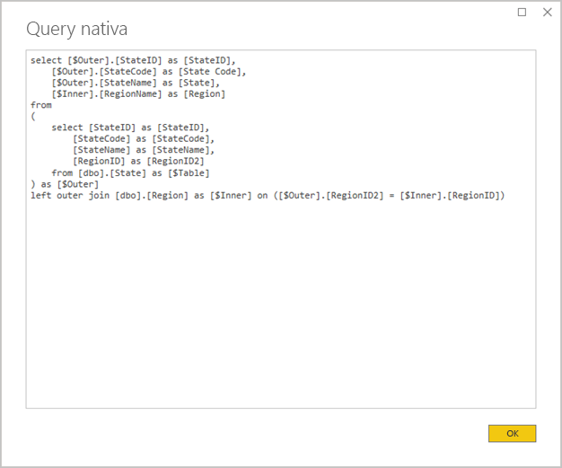
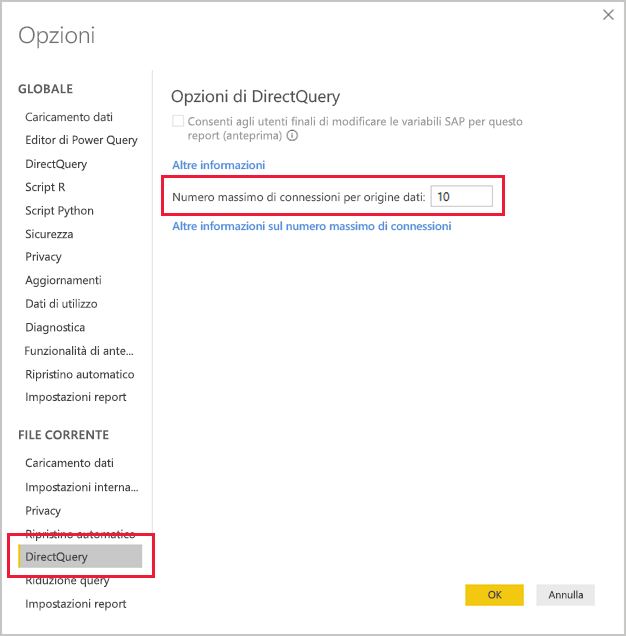
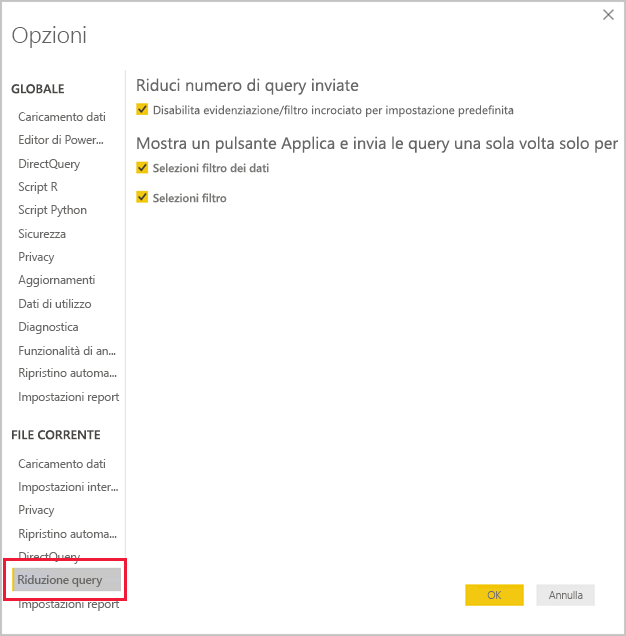
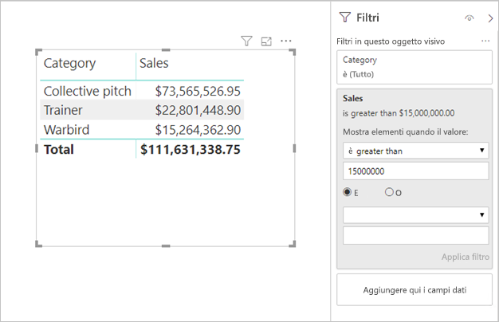

# <a name="directquery-model-guidance-in-power-bi-desktop"></a>Linee guida per il modello DirectQuery in Power BI Desktop

Questo articolo è destinato agli autori di modelli di dati che sviluppano modelli DirectQuery di Power BI usando Power BI Desktop o il servizio Power BI. Vengono descritti i casi d'uso, le limitazioni e le linee guida per DirectQuery. In particolare, le linee guida consentono di determinare se DirectQuery è la modalità appropriata per il modello e di migliorare le prestazioni dei report basati su modelli DirectQuery. Questo articolo si applica ai modelli DirectQuery ospitati nel servizio Power BI o in Server di report di Power BI.

Questo articolo non intende fornire una trattazione completa sulla progettazione di un modello DirectQuery. Per un'introduzione, vedere l'articolo [Modelli DirectQuery in Power BI Desktop](../desktop-directquery-about.md). Per una presentazione più approfondita, fare riferimento direttamente al white paper [DirectQuery in SQL Server 2016 Analysis Services](https://download.microsoft.com/download/F/6/F/F6FBC1FC-F956-49A1-80CD-2941C3B6E417/DirectQuery%20in%20Analysis%20Services%20-%20Whitepaper.pdf). Tenere presente che il white paper descrive l'uso di DirectQuery in SQL Server Analysis Services. Gran parte del contenuto, tuttavia, è comunque applicabile ai modelli DirectQuery di Power BI.

Questo articolo non tratta in modo diretto dei modelli compositi. Un modello composito è costituito da almeno un'origine DirectQuery e probabilmente di più. Le linee guida descritte in questo articolo sono comunque pertinenti, almeno in parte, per la progettazione di modelli compositi. Tuttavia, le implicazioni della combinazione delle tabelle di importazione con le tabelle DirectQuery esulano dagli scopi di questo articolo. Per altre informazioni, vedere [Usare modelli compositi in Power BI Desktop](../desktop-composite-models.md).

È importante comprendere che i modelli DirectQuery impongono un carico di lavoro diverso sull'ambiente Power BI (servizio Power BI o Server di report di Power BI) e anche sulle origini dati sottostanti. Se si determina che DirectQuery è l'approccio di progettazione appropriato, è consigliabile coinvolgere le persone giuste nel progetto. Risulta spesso che una distribuzione corretta del modello DirectQuery è il risultato della stretta collaborazione di un team di professionisti IT. Il team di solito è costituito da sviluppatori di modelli e amministratori di database di origine. Può inoltre coinvolgere architetti di dati e sviluppatori di data warehouse e soluzioni ETL. Spesso è necessario applicare le ottimizzazioni direttamente all'origine dati per ottenere buoni risultati a livello di prestazioni.

## <a name="design-in-power-bi-desktop"></a>Progettazione in Power BI Desktop

È possibile connettersi direttamente a entrambe le origini dati Azure SQL Data Warehouse e Azure HDInsight Spark, senza che sia necessario usare Power BI Desktop. Basta usare il comando "Recupera dati" nel servizio Power BI e scegliere il riquadro Database. Per altre informazioni, vedere [Azure SQL Data Warehouse con DirectQuery](../service-azure-sql-data-warehouse-with-direct-connect.md).

Sebbene la connessione diretta sia comoda, non è consigliabile usare questo approccio. Il motivo principale è che non è possibile aggiornare la struttura del modello in caso di modifica dello schema dell'origine dati sottostante.

Si consiglia di usare Power BI Desktop per creare e gestire tutti i modelli DirectQuery. Questo approccio offre un controllo completo per definire il modello necessario, incluso l'uso di funzionalità supportate come gerarchie, colonne calcolate, misure e altro ancora. Consentirà anche di rivedere la progettazione del modello se lo schema dell'origine dati sottostante viene modificato.

## <a name="optimize-data-source-performance"></a>Ottimizzare le prestazioni dell'origine dati

L'origine del database relazionale può essere ottimizzata in diversi modi, come descritto nell'elenco puntato seguente.

> [!NOTE]
> È assodato che non tutti gli autori di modelli hanno le autorizzazioni o le competenze necessarie per ottimizzare un database relazionale. Sebbene sia il livello preferito per preparare i dati per un modello DirectQuery, è possibile realizzare alcune ottimizzazioni nella progettazione del modello, senza modificare il database di origine. Tuttavia, i risultati di ottimizzazione migliori vengono spesso ottenuti applicando le ottimizzazioni al database di origine.

- **Verificare che l'integrità dei dati sia completa:** è particolarmente importante che le tabelle di tipo dimensione contengano una colonna di valori univoci (chiave della dimensione) mappata alle tabelle dei fatti. È anche importante che le colonne delle dimensioni dei fatti includano valori validi per le chiavi delle dimensioni. Consentono di configurare relazioni del modello più efficienti che prevedono valori corrispondenti su entrambi i lati delle relazioni. Quando l'integrità dei dati di origine non è sufficiente, è consigliabile aggiungere un record della dimensione "sconosciuto" per correggere i dati in modo efficace. Ad esempio, è possibile aggiungere una riga alla tabella **Product** per rappresentare un prodotto sconosciuto e quindi assegnarle una chiave fuori intervallo, ad esempio -1. Se le righe nella tabella **Sales** contengono un valore di codice prodotto mancante, sostituirlo con -1. In questo modo ogni valore di codice prodotto di **Sales** avrà una riga corrispondente nella tabella **Product**.
- **Aggiungere indici:** definire indici appropriati, nelle tabelle o nelle viste, per supportare il recupero efficiente dei dati per il filtro e il raggruppamento visivi del report previsti. Per informazioni sulle origini SQL Server, database SQL di Azure o Azure SQL Data Warehouse, vedere [Architettura e guida per la progettazione degli indici di SQL Server](/sql/relational-databases/sql-server-index-design-guide?view=sql-server-2017) per informazioni utili sulle linee guida per la progettazione degli indici. Per informazioni sulle origini volatili di SQL Server o del database SQL di Azure, vedere [Introduzione a columnstore per l'analisi operativa in tempo reale](/sql/relational-databases/indexes/get-started-with-columnstore-for-real-time-operational-analytics?view=sql-server-2017).
- **Progettare tabelle distribuite:** per le origini Azure SQL Data Warehouse, che sfruttano l'architettura MPP (Massive Parallel Processing), è consigliabile configurare tabelle dei fatti di grandi dimensioni con distribuzione hash e tabelle delle dimensioni per la replica in tutti i nodi di calcolo. Per altre informazioni, vedere [Linee guida per la progettazione di tabelle distribuite in Azure SQL Data Warehouse](/azure/sql-data-warehouse/sql-data-warehouse-tables-distribute#what-is-a-distributed-table).
- **Assicurarsi che le trasformazioni dei dati richieste siano materializzate:** per le origini di database relazionali di SQL Server (e altre origini di database relazionali), le colonne calcolate possono essere aggiunte alle tabelle. Queste colonne sono basate su un'espressione, ad esempio **Quantity** moltiplicato per **UnitPrice**. Le colonne calcolate possono essere rese persistenti (materializzate) e, come le colonne normali, a volte possono essere indicizzate. Per altre informazioni, vedere [Indici per le colonne calcolate](/sql/relational-databases/indexes/indexes-on-computed-columns?view=sql-server-2017).

    Prendere in considerazione anche le viste indicizzate che possono pre-aggregare i dati della tabella dei fatti con una granularità più elevata. Ad esempio, se la tabella **Sales** archivia i dati a livello di riga dell'ordine, è possibile creare una vista per riepilogare questi dati. La vista può essere basata su un'istruzione SELECT che raggruppa i dati della tabella **Sales** per data (a livello di mese), cliente e prodotto, quindi riepiloga i valori di misura come vendite, quantità e così via. La vista può quindi essere indicizzata. Per informazioni sulle origini SQL Server o del database SQL di Azure, vedere [Creare viste indicizzate](/sql/relational-databases/views/create-indexed-views?view=sql-server-2017).
- **Materializzare una tabella di data:** un requisito di modellazione comune prevede l'aggiunta di una tabella di data per supportare i filtri basati sul tempo. Per supportare i filtri basati sul tempo noti nell'organizzazione, creare una tabella nel database di origine e assicurarsi che venga caricata con un intervallo di date che includa le date della tabella dei fatti. Assicurarsi inoltre che includa colonne per periodi di tempo utili, ad esempio anno, trimestre, mese, settimana e così via.

## <a name="optimize-model-design"></a>Ottimizzare la progettazione del modello

Un modello DirectQuery può essere ottimizzato in diversi modi, come descritto nell'elenco puntato seguente.

- **Evitare query Power Query complesse:** È possibile ottenere una progettazione efficiente del modello evitando che le query Power Query applichino trasformazioni. Questo significa che ogni query viene mappata a una singola tabella o vista di origine di un database relazionale. È possibile visualizzare in anteprima una rappresentazione dell'istruzione di query SQL effettiva per un passaggio Power Query applicato, selezionando l'opzione **Visualizza query nativa**.

    
    
    

- **Esaminare l'uso delle colonne calcolate e delle modifiche del tipo di dati:** i modelli DirectQuery supportano l'aggiunta di calcoli e i passaggi di Power Query per la conversione dei tipi di dati. Tuttavia, si ottengono spesso prestazioni migliori materializzando i risultati della trasformazione nell'origine del database relazionale, quando possibile.
- **Non usare il filtro per data relativa di Power Query:** è possibile definire un filtro per data relativa in una query di Power Query. Ad esempio, per recuperare gli ordini di vendita creati nell'ultimo anno (rispetto alla data odierna). Questo tipo di filtro viene convertito in una query nativa inefficiente, come indicato di seguito:

    ```SQL
    …
    from [dbo].[Sales] as [_]
    where [_].[OrderDate] >= convert(datetime2, '2018-01-01 00:00:00') and [_].[OrderDate] < convert(datetime2, '2019-01-01 00:00:00'))  
    ```
    
    Un approccio progettuale migliore consiste nell'includere le colonne temporali relative nella tabella delle date. In queste colonne vengono archiviati valori di offset rispetto alla data corrente. Ad esempio, in una colonna **RelativeYear** il valore zero rappresenta l'anno corrente, -1 rappresenta l'anno precedente e così via. È preferibile materializzare la colonna **RelativeYear** nella tabella delle date. Sebbene sia meno efficiente, potrebbe essere anche aggiunta come colonna calcolata del modello, in base all'espressione che usa le funzioni DAX [TODAY](/dax/today-function-dax) e [DATE](/dax/date-function-dax).

- **Mantenere le misure semplici:** almeno inizialmente è consigliabile limitare le misure ad aggregazioni semplici. Le funzioni di aggregazione includono SUM, COUNT, MIN, MAX e AVERAGE. Se le misure offrono prestazioni sufficienti, è poi possibile provare a usare misure più complesse, prestando comunque attenzione alle prestazioni di ognuna. Mentre la funzione DAX [CALCULATE](/dax/calculate-function-dax) può essere usata per produrre espressioni di misura sofisticate che modificano il contesto di filtro, tali misure possono generare query native onerose con prestazioni insufficienti.
- **Evitare relazioni sulle colonne calcolate:** le relazioni del modello possono mettere in relazione solo una singola colonna in una tabella con una singola colonna in una tabella diversa. In alcuni casi, tuttavia, è necessario correlare le tabelle usando più colonne. Ad esempio, le tabelle **Sales** e **Geography** sono correlate da due colonne: **Country** e **City**. Per creare una relazione tra le tabelle, è necessaria una singola colonna e nella tabella **Geography** la colonna deve contenere valori univoci. La concatenazione del paese e della città con un segno meno come separatore potrebbe consentire di ottenere questo risultato.

    La colonna combinata può essere creata con una colonna personalizzata di Power Query o nel modello come colonna calcolata. È tuttavia consigliabile evitare questa operazione perché l'espressione di calcolo viene incorporata nelle query di origine. Oltre a essere una soluzione inefficiente, in genere impedisce l'uso degli indici. Aggiungere invece colonne materializzate nell'origine del database relazionale e prenderne in considerazione l'indicizzazione. È anche possibile valutare la possibilità di aggiungere colonne chiave surrogate a tabelle delle dimensioni, una pratica comune nelle progettazioni di data warehouse relazionali.
    
    Esiste un'eccezione per queste indicazioni e riguarda l'uso della funzione DAX [COMBINEVALUES](/dax/combinevalues-function-dax). Lo scopo di questa funzione è supportare relazioni a più colonne nei modelli. Anziché generare un'espressione usata dalla relazione, viene generato un predicato di join SQL a più colonne.
- **Evitare relazioni sulle colonne "identificatore univoco":** Power BI non supporta in modo nativo il tipo di dati identificatore univoco (GUID). Quando si definisce una relazione tra colonne di questo tipo, Power BI genererà una query di origine con un join che implica un cast. Questa conversione dei dati in fase di query comporta in genere una riduzione delle prestazioni. Fino a quando questo caso d'uso non viene ottimizzato, l'unica soluzione consiste nel materializzare colonne di un tipo di dati alternativo nel database sottostante.
- **Nascondere la colonna nel lato uno delle relazioni:** la colonna nel lato uno di una relazione deve essere nascosta. Si tratta in genere della colonna chiave primaria delle tabelle delle dimensioni. Se nascosta, non è disponibile nel riquadro **Campi** e pertanto non può essere usata per configurare un oggetto visivo. La colonna nel lato molti può rimanere visibile se è utile per raggruppare o filtrare i report in base ai valori della colonna. Si consideri ad esempio un modello in cui esiste una relazione tra le tabelle **Sales** e **Product**. Le colonne della relazione contengono i valori SKU (codice di riferimento) del prodotto. Se lo SKU del prodotto deve essere aggiunto agli oggetti visivi, dovrebbe essere visibile solo nella tabella **Sales**. Quando questa colonna viene usata per operazioni di filtro o raggruppamento in un oggetto visivo, Power BI genererà una query che non richiede di unire in join le tabelle **Sales** e **Product**.
- **Impostare le relazioni per applicare l'integrità:** la proprietà **Considera integrità referenziale** delle relazioni DirectQuery determina se Power BI genererà query di origine usando un inner join anziché un outer join. Le prestazioni delle query generalmente migliorano, anche se ciò dipende dalle specifiche dell'origine del database relazionale. Per altre informazioni, vedere [Considerare le impostazioni di integrità referenziale in Power BI Desktop](../desktop-assume-referential-integrity.md).
- **Evitare l'uso del filtro di relazione bidirezionale:** l'uso di filtri di relazione bidirezionali può determinare istruzioni di query che non offrono prestazioni ottimali. Usare questa funzionalità delle relazioni solo quando necessario, ossia in genere quando si implementa una relazione molti-a-molti in una tabella di bridging. Per altre informazioni, vedere [Relazioni con cardinalità molti-a-molti in Power BI Desktop](../desktop-many-to-many-relationships.md).
- **Limitare le query parallele:** è possibile impostare il numero massimo di connessioni aperte da DirectQuery per ogni origine dati sottostante. Questa impostazione consente di controllare il numero di query inviate simultaneamente all'origine dati.

    
    
    L'impostazione è abilitata solo se nel modello è presente almeno un'origine DirectQuery. Il valore si applica a tutte le origini DirectQuery e a tutte le nuove origini DirectQuery aggiunte al modello.

    Se si aumenta il valore **Numero massimo di connessioni per origine dati**, è possibile inviare un numero maggiore di query, fino al numero massimo specificato, all'origine dati sottostante. Questo è utile se in un'unica pagina sono presenti numerosi oggetti visivi o se molti utenti accedono a un report contemporaneamente. Quando viene raggiunto il numero massimo di connessioni, le query in eccesso vengono accodate fino a quando non diventa disponibile una connessione. L'aumento di questo limite comporta un carico maggiore per l'origine dati sottostante. L'impostazione non garantisce quindi il miglioramento delle prestazioni complessive.
    
    Quando il modello viene pubblicato in Power BI, il numero massimo di query simultanee inviate all'origine dati sottostante dipende anche dall'ambiente. Ambienti diversi (ad esempio Power BI, Power BI Premium o Server di report di Power BI) possono imporre ognuno vincoli diversi per la velocità effettiva. Per altre informazioni sulle limitazioni delle risorse relative alle capacità di Power BI Premium, vedere [Distribuzione e gestione delle capacità Power BI Premium](https://docs.microsoft.com/power-bi/whitepaper-powerbi-premium-deployment#premium-capacities).

## <a name="optimize-report-designs"></a>Ottimizzazione delle progettazioni di report

I report basati su un set di dati DirectQuery possono essere ottimizzati in diversi modi, come descritto nell'elenco puntato seguente.

- **Abilitare le tecniche di riduzione della query:** la finestra _Opzioni e impostazioni_ di Power BI Desktop include una pagina Riduzione query con tre opzioni utili. È possibile disabilitare l'evidenziazione incrociata e il filtro incrociato per impostazione predefinita, sebbene si possa eseguirne l'override modificando le interazioni. È anche possibile visualizzare un pulsante Applica per filtri dei dati e filtri. Le opzioni per filtri dei dati o filtri non verranno applicate finché l'utente del report non fa clic sul pulsante. Se si abilitano queste opzioni, è consigliabile eseguire questa operazione durante la prima creazione del report.

    
    
- **Applicare prima i filtri:** quando si progettano report per la prima volta, è consigliabile applicare gli eventuali filtri applicabili, a livello di report, di pagina o di oggetto visivo, prima di eseguire il mapping dei campi ai campi dell'oggetto visivo. Ad esempio, anziché includere le misure **Country** e **Sales** e poi filtrare in base a un determinato anno, applicare prima il filtro al campo **Year**. Ogni passaggio della creazione di un oggetto visivo invia una query e, anche se è possibile apportare un'altra modifica prima del completamento della prima query, questa operazione genera un carico superfluo sull'origine sottostante. Applicando subito i filtri, le query intermedie diventano generalmente meno onerose e più veloci. Inoltre, la mancata applicazione dei filtri può causare il superamento del limite di un milione righe, come descritto in precedenza.
- **Limitare il numero di oggetti visivi in una pagina:** quando viene aperta una pagina del report (e quando vengono applicati i filtri di pagina), vengono aggiornati tutti gli oggetti visivi in una pagina. Esiste tuttavia un limite al numero di query che possono essere inviate in parallelo, imposto dall'ambiente Power BI e dall'impostazione del modello **Numero massimo di connessioni per origine dati**, come descritto in precedenza. Pertanto, con l'aumentare del numero di oggetti visivi della pagina, è più probabile che vengano aggiornati in modo seriale. Diventa così maggiore il tempo necessario per aggiornare l'intera pagina e aumenta anche la probabilità che gli oggetti visivi visualizzino risultati incoerenti (per le origini dati volatili). Per questo motivo, è consigliabile limitare il numero di oggetti visivi presenti in una singola pagina e optare per varie pagine più semplici. La sostituzione di più oggetti visivi scheda con un singolo oggetto visivo scheda con più righe può consentire di ottenere un layout di pagina simile.
- **Disattivare l'interazione tra gli oggetti visivi:** le interazioni di evidenziazione incrociata e filtro incrociato richiedono l'invio di query all'origine sottostante. Se queste interazioni non sono necessarie, è consigliabile disattivarle se il tempo necessario per rispondere alle selezioni degli utenti è molto lungo. Queste interazioni possono essere disattivate, sia per l'intero report (come descritto in precedenza per le opzioni di Riduzione query) o caso per caso. Per altre informazioni, vedere [Filtro incrociato per gli oggetti visivi in un report di Power BI](../consumer/end-user-interactions.md).

Oltre all'elenco delle tecniche di ottimizzazione precedente, ognuna delle funzionalità di creazione di report seguenti può contribuire a causare problemi di prestazioni:

- **Filtri di misure:** gli oggetti visivi che contengono misure o aggregazioni di colonne possono avere filtri applicati a tali misure. Ad esempio, l'oggetto visivo seguente mostra **Sales** per **Category**, ma solo per le categorie con più di $ 15 milioni di vendite.

    
    
    
    Ciò può causare l'invio di due query all'origine sottostante:
    
    - La prima query recupererà le categorie che soddisfano la condizione (Sales > $ 15 milioni)
    - La seconda query recupererà quindi i dati necessari per l'oggetto visivo, aggiungendo le categorie che soddisfano la condizione nella clausola WHERE
    
    Questa query in genere funziona correttamente in presenza di centinaia o migliaia di categorie, come in questo esempio. Le prestazioni possono però ridursi se il numero di categorie è molto maggiore e in effetti la query avrà esito negativo se più di un milione di categorie soddisfano la condizione, a causa del limite di un milione di righe indicato in precedenza.
- **Filtri PrimiN:** è possibile definire filtri avanzati in modo da filtrare solo i valori primi (o ultimi) N classificati in base a una misura. Ad esempio, per visualizzare solo le prime cinque categorie nell'oggetto visivo sopra riportato. Analogamente ai filtri delle misure, anche questa operazione comporterà l'invio di due query all'origine dati sottostante. La prima query restituirà tuttavia tutte le categorie dell'origine sottostante. Le prime N verranno poi determinate in base ai risultati restituiti. A seconda della cardinalità della colonna interessata, ciò può provocare problemi di prestazioni oppure l'esito negativo delle query a causa del limite di 1 milione di righe.
- **Mediana:** per le aggregazioni (Sum, Count Distinct e così via) viene in genere eseguito il push nell'origine sottostante. Questo non vale tuttavia per la mediana, perché questa aggregazione non è supportata dall'origine sottostante. In questi casi, i dati di dettaglio vengono recuperati dall'origine sottostante e Power BI calcola la mediana dai risultati restituiti. Questa operazione è appropriata quando la mediana deve essere calcolata su un numero relativamente ridotto di risultati, mentre si verificheranno problemi di prestazioni, o errori di query a causa del limite di un milione di righe, se la cardinalità è di grandi dimensioni. La mediana della popolazione nazionale può essere ad esempio un'operazione ragionevole, mentre la mediana del prezzo di vendita potrebbe non esserlo.
- **Filtri dei dati per selezione multipla:** consentire la selezione multipla in filtri dei dati e filtri può causare problemi di prestazioni perché quando l'utente seleziona ulteriori elementi del filtro dei dati (ad esempio, fino a ottenere i dieci prodotti a cui si è interessati), ogni nuova selezione comporta l'invio di una nuova query all'origine sottostante. Anche se l'utente può selezionare l'elemento successivo prima che la query venga completata, l'operazione comporta in ogni caso un carico aggiuntivo sull'origine sottostante. Questa situazione può essere evitata visualizzando il pulsante Applica, come descritto in precedenza nelle tecniche di riduzione della query.
- **Totali per gli oggetti visivi:** per impostazione predefinita, le tabelle e le matrici visualizzano totali e subtotali. In molti casi, è necessario inviare query aggiuntive all'origine sottostante per ottenere i valori per i totali. Questo vale quando si usano le aggregazioni Count Distinct o Median e in tutti i casi quando si usa DirectQuery su SAP HANA o SAP Business Warehouse. È consigliabile disattivare questi totali, tramite il riquadro Formato, se non sono necessari.

## <a name="convert-to-a-composite-model"></a>Conversione in un modello composito

I vantaggi dei modelli di importazione e DirectQuery possono essere combinati in un unico modello configurando la modalità di archiviazione delle tabelle del modello. La modalità di archiviazione delle tabelle può essere importazione o DirectQuery oppure entrambe, ovvero Doppia. Quando un modello contiene tabelle con modalità di archiviazione diverse, è noto come modello composito. Per altre informazioni, vedere [Usare modelli compositi in Power BI Desktop](../desktop-composite-models.md).

La conversione di un modello DirectQuery in un modello composito consente di ottenere molti miglioramenti funzionali e delle prestazioni. Un modello composito può integrare più di un'origine DirectQuery e può includere anche aggregazioni. Le tabelle di aggregazione possono essere aggiunte alle tabelle DirectQuery per importare una rappresentazione riepilogata della tabella. Si possono ottenere miglioramenti eccezionali delle prestazioni quando gli oggetti visivi eseguono query su aggregazioni di livello superiore. Per altre informazioni, vedere [Aggregazioni in Power BI Desktop](../desktop-aggregations.md).

## <a name="educate-users"></a>Informare gli utenti

È importante informare gli utenti su come usare in modo efficiente i report basati sui set di dati DirectQuery. Gli autori del report devono conoscere il contenuto dell'argomento [Ottimizzazione delle progettazioni di report](#optimize-report-designs section).

Si consiglia di informare gli utenti dei report sui report basati sui set di risultati DirectQuery. Può essere utile che comprendano l'architettura dei dati generale, incluse eventuali limitazioni rilevanti descritte in questo articolo. Si supponga di prevedere che le risposte di aggiornamento e i filtri interattivi possano talvolta essere lenti. Se gli utenti del report conoscono i motivi del calo delle prestazioni, è meno probabile che perdano fiducia nei report e nei dati.

Quando si recapitano i report su origini dati volatili, assicurarsi di informare gli utenti dell'uso del pulsante Aggiorna. Informarli anche che è possibile che vengano visualizzati risultati incoerenti e che un aggiornamento del report può risolvere eventuali incoerenze nella pagina del report.

## <a name="next-steps"></a>Passaggi successivi

Per altre informazioni su DirectQuery, vedere le risorse seguenti:

- [Modelli DirectQuery in Power BI Desktop](../desktop-directquery-about.md)
- [Usare DirectQuery in Power BI Desktop](../desktop-use-directquery.md)
- [Risoluzione dei problemi del modello DirectQuery in Power BI Desktop](../desktop-directquery-troubleshoot.md)
- Domande? [Provare a rivolgersi alla community di Power BI](https://community.powerbi.com/)
