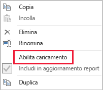

# Tecniche di riduzione dei dati per i modelli di importazione

Questo articolo è destinato a esperti di modellazione di dati in Power BI Desktop che sviluppano modelli di importazione. Illustra le varie tecniche che consentono di ridurre i dati caricati nei modelli di importazione.

I modelli di importazione vengono caricati con dati compressi e ottimizzati e quindi archiviati su disco tramite il motore di archiviazione VertiPaq. Durante il caricamento dei dati di origine in memoria, è possibile osservare la compressione 10x ed è quindi ragionevole aspettarsi che 10 GB di dati di origine possano essere compressi in circa 1 GB. Inoltre, quando viene eseguito il salvataggio permanente su disco, è possibile ottenere un'ulteriore riduzione del 20%.

Nonostante il livello di efficienza del motore di archiviazione VertiPaq, è importante cercare di ridurre al minimo i dati da caricare nei modelli. Questo è particolarmente vero per i modelli di grandi dimensioni o i modelli per i quali si prevede un notevole aumento di dimensioni nel tempo. Di seguito sono elencati i quattro motivi principali:

- Le dimensioni più grandi dei modelli possono non essere supportate dalla capacità. La capacità condivisa può ospitare modelli di dimensioni fino a 1 GB, mentre le capacità Premium possono ospitare modelli di dimensioni fino a 13 GB. Per altre informazioni, vedere l'articolo [Supporto di Power BI Premium per set di dati di grandi dimensioni](../service-premium-large-datasets.md).
- Le dimensioni più piccole dei modelli riducono la contesa per le risorse di capacità, in particolare della memoria. In questo modo è possibile caricare simultaneamente più modelli per periodi di tempo più lunghi, con conseguente riduzione del tasso di rimozione. Per altre informazioni, vedere l'argomento relativo alla [modalità di funzionamento delle capacità](../whitepaper-powerbi-premium-deployment.md#how-capacities-function) nel white paper [Distribuzione di Power BI Premium](../whitepaper-powerbi-premium-deployment.md).
- I modelli più piccoli vengono aggiornati più velocemente, consentendo così una riduzione della latenza, una velocità effettiva di aggiornamento del set di dati più elevata e minore pressione sulle risorse di capacità e di sistema di origine.
- Un numero minore di righe di tabella può risultare in una maggiore velocità di valutazione dei calcoli, con conseguente miglioramento delle prestazioni generali delle query.

In questo articolo sono illustrate otto tecniche diverse per la riduzione dei dati. Tra queste sono incluse:

- [Rimuovere le colonne inutili](#remove-unnecessary-columns)
- [Rimuovere le righe inutili](#remove-unnecessary-rows)
- [Raggruppare e riepilogare](#group-by-and-summarize)
- [Ottimizzare i tipi di dati delle colonne](#optimize-column-data-types)
- [Preferire le colonne personalizzate](#preference-for-custom-columns)
- [Disabilitare il caricamento di query di Power Query](#disable-power-query-query-load)
- [Disabilitare la data/ora automatica](#disable-auto-datetime)
- [Passare alla modalità mista](#switch-to-mixed-mode)

## Rimuovere le colonne inutili

Le colonne delle tabelle del modello hanno due scopi principali:

- La **creazione di report**, ovvero ottenere strutture di report appropriate per filtrare, raggruppare e riepilogare i dati del modello
- La **struttura del modello**, ovvero supportare le relazioni tra modelli, i calcoli del modello, i ruoli di sicurezza e anche la formattazione a colori dei dati

Le colonne che non servono a questi scopi possono probabilmente essere rimosse. La rimozione di colonne è definita _filtraggio verticale_.

È consigliabile progettare modelli con il numero esatto di colonne in base ai requisiti di reporting noti. Naturalmente questi requisiti possono cambiare nel tempo, ma è bene tenere presente che è più semplice aggiungere colonne in un secondo momento che non rimuoverle. La rimozione di colonne può causare interruzioni nei report o nella struttura del modello.

## Rimuovere le righe inutili

Le tabelle del modello devono essere caricate con il minor numero di righe possibile. Questa operazione può essere eseguita caricando set di righe filtrati nelle tabelle del modello per due motivi diversi, ovvero per filtrare i dati in base all'entità o in base al tempo. La rimozione di righe è definita _filtraggio orizzontale_.

Il **filtraggio in base all'entità** consiste nel caricamento di un subset dei dati di origine nel modello. Ad esempio, anziché caricare i fatti di vendita per tutte le aree di vendita, è possibile caricare solo i fatti per una singola area. Questo approccio di progettazione ha come risultato modelli più piccoli e può anche eliminare la necessità di definire la sicurezza a livello di riga, ma richiede la concessione di autorizzazioni specifiche per i set di dati nel servizio Power BI e la creazione di report "duplicati" che si connettono a ogni set di dati. Per semplificare la gestione e la pubblicazione è possibile sfruttare l'uso di parametri di Power Query e di file di modello di Power BI. Per altre informazioni, leggere il post di blog [Deep Dive into Query Parameters and Power BI Templates](https://powerbi.microsoft.com/blog/deep-dive-into-query-parameters-and-power-bi-templates/) (Approfondimento sui parametri di query e sui modelli di Power BI).

Il **filtraggio in base al tempo** consiste nella limitazione della _cronologia dei dati_ caricata nelle tabelle di tipo fatto e nella limitazione delle righe di data caricate nelle tabelle delle date del modello. È consigliabile evitare di caricare automaticamente tutta la cronologia disponibile, a meno che non si tratti di un requisito di reporting noto. È utile comprendere che è possibile impostare parametri per i filtri di Power Query basati sul tempo e persino impostare l'uso di periodi di tempo relativi (rispetto alla data di aggiornamento, ad esempio gli ultimi cinque anni). Tenere inoltre presente che le modifiche retrospettive ai filtri temporali non causano interruzioni nei report. Hanno semplicemente l'effetto di ridurre o aumentare la cronologia dei dati disponibile nei report.

## Raggruppare e riepilogare

La tecnica più efficace per ridurre la dimensione di un modello è quella di caricare dati già riepilogati. Questa tecnica può essere usata per aumentare la granularità delle tabelle di tipo fatto. Ciò comporta tuttavia un chiaro compromesso che ha come risultato una perdita di dettaglio.

In una tabella dei fatti di vendita di origine, ad esempio, viene archiviata una riga per ogni riga di ordine. Per ottenere una riduzione significativa dei dati è possibile riepilogare tutte le metriche relative alle vendite, raggruppando per data, cliente e prodotto. Si tenga quindi presente che è possibile ottenere una riduzione dei dati ancora più significativa raggruppando per data _a livello di mese_. In questo modo si può ottenere una riduzione della dimensione del modello pari al 99%, ma ovviamente la generazione di report a livello di giorno o di singolo ordine non è più possibile. La decisione di riepilogare i dati di tipo fatto presuppone sempre un compromesso, che può essere attenuato da un struttura del modello di tipo misto, come verrà discusso più avanti nell'argomento [Passare alla modalità mista](#switch-to-mixed-mode).

## Ottimizzare i tipi di dati delle colonne

Il motore di archiviazione VertiPaq usa strutture di dati separate per ogni colonna. Queste strutture raggiungono il massimo livello di ottimizzazione per i dati delle colonne numeriche, che usano la codifica basata su valori. Il testo e altri dati non numerici, tuttavia, usano la codifica basata su hash. Di conseguenza, il motore di archiviazione deve assegnare un identificatore numerico a ogni valore di testo univoco contenuto nella colonna. L'identificatore numerico viene quindi archiviato nella struttura dei dati, e questo richiede una ricerca dell'hash durante l'archiviazione e l'esecuzione di query.

In alcune istanze specifiche è possibile convertire i dati del testo di origine in valori numerici. Un numero di ordine di vendita, ad esempio, può essere preceduto in modo coerente da un valore di testo, come in "SO123456". Il prefisso può essere rimosso e il valore del numero di ordine viene convertito in un numero intero. Per le tabelle di grandi dimensioni, questo può determinare una riduzione significativa dei dati, soprattutto quando la colonna contiene valori univoci o a cardinalità elevata.

In questo esempio, è consigliabile impostare la proprietà della colonna Esecuzione del riepilogo predefinita su "Non riepilogare". Ciò consente di ridurre al minimo il riepilogo inappropriato dei valori dei numeri di ordine.

## Preferire le colonne personalizzate

Il motore di archiviazione VertiPaq archivia le colonne calcolate del modello (definite in DAX) esattamente come le normali colonne che hanno origine da Power Query. Le strutture di dati, tuttavia, vengono archiviate in modo leggermente diverso e in genere ottengono una compressione meno efficiente. Vengono inoltre create dopo il caricamento di tutte le tabelle di Power Query e questo può richiedere un'estensione dei tempi di aggiornamento dei dati. È quindi meno efficiente aggiungere colonne di tabella come _colonne calcolate_ rispetto alle colonne _calcolate_ di Power Query (definite in M).

La soluzione migliore dovrebbe essere quella di creare colonne personalizzate in Power Query. Quando l'origine è un database, è possibile ottenere maggiore efficienza nel caricamento in due modi. Il calcolo può essere definito nell'istruzione SQL (tramite il linguaggio di query nativo del provider) oppure può essere materializzato come colonna.

In molti casi, tuttavia, le colonne calcolate del modello potrebbero rappresentare la scelta ideale. Questo può avvenire quando la formula implica la valutazione di misure oppure richiede specifiche funzionalità di modellazione supportate solo nelle funzioni DAX. Per informazioni su un evento di questo tipo, vedere l'articolo [Informazioni sulle funzioni per le gerarchie padre-figlio in DAX](/dax/understanding-functions-for-parent-child-hierarchies-in-dax).

## Disabilitare il caricamento di query di Power Query

Le query di Power Query destinate a supportare l'integrazione dei dati con altre query non dovrebbero essere caricate nel modello. Per evitare il caricamento della query nel modello, assicurarsi di disabilitare il caricamento di query in queste istanze.

## Disabilitare la data/ora automatica

Power BI Desktop include un'opzione denominata _Data/ora automatica_. Quando è abilitata, viene creata una tabella data/ora automatica nascosta per le colonne data per supportare gli autori dei report durante la configurazione di filtri, raggruppamento e drill-down per i periodi di calendario. Le tabelle nascoste sono in realtà tabelle calcolate che aumenteranno le dimensioni del modello. Per istruzioni sull'uso di questa opzione, vedere l'articolo relativo alle [linee guida per la data/ora automatica in Power BI Desktop](../desktop-auto-date-time.md).

## Passare alla modalità mista

In Power BI Desktop, una progettazione in modalità mista ha l'effetto di produrre un modello composito. Consente essenzialmente di determinare la modalità di archiviazione _per ogni tabella_. Ogni tabella può quindi avere una specifica proprietà Modalità di archiviazione impostata come Importa o DirectQuery (un'altra opzione possibile è Doppia).

Una tecnica efficace per ridurre le dimensioni del modello consiste nell'impostare su DirectQuery la proprietà Modalità di archiviazione per le tabelle di tipo fatto più grandi. Tenere presente che questo approccio di progettazione potrebbe funzionare bene insieme all'argomento [Raggruppare e riepilogare](#group-by-and-summarize) introdotto in precedenza. Ad esempio, i dati di vendita riepilogati potrebbero essere usati per ottenere report di riepilogo con prestazioni elevate. Una pagina di drill-through potrebbe visualizzare le vendite granulari per un contesto di filtro specifico (e limitato), visualizzando tutti gli ordini di vendita nel contesto. In questo esempio, la pagina di drill-through includerebbe oggetti visivi basati su una tabella DirectQuery per recuperare i dati degli ordini di vendita.

Esistono tuttavia molte implicazioni in materia di sicurezza e prestazioni correlate ai modelli compositi. Per altre informazioni, vedere l'articolo [Usare modelli compositi in Power BI Desktop](../desktop-composite-models.md).

## Passaggi successivi

Per altre informazioni sulla struttura di un modello di importazione di Power BI, vedere gli articoli seguenti:

- [Usare modelli compositi in Power BI Desktop](../desktop-composite-models.md)
- [Modalità di archiviazione in Power BI Desktop](../desktop-storage-mode.md)
