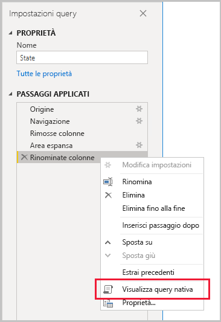
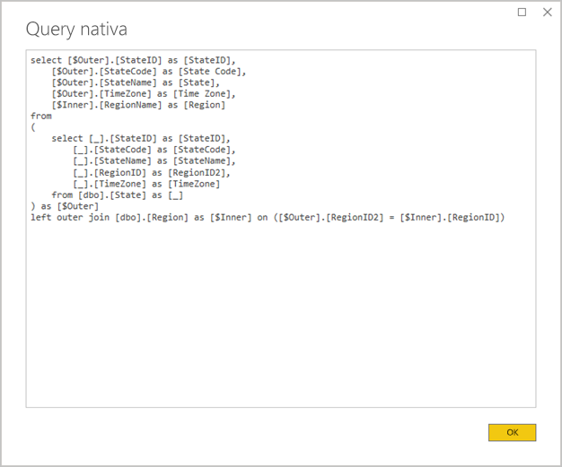

# <a name="the-importance-of-query-folding"></a>Importanza della riduzione delle query

Questo articolo è destinato agli autori di modelli di dati in Power BI Desktop. Viene descritta la riduzione della query e il motivo per cui è importante. Vengono inoltre descritte le origini dati e le trasformazioni per le quali è possibile ottenere la riduzione della query e viene spiegato come determinare se le query di Power Query possono essere ridotte, sia completamente che parzialmente. Vengono infine proposte procedure consigliate per quando e come ottenere la riduzione della query.

La riduzione della query è la possibilità per una query di Power Query di generare una singola istruzione di query per recuperare e trasformare i dati di origine. Il motore Mashup di Power Query tenta di ottenere la riduzione della query ogni volta che è possibile, in modo da ottenere il percorso più efficiente per connettere una tabella del modello di Power BI alla relativa origine dati sottostante.

La riduzione della query è un concetto importante per la modellazione dei dati per diversi motivi:

- **Tabelle del modello di importazione:** l'aggiornamento dei dati verrà eseguito in modo efficiente per le tabelle del modello di importazione, in termini di utilizzo delle risorse e durata dell'aggiornamento
- **Tabelle DirectQuery e con modalità di archiviazione Doppia:** ogni tabella DirectQuery e con modalità di archiviazione Doppia deve essere basata su una query di Power Query che può essere ridotta
- **Aggiornamento incrementale:** l'aggiornamento incrementale dei dati sarà efficiente in termini di utilizzo delle risorse e durata dell'aggiornamento. Di fatto, la finestra di configurazione Aggiornamento incrementale invierà una notifica di avviso se determina che non è possibile ottenere la riduzione della query per la tabella. Se non è possibile ottenerla, l'obiettivo dell'aggiornamento incrementale fallisce. Il motore Mashup dovrà quindi recuperare tutte le righe di origine e poi applicare i filtri per determinare le modifiche incrementali.

La riduzione della query può verificarsi per un'intera query di Power Query o per un subset dei passaggi. Quando non è possibile ottenere la riduzione della query, parzialmente o completamente, il motore Mashup di Power Query in Power BI deve compensare elaborando autonomamente le trasformazioni dei dati. Questo può comportare il recupero dei risultati della query di origine, che per i set di dati di grandi dimensioni è un'operazione lenta e che richiede un utilizzo intensivo delle risorse.

È consigliabile che gli autori di modelli di dati si sforzino al massimo per ottenere progettazioni efficienti dei modelli di importazione assicurandosi che la riduzione della query venga applicata quando possibile.

## <a name="sources-that-support-query-folding"></a>Origini che supportano la riduzione della query

La maggior parte delle origini dati che prevede il concetto di linguaggio di query supporta la riduzione della query. Queste origini dati possono includere i database relazionali, i feed OData (inclusi gli elenchi di SharePoint), Exchange e Active Directory. Origini dati quali file flat, BLOB e Web, tuttavia, in genere non la supportano.

## <a name="transformations-that-can-achieve-query-folding"></a>Trasformazioni che possono ottenere la riduzione della query

Le trasformazioni di origini dati relazionali che supportano la riduzione della query possono essere scritte in un'istruzione SELECT singola. Un'istruzione SELECT può essere costruita con clausole WHERE, GROUP BY e JOIN appropriate. Può inoltre contenere espressioni di colonna (calcoli) che usano funzioni predefinite comuni supportate dai database SQL.

In termini generali, l'elenco puntato seguente descrive le trasformazioni che possono supportare la riduzione della query.

- Rimozione di colonne
- Ridenominazione di colonne (SELECT alias colonna)
- Filtraggio di righe, con valori statici o parametri di Power Query (predicati della clausola WHERE)
- Raggruppamento e riepilogo (clausola GROUP BY)
- Espansione delle colonne dei record (colonne chiave esterna di origine) per ottenere un join di due tabelle di origine (clausola JOIN)
- Unione non fuzzy di query riducibili, in base alla stessa origine (clausola JOIN)
- Aggiunta di query riducibili basate sulla stessa origine (operatore UNION ALL)
- Aggiunta di colonne personalizzate con _logica semplice_ (SELECT espressioni colonna). La logica semplice implica operazioni non complesse, che possono includere l'uso di funzioni M con funzioni equivalenti nell'origine dati SQL, ad esempio funzioni matematiche o di manipolazione del testo. L'espressione seguente, ad esempio, restituisce il componente dell'anno del valore della colonna **OrderDate** (per restituire un valore numerico).

    ```powerquery-m
    Date.Year([OrderDate])
    ```

- Trasformazioni tramite Pivot e UnPivot (operatori PIVOT e UNPIVOT)

## <a name="transformations-that-prevent-query-folding"></a>Trasformazioni che impediscono la riduzione della query

In termini generali, l'elenco puntato seguente descrive le trasformazioni che possono impedire la riduzione della query. Questo elenco non vuole essere esauriente.

- Unione di query in base a origini diverse
- Accodamento di query (Union) basate su origini diverse
- Aggiunta di colonne personalizzate con _logica complessa_. La logica complessa implica l'uso di funzioni M che non hanno funzioni equivalenti nell'origine dati. Ad esempio, l'espressione seguente formatta il valore della colonna **OrderDate** (per restituire un valore di testo).

    ```powerquery-m
    Date.ToText([OrderDate], "yyyy")
    ```

- Aggiunta di colonne di indice
- Modifica del tipo di dati di una colonna

Quando una query Power Query include più origini dati, l'incompatibilità dei livelli di privacy dell'origine dati può impedire l'esecuzione della riduzione della query. Per altre informazioni, leggere l'articolo [Livelli di privacy di Power BI Desktop](../desktop-privacy-levels.md).

## <a name="determine-when-a-query-can-be-folded"></a>Determinare quando è possibile la riduzione della query

Nella finestra dell'editor di Power Query è possibile determinare quando una query Power Query può essere ridotta. Nel riquadro **Impostazioni query**, quando si fa clic con il pulsante destro del mouse sull'ultimo passaggio applicato, se l'opzione **Visualizza query nativa** è abilitata (non in grigio), la query può essere ridotta.



Per visualizzare la query ridotta, procedere e selezionare l'opzione **Visualizza query nativa**. Verrà quindi visualizzata la query nativa usata da Power Query per recuperare i dati.



Se l'opzione **Visualizza query nativa** è disabilitata (visualizzata in grigio), non tutti i passaggi della query possono essere ridotti. Tuttavia, potrebbe significare che è comunque possibile ridurre un subset di passaggi. Ripercorrendo all'indietro i passaggi partendo dall'ultimo, è possibile controllare ogni passaggio per verificare se l'opzione **Visualizza query nativa** viene abilitata. Quando ciò si verifica, è possibile scoprire la posizione nella sequenza di passaggi dove non è più possibile ottenere la riduzione della query.


## <a name="best-practice-guidance"></a>Indicazioni sulle procedure consigliate

In breve, per una tabella DirectQuery o con modalità di archiviazione Doppia, la query di Power Query deve ottenere la riduzione della query. Per una tabella di importazione basata su un'origine relazionale e quando è possibile costruire una singola istruzione SELECT, le _migliori prestazioni di aggiornamento dei dati_ si ottengono assicurandosi che venga eseguita la riduzione della query. Se il motore Mashup è ancora necessario per elaborare le trasformazioni, è necessario cercare di ridurre al minimo il lavoro necessario, soprattutto per i set di dati di grandi dimensioni.

L'elenco puntato seguente fornisce indicazioni sulle procedure consigliate.

- **Delegare quanto più possibile l'elaborazione all'origine dati:** quando non è possibile ridurre tutti i passaggi di una query di Power Query, individuare il passaggio che impedisce la riduzione della query. Quando possibile, spostare i passaggi successivi in una posizione precedente nella sequenza in modo che sia possibile eseguirne il factoring nella riduzione della query. Il motore mashup di Power Query può essere sufficientemente intelligente da riordinare i passaggi della query quando genera la query di origine.

Per un'origine dati relazionale, se il passaggio che impedisce la riduzione della query può essere eseguito in una singola istruzione SELECT o all'interno della logica procedurale di una stored procedure, valutare la possibilità di usare un'istruzione di query nativa, come descritto di seguito.

- **Usare una query SQL nativa:** quando una query di Power Query recupera dati da un'origine relazionale, è possibile usare una query SQL nativa. La query può essere in effetti qualsiasi istruzione valida, inclusa l'esecuzione di una stored procedure. Se l'istruzione produce più set di risultati, verrà restituito solo il primo. I parametri possono essere dichiarati nell'istruzione ed è consigliabile usare la funzione M [Value.NativeQuery](/powerquery-m/value-nativequery) per passare i valori dei parametri in modo sicuro e comodo. È importante comprendere che il motore Mashup di Power Query non è in grado di ridurre i passaggi della query successivi ed è quindi importante includere tutta la logica di trasformazione (o la maggior parte possibile) nell'istruzione della query nativa.

    Quando si usano query native SQL, è necessario tenere presenti due considerazioni importanti:

    - Per una tabella del modello DirectQuery, la query deve essere un'istruzione SELECT e non può usare espressioni di tabella comuni (CTE) o un stored procedure
    - L'aggiornamento incrementale non può sfruttare una query SQL nativa, quindi forza il motore Mashup di Power Query a recuperare tutte le righe di origine e quindi ad applicare filtri per determinare le modifiche incrementali

    > [!IMPORTANT]
    > Una query nativa può eseguire potenzialmente molte altre operazioni oltre al recupero dei dati. È possibile eseguire qualsiasi istruzione valida (ed eventualmente più volte), inclusa una che modifica o elimina i dati. È importante applicare il principio dei privilegi minimi per assicurarsi che l'account usato per accedere al database disponga solo dell'autorizzazione di lettura per i dati richiesti.

- **Preparare e trasformare i dati nell'origine:** se si rileva che alcuni passaggi della query di Power Query non possono essere ridotti, potrebbe essere possibile applicare le trasformazioni nell'origine dati. Questa operazione può essere eseguita scrivendo una vista di database che trasforma logicamente i dati di origine o preparando e materializzando fisicamente i dati prima che Power BI esegua query su di essi. Un data warehouse relazionale è un ottimo esempio di dati preparati, in genere costituito da origini pre-integrate di dati dell'organizzazione.

## <a name="next-steps"></a>Passaggi successivi

Per altre informazioni sulla riduzione della query e sugli articoli correlati, vedere le risorse seguenti:

- [Usare modelli compositi in Power BI Desktop](../desktop-composite-models.md)
- [Aggiornamento incrementale in Power BI Premium](../service-premium-incremental-refresh.md)
- [Uso di Table.View per implementare la riduzione della query](/power-query/handlingqueryfolding)
- Domande? [Provare a rivolgersi alla community di Power BI](https://community.powerbi.com/)
