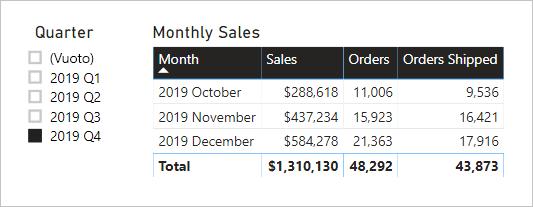

# <a name="active-vs-inactive-relationship-guidance"></a>Linee guida per relazioni attive e inattive

Questo articolo è destinato agli autori di modelli di dati che usano Power BI Desktop. Offre indicazioni su quando creare relazioni di modello attive o inattive. Per impostazione predefinita, le relazioni attive propagano i filtri ad altre tabelle. Le relazioni inattive invece propagano i filtri solo quando un'espressione DAX attiva, ovvero usa, la relazione.

[!INCLUDE [relationships-prerequisite-reading](includes/relationships-prerequisite-reading.md)]

## <a name="active-relationships"></a>Relazioni attive

In genere, è consigliabile definire relazioni attive laddove possibile. Ampliano l'ambito e il potenziale di utilizzo del modello da parte degli autori di report e degli utenti che usano Domande e risposte.

Si consideri un esempio di modello di importazione progettato per analizzare le prestazioni in tempo di voli aerei. Il modello include una tabella **Flight**, una tabella di tipo fact che archivia una riga per ogni volo. Ogni riga registra la data del volo, il numero del volo, gli aeroporti di partenza e arrivo ed eventuali ritardi (in minuti). È disponibile anche una tabella **Airport**, ovvero una tabella di tipo dimensione che archivia una riga per ogni aeroporto. Ogni riga descrive il codice e il nome dell'aeroporto e il paese.

Di seguito è riportato un diagramma del modello parziale delle due tabelle.


Esistono due relazioni di modello tra le tabelle **Flight** e **Airport**. Nella tabella **Flight** le colonne **DepartureAirport** e **ArrivalAirport** sono correlate alla colonna **Airport** della tabella **Airport**. Nella progettazione dello schema a stella la tabella **Airport** è descritta come una [dimensione con ruoli multipli](star-schema.md#role-playing-dimensions). In questo modello i due ruoli sono _l'aeroporto di partenza_ e _l'aeroporto di arrivo_.

Sebbene questo progetto funzioni bene per le progettazioni con schema a stella relazionale, non è così per i modelli di Power BI. Questo perché le relazioni dei modelli sono percorsi per la propagazione dei filtri e tali percorsi devono essere deterministici. Per questo motivo, un modello non può avere più relazioni attive tra due tabelle. Pertanto, come descritto in questo esempio, una relazione è attiva mentre l'altra è inattiva (rappresentata dalla linea tratteggiata). In particolare, è la relazione con la colonna **ArrivalAirport** a essere attiva. Ciò significa che i filtri applicati alla tabella **Airport** vengono propagati automaticamente alla colonna **ArrivalAirport** della tabella **Flight**.

Questa progettazione di modello impone limitazioni notevoli alla modalità di uso dei dati nei report. In particolare, non è possibile filtrare la tabella **Airport** per isolare automaticamente i dettagli relativi ai voli per un aeroporto di partenza. Poiché i requisiti per la creazione di report includono l'applicazione di filtri, o il raggruppamento, per aeroporto di partenza e di arrivo _allo stesso tempo_, sono necessarie due relazioni attive. Tradurre tutto ciò in una progettazione di un modello Power BI significa che il modello deve avere due tabelle per gli aeroporti.

Di seguito è illustrata la progettazione del modello migliorata.


Il modello ora include due tabelle per gli aeroporti: **Departure Airport** e **Arrival Airport**. Le relazioni di modello tra queste tabelle e la tabella **Flight** sono attive. Si noti anche che i nomi di colonna delle tabelle **Departure Airport** e **Arrival Airport** sono preceduti dalla parola _Departure_ o _Arrival_.

La progettazione del modello migliorata supporta la creazione della progettazione del report seguente.


La pagina del report filtra in base a Melbourne come aeroporto di partenza e l'oggetto visivo tabella raggruppa le righe in base agli aeroporti di arrivo.

> [!NOTE]
> Per i modelli di importazione, la tabella aggiuntiva ha comportato dimensioni maggiori del modello e tempi di aggiornamento più lunghi. Di conseguenza, contraddice le raccomandazioni incluse nell'articolo [Tecniche di riduzione dei dati per i modelli di importazione](import-modeling-data-reduction.md). Tuttavia, nell'esempio il requisito che richiede di avere solo relazioni attive sostituisce le raccomandazioni.
>
> Inoltre, spesso le tabelle di tipo dimensione contengono un numero di righe ridotto rispetto alle tabelle di tipo fact. Quindi le dimensioni e i tempi di aggiornamento del modello, sebbene maggiori, non sono eccessivamente grandi.

### <a name="refactoring-methodology"></a>Metodologia di refactoring

Di seguito viene illustrata una metodologia per eseguire il refactoring di un modello da una singola tabella di tipo dimensione con ruoli multipli a una progettazione con _una tabella per ruolo_.

1. Rimuovere tutte le relazioni inattive.
2. È consigliabile rinominare la tabella di tipo dimensione con ruoli multipli per descriverne meglio il ruolo. Nell'esempio seguente la tabella **Airport** è correlata alla colonna **ArrivalAirport** della tabella **Flight**, quindi viene rinominata **ArrivalAirport**.
3. Creare una copia della tabella con ruoli multipli, denominandola in modo che rispecchi il proprio ruolo. Se si tratta di una tabella di importazione, è consigliabile definire una tabella calcolata. Se si tratta di una tabella DirectQuery, è possibile duplicare la query di Power Query.

    Nell'esempio la tabella **Departure Airport** è stata creata usando la definizione seguente di tabella calcolata.

    ```dax
    Departure Airport = 'Arrival Airport'
    ```

4. Creare una relazione attiva per correlare la nuova tabella.
5. È consigliabile rinominare le colonne nelle tabelle in modo che riflettano accuratamente il proprio ruolo. Nell'esempio tutte le colonne sono precedute dalla parola _Departure_ o _Arrival_. Questi nomi fanno sì che gli oggetti visivi abbiano per impostazione predefinita etichette autodescrittive e non ambigue. Ciò consente anche di migliorare l'esperienza d'uso di Domande e risposte, semplificando l'inserimento delle domande da parte degli utenti.
6. È consigliabile aggiungere descrizioni alle tabelle con ruoli multipli. Quando l'autore del report passa il cursore sulla tabella, nel riquadro **Campi** viene visualizzata una descrizione in una descrizione comando. In questo modo è possibile comunicare eventuali dettagli aggiuntivi della propagazione dei filtri agli autori del report.

## <a name="inactive-relationships"></a>Relazioni inattive

In circostanze specifiche le relazioni inattive possono rispondere a specifiche esigenze di creazione di report.

Si considerino ora altri requisiti di modello e della creazione di report:

- Un modello vendita contiene una tabella **Sales** con due colonne di data: **OrderDate** e **ShipDate**
- Ogni riga della tabella **Sales** registra un solo ordine
- Alla colonna **OrderDate**, che archivia sempre una data valida, vengono quasi sempre applicati i filtri data
- Una sola misura richiede la propagazione del filtro data alla colonna **ShipDate**, che può contenere righe vuote (fino a quando l'ordine non viene spedito)
- Non è necessario eseguire contemporaneamente il filtro, o raggruppare, in base all'ordine _e_ ai periodi di data di spedizione

Di seguito è riportato un diagramma del modello parziale delle due tabelle.


Esistono due relazioni di modello tra le tabelle **Sales** e **Date**. Nella tabella **Sales** le colonne **OrderDate** e **ShipDate** sono correlate alla colonna **Date** della tabella **Date**. In questo modello i due ruoli per la tabella **Date** sono la _data ordine_ e la _data spedizione_. La relazione con la colonna **OrderDate** è una relazione attiva.

Tutte le sei misure, eccetto una, devono filtrare in base alla colonna **OrderDate**. La misura **Orders Shipped**, invece, deve filtrare in base alla colonna **ShipDate**.

Di seguito viene riportata la definizione della misura **Orders**. Include semplicemente il numero di righe della tabella **Sales** all'interno del contesto di filtro. Tutti i filtri applicati alla tabella **Date** si propagano alla colonna **OrderDate**.

```dax
Orders = COUNTROWS(Sales)
```

Di seguito viene riportata la definizione della misura **Orders Shipped**. Usa la funzione DAX [USERELATIONSHIP](/dax/userelationship-function-dax), che attiva la propagazione del filtro per una relazione specifica solo durante la valutazione dell'espressione. In questo esempio viene usata la relazione con la colonna **ShipDate**.

```dax
Orders Shipped =
CALCULATE(
    COUNTROWS(Sales)
    ,USERELATIONSHIP('Date'[Date], Sales[ShipDate])
)
```

La progettazione del modello supporta la creazione della progettazione di report seguente.



La pagina del report viene filtrata in base al quarto trimestre 2019. L'oggetto visivo tabella esegue il raggruppamento in base al mese e visualizza varie statistiche sulle vendite. Le misure **Orders** e **Orders Shipped** producono risultati diversi. Usano entrambe la stessa logica di riepilogo (numero di righe della tabella **Sales**) ma una propagazione del filtro tabella **Date** diversa.

Si noti che nel filtro dei dati del trimestre è incluso un elemento vuoto. Questo elemento filtro dei dati viene visualizzato in seguito all'[espansione della tabella](../desktop-relationships-understand.md#strong-relationships). Sebbene ogni riga della tabella **Sales** abbia una data di ordine, alcune righe hanno una data di spedizione vuota. Si tratta degli ordini che devono ancora essere spediti. L'espansione della tabella considera anche le relazioni inattive quindi le righe vuote possono essere visualizzate in quanto vi sono elementi vuoti sul lato "molti" della relazione o a causa di problemi di integrità dei dati.

## <a name="recommendations"></a>Raccomandazioni

Riepilogando, è consigliabile definire relazioni attive laddove possibile. Ampliano l'ambito e il potenziale di utilizzo del modello da parte degli autori di report e degli utenti che usano Domande e risposte. Ciò significa che le tabelle di tipo dimensione con ruoli multipli devono essere duplicate nel modello.

In circostanze specifiche, tuttavia, è possibile definire una o più relazioni inattive per una tabella di tipo dimensione con ruoli multipli. È possibile eseguire questa progettazione quando:

- Non è necessario che gli oggetti visivi del report vengano filtrati simultaneamente in base a ruoli diversi
- Viene usata la funzione DAX USERELATIONSHIP per attivare una relazione specifica per i calcoli del modello pertinenti

## <a name="next-steps"></a>Passaggi successivi

Per altre informazioni correlate a questo articolo, vedere le risorse seguenti:

- [Relazioni nei modelli in Power BI Desktop](../desktop-relationships-understand.md)
- [Informazioni su uno schema star e sull'importanza di questo schema per Power BI](star-schema.md)
- [Linee guida per la risoluzione dei problemi relativi alle relazioni](relationships-troubleshoot.md)
- Domande? [Provare a rivolgersi alla community di Power BI](https://community.powerbi.com/)
- Se si hanno suggerimenti, [Contribuire con idee per migliorare Power BI](https://ideas.powerbi.com/)
