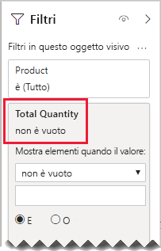

# <a name="bi-directional-relationship-guidance"></a>Linee guida per la relazione bidirezionale

Questo articolo è destinato agli autori di modelli di dati che usano Power BI Desktop. Offre indicazioni su quando creare relazioni di modello bidirezionali. Una relazione bidirezionale è una relazione che filtra in _entrambe le direzioni_.

[!INCLUDE [relationships-prerequisite-reading](includes/relationships-prerequisite-reading.md)]

In genere è consigliabile ridurre al minimo l'uso di relazioni bidirezionali, in quanto possono influire negativamente sulle prestazioni delle query del modello e persino offrire un’esperienza d'uso non chiara agli utenti del report.

Gli scenari in cui i filtri bidirezionali possono essere utili per soddisfare requisiti specifici sono tre:

- [Relazioni speciali dei modelli](#special-model-relationships)
- [Elementi filtro dei dati "con dati"](#slicer-items-with-data)
- [Analisi da dimensione a dimensione](#dimension-to-dimension-analysis)

## <a name="special-model-relationships"></a>Relazioni speciali dei modelli

Le relazioni bidirezionali svolgono un ruolo importante quando si creano i due tipi seguenti di relazione speciale dei modelli:

- **Uno-a-uno**: tutte le relazioni uno-a-uno devono essere bidirezionali, non è possibile configurarle diversamente. In genere, non è consigliabile creare questi tipi di relazioni. Per una descrizione completa e progettazioni alternative, vedere [Linee guida per relazioni uno-a-uno](relationships-one-to-one.md).
- **Molti-a-molti**: quando si correlano due tabelle di tipo dimensione, è necessaria una tabella di bridging. È necessario un filtro bidirezionale per garantire la propagazione dei filtri nella tabella di bridging. Per altre informazioni, vedere [Linee guida per le relazioni molti-a-molti (Correlare dimensioni molti-a-molti)](relationships-many-to-many.md#relate-many-to-many-dimensions).

## <a name="slicer-items-with-data"></a>Elementi filtro dei dati "con dati"

Le relazioni bidirezionali possono specificare filtri dei dati che limitano gli elementi solo in presenza di dati. Se si ha familiarità con le tabelle pivot e i filtri dei dati di Excel, si tratta del comportamento predefinito quando si usano dati provenienti da un set di dati Power BI o da un modello di Analysis Services. Per avere un'idea più chiara di cosa questo significhi, si consideri il diagramma del modello seguente.


La prima tabella è denominata **Customer** e contiene tre colonne: **Country-Region**, **Customer** e **CustomerCode**. La seconda tabella è denominata **Product** e contiene tre colonne: **Color**, **Product** e **SKU**. La terza tabella è denominata **Sales** e contiene quattro colonne: **CustomerCode**, **OrderDate**, **Quantity** e **SKU**. Le tabelle **Customer** e **Product** sono tabelle di tipo dimensione e hanno tutte una relazione uno-a-molti con la tabella **Sales**. Ogni relazione filtra in un'unica direzione.

Per semplificare la descrizione del funzionamento del filtro bidirezionale, il diagramma del modello è stato modificato in modo da visualizzare le righe delle tabelle. Tutti gli esempi in questo articolo sono basati su questi dati.

> [!NOTE]
> Non è possibile visualizzare le righe della tabella nel diagramma del modello di Power BI Desktop. Questa operazione viene eseguita in questo articolo solo per supportare la discussione con esempi chiari.


I dettagli delle righe per le tre tabelle sono descritti nell'elenco puntato seguente:

- La tabella **Customer** contiene due righe:
  - **CustomerCode** CUST-01, **Customer** Customer-1, **Country-Region** United States
  - **CustomerCode** CUST-02, **Customer** Customer-2, **Country-Region** Australia
- La tabella **Product** include tre righe:
  - **SKU** CL-01, **Product** T-shirt, **Color** Green
  - **SKU** CL-02, **Product** Jeans, **Color** Blue
  - **SKU** AC-01, **Product** Hat, **Color** Blue
- La tabella **Sales** include tre righe:
  - **OrderDate** January 1 2019, **CustomerCode** CUST-01, **SKU** CL-01, **Quantity** 10
  - **OrderDate** February 2 2019, **CustomerCode** CUST-01, **SKU** CL-02, **Quantity** 20
  - **OrderDate** March 3 2019, **CustomerCode** CUST-02, **SKU** CL-01, **Quantity** 30

Si consideri ora la pagina di report seguente.


La pagina è costituita da due filtri dei dati e da un oggetto visivo della scheda. Il primo filtro dei dati è per **Country-Region** e include due elementi: Australia e United States. Attualmente esegue il filtro dei dati per Australia. Il secondo filtro dei dati è per **Product** ed è costituito da tre elementi: Hat, Jeans e T-shirt. Non è selezionato alcun elemento, ovvero _i prodotti non vengono filtrati_. L'oggetto visivo della scheda visualizza una quantità pari a 30.

Quando gli utenti del report eseguono il filtro per Australia, è possibile limitare il filtro dei dati **Product** in modo che vengano visualizzati gli elementi per cui i dati _si riferiscono_ alle vendite australiane. È questo che si intende quando si parla di visualizzazione degli elementi del filtro dei dati "con dati". È possibile ottenere questo comportamento configurando la relazione tra la tabella **Product** e la tabella **Sales** in modo che il filtro venga eseguito in entrambe le direzioni.


Il filtro dei dati **Product** ora elenca un singolo elemento: T-shirt. L'elemento rappresenta l'unico prodotto venduto ai clienti australiani.


Prima di tutto è consigliabile valutare attentamente se questa progettazione funziona per gli utenti del report. Alcuni utenti di report trovano questo tipo di esperienza poco chiaro. Non capiscono perché gli elementi del filtro dei dati appaiono o scompaiono in modo dinamico quando interagiscono con altri filtri dei dati.

Se si decide di visualizzare gli elementi del filtro dei dati "con dati", non è consigliabile configurare relazioni bidirezionali. Le relazioni bidirezionali richiedono una maggiore elaborazione, quindi possono influire negativamente sulle prestazioni delle query, soprattutto quando il numero di relazioni bidirezionali nel modello aumenta.

Esiste un modo migliore per ottenere lo stesso risultato: invece di usare i filtri bidirezionali, è possibile applicare un filtro a livello di oggetto visivo al filtro dei dati **Product**.

Si consideri ora che la relazione tra le tabelle **Product** e **Sales** non filtri più in entrambe le direzioni. E che sia stata aggiunta la definizione di misura seguente alla tabella **Sales**.

```dax
Total Quantity = SUM(Sales[Quantity])
```

Per visualizzare gli elementi del filtro dei dati "con dati" **Product**, è sufficiente filtrare in base alla misura **Total Quantity** usando la condizione "non è vuoto".



## <a name="dimension-to-dimension-analysis"></a>Analisi da dimensione a dimensione

Uno scenario diverso che riguarda le relazioni bidirezionali tratta una tabella di tipo fact come una tabella di bridging. In questo modo l'analisi dei dati della tabella di tipo dimensione viene supportata all'interno del contesto filtro di una tabella di tipo dimensione diversa.

Usando il modello di esempio in questo articolo, considerare come rispondere alle domande seguenti:

- Quanti colori sono stati venduti ai clienti australiani?
- Quanti paesi hanno acquistato jeans?

È possibile rispondere a entrambe le domande _senza_ riepilogare i dati nella tabella di bridging di tipo fact. Tuttavia, è necessario che i filtri vengano propagati da una tabella di tipo dimensione all'altra. Una volta che i filtri vengono propagati tramite la tabella di tipo fact, è possibile ottenere il riepilogo delle colonne della tabella di tipo dimensione usando la funzione DAX [DISTINCTCOUNT](/dax/distinctcount-function-dax) ed eventualmente anche le funzioni DAX [MIN](/dax/min-function-dax) e [MAX](/dax/max-function-dax).

Dal momento che la tabella di tipo fact si comporta come una tabella di bridging, è possibile seguire le linee guida per la relazione molti-a-molti per mettere in relazione due tabelle di tipo dimensione. Sarà necessario configurare almeno una relazione in modo che filtri in entrambe le direzioni. Per altre informazioni, vedere [Linee guida per le relazioni molti-a-molti (Correlare dimensioni molti-a-molti)](relationships-many-to-many.md#relate-many-to-many-dimensions).

Tuttavia, come già descritto in questo articolo, la progettazione avrà probabilmente effetti negativi sulle prestazioni e sull'esperienza utente relativamente agli [elementi del filtro di dati "con dati"](#slicer-items-with-data). È quindi consigliabile attivare il filtro bidirezionale _in una definizione di misura_ usando invece la funzione DAX [CROSSFILTER](/dax/crossfilter-function). La funzione CROSSFILTER può essere usata per modificare le direzioni del filtro, o persino disabilitare la relazione, durante la valutazione di un'espressione.

Considerare la definizione di misura seguente aggiunta alla tabella **Sales**. In questo esempio la relazione del modello tra le tabelle **Customer** e **Sales** è stata configurata in modo da filtrare in una _singola direzione_.

```dax
Different Countries Sold =
CALCULATE(
    DISTINCTCOUNT(Customer[Country-Region]),
    CROSSFILTER(
        Customer[CustomerCode],
        Sales[CustomerCode],
        BOTH
    )
)
```

Durante la valutazione dell'espressione di misura **Different Countries Sold**, la relazione tra le tabelle **Customer** e **Sales** filtra in entrambe le direzioni.

Nella tabella oggetti visivi seguente vengono visualizzate le statistiche relative a ogni prodotto venduto. La colonna **Quantity** è semplicemente la somma dei valori della quantità. La colonna **Different Countries Sold** rappresenta il conteggio distinto dei valori di paese-area di tutti i clienti che hanno acquistato il prodotto.


## <a name="next-steps"></a>Passaggi successivi

Per altre informazioni correlate a questo articolo, vedere le risorse seguenti:

- [Relazioni nei modelli in Power BI Desktop](../desktop-relationships-understand.md)
- [Informazioni su uno schema star e sull'importanza di questo schema per Power BI](star-schema.md)
- [Linee guida per relazioni uno-a-uno](relationships-one-to-one.md)
- [Linee guida per le relazioni molti-a-molti](relationships-many-to-many.md)
- [Linee guida per la risoluzione dei problemi relativi alle relazioni](relationships-troubleshoot.md)
- Domande? [Provare a rivolgersi alla community di Power BI](https://community.powerbi.com/)
- Se si hanno suggerimenti, [Contribuire con idee per migliorare Power BI](https://ideas.powerbi.com/)
