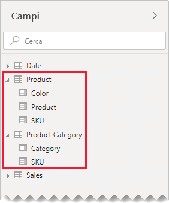
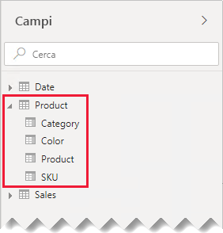
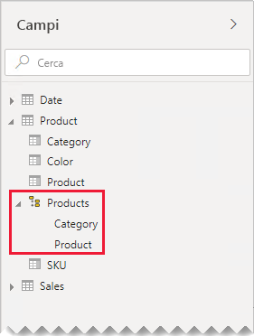
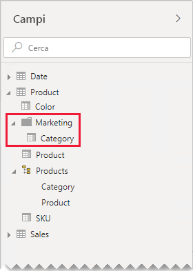

# Linee guida per relazioni uno-a-uno

Questo articolo è destinato agli autori di modelli di dati che usano Power BI Desktop. Offre linee guida per l'uso di relazioni di modelli uno-a-uno. È possibile creare una relazione uno-a-uno quando entrambe le tabelle contengono ognuna una colonna di valori comuni e univoci.

[!INCLUDE [relationships-prerequisite-reading](includes/relationships-prerequisite-reading.md)]

Esistono due scenari che prevedono relazioni uno-a-uno:

- [Dimensioni degeneri](#degenerate-dimensions): è possibile derivare una [dimensione degenere](star-schema.md#degenerate-dimensions) da una tabella di tipo fact.
- [Estensione dei dati delle righe su più tabelle](#row-data-spans-across-tables): una singola entità business o un singolo oggetto viene caricato come due o più tabelle del modello, probabilmente perché i dati hanno origine da archivi dati diversi. Questo scenario può essere comune per le tabelle di tipo dimensione. I dettagli master dei prodotti, ad esempio, possono essere archiviati in un sistema di vendita operativo e i dettagli supplementari dei prodotti possono essere archiviati in un'origine diversa.

    È insolito, tuttavia, correlare due tabelle di tipo fact con una relazione uno-a-uno. Ciò è dovuto al fatto che entrambe le tabelle di tipo fact devono avere la stessa dimensionalità e la stessa granularità. Per consentire la creazione della relazione di modello, poi, ogni tabella di tipo fact richiede colonne univoche.

## Dimensioni degeneri

Quando le colonne di una tabella di tipo fact vengono usate per la creazione di filtri o gruppi, è possibile renderle disponibili in una tabella separata. In questo modo le colonne usate per il filtro o il raggruppamento vengono separate da quelle usate per il riepilogo delle righe fact. Questa separazione consente di:

- Ridurre lo spazio di archiviazione
- Semplificare i calcoli dei modelli
- Contribuire al miglioramento delle prestazioni delle query
- Offrire un'esperienza più intuitiva del riquadro **Campi** agli autori di report

Si consideri una tabella di vendite di origine in cui vengono archiviati dettagli degli ordini di vendita in due colonne.

Nella colonna **OrderNumber** è archiviato il numero di ordine e nella colonna **OrderLineNumber** è archiviata una sequenza di righe all'interno dell'ordine.

Nel diagramma di modello seguente si noti che le colonne del numero di ordine e del numero di riga dell'ordine non sono state caricate nella tabella **Sales**. I valori corrispondenti sono stati invece usati per creare una colonna [chiave sostitutiva](star-schema.md#surrogate-keys) denominata **SalesOrderLineID**. Il valore della chiave viene calcolato moltiplicando il numero di ordine per 1000 e aggiungendo quindi il numero di riga dell'ordine.

La tabella **Sales Order** offre un'esperienza avanzata agli autori di report tramite tre colonne: **Sales Order**, **Sales Order Line** e **Line Number**. La tabella include anche una gerarchia. Queste risorse di tabella supportano le progettazioni di report che devono filtrare gli ordini, raggrupparli o eseguire il drill-down in base a ordini e righe di ordine specifici.

Poiché la tabella **Sales Order** deriva dai dati delle vendite, ogni tabella deve contenere esattamente lo stesso numero di righe. I valori presenti in ciascuna colonna **SalesOrderLineID**, poi, devono corrispondere.

## Estensione dei dati delle righe su più tabelle

Si considerino, ad esempio, due tabelle di tipo dimensione con una relazione uno-a-uno: **Product** e **Product Category**. Ognuna rappresenta dati importati e ha una colonna **SKU** (Stock-Keeping Unit, codice di riferimento del prodotto) contenente valori univoci.

Di seguito è riportato un diagramma di modello parziale delle due tabelle.

La prima tabella, denominata **Product**, contiene tre colonne: **Color**, **Product** e **SKU**. La seconda tabella, denominata **Product Category**, contiene due colonne: **Category** e **SKU**. Le due colonne **SKU** sono collegate da una relazione uno-a-uno. La relazione applica un filtro in entrambe le direzioni, come avviene sempre per le relazioni uno-a-uno.

Per semplificare la descrizione del funzionamento della propagazione del filtro delle relazioni, il diagramma del modello è stato modificato in modo da mostrare le righe della tabella. Tutti gli esempi in questo articolo si basano su questi dati.

> [!NOTE]
> Non è possibile visualizzare le righe della tabella nel diagramma del modello di Power BI Desktop. Questa operazione viene eseguita in questo articolo solo per supportare la discussione con esempi chiari.

I dettagli delle righe per le due tabelle sono descritti nell'elenco puntato seguente:

- La tabella **Product** ha tre righe:
  - **SKU** CL-01, **Product** T-shirt, **Color** Green
  - **SKU** CL-02, **Product** Jeans, **Color** Blue
  - **SKU** AC-01, **Product** Hat, **Color** Blue
- La tabella **Product Category** ha due righe:
  - **SKU** CL-01, **Category** Clothing
  - **SKU** AC-01, **Category** Accessories

Si noti che la tabella **Product Category** non include alcuna riga per lo SKU di prodotto CL-02. Le conseguenze della mancanza di questa riga verranno illustrate più avanti in questo articolo.

Nel riquadro **Campi** gli autori di report trovano i campi relativi ai prodotti all'interno di due tabelle: **Product** e **Product Category**.

Si vedrà ora cosa accade quando i campi di entrambe le tabelle vengono aggiunti a un oggetto visivo tabella. In questo esempio, la colonna **SKU** ha origine dalla tabella **Product**.

Si noti che il valore **Category** per lo SKU CL-02 di prodotto è vuoto. Questo è dovuto al fatto che per questo prodotto non è presente alcuna riga nella tabella **Product Category**.

### Consigli

Se possibile, è consigliabile evitare di creare relazioni di modelli uno-a-uno quando i dati delle righe si estendono su più tabelle del modello. Questo è dovuto al fatto che questo tipo di progettazione può:

- Contribuire a creare ingombro nel riquadro **Campi** a causa della presenza di un numero di tabelle maggiore del necessario
- Rendere difficile per gli autori di report trovare campi correlati, perché questi sono distribuiti su più tabelle
- Limitare la possibilità di creare gerarchie, poiché i livelli di queste devono basarsi su colonne della _stessa tabella_
- Generare risultati imprevisti se le righe nelle diverse tabelle non corrispondono esattamente

I consigli specifici possono variare a seconda che la relazione uno-a-uno sia _all'interno dell'isola_ o _tra isole_. Per altre informazioni sulla valutazione delle relazioni, vedere [Relazioni di modelli in Power BI Desktop (valutazione della relazione)](../transform-model/desktop-relationships-understand.md#relationship-evaluation).

### Relazione uno-a-uno all'interno dell'isola

Se tra le tabelle esiste una relazione uno-a-uno _all'interno dell'isola_, è consigliabile consolidare i dati in un'unica tabella del modello. Per eseguire questa operazione, unire le query di Power Query.

I passaggi seguenti presentano una metodologia che consente di consolidare e modellare i dati correlati da una relazione uno-a-uno:

1. **Unione delle query**: quando si [combinano le due query](../connect-data/desktop-shape-and-combine-data.md#combine-queries), prestare attenzione alla completezza dei dati in ognuna. Se una query contiene un set di righe completo (come un elenco master), unire l'altra query. Configurare la trasformazione di unione in modo che usi un _left outer join_, il tipo di join predefinito. Questo tipo di join garantisce il mantenimento di tutte le righe della prima query e l'integrazione di queste con le righe corrispondenti della seconda query. Espandere tutte le colonne obbligatorie della seconda query nella prima query.
2. **Disabilitazione del caricamento delle query**: assicurarsi di [disabilitare il caricamento](import-modeling-data-reduction.md#disable-power-query-query-load) della seconda query. In questo modo, il risultato non verrà caricato come tabella del modello. Questa configurazione riduce le dimensioni di archiviazione del modello di dati e consente di evitare l'ingombro del riquadro **Campi**.

    Nell'esempio, gli autori di report trovano ora un'unica tabella denominata **Product** nel riquadro **Campi** con tutti i campi relativi ai prodotti.

    
3. **Sostituzioni dei valori mancanti**: se la seconda query contiene righe non corrispondenti, verranno visualizzati valori NULL nelle colonne introdotte da tale query. Se appropriato, considerare la possibilità di sostituire i valori NULL con un valore di token. La sostituzione dei valori mancanti è particolarmente importante nel caso in cui gli autori di report filtrino o raggruppino in base ai valori delle colonne, dato che negli oggetti visivi dei report potrebbero comparire valori vuoti.

    Nell'oggetto visivo tabella seguente si noti che per la categoria dello SKU di prodotto CL-02 ora compare _[Undefined]_ (Non definito). Nella query, infatti, le categorie Null sono state sostituite con questo valore di testo di token.

    

4. **Creazione di gerarchie**: se esistono relazioni _tra le colonne_ della tabella ora consolidata, prendere in considerazione la possibilità di creare gerarchie. In questo modo, gli autori di report potranno identificare rapidamente le opportunità di drill-down sugli oggetti visivi dei report.

    In questo esempio, gli autori di report possono ora usare una gerarchia a due livelli: **Category** e **Product**.

    

Anche se si preferisce mantenere tabelle separate per facilitare l'organizzazione dei campi, è comunque consigliabile eseguire il consolidamento in un'unica tabella. Organizzare i campi è ancora possibile, usando _cartelle di visualizzazione_.

In questo esempio, gli autori di report possono trovare il campo **Category** all'interno della cartella di visualizzazione **Marketing**.

Se si decide comunque di definire relazioni uno-a-uno all'interno dell'isola nel modello, verificare, quando possibile, che siano presenti righe corrispondenti nelle tabelle correlate. Poiché una relazione uno-a-uno all'interno dell'isola viene valutata come [relazione forte](../transform-model/desktop-relationships-understand.md#strong-relationships), i problemi di integrità dei dati possono essere rappresentati negli oggetti visivi dei report come spazi vuoti. È possibile vedere un esempio di raggruppamento vuoto nel primo oggetto visivo tabella presentato in questo articolo.

### Relazione uno-a-uno tra isole

Se tra tabelle diverse esiste una relazione uno-a-uno _tra isole_, non esiste alcun tipo di progettazione di modello alternativa, a meno che non si esegua prima il consolidamento dei dati nelle origini dati. Power BI valuterà la relazione di modello uno-a-uno come [relazione debole](../transform-model/desktop-relationships-understand.md#weak-relationships). Assicurarsi quindi che le righe presenti nelle tabelle correlate corrispondano, poiché le righe non corrispondenti verranno eliminate dai risultati delle query.

Si vedrà ora cosa accade quando a un oggetto visivo tabella vengono aggiunti campi di entrambe le tabelle ed esiste una relazione debole tra le tabelle.

La tabella visualizza solo due righe. Lo SKU di prodotto CL-02 manca perché non esiste alcuna riga corrispondente nella tabella **Product Category**.

## Passaggi successivi

Per altre informazioni correlate a questo articolo, vedere le risorse seguenti:

- [Relazioni nei modelli in Power BI Desktop](../transform-model/desktop-relationships-understand.md)
- [Informazioni su uno schema star e sull'importanza di questo schema per Power BI](star-schema.md)
- [Linee guida per la risoluzione dei problemi relativi alle relazioni](relationships-troubleshoot.md)
- Domande? [Contattare la community di Power BI](https://community.powerbi.com/)
- Se si hanno suggerimenti, [Contribuire con idee per migliorare Power BI](https://ideas.powerbi.com/)
