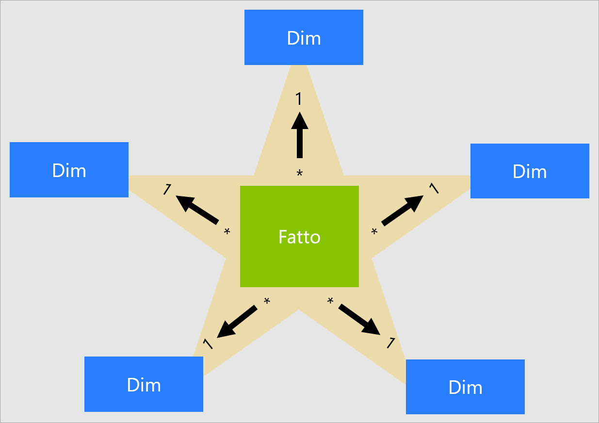

# Informazioni su uno schema a stella e sull'importanza di questo schema per Power BI

Questo articolo è destinato a esperti di modellazione di dati in Power BI Desktop. Illustra la progettazione di uno schema a stella e la pertinenza di questo schema per lo sviluppo di modelli di dati di Power BI ottimizzati per le prestazioni e l'usabilità.

Questo articolo non intende fornire una trattazione completa sulla progettazione di uno schema a stella. Per informazioni più dettagliate, fare direttamente riferimento alla documentazione pubblicata, ad esempio **The Data Warehouse Toolkit: The Complete Guide to Dimensional Modeling** (seconda edizione, 2002) di Ralph Kimball et al.

## Panoramica dello schema a stella

Lo **schema a stella** è un approccio maturo alla modellazione, ampiamente adottato dai data warehouse relazionali. In base a questo schema, gli esperti di modellazione devono classificare le tabelle del modello come _dimensione_ o _fatto_.

Le **tabelle delle dimensioni** descrivono le entità aziendali, ovvero gli elementi modellati. Le entità possono includere prodotti, persone, luoghi e concetti, incluso il tempo stesso. La tabella più coerente che è possibile trovare in uno schema a stella è una tabella delle dimensioni data. Una tabella delle dimensioni è costituita da una o più colonne chiave, con funzione di identificatore univoco, e da colonne descrittive.

Le **tabelle dei fatti** archiviano osservazioni o eventi. Possono essere ordini di vendita, saldi azionari, tassi di cambio, temperature e così via. Una tabella dei fatti contiene colonne chiave di dimensione correlate alle tabelle delle dimensioni e alle colonne di misure numeriche. Le colonne chiave di dimensione determinano la _dimensionalità_ di una tabella dei fatti, mentre i valori chiave di dimensione determinano la _granularità_ di una tabella dei fatti. Si consideri, ad esempio, una tabella dei fatti progettata per archiviare obiettivi di vendita con due colonne chiave di dimensione, **Date** e **ProductKey**. È evidente che la tabella ha due dimensioni. Non è tuttavia possibile determinare la granularità senza considerare i valori chiave di dimensione. In questo esempio, si consideri che i valori archiviati nella colonna **Date** corrispondono al primo giorno di ogni mese. In questo caso, la granularità è a livello di mese-prodotto.

Le tabelle delle dimensioni contengono in genere un numero di righe relativamente ridotto. Le tabelle dei fatti, al contrario, possono contenere un numero molto elevato di righe e continuano a crescere nel tempo.

## Pertinenza dello schema a stella per i modelli di Power BI

La progettazione di schemi a stella e molti concetti correlati introdotti in questo articolo sono particolarmente pertinenti allo sviluppo di modelli di Power BI ottimizzati per le prestazioni e l'usabilità.

Si tenga presente che ogni oggetto visivo di report Power BI genera una query che viene inviata al modello di Power BI, definito set di dati nel servizio Power BI. Queste query vengono usate per filtrare, raggruppare e riepilogare i dati del modello. Un modello ben progettato è quindi un modello che fornisce tabelle per il filtraggio e il raggruppamento e tabelle per il riepilogo dei dati. Questo concetto si adatta perfettamente ai principi di progettazione di uno schema a stella:

- Le tabelle delle dimensioni supportano il _filtraggio_ e il _raggruppamento_
- Le tabelle dei fatti supportano la _generazione di riepiloghi_

Anche se non esiste una proprietà di tabella che gli esperti di modellazione possono impostare per configurare il tipo di tabella (dimensioni o fatti), il tipo è determinato dalle relazioni tra modelli. Una relazione tra modelli stabilisce un percorso di propagazione dei filtri tra due tabelle ed è la proprietà **Cardinality** della relazione a determinare il tipo di tabella. Una cardinalità di relazione comune è "uno-a-molti" o il relativo inverso "molti-a-uno". Il lato "uno" è sempre rappresentato da una tabella di tipo dimensione mentre il lato "molti" corrisponde sempre a una tabella di tipo fatto.

La progettazione di un modello ben strutturato deve prevedere tabelle di tipo dimensione o tabelle di tipo fatto. È opportuno evitare di combinare i due tipi per una singola tabella. È anche consigliabile specificare il numero corretto di tabelle con le corrette relazioni. È inoltre importante che le tabelle di tipo fatto carichino sempre dati a un livello di granularità coerente.

È infine importante comprendere che progettare un modello in modo ottimale è una questione di scienza ma anche di arte. Talvolta è possibile deviare dagli standard quando ha senso farlo.

Esistono molte altre entità correlate alla progettazione di uno schema a stella che è possibile applicare a un modello di Power BI. Tra queste sono incluse:

- [Misure](#measures)
- [Chiavi sostitutive](#surrogate-keys)
- [Dimensioni a fiocco di neve](#snowflake-dimensions)
- [Dimensioni con ruoli multipli](#role-playing-dimensions)
- [Dimensioni a modifica lenta](#slowly-changing-dimensions)
- [Dimensioni di tipo junk](#junk-dimensions)
- [Dimensioni degeneri](#degenerate-dimensions)
- [Tabelle dei fatti senza fatti](#factless-fact-tables)

## Misure

Nella progettazione di uno schema a stella, una **misura** è una colonna della tabella dei fatti in cui vengono archiviati i valori da riepilogare.

In un modello di Power BI una **misura** ha una definizione diversa, anche se simile. Si tratta di una formula scritta in [DAX (Data Analysis Expressions)](https://docs.microsoft.com/dax/data-analysis-expressions-dax-reference) che consente la generazione di riepiloghi. Le espressioni di misura utilizzano spesso funzioni di aggregazione DAX, come SUM, MIN, MAX, AVERAGE e così via, per generare un risultato di valore scalare in fase di query (i valori non vengono mai archiviati nel modello). Un'espressione di misura può variare da semplici aggregazioni di colonne a formule più sofisticate che sostituiscono le propagazioni di relazioni e/o contesti di filtro. Per altre informazioni, vedere l'articolo [Nozioni di DAX in Power BI Desktop](https://docs.microsoft.com/power-bi/desktop-quickstart-learn-dax-basics). Collegamento Altre informazioni?

È importante comprendere che i modelli di Power BI supportano un secondo metodo per la generazione di riepiloghi. Le colonne, e in genere quelle numeriche, possono essere riepilogate in base a un oggetto visivo di report o a Domande e risposte. Questa è una soluzione pratica per gli sviluppatori di modelli, poiché in molti casi non è necessario creare misure. Ad esempio, la colonna **Sales Amount** relativa alle vendite dei rivenditori di Adventure Works può essere riepilogata in diversi modi (sum, count, average, median, min, max e così via), senza che sia necessario creare una misura per ogni tipo di aggregazione possibile.

Vi sono tuttavia due validi motivi per creare misure, anche per semplici riepiloghi a livello di colonna:

- Quando si è a conoscenza del fatto che gli autori di report eseguiranno una query sul modello usando [espressioni MDX](https://docs.microsoft.com/sql/analysis-services/multidimensional-models/mdx/mdx-query-the-basic-query?view=sql-server-2017), il modello deve includere misure. MDX non può generare riepiloghi di valori di colonna. Questo è particolarmente importante quando viene eseguita una query su un set di dati di Power BI usando MDX, come accade quando si usa [Analizza in Excel](https://docs.microsoft.com/power-bi/service-analyze-in-excel) (query MDX su tabelle pivot).
- Se è necessario assicurarsi che gli autori di report possano riepilogare le colonne solo in modi specifici. Ad esempio, la colonna **Unit Price** relativa alle vendite dei rivenditori (che rappresenta una tariffa per unità) può essere riepilogata, ma solo tramite funzioni di aggregazione specifiche. I valori della colonna non dovrebbero essere mai sommati, ma è opportuno riepilogarli usando altre funzioni di aggregazione (min, max, average e così via). In questo esempio, l'esperto di modellazione può nascondere la colonna **Unit Price** e creare misure per tutte le funzioni di aggregazione appropriate.

Si noti che questo approccio di progettazione funziona bene per i report creati nel servizio Power BI e per Domande e risposte. Le connessioni dinamiche di Power BI Desktop, tuttavia, consentono agli autori di report di mostrare i campi nascosti nel riquadro **Campi**, eludendo così questo approccio di progettazione.

## Chiavi sostitutive

Una **chiave sostitutiva** è un identificatore univoco che viene aggiunto a una tabella per supportare la modellazione dello schema a stella. Per definizione, non è definito né archiviato nei dati di origine. Le chiavi sostitutive vengono in genere aggiunte alle tabelle delle dimensioni di un data warehouse relazionale per fornire un identificatore univoco per ogni riga di tabella delle dimensioni.

Le relazioni del modello di Power BI sono basate su una singola colonna univoca in una tabella, che propaga i filtri a una singola colonna in un'altra tabella. Quando una tabella di tipo dimensione nel modello non include una singola colonna univoca, è necessario aggiungere un identificatore univoco che diventerà il lato "uno" di una relazione. In Power BI Desktop è possibile ottenere facilmente questo risultato creando una [colonna indice di Power Query](https://docs.microsoft.com/powerquery-m/table-addindexcolumn).

È necessario unire questa query alla query sul lato "molti" in modo che sia possibile aggiungervi anche la colonna indice. Quando si caricano queste query nel modello, è quindi possibile creare una relazione uno-a-molti tra le tabelle del modello.

## Dimensioni a fiocco di neve

Una **dimensione a fiocco di neve** è un set di tabelle normalizzate per una singola entità aziendale. Adventure Works, ad esempio, classifica i prodotti per categoria e sottocategoria. Le categorie vengono assegnate alle sottocategorie e i prodotti vengono a loro volta assegnati alle sottocategorie. Nel data warehouse relazionale Adventure Works la dimensione Product è normalizzata e archiviata in tre tabelle correlate: **DimProductCategory**, **DimProductSubcategory** e **DimProduct**.

Usando l'immaginazione, è possibile rappresentare le tabelle normalizzate all'esterno della tabella dei fatti, organizzate in base a uno schema a forma di fiocco di neve.

In Power BI Desktop è possibile scegliere di simulare una progettazione delle dimensioni a fiocco di neve (probabilmente in base alla struttura dei dati di origine) o di integrare (denormalizzare) le tabelle di origine in una singola tabella del modello. I vantaggi offerti da una singola tabella del modello sono in genere maggiori rispetto all'uso di più tabelle. La decisione ottimale può dipendere dai volumi di dati e dai requisiti di usabilità per il modello.

Quando si sceglie di simulare una progettazione delle dimensioni a fiocco di neve:

- Power BI carica più tabelle, il che è meno efficiente dal punto di vista dell'archiviazione e delle prestazioni. Le tabelle devono includere colonne per supportare le relazioni tra modelli e ciò può comportare un aumento delle dimensioni del modello.
- È necessario attraversare catene di propagazione dei filtri delle relazioni più lunghe, che probabilmente saranno meno efficienti rispetto ai filtri applicati a una singola tabella.
- Il riquadro **Campi** presenta più tabelle del modello agli autori di report. Questo può comportare un'esperienza meno intuitiva, soprattutto quando le tabelle delle dimensioni a fiocco di neve contengono solo una o due colonne.
- Non è possibile creare una gerarchia che si estende sulle tabelle.

Quando si sceglie di eseguire l'integrazione in una singola tabella del modello, è anche possibile definire una gerarchia che includa la granularità massima e minima della dimensione. È possibile che l'archiviazione di dati denormalizzati ridondanti comporti un aumento delle dimensioni di archiviazione del modello, in particolare per le tabelle delle dimensioni molto grandi.

## Dimensioni a modifica lenta

Una **dimensione a modifica lenta** consente di gestire in modo appropriato le modifiche dei membri della dimensione nel tempo. Si applica quando i valori dell'entità aziendale cambiano nel tempo e in maniera ad hoc. Un buon esempio di dimensione a _modifica lenta_ è costituito da una dimensione relativa ai clienti e in particolare dalle colonne specifiche dei dettagli di contatto, come l'indirizzo di posta elettronica e il numero di telefono. Diversamente da questa, alcune dimensioni vengono considerate a _modifica rapida_, quando un attributo della dimensione cambia spesso, ad esempio il prezzo di mercato di un'azione. L'approccio di progettazione comune in queste istanze consiste nell'archiviare i valori degli attributi a modifica rapida in una misura della tabella dei fatti.

La teoria della progettazione con schema a stella fa riferimento a due tipi comuni di dimensione a modifica lenta, ovvero i tipi 1 e 2. Una tabella di dimensione può essere di tipo 1 o 2 oppure può supportare entrambi i tipi contemporaneamente per colonne diverse.

### Dimensione a modifica lenta di tipo 1

Una **dimensione a modifica lenta** di **tipo 1** riflette sempre i valori più recenti e, quando vengono rilevate modifiche ai dati di origine, i dati della tabella corrispondente vengono semplicemente sovrascritti. Questo approccio di progettazione è comune per le colonne in cui vengono archiviati valori supplementari, ad esempio l'indirizzo di posta elettronica o il numero di telefono di un cliente. Quando viene modificato l'indirizzo di posta elettronica o il numero di telefono di un cliente, la tabella della dimensione aggiorna la riga del cliente con i nuovi valori. È come se il cliente avesse sempre avuto queste informazioni di contatto.

Un aggiornamento non incrementale di una tabella di tipo dimensione del modello di Power BI ha come risultato una dimensione a modifica lenta di tipo 1. Aggiorna i dati della tabella per verificare che vengano caricati i valori più recenti.

### Dimensione a modifica lenta di tipo 2

Una **dimensione a modifica lenta** di **tipo 2** supporta il controllo delle versioni dei propri membri. Se il sistema di origine non archivia le versioni, è in genere il processo di caricamento del data warehouse a rilevare le modifiche e a gestire in modo appropriato la modifica in una tabella delle dimensioni. In questo caso, la tabella delle dimensioni deve usare una chiave sostitutiva per fornire un riferimento univoco a una _versione_ del membro della dimensione. Sono incluse anche le colonne che definiscono la validità dell'intervallo di date della versione (ad esempio **StartDate** ed **EndDate**) e possibilmente una colonna di flag (ad esempio **IsCurrent**) per filtrare facilmente in base ai membri della dimensione corrente.

Adventure Works, ad esempio, assegna i venditori a un'area di vendita. Quando un venditore si sposta in un'altra area, è necessario creare una nuova versione del venditore per assicurarsi che i fatti cronologici rimangano associati all'area precedente. Per supportare un'analisi cronologica accurata delle vendite per venditore, è necessario che nella tabella delle dimensioni vengano archiviate le versioni dei venditori e le aree associate. La tabella deve includere anche i valori delle date di inizio e di fine per definire la validità a livello temporale. Le versioni correnti possono definire una data di fine vuota (o 31/12/9999), in modo da indicare che la riga corrisponde alla versione corrente. La tabella deve inoltre definire una chiave sostitutiva perché la chiave aziendale (in questo caso, l'ID dipendente) non sarà univoca.

È importante comprendere che, quando nei dati di origine non vengono archiviate le versioni, è necessario usare un sistema intermedio (ad esempio un data warehouse) per rilevare e archiviare le modifiche. Il processo di caricamento della tabella deve conservare i dati esistenti e rilevare le modifiche. Quando viene rilevata una modifica, il processo di caricamento della tabella deve determinare la scadenza della versione corrente. Questa operazione viene eseguita aggiornando il valore **EndDate** e inserendo una nuova versione con il valore **StartDate** che inizia dal valore **EndDate** precedente. Inoltre, i fatti correlati devono usare una ricerca basata sul tempo per recuperare il valore della chiave della dimensione pertinente alla data del fatto. Un modello di Power BI basato su Power Query non può ottenere questo risultato. Può tuttavia caricare i dati da una tabella delle dimensioni a modifica lenta di tipo 2 precaricata.

Il modello di Power BI deve supportare l'esecuzione di query sui dati cronologici per un membro, indipendentemente dalla modifica, e per una versione del membro, che rappresenta uno stato particolare del membro nel tempo. Nel contesto di Adventure Works, ciò consente di eseguire query sul venditore, indipendentemente dall'area di vendita assegnata, o per una particolare versione del venditore.

A tale scopo, è necessario che la tabella di tipo dimensione del modello di Power BI includa una colonna per filtrare il venditore e un'altra colonna per filtrare una versione specifica del venditore. È importante che la colonna della versione fornisca una descrizione non ambigua, ad esempio "Michael Blythe (15/12/2008-26/06/2019)" o "Michael Blythe (Corrente)". È inoltre importante istruire gli autori e gli utenti dei report sulle nozioni di base relative alle dimensioni a modifica lenta di tipo 2 e mostrare loro come ottenere strutture di report appropriate applicando filtri corretti.

È anche una procedura di progettazione consigliata includere una gerarchia che consenta il drill-down degli oggetti visivi fino al livello della versione.

## Dimensioni con ruoli multipli

Una **dimensione con ruoli multipli** è una dimensione che può filtrare i fatti correlati in modo diverso. In Adventure Works, ad esempio, la tabella delle dimensioni data presenta tre relazioni con i fatti relativi alle vendite dei rivenditori. La stessa tabella delle dimensioni può essere usata per filtrare i fatti in base alla data dell'ordine, alla data di spedizione o alla data di consegna.

In un data warehouse, l'approccio di progettazione accettato consiste nel definire una singola tabella delle dimensioni data. In fase di query, il "ruolo" della dimensione data viene stabilito in base alla colonna dei fatti usata per eseguire il join delle tabelle. Ad esempio, quando si analizzano le vendite in base alla data dell'ordine, il join delle tabelle è correlato alla colonna delle date degli ordini di vendita del rivenditore.

In un modello di Power BI questa progettazione può essere imitata creando più relazioni tra due tabelle. Nell'esempio di Adventure Works, le tabelle relative alla data e alle vendite del rivenditore avrebbero tre relazioni. Anche se questo è possibile, è importante comprendere che può esistere una sola relazione attiva tra due tabelle del modello di Power BI. Tutte le relazioni rimanenti devono essere impostate come inattive. Quando si ha una sola relazione attiva significa che è presente una propagazione dei filtri predefinita dalla data alle vendite del rivenditore. In questo caso, per la relazione attiva è impostato il filtro più comune usato dai report, che in Adventure Works corrisponde alla relazione delle date degli ordini.

L'unico modo per usare una relazione inattiva consiste nel definire un'espressione DAX che usa la [funzione USERELATIONSHIP](https://docs.microsoft.com/dax/userelationship-function-dax). In questo esempio, lo sviluppatore del modello deve creare misure per consentire l'analisi delle vendite del rivenditore in base alla data di spedizione e alla data di consegna. Questa operazione può essere noiosa, soprattutto quando la tabella del rivenditore definisce molte misure. Ciò comporta anche disordine nel riquadro **Campi**, con un eccessivo numero di misure. Vi sono anche altre limitazioni:

- Quando gli autori di report si basano sul riepilogo delle colonne, invece che sulla definizione delle misure, non riescono a ottenere il riepilogo per le relazioni inattive senza scrivere una misura a livello di report. Le misure a livello di report possono essere definite solo quando si creano report in Power BI Desktop.
- Con un solo percorso di relazione attivo tra le date e le vendite del rivenditore, non è possibile filtrare contemporaneamente le vendite del rivenditore in base a diversi tipi di date. Non è ad esempio possibile generare un oggetto visivo che traccia le vendite alla data dell'ordine in base alle vendite spedite.

Per ovviare a queste limitazioni, una tecnica di modellazione comune di Power BI consiste nel creare una tabella di tipo dimensione per ogni istanza con ruoli multipli. Le tabelle delle dimensioni aggiuntive vengono in genere create come [tabelle calcolate](https://docs.microsoft.com/dax/calculatetable-function-dax) tramite DAX. Usando le tabelle calcolate, il modello può contenere una tabella **Date**, una tabella **Ship Date** e una tabella **Delivery Date**, ciascuna con una singola relazione attiva alle rispettive colonne della tabella delle vendite del rivenditore.

Questo approccio di progettazione non richiede la definizione di più misure per diversi ruoli di data e consente di filtrare simultaneamente in base a ruoli di data diversi. Questo approccio di progettazione, tuttavia, comporta un prezzo minimo da pagare, ovvero la duplicazione della tabella delle dimensioni data, con il conseguente aumento delle dimensioni di archiviazione del modello. Poiché in genere le tabelle di tipo dimensione archiviano un minor numero di righe rispetto alle tabelle di tipo fatto, questo rappresenta raramente un problema.

Quando si creano tabelle di tipo dimensione del modello per ogni ruolo, osservare le procedure di progettazione consigliate riportate di seguito:

- Verificare che i nomi delle colonne siano autodescrittivi. Anche se è possibile avere una colonna **Year** in tutte le tabelle delle date (i nomi di colonna sono univoci all'interno della rispettiva tabella), questo nome non è autodescrittivo in base ai titoli predefiniti degli oggetti visivi. È consigliabile rinominare ogni tabella dei ruoli di dimensione in modo che la tabella **Ship Date** abbia una colonna relativa all'anno denominata **Ship Year** e così via.
- Quando opportuno, assicurarsi che le descrizioni delle tabelle forniscano feedback agli autori di report (tramite le descrizioni comandi del riquadro **Campi**) sulla configurazione della propagazione dei filtri. La chiarezza è importante quando il modello contiene una tabella con un nome generico, ad esempio **Data**, che viene usata per filtrare molte tabelle di tipo fatto. Nel caso in cui la tabella abbia, ad esempio, una relazione attiva con la colonna delle date degli ordini di vendita del rivenditore, è consigliabile fornire una descrizione di tabella, ad esempio "Filtra le vendite del rivenditore per data dell'ordine".

## Dimensioni di tipo junk

Una **dimensione di tipo junk** è utile quando vi sono molte dimensioni, costituite in particolare da pochi attributi (talvolta anche uno solo), e quando questi attributi hanno pochi valori. Nelle colonne di questo tipo sono incluse in genere le colonne relative allo stato degli ordini o quelle relative ai dati demografici dei clienti (sesso, età e così via).

L'obiettivo di progettazione di una dimensione di tipo junk è di consolidare molte dimensioni "piccole" in un'unica dimensione in modo da ridurre le dimensioni di archiviazione del modello e ridurre anche il disordine del riquadro **Campi** esponendo un minor numero di tabelle del modello.

Una tabella di dimensioni di tipo junk è in genere il prodotto cartesiano di tutti i membri attributo delle dimensione, con una colonna chiave sostitutiva. La chiave sostitutiva fornisce un riferimento univoco a ogni riga della tabella. È possibile creare la dimensione in un data warehouse oppure usando Power Query per creare una query che esegue [full outer join di query](https://docs.microsoft.com/powerquery-m/table-join) e quindi aggiunge una chiave sostitutiva (colonna indice).

Questa query viene caricata nel modello come tabella di tipo dimensione. È inoltre necessario unire questa query alla query relativa ai fatti, in modo da consentire il caricamento della colonna indice nel modello per supportare la creazione di una relazione del modello "uno-a-molti".

## Dimensioni degeneri

Una **dimensione degenere** fa riferimento a un attributo della tabella dei fatti necessario per il filtraggio. In Adventure Works, un valido esempio è rappresentato dal numero di ordine di vendita di un rivenditore. In questo caso, quando si progetta un modello non ha molto senso creare una tabella indipendente costituita da una sola colonna, perché questo aumenterebbe le dimensioni di archiviazione del modello e genererebbe disordine nel riquadro **Campi**.

Nel modello di Power BI, può essere opportuno aggiungere la colonna dei numeri di ordine di vendita alla tabella di tipo fatto per consentire il filtraggio o il raggruppamento in base al numero di ordine di vendita. Si tratta di un'eccezione alla regola introdotta in precedenza in base alla quale non è consigliabile combinare i tipi di tabella. In altre parole, le tabelle del modello devono essere in genere di tipo dimensione o di tipo fatto.

## Tabelle dei fatti senza fatti

Una **tabella dei fatti senza fatti** non include colonne di misure. Contiene solo chiavi di dimensione.

Una tabella dei fatti senza fatti può archiviare le osservazioni definite dalle chiavi di dimensione. Ad esempio, in una data e a un'ora specifiche, un determinato cliente ha eseguito l'accesso a un sito Web. È possibile definire una misura per contare le righe della tabella dei fatti senza fatti per eseguire l'analisi di quando i clienti hanno eseguito l'accesso e del numero di accessi eseguiti.

Un uso più efficace di una tabella dei fatti senza fatti consiste nell'archiviare le relazioni tra le dimensioni ed è questo l'approccio di progettazione dei modelli di Power BI consigliato per definire relazioni di tipo molti-a-molti tra le dimensioni. In una progettazione basata su relazioni di questo tipo, la tabella dei fatti senza fatti è definita _tabella di bridging_.

Si consideri, ad esempio, il caso in cui i venditori possono essere assegnati a una _o più_ aree di vendita. La tabella di bridging verrebbe progettata come una tabella dei fatti senza fatti costituita da due colonne: chiave del venditore e chiave dell'area. I valori duplicati possono essere archiviati in entrambe le colonne.

Questo approccio di progettazione basato su relazioni molti-a-molti è ben documentato e può essere ottenuto senza una tabella di bridging. Tuttavia, l'approccio della tabella di bridging è considerato ottimale quando si stabilisce una relazione tra due dimensioni. Per altre informazioni, vedere [Relazioni con cardinalità molti-a-molti in Power BI Desktop](https://docs.microsoft.com/power-bi/desktop-many-to-many-relationships).

## Passaggi successivi

Per altre informazioni sulla progettazione di uno schema a stella o di un modello di Power BI, vedere gli articoli seguenti:

- [Articolo di Wikipedia sulla modellazione dimensionale](https://go.microsoft.com/fwlink/p/?linkid=246459)
- [Creare e gestire le relazioni in Power BI Desktop](https://docs.microsoft.com/power-bi/desktop-create-and-manage-relationships)
- [Relazioni con cardinalità molti-a-molti in Power BI Desktop](https://docs.microsoft.com/power-bi/desktop-many-to-many-relationships)
- [Esperienza di apprendimento guidato per la creazione di modelli](https://docs.microsoft.com/power-bi/guided-learning/modeling)