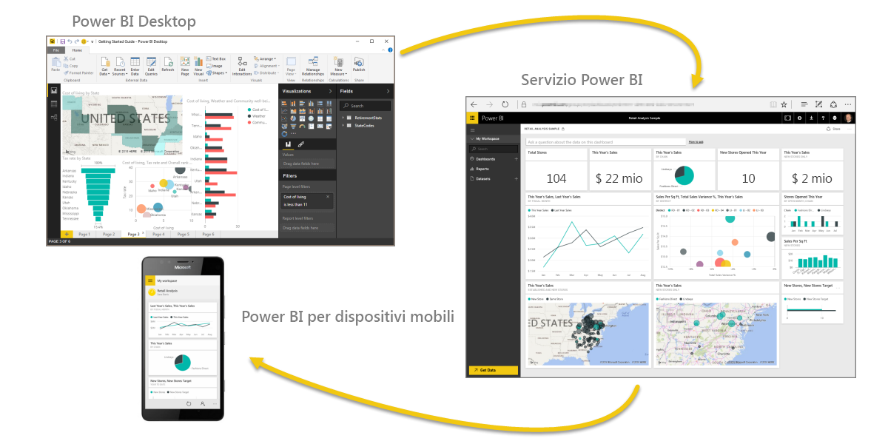

Benvenuti nell'**apprendimento guidato** per Power BI. Questo corso online di autoapprendimento presenta Power BI in modo sequenziale e consente di conoscere lo strumento dall'inizio alla fine.

Il corso è progettato per offrire indicazioni in blocchi di facile comprensione, seguendo un flusso logico per favorire l'apprendimento di concetti, dettagli ed esempi. Include inoltre molte immagini e numerosi video per facilitare lo studio.

Questo corso di **apprendimento guidato** comprende molte **sezioni**, ognuna composta da una serie di **argomenti**. Dopo i primi argomenti trattati in questa sezione **introduttiva**, quasi tutti gli argomenti includeranno un video in cui verrà descritto l'oggetto di studio. I contenuti riportati sotto il video approfondiscono i concetti e consentono di ripassarli e consolidarli secondo i propri ritmi.

Per i **principianti** di Power BI questo corso offre gli strumenti adatti per iniziare a usarlo, mentre per gli **esperti** rappresenta l'opportunità di consolidare la conoscenza e colmare eventuali lacune. Buon divertimento a tutti gli utenti di questo corso, che verrà presto completato con altri argomenti.

## Che cos'è Power BI?
**Power BI** è una raccolta di servizi software, app e connettori che interagiscono per trasformare le origini dei dati non correlate in un insieme di informazioni coerenti, visivamente accattivanti e interattive. Non importa se i dati provengono da un semplice foglio di calcolo di Excel o da una raccolta di data warehouse ibride basate sul cloud e locali: **Power BI** consente di connettersi facilmente alle origini dati, visualizzare o individuare gli elementi importanti e condividerli con tutti gli utenti selezionati.

**Power BI** può essere semplice e rapido, in grado di ricavare informazioni veloci da un foglio di calcolo di Excel o un database locale. Tuttavia, **Power BI** è anche un prodotto solido e di classe enterprise, pronto per la modellazione su vasta scala e l'analisi in tempo reale, nonché per lo sviluppo personalizzato. Può essere quindi usato come strumento personale per report e visualizzazioni o ricoprire la funzione di motore per le analisi e le decisioni in progetti di gruppo, reparti o intere aziende.

## Gli elementi di Power BI
Power BI è composto da un'applicazione desktop di Windows denominata **Power BI Desktop**, da un servizio SaaS (*Software as a Service*) online detto **servizio Power BI** e da **app** Power BI per dispositivi mobili disponibili per telefoni e tablet Windows, iOS e Android.

Questi tre elementi, **Desktop**, **servizio** e **dispositivi mobili**, sono progettati per consentire agli utenti di creare, condividere e sfruttare al meglio le informazioni aziendali a livello personale o professionale.

## Vantaggi di Power BI in base al ruolo
Il modo di usare Power BI può variare in base al ruolo ricoperto all'interno di un progetto o di un team. È naturale che utenti con un altro ruolo usino Power BI in modo completamente diverso.

Ad esempio, può capitare che un utente usi principalmente il **servizio Power BI** e che i suoi colleghi addetti a calcoli e report aziendali usino invece **Power BI Desktop** per pubblicare i report nel servizio che l'utente iniziale possa quindi visualizzare. E un altro collega, vendite, principalmente usino app telefono di Power BI per monitorare lo stato di avanzamento sulle quote di vendita e approfondire nuovi dettagli di lead di vendita.

Può capitare inoltre che gli elementi di **Power BI** vengano usati in momenti diversi a seconda degli obiettivi da raggiungere o del ruolo ricoperto in un determinato progetto o attività.

È possibile sfruttare il servizio per visualizzare l'inventario e l'avanzamento della produzione in un dashboard in tempo reale e usare parallelamente **Power BI Desktop** per creare report per il team sulle statistiche relative al coinvolgimento del cliente. Il modo di impiego di Power BI dipende dalle funzionalità o dai servizi che meglio si adattano alla situazione. L'accessibilità di tutti gli elementi di Power BI è l'aspetto che lo rende uno strumento flessibile ed efficace.

Approfondiremo questi tre elementi, **Desktop**, **servizio** e app per **dispositivi mobili**, più avanti in questo corso di **apprendimento guidato**. Negli articoli seguenti illustreremo inoltre la creazione di report in Power BI Desktop, la relativa condivisione nel servizio e il successivo approfondimento nel dispositivo mobile.

## Il flusso di lavoro in Power BI
Un comune flusso di lavoro in Power BI inizia in **Power BI Desktop**, dove viene creato un report. Il report viene quindi pubblicato nel **servizio** Power BI e reso disponibile per consentire agli utenti delle app **Power BI per dispositivi mobili** di fruire delle informazioni.

Non è sempre così, ovviamente, ma questo flusso servirà a capire i diversi elementi di Power BI e come sono integrati tra loro.

Dopo aver presentato il corso, il prodotto e i tre elementi principali che lo compongono, possiamo scoprire come funziona **Power BI**.

